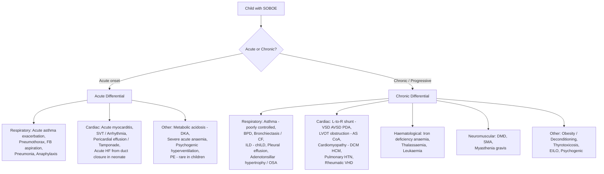

## Differential Diagnosis of Shortness of Breath on Exertion in Children

The differential diagnosis of SOBOE in a child is one of the broadest in paediatrics because the symptom sits at the intersection of almost every organ system. The key to making sense of a long list is to **think mechanistically**: trace the oxygen delivery chain from atmosphere to mitochondria, and at each step ask "what could go wrong here to make this child breathless during activity?" Then layer on **age** — because the likely diagnosis in a 6-week-old is completely different from that in a 14-year-old.

---

### Organising Framework: The Mermaid Approach

Below is a diagnostic reasoning algorithm that a paediatric clinician should run through mentally when a child presents with SOBOE. It separates the problem by system, then by tempo.

---

### Age-Stratified Differential Diagnosis

The single most powerful discriminator in paediatric SOBOE is **age**. Below is a comprehensive table that maps the most likely diagnoses to the age group — the rationale for each is explained in the sections that follow.

| Age Group | Most Likely Diagnoses | Why at This Age? |
|---|---|---|
| **Neonate (0–28 d)** | ***Duct-dependent CHD (critical AS, CoA, IAA, HLHS)*** [1]; RDS (surfactant deficiency in preterms); PPHN; ***sepsis, asphyxia, hypoCa*** [1]; congenital airway anomalies (laryngomalacia, tracheomalacia); ***congenital heart block, SVT*** [1] | PVR still high → shunt lesions not yet manifest; duct-dependent lesions unmasked by duct closure (day 1–7); premature lungs lack surfactant |
| **Infant 1–6 m** | ***Large L-to-R shunts: VSD, AVSD, PDA*** [1][5]; bronchiolitis (RSV peak ~2–6 months); BPD (ex-preterms); ***SVT, cardiomyopathy, Kawasaki-related MI, anomalous coronary artery*** [1] | PVR drops at 6–8 weeks → L-to-R shunt flow increases → pulmonary overcirculation → HF symptoms; RSV seasonality; immature immune system |
| **Infant 6–12 m** | As above, plus: viral-induced wheeze (early asthma phenotype); foreign body aspiration (emerging mobility); anaemia (nutritional transition from breast milk/formula to solids) | Motor development → exploration → aspiration risk; iron stores from birth depleting at ~6 months |
| **Toddler/Pre-school (1–5 y)** | ***Asthma / viral-induced wheeze*** [3]; foreign body aspiration (peak 1–3 y); myocarditis; ***recurrent LRTI*** [1]; adenotonsillar hypertrophy → OSA → daytime fatigue/↓ET | Oral exploratory phase → FB aspiration; allergen sensitisation → early asthma; lymphoid hypertrophy peaks 3–6 y |
| **School-age (6–12 y)** | ***Asthma*** [3]; exercise-induced bronchoconstriction; ***unoperated CHD or post-operative late ventricular dysfunction*** [1]; ***secondary cardiomyopathy (Fe overload, post-chemo, neuromuscular)*** [1]; ***anaemia (thalassaemia intermedia, IDA)***; DMD (respiratory involvement beginning); bronchiectasis (CF, PCD, immunodeficiency) | Formal exercise exposes previously sub-clinical disease; DMD respiratory decline accelerates from ~8–10 y; thalassaemia complications manifest |
| **Adolescent (12–18 y)** | ***Asthma***; ***LVOT obstruction (AS → ↓ET with SOB, chest pain, syncope on exertion)*** [5]; ***HCM***; arrhythmias (long QT, WPW, CPVT); spontaneous pneumothorax (tall thin males); ***valvular insufficiencies (MR, AR, TR, PR)*** [1]; EILO; psychogenic hyperventilation; PE (rare — OCP, SLE, immobilisation); ***high-output HF (anaemia, thyrotoxicosis, AV fistula)*** [1]; obesity/deconditioning | Growth spurt unmasks subclinical aortic stenosis; HCM becomes symptomatic with ↑exercise demand; EILO mimics asthma; hormonal changes predispose to psychogenic causes |

<Callout title="Key Teaching Point">
***Heart failure = cardiac output cannot meet demand → a mismatch!*** [1]. In infants, the commonest cause of HF is ***large L-to-R shunts (VSD, AVSD, PDA)***, presenting at 2–3 months as PVR drops. In older children and adolescents, consider ***unoperated CHD, valvular insufficiencies, secondary cardiomyopathy, and high-output failure*** [1].
</Callout>

---

### System-by-System Differential Diagnosis with Reasoning

#### I. Respiratory Causes

These are the **most common** causes of SOBOE overall in paediatric practice, simply because respiratory disease is so prevalent in childhood.

| Diagnosis | Key Differentiating Features | Pathophysiological Reason for SOBOE |
|---|---|---|
| ***Asthma*** | Episodic wheeze, cough, chest tightness; triggers (exercise, allergens, cold air, viral URTI); ***characteristically occur 5–15 min after exertion, resolve 30–60 min after stopping*** [3][4]; diurnal variation (worse at night/early morning); personal/family Hx of atopy; reversible airflow obstruction on spirometry | Chronic Th2 airway inflammation → bronchial hyperresponsiveness → bronchoconstriction + mucosal oedema + mucus plugging → ↑airway resistance → ↑work of breathing. During exercise: airway cooling/drying → osmotic mast cell degranulation → EIB |
| **Bronchiolitis** (age < 2 y) | Coryzal prodrome → LRTI with SOB, cough, wheeze/crackles; ***worst day 2–3***; winter/seasonal; RSV most common [6] | Viral inflammation of bronchioles → oedema + mucus + sloughed epithelium → obstruction of small airways → air trapping + V/Q mismatch |
| **Pneumonia** | Fever, productive cough, tachypnoea, crackles/bronchial breathing, focal signs; CXR consolidation [6] | Alveolar filling with inflammatory exudate → impaired gas exchange → hypoxaemia → ↑respiratory drive |
| **Foreign body aspiration** | Acute choking episode (may be unwitnessed); persistent/recurrent cough ± unilateral wheeze; age 1–3 y; ***localised wheeze*** [3] | Mechanical obstruction of airway → ball-valve effect (hyperinflation) or complete obstruction (atelectasis) → V/Q mismatch |
| ***Bronchiectasis*** | ***Prominent cough with mucopurulent sputum ± haemoptysis; diagnosed by CXR/HRCT ("tram-line" appearance)*** [3] | Permanent airway dilatation with chronic infection → mucus obstruction + loss of mucociliary clearance → recurrent infections → progressive airflow limitation |
| **BPD / Chronic lung disease of prematurity** | History of prematurity (< 28 wk) and prolonged O₂/ventilator support; chronic tachypnoea; CXR with cystic/fibrotic changes | Arrested alveolar development + inflammation → ↓gas exchange surface → chronic hypoxia ± secondary pulmonary HTN |
| **Interstitial lung disease (chILD)** | Progressive tachypnoea, crackles, hypoxaemia; ↓DLCO; HRCT ground-glass changes | Thickened interstitium → impaired diffusion → hypoxaemia (particularly during exercise when transit time shortens) |
| **Pleural effusion** | Stony dull percussion, ↓breath sounds, mediastinal shift away (if large); dull ache; may be secondary to pneumonia, TB, lymphoma | Fluid in pleural space → restrictive physiology → ↓lung expansion → ↓ventilatory capacity |
| **Pneumothorax** | Acute pleuritic pain + sudden dyspnoea; tall thin adolescent male; hyperresonance, ↓AE unilaterally | Air in pleural space → lung collapse → V/Q mismatch → dyspnoea |
| ***Central airway obstruction*** | ***Exertional dyspnoea ± monophonic wheeze; flow-volume loop with expiratory plateau (intrathoracic) or inspiratory plateau (extrathoracic)*** [3] | Mass or stenosis compressing central airway → fixed obstruction → ↑work of breathing through narrowed conduit |
| **Adenotonsillar hypertrophy / OSA** | Snoring, mouth breathing, witnessed apnoeas; ***enlarged tonsils/adenoids: important factor in children (small airway)*** [7]; daytime somnolence → reduced exercise tolerance | Intermittent upper airway obstruction during sleep → chronic nocturnal hypoxia + sleep fragmentation → daytime fatigue + poor exercise performance |
| **Exercise-induced laryngeal obstruction (EILO)** | Adolescent (often athletic females); inspiratory stridor during intense exercise; resolves rapidly at rest; normal spirometry; diagnosed by continuous laryngoscopy during exercise (CLE) test | Paradoxical adduction of supraglottic structures or vocal cords during exercise → functional inspiratory obstruction. Key DDx from asthma: stridor is inspiratory (not expiratory wheeze), onset is during (not after) exercise, resolves quickly at rest |

<Callout title="Exam Favourite" type="idea">
***Differentiating asthma from simple exertional dyspnoea***: In asthma/EIB, attacks occur ***5–15 minutes after a brief exertion*** and may only resolve ***30–60 minutes after stopping*** [3]. This is distinct from normal exertional dyspnoea (or deconditioning), where breathlessness occurs **during** exertion and stops quickly (< 5 minutes) into rest. This timing difference is high-yield.
</Callout>

#### II. Cardiac Causes

***Cardiac causes of dyspnoea operate through pulmonary congestion (↓compliance + airway obstruction) and/or ↓cardiac output*** [2][14].

| Diagnosis | Age of Presentation | Key Differentiating Features | Pathophysiological Reason for SOBOE |
|---|---|---|---|
| ***VSD*** (most common CHD) | ***Infant 2–3 months*** [1] | ***Poor feeding, FTT, excessive sweating, recurrent chest infections*** [1][5]; loud pansystolic murmur at LLSE; CXR: cardiomegaly + pulmonary plethora | As PVR drops → ↑L-to-R shunt → pulmonary overcirculation → ↑pulmonary venous pressure → ↓lung compliance → ↑work of breathing |
| ***AVSD*** | Infant 2–3 months; a/w Down syndrome | As VSD but often with additional MR; superior QRS axis on ECG | Same as VSD but larger defect → more shunting → earlier/more severe HF |
| ***PDA*** | Premature infants; full-term infants 2–3 months | ***Continuous machinery murmur*** at upper left sternal edge; bounding pulses (wide pulse pressure); CXR: cardiomegaly + plethora | Left-to-right shunt through patent ductus → volume overload of LA/LV + pulmonary overcirculation |
| **ASD** | Usually asymptomatic in childhood; may present with ***exercise intolerance in adolescence*** | Fixed split S2; ESM at pulmonary area (due to relative PS from ↑flow); ***rarely causes HF in infancy*** [1]; RBBB on ECG | R-to-L volume overload → progressive RA/RV dilatation → eventually ↓RV function + possible atrial arrhythmias → SOBOE |
| ***Aortic stenosis*** | ***Asymptomatic in childhood even in moderate/severe AS; ↓ET with SOB, chest pain, syncope, SCD on exertion in adolescence*** [5] | ***Ejection click + ESM at LVOT radiating to neck; weak slow-rising pulse in severe AS; delayed/absent A2; Turner syndrome (valvar); Williams syndrome "elfin facies" (supravalvar)*** [5] | LV pressure overload → LVH → ↑myocardial O₂ demand + ↓coronary perfusion → subendocardial ischaemia during exercise. Also inability to ↑CO during exercise → exertional syncope |
| ***Coarctation of aorta*** | Neonate (critical): duct-dependent; Older child: incidental finding or SOBOE + HTN | Radio-femoral delay; upper limb BP > lower limb by > 20 mmHg; rib notching on CXR (older children); ***LVOT obstruction group: CoA, IAA*** [1] | Mechanical obstruction of aortic flow → LV afterload ↑ → LVH → eventual HF. In neonates: systemic circulation depends on PDA → HF + shock when duct closes |
| **Myocarditis** | Any age; often preceded by viral illness | Tachycardia out of proportion to fever; gallop rhythm; ↓CO signs; elevated troponin; ↓LVEF on echo; arrhythmias | Viral/inflammatory damage to cardiomyocytes → ↓contractility → ↓CO → HF → pulmonary congestion → SOBOE |
| ***Cardiomyopathy (DCM)*** | Any age; ***secondary causes: Fe overload, post-chemo, neuromuscular disease*** [1] | Progressive exercise intolerance; gallop; displaced apex; ↓LVEF | Primary myocardial dysfunction → ↓contractility → ↓CO + ↑filling pressures → pulmonary congestion |
| ***Hypertrophic cardiomyopathy (HCM)*** | Adolescent (symptomatic); may be detected incidentally earlier | ***LVOT obstruction in ~1/3*** [8]; dynamic ESM ↑ with Valsalva; jerky pulse; FHx of sudden death; ECG: LVH + ST changes | LVOT obstruction → ↑afterload → ↓CO during exercise → SOBOE/syncope; Diastolic dysfunction → ↑filling pressures → pulmonary congestion; Risk of VT/VF → SCD |
| ***SVT / Arrhythmias*** | Any age; ***SVT and VT may be WPW-related*** [1] | Palpitations; sudden onset/offset; HR > 220 bpm in infants or > 180 bpm in children; delta wave on ECG (WPW) | Sustained tachycardia → ↓diastolic filling time → ↓SV → ↓CO; or if persistent → tachycardia-mediated cardiomyopathy → HF |
| ***Congenital heart block*** | Neonatal period; a/w maternal anti-Ro/La antibodies (neonatal lupus) | Bradycardia (HR < 80 in neonate); cannon A waves in JVP; dissociated P and QRS on ECG | ↓HR → ↓CO (especially critical in neonates/infants whose CO is rate-dependent) → inadequate O₂ delivery → SOBOE |
| ***Rheumatic heart disease*** | School-age → adolescent; ***more common in new immigrants in HK*** | History of rheumatic fever (Jones criteria); pansystolic murmur at apex (MR); mid-diastolic murmur at apex (MS) | Acute: MR → volume overload → LV failure → pulmonary congestion; Chronic: MS → ↑LA pressure → pulmonary venous congestion → ↓lung compliance |
| ***Pulmonary hypertension*** | Variable; Eisenmenger = late complication of unrepaired L-to-R shunts | ***Progressive SOBOE, effort syncope ± haemoptysis*** [9]; loud P2; RV heave; TR murmur | ↑PVR → RV pressure overload → RV failure → ↓CO → SOBOE. In Eisenmenger: reversal of shunt (R-to-L) → cyanosis + SOBOE |
| ***High-output HF*** | Any age; ***anaemia, thyrotoxicosis, AV fistula*** [1] | Hyperdynamic precordium; bounding pulses; flow murmur; signs specific to underlying cause (pallor, goitre, bruit) | ↑CO demand exceeds cardiac reserve → ventricular dilatation → eventually ↓effective forward flow → pulmonary congestion |

<Callout title="Must-Know: Cardiac vs Respiratory Dyspnoea" type="error">
A common exam pitfall is failing to distinguish ***cardiac from respiratory dyspnoea*** in infants. Both cause tachypnoea and wheeze. Key distinguishing features of **cardiac** cause: ***hepatomegaly, cardiomegaly on CXR, displaced apex beat, gallop rhythm, murmur, poor perfusion (cool extremities, weak pulses, prolonged CRT)***. Respiratory causes typically have hyperinflated chest, predominant wheeze/crackles without hepatomegaly, and normal perfusion [1][2].
</Callout>

#### III. Haematological Causes

| Diagnosis | Key Differentiating Features | Pathophysiological Reason for SOBOE |
|---|---|---|
| **Iron deficiency anaemia** | Pallor; dietary history (cow's-milk predominant diet in toddlers); koilonychia; pica; low MCV, low ferritin | ↓Hb → ↓O₂-carrying capacity → compensatory ↑HR/CO insufficient during exercise → tissue hypoxia → ↑respiratory drive → SOBOE |
| **Thalassaemia (β-major/intermedia, HbH disease)** | **Very relevant in Hong Kong (3–4% carrier rate)**; pallor, hepatosplenomegaly (extramedullary haematopoiesis), thalassaemic facies (bossing from marrow expansion), FTT; Hb electrophoresis diagnostic | Chronic haemolysis + ineffective erythropoiesis → severe anaemia → high-output state → cardiac failure if untreated |
| **Leukaemia** | Pallor (anaemia), bruising/petechiae (thrombocytopaenia), bone pain, lymphadenopathy, hepatosplenomegaly; pancytopaenia on CBC | Marrow infiltration → ↓RBC production → anaemia → SOBOE; also possible mediastinal mass (T-ALL) → airway/SVC compression |
| **Aplastic anaemia** | Pancytopaenia; bleeding, infections; no organomegaly (unlike leukaemia) | ↓RBC production → anaemia → ↓O₂ delivery → SOBOE |
| ***Severe acute anaemia (e.g. fetomaternal transfusion in neonates)*** [1] | Neonatal: pallor, poor feeding, tachycardia, HF signs; Older child: acute GI bleed, trauma | Acute ↓Hb → ↓O₂ delivery → acute cardiovascular decompensation |

#### IV. Neuromuscular Causes

| Diagnosis | Key Differentiating Features | Pathophysiological Reason for SOBOE |
|---|---|---|
| **Duchenne muscular dystrophy** | X-linked male; proximal weakness first (Gowers' sign); pseudohypertrophy of calves; ↑CK ( > 10× ULN); respiratory decline accelerates from ~10 y; also develops DCM | Progressive skeletal + respiratory muscle weakness → ↓vital capacity → ventilatory insufficiency → SOBOE; DCM adds cardiac component |
| **Spinal muscular atrophy** | Hypotonia; weakness (proximal > distal); tongue fasciculations (SMA type I); recurrent chest infections (weak cough) | Anterior horn cell loss → denervation of respiratory muscles → ↓ventilatory capacity |
| **Myasthenia gravis (juvenile)** | Fatiguable weakness: ptosis, diplopia progressing to bulbar and limb weakness; improvement with rest; positive edrophonium/ice test; anti-AChR Ab [10] | Autoimmune destruction of AChR → ↓neuromuscular transmission → respiratory muscle fatigue → SOBOE |
| **Guillain-Barré syndrome** | Preceding infection; ascending weakness; areflexia; respiratory compromise if diaphragm involved; CSF: albuminocytological dissociation | Acute demyelination of peripheral nerves → respiratory muscle weakness → ventilatory failure |

#### V. Metabolic / Systemic Causes

| Diagnosis | Key Differentiating Features | Pathophysiological Reason for SOBOE |
|---|---|---|
| **Diabetic ketoacidosis** | Polyuria, polydipsia, weight loss; Kussmaul breathing (deep, laboured); fruity breath; ↑glucose, ↑anion gap metabolic acidosis | Insulin deficiency → lipolysis → ketoacids → metabolic acidosis → respiratory compensation (↑RR, ↑TV to blow off CO₂) — perceived as dyspnoea |
| **Inborn errors of metabolism** | Neonatal or infantile onset; encephalopathy, vomiting; metabolic acidosis (organic acidaemias, mitochondrial disorders) | Toxic metabolite accumulation → metabolic acidosis → Kussmaul breathing; also mitochondrial myopathy → respiratory muscle weakness |
| **Thyrotoxicosis** | Weight loss despite ↑appetite; tremor, tachycardia, goitre, exophthalmos (Graves'); heat intolerance; a/w Graves' disease in adolescents | ↑metabolic rate → ↑O₂ consumption → ↑CO demand; if severe and sustained → high-output cardiac failure → SOBOE |
| ***Obesity*** | BMI > 95th centile; sedentary lifestyle; ± OSA symptoms | ↑chest wall weight → ↑work of breathing; ↓FRC → atelectasis; ↑O₂ consumption; deconditioning → ↓cardiovascular fitness; possible obesity-hypoventilation [12] |
| ***Fluid overload*** [1] | Iatrogenic (excessive IV fluids); renal failure (oliguric); nephrotic syndrome (hypoalbuminaemia) | ↑intravascular volume → ↑pulmonary venous pressure → pulmonary oedema → ↓compliance → SOBOE |

#### VI. Psychogenic Causes

| Diagnosis | Key Differentiating Features | Pathophysiological Reason for "SOBOE" |
|---|---|---|
| ***Psychogenic hyperventilation / Panic disorder*** | ***Subjective feeling of "inability to take a deep breath"; frequent sighing/erratic ventilation at rest; digital/perioral paraesthesiae; light-headedness; central chest discomfort; occurs at rest, rarely disturbs sleep*** [14][15]; normal SpO₂; normal cardiopulmonary examination; often in context of academic/social stress | Anxiety → ↑sympathetic drive → ↑RR → respiratory alkalosis → ↓ionised Ca²⁺ → perioral/digital paraesthesiae + tetany. The perceived dyspnoea is from ↑awareness of breathing rather than true ventilatory impairment |
| **Functional breathing disorder / Vocal cord dysfunction (= EILO)** | Symptoms disproportionate to objective findings; normal PFTs; inspiratory difficulty; responds poorly to asthma treatment; diagnosed by CLE test | Laryngeal dysfunction or breathing pattern disorder → intermittent functional airway obstruction or hyperventilation |

<Callout title="Psychogenic vs Organic" type="idea">
Psychogenic hyperventilation is a **diagnosis of exclusion** in children. However, certain features are strongly suggestive: symptoms at rest rather than during exertion, sighing respirations, perioral tingling, no nocturnal disturbance, and normal SpO₂ and examination. Always screen for anxiety/depression in adolescents with unexplained SOBOE.
</Callout>

---

### Putting It All Together: A Clinical Reasoning Strategy

When you see a child with SOBOE, run through the following rapid mental algorithm:

**Step 1 — Age and Tempo**
- Neonate → think structural heart disease (duct-dependent), sepsis, lung disease of prematurity
- Infant (2–3 m) → think ***large L-to-R shunts*** [1]
- Toddler → think asthma/viral wheeze, FB aspiration
- School-age/Adolescent → think asthma, cardiac (AS, HCM, arrhythmia), anaemia, psychogenic

**Step 2 — Cardinal Associated Features**
- **Wheeze** → Asthma (most common), bronchiolitis, ***cardiac "asthma" (infant with HF)*** [1]
- **Murmur** → CHD or acquired VHD
- **Pallor** → Anaemia (check Hb!)
- **FTT + poor feeding + diaphoresis** → ***Heart failure in infancy*** [1][5]
- **Exertional syncope** → ***AS, HCM, arrhythmia (red flag!)*** [5][8]
- **Weakness** → Neuromuscular disease
- **Sighing, perioral paraesthesiae, occurs at rest** → Psychogenic [14]

**Step 3 — Examination Clues**
- ***Hepatomegaly*** → Right heart failure
- ***Displaced apex / cardiomegaly*** → Cardiac cause
- ***Cool peripheries, weak pulses, prolonged CRT*** → ***↓cardiac output*** [1]
- Hyperinflated chest + wheeze → Obstructive airway disease
- Crackles at bases → Pulmonary oedema (HF) or ILD or infection
- Clubbing → Cyanotic CHD, bronchiectasis, CF

**Step 4 — Targeted Investigations** (to be discussed in the Diagnosis section)

---

### Key Differential Diagnosis Comparisons (High-Yield for Exams)

#### A. Cardiac vs Respiratory Wheeze in an Infant

| Feature | ***Cardiac "asthma"*** (HF from L-to-R shunt) | **Viral bronchiolitis / Early asthma** |
|---|---|---|
| Age | ***2–3 months*** [1] | < 2 years (bronchiolitis); > 1 year (asthma) |
| Feeding | ***Poor feeding, tires during feeds*** | Usually maintains feeds (unless severe) |
| Growth | ***FTT*** [1] | Usually normal growth |
| Sweating | ***Excessive, especially during feeds*** [1] | Uncommon |
| Hepatomegaly | ***Present*** [1] | Absent |
| Murmur | Often present (VSD, PDA) | Absent |
| CXR | ***Cardiomegaly + pulmonary plethora*** [1] | Hyperinflation ± patchy atelectasis; normal heart size |
| Response to bronchodilators | Poor | Partial (bronchiolitis) to good (asthma) |

#### B. Asthma vs EILO in an Adolescent

| Feature | Asthma / EIB | EILO |
|---|---|---|
| Sound | Expiratory wheeze | ***Inspiratory stridor*** |
| Timing during exercise | ***5–15 min after exertion; lasts 30–60 min*** [3] | During peak exercise; resolves rapidly (< 5 min after stopping) |
| Nocturnal symptoms | Common | Absent |
| Response to SABA | Good | Poor |
| PFTs | Obstructive pattern; BD reversibility | Normal |
| Gold-standard diagnosis | Spirometry + BD reversibility | Continuous laryngoscopy during exercise (CLE) |

#### C. Cardiac Causes by Age [1]

| Neonatal | Infant (2–3 m) | Older Children / Adolescents |
|---|---|---|
| ***Duct-dependent CHD: AS, CoA, IAA, HLHS*** | ***Large L-to-R shunt: VSD, AVSD, PDA, ASD (rarely)*** | ***Unoperated CHD; Valvular insufficiencies: MR, AR, TR, PR*** |
| ***Myocarditis, cardiomyopathy*** | ***Cardiomyopathy; MI due to Kawasaki or anomalous coronary*** | ***2° cardiomyopathy: Fe overload, post-chemo, neuromuscular*** |
| ***Arrhythmias: CHB, SVT, VT*** | ***SVT, VT*** | ***Operated CHD with late ventricular dysfunction*** |
| ***Extracardiac: Sepsis, asphyxia, hypoCa, anaemia*** | | ***High-output HF: anaemia, thyroid, AV fistula; Fluid overload*** |

---

### Rare but Important "Don't Miss" Diagnoses

These are uncommon but carry high morbidity/mortality if missed:

1. **Anomalous left coronary artery from the pulmonary artery (ALCAPA)**: Presents at 2–3 months with HF symptoms; ***MI due to anomalous coronary artery*** [1] — ECG may show anterolateral ischaemic changes (Q waves, ST changes in I, aVL, V5–V6). Echo confirms origin.

2. **Pulmonary embolism**: Exceedingly rare in children but consider in adolescents with immobilisation, central lines, SLE, nephrotic syndrome, or OCP use. Acute pleuritic pain + dyspnoea + tachycardia + hypoxia [16].

3. **Cardiac tamponade**: Acute dyspnoea + muffled heart sounds + distended neck veins (Beck's triad); pulsus paradoxus; can occur with pericardial effusion (viral, TB, malignancy, post-pericardiotomy syndrome).

4. **Mediastinal mass (T-ALL)**: Anterior mediastinal mass → compression of trachea and/or SVC → dyspnoea + facial swelling (SVC syndrome). Can present acutely; important to identify before sedation/anaesthesia (risk of complete airway collapse).

5. **Primary pulmonary hypertension**: ***Progressive SOBOE → effort angina, syncope ± haemoptysis; median survival 3 years if untreated*** [9]. Rare but important, especially in adolescent females.

---

<Callout title="High Yield Summary">

**Approach to DDx of SOBOE in Children**:

1. **Age is the most powerful discriminator**:
   - Neonate: duct-dependent CHD, RDS, sepsis
   - Infant 2–3 m: ***large L-to-R shunts (VSD, AVSD, PDA)*** — commonest cause of paediatric HF at this age
   - Toddler: asthma, FB aspiration
   - School-age/adolescent: asthma, cardiac (AS, HCM, arrhythmia), anaemia, psychogenic

2. **Most common overall**: ***Asthma*** (chronic/episodic); ***CHD*** (infants)

3. **Key differentiating features for cardiac HF in infants**: ***Poor feeding + FTT + excessive sweating + hepatomegaly + cardiomegaly on CXR + murmur***

4. **Red flags for serious cardiac disease in older children**: ***Exertional syncope, exertional chest pain, family history of sudden death*** → think AS, HCM, arrhythmia

5. ***Cardiac vs respiratory cause***: Look for ***hepatomegaly, cardiomegaly, poor perfusion, murmur*** (cardiac) vs hyperinflation, wheeze without hepatomegaly, normal perfusion (respiratory)

6. **Never forget anaemia** — silent cause of SOBOE; always check Hb. Thalassaemia is common in Hong Kong.

7. **Psychogenic hyperventilation**: Diagnosis of exclusion; ***occurs at rest, sighing, perioral paraesthesiae, rarely disturbs sleep***

</Callout>

---

<ActiveRecallQuiz
  title="Active Recall - Differential Diagnosis of SOBOE in Children"
  items={[
    {
      question: "A 10-week-old infant presents with tachypnoea, diaphoresis during feeds, FTT, and a loud pansystolic murmur at the LLSE. CXR shows cardiomegaly with pulmonary plethora. What is the most likely diagnosis and why does it present at this age rather than at birth?",
      markscheme: "VSD with large left-to-right shunt causing congestive heart failure. Presents at ~6-8 weeks because PVR is high at birth (near systemic level), so minimal L-to-R shunting occurs. As PVR falls physiologically over the first 6-8 weeks, the pressure gradient across the VSD increases, driving more blood left-to-right through the defect, causing pulmonary overcirculation, pulmonary congestion, and heart failure."
    },
    {
      question: "List 4 clinical features that help distinguish cardiac from respiratory causes of wheeze in an infant.",
      markscheme: "Cardiac: (1) Hepatomegaly (from systemic venous congestion), (2) Cardiomegaly on CXR with pulmonary plethora, (3) Cardiac murmur, (4) Signs of poor perfusion (cool extremities, weak pulses, prolonged CRT). Additional features: FTT, excessive sweating during feeds, poor feeding. Respiratory causes typically show hyperinflation on CXR, normal heart size, no hepatomegaly, and normal peripheral perfusion."
    },
    {
      question: "An adolescent athlete collapses during a race with transient loss of consciousness. He reports preceding lightheadedness and breathlessness. Name 3 cardiac diagnoses that must be excluded and their respective mechanisms for exertional syncope.",
      markscheme: "(1) Severe aortic stenosis: fixed LVOT obstruction prevents CO augmentation during exercise, combined with peripheral vasodilation leads to sudden BP drop. (2) Hypertrophic cardiomyopathy: dynamic LVOT obstruction worsens with exercise (increased contractility, decreased preload from dehydration), causing sudden drop in CO. (3) Cardiac arrhythmia (Long QT syndrome, WPW, CPVT): exercise-induced ventricular tachycardia or fibrillation causing sudden haemodynamic collapse."
    },
    {
      question: "How does the timing of exercise-induced bronchoconstriction (EIB) in asthma differ from simple deconditioning/lack of fitness, and from exercise-induced laryngeal obstruction (EILO)?",
      markscheme: "EIB (asthma): symptoms typically occur 5-15 minutes AFTER a brief exertion and may persist 30-60 minutes after stopping. Deconditioning: dyspnoea occurs DURING exertion and resolves within less than 5 minutes of rest. EILO: inspiratory stridor occurs DURING peak exercise and resolves very rapidly (within minutes) after stopping. Also EIB causes expiratory wheeze while EILO causes inspiratory stridor."
    },
    {
      question: "Name the Ross Classification equivalent to NYHA Class III for infants and for older children.",
      markscheme: "Ross Class III - Infants: marked tachypnoea or diaphoresis with feeding, prolonged feeding time, growth failure. Older children: marked dyspnoea on exertion."
    }
  ]}
/>

---

## References

[1] Senior notes: Adrian Lui Pediatrics.pdf (p197–198, Section 6.2.2 Heart Failure and Acyanotic Heart Disease)
[2] Senior notes: Ryan Ho Cardiology.pdf (p59, Section 2.2 Dyspnoea)
[3] Senior notes: Adrian Lui Pediatrics.pdf (p168–172, Section 5.2.2 Asthma)
[4] Senior notes: Ryan Ho Respiratory.pdf (p95–98, Section 3.2.1 Asthma)
[5] Lecture slides: GC 147. Heart failure and cyanosis in children acyanotic and cyanotic congenital heart disease - Part 1.pdf (p8)
[6] Senior notes: Adrian Lui Pediatrics.pdf (p163, Section B. Lower Respiratory Tract Infections)
[7] Senior notes: Ryan Ho Respiratory.pdf (p158, Section 3.8.2 Sleep Apnoea/Hypopnoea Syndrome)
[8] Senior notes: Ryan Ho Cardiology.pdf (p167, Hypertrophic Cardiomyopathy)
[9] Senior notes: Ryan Ho Respiratory.pdf (p138, Pulmonary Hypertension)
[10] Senior notes: Ryan Ho Neurology.pdf (p188, Myasthenia Gravis)
[12] Senior notes: Ryan Ho Endocrine.pdf (p117, Complications of Obesity)
[14] Senior notes: Ryan Ho Fundamentals.pdf (p222–223, Section 3.2.2 Dyspnoea)
[15] Senior notes: Ryan Ho Respiratory.pdf (p20, History of Dyspnoea)
[16] Senior notes: Ryan Ho Haemtology.pdf (p131, VTE and Pulmonary Embolism)
