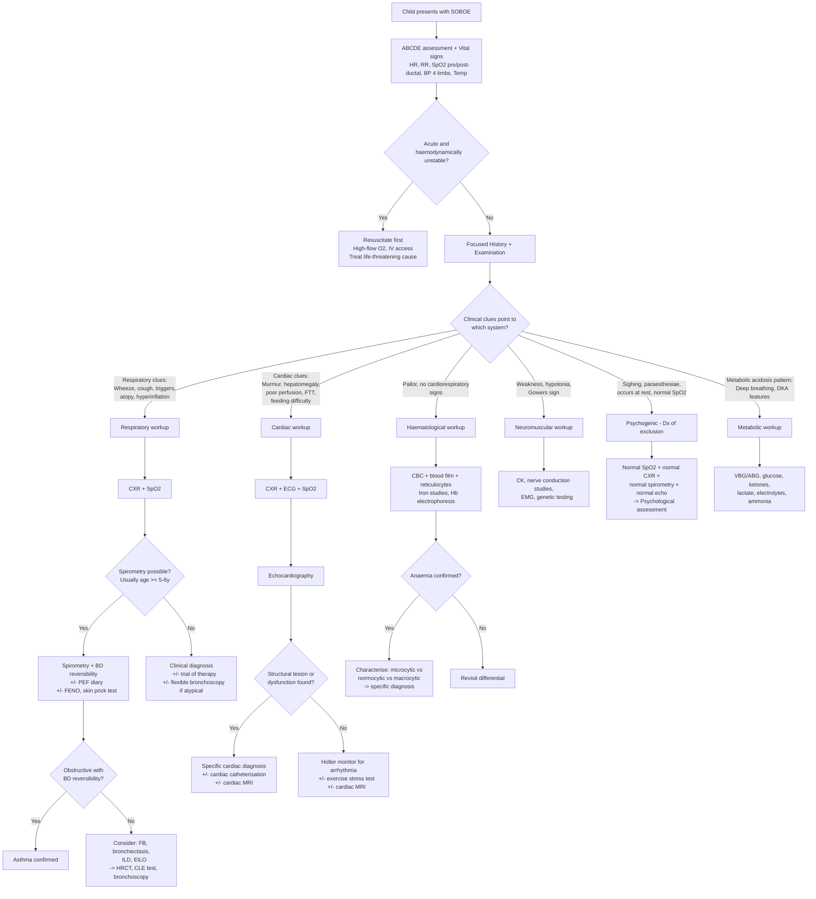

## Diagnostic Criteria, Algorithm and Investigation Modalities for SOBOE in Children

### Overarching Principle

SOBOE is a **symptom**, not a diagnosis — therefore there is no single set of "diagnostic criteria" for SOBOE itself. Instead, the diagnostic process aims to **identify the underlying cause** of the exertional breathlessness. The approach is structured as:

1. **Clinical assessment** (history + examination) → generate a working differential
2. **Bedside and first-line investigations** → narrow the differential
3. **Targeted second-line investigations** → confirm the diagnosis

The order and depth of investigation depends on the **tempo** (acute vs chronic), the **age** of the child, and the **clinical clues** from history and examination. This section walks through each step with paediatric-specific interpretation.

---

### Diagnostic Algorithm

The following algorithm represents the clinical reasoning pathway for a paediatric patient presenting with SOBOE. It is designed to be applied at the bedside.

---

### Step-by-Step Diagnostic Approach

#### Step 1: Immediate Assessment (All Ages)

Every child with SOBOE — regardless of suspected cause — requires a rapid initial assessment. This is **not optional**; it is the foundation of safe practice.

| Assessment | What to Do | Why |
|---|---|---|
| **Airway** | Look, listen, feel. Stridor? Drooling? | Upper airway obstruction can present as SOBOE |
| **Breathing** | RR (age-appropriate), SpO₂, work of breathing (recession, grunting, nasal flaring) | Quantifies severity; guides urgency |
| **Circulation** | HR, BP (four limbs), CRT, pulse volume, hepatomegaly | Identifies cardiac cause + haemodynamic instability |
| **Disability** | Conscious level (AVPU/GCS), tone | Neuromuscular disease; also assesses adequacy of oxygenation |
| **Exposure** | Growth parameters, dysmorphism, pallor, cyanosis, clubbing, oedema, rashes | Clues to underlying aetiology |

***Physical examination*** should include [17][18]:
- ***Temperature (fever)***
- ***Vital signs***
- ***Respiratory distress? Respiratory rate, retraction/insucking/use of accessory muscles, cyanosis, oxygen saturation, dyspnoea/shortness of breath***
- ***Chest exam: deformity, percussion, auscultation (wheeze, crepitations, rhonchi)***
- ***Associated findings: skin rash, eczema, tonsils, lymph nodes, rhinorrhoea***

<Callout title="Pre- and Post-Ductal SpO₂ in Neonates">
In neonates, always measure SpO₂ in the **right hand** (pre-ductal) AND a **foot** (post-ductal). A difference > 3% suggests right-to-left ductal shunting — pointing towards duct-dependent CHD or persistent pulmonary hypertension of the newborn (PPHN). This is a critical bedside test that costs nothing and takes seconds.
</Callout>

#### Step 2: First-Line Investigations (Bedside and Blood Tests)

These should be ordered for virtually every child with significant or unexplained SOBOE.

##### A. Pulse Oximetry

- **What**: Non-invasive, continuous measurement of peripheral oxygen saturation (SpO₂)
- **Normal**: > 95% in room air for all ages beyond the immediate transitional period
- **Interpretation**:
  - SpO₂ < 95% → significant hypoxaemia → rules in cardiorespiratory pathology
  - SpO₂ < 92% in acute setting → severe; consider ABG
  - SpO₂ 100% with distress → suspect psychogenic (lungs fine, no desaturation) or metabolic acidosis (compensatory hyperventilation maintaining good oxygenation)
  - Pre-post ductal difference > 3% in neonate → R-to-L ductal shunt

##### B. Blood Tests

| Test | What It Tells You | Key Paediatric Interpretations |
|---|---|---|
| **CBC + blood film** | Hb, MCV, WCC, platelets, reticulocytes, film morphology | ***Anaemia is an important DDx in chronic SOB*** [15] — always check. In HK: low MCV + target cells → thalassaemia trait/disease; blasts on film → leukaemia |
| **Iron studies** (ferritin, serum iron, TIBC, transferrin saturation) | Iron status | Low ferritin (< 12 µg/L in children) = iron deficiency. But ferritin is an acute phase reactant — can be falsely normal in inflammation |
| **Hb electrophoresis** | Haemoglobinopathy screen | Essential in Hong Kong for any child with unexplained microcytic anaemia. Identifies β-thalassaemia trait (↑HbA2), HbH disease (HbH band), etc. |
| **VBG/ABG** | pH, pCO₂, pO₂, HCO₃⁻, lactate, base excess | ***ABG if severe dyspnoea*** [14][15] — Type 1 respiratory failure (↓pO₂, normal/↓pCO₂) vs Type 2 (↓pO₂, ↑pCO₂); metabolic acidosis (↑AG → DKA, lactic acidosis; normal AG → RTA) |
| **Blood glucose** | DKA screen | Any child with deep Kussmaul breathing + unexplained SOBOE → check glucose immediately |
| **CRP / Procalcitonin** | Infection/inflammation | Guides antibiotic decision in pneumonia |
| **NT-proBNP / BNP** | Cardiac biomarker for ventricular dysfunction | ***Confirm HF: CXR, BNP*** [2][14]. Elevated in HF (ventricular wall stress → BNP release). In children, age-specific cut-offs apply (neonates have physiologically higher BNP). Very useful to distinguish cardiac from respiratory wheeze in infants |
| **Troponin** | Myocardial injury | Elevated in myocarditis, Kawasaki with coronary involvement, anomalous coronary artery |
| **TFT** | Thyroid function | Thyrotoxicosis as cause of high-output HF; hypothyroidism causing pericardial effusion |
| **Renal function, electrolytes** | Baseline; metabolic acidosis from renal disease | Urea, creatinine, Na⁺, K⁺, Ca²⁺, PO₄ |

<Callout title="NT-proBNP in Paediatric Practice" type="idea">
NT-proBNP is increasingly used as a bedside discriminator between cardiac and respiratory causes of dyspnoea in children. A normal NT-proBNP has excellent negative predictive value for ruling out heart failure. However, neonates normally have very high BNP levels (can be > 1000 pg/mL in the first few days of life), which drop rapidly over the first weeks — always use age-specific reference ranges.
</Callout>

##### C. Chest X-Ray (CXR)

***Diagnosis and evaluation: based on clinical, radiographic, echo and laboratory findings*** [1].

CXR is the **single most important first-line imaging** in a child with SOBOE. It provides information about both the heart and the lungs in one shot.

**Systematic CXR interpretation in a child with SOBOE** [1]:

| Feature | What to Look For | Interpretation |
|---|---|---|
| ***Cardiomegaly*** | ***CTR ≥ 0.5 (children/adults) vs ≥ 0.6 (infants)*** [1] | Suggests cardiac cause. ***Note: thymus in infants/young children can simulate cardiomegaly → diagnostic difficulty*** [1]. The "sail sign" of the thymus should not be confused with cardiomegaly |
| ***Cardiac contour*** | ***RAE: Rt heart border more convex; LAE: 3rd mogul sign; RVE: ↑CTR + apex tilts up → "boot-shaped heart"; LVE: apex extends laterally and downward*** [1] | Specific chamber enlargement suggests specific lesions (e.g. boot-shaped = ToF; LVE = VSD with volume overload) |
| ***Pulmonary vasculature*** | ***L-to-R shunt: pulmonary plethora + cardiomegaly (volume overload). Pulmonary venous congestion: plethora + hazy markings. Pulmonary outflow obstruction: pulmonary oligemia*** [1] | **Pulmonary plethora** = prominent, engorged pulmonary arteries extending to periphery → implies ↑pulmonary blood flow (L-to-R shunt). **Pulmonary oligemia** = reduced/sparse vascular markings → implies ↓pulmonary blood flow (right-sided obstruction or Eisenmenger) |
| **Lung fields** | Hyperinflation, consolidation, effusion, interstitial markings, lobar collapse, FB (may be radiolucent) | Hyperinflation → asthma, bronchiolitis, BPD; consolidation → pneumonia; interstitial markings → ILD, pulmonary oedema; lobar collapse → FB, mucus plugging |
| ***Position of heart and abdominal organs*** | ***Dextrocardia: when a/w left or central liver/stomach → likely isolated displacement; 90% isolated dextrocardia a/w severe cardiac defects*** [1] | Situs abnormalities suggest complex CHD |
| **Mediastinum** | Width, masses | Anterior mediastinal mass → T-ALL (can compress airway + SVC) |
| **Bones and soft tissues** | Rib notching, vertebral anomalies | Rib notching → coarctation of aorta (collateral flow through intercostal arteries eroding undersurface of ribs); butterfly vertebra → possible associated CHD |

> **CXR Pattern Recognition for Cardiac Causes of SOBOE** [1]:
>
> | CXR Pattern | Likely Diagnosis |
> |---|---|
> | Cardiomegaly + pulmonary plethora | L-to-R shunt (VSD, PDA, AVSD) |
> | Pulmonary plethora + hazy venous markings + NO cardiomegaly | Pulmonary venous obstruction (e.g. TAPVR with obstruction, cor triatriatum) |
> | Pulmonary oligemia + boot-shaped heart | Tetralogy of Fallot |
> | Pulmonary oligemia + egg-on-side silhouette | TGA |
> | Cardiomegaly + pulmonary oedema (Kerley B lines, upper lobe diversion) | LV failure (cardiomyopathy, myocarditis, severe AS) |
> | Normal heart size + bilateral interstitial infiltrates | ILD, atypical pneumonia |

##### D. Electrocardiogram (ECG)

***ECG: for any cardiac causes of HF*** [14][15].

The ECG is essential whenever a cardiac cause is suspected. In children, interpretation requires **age-specific normal values** — the paediatric ECG is very different from the adult ECG.

| ECG Feature | What It Suggests | Paediatric Nuance |
|---|---|---|
| **Heart rate and rhythm** | Sinus tachycardia (compensatory); SVT (narrow complex, HR > 220 in infants); VT (wide complex) | Age-specific HR ranges. In neonates, right axis deviation and right ventricular dominance are normal |
| **Axis** | RAD → RVH (normal in neonates); LAD → AVSD (superior axis is pathognomonic of AVSD); extreme axis → complex CHD | In children < 1 year, the normal axis is rightward (up to +180°). Left axis deviation in an infant is always abnormal |
| **Chamber hypertrophy** | RVH: tall R in V1, deep S in V6; LVH: tall R in V5/V6, deep S in V1 | Age-specific voltage criteria must be used. In neonates, RV dominance is normal — RVH must exceed expected normal |
| **ST-T changes** | Ischaemia (rare in children but seen in anomalous coronary, Kawasaki, AS); myocarditis; pericarditis | Anterolateral ST depression or Q waves in a young infant → think ALCAPA (anomalous left coronary artery from PA) |
| **PR interval** | 1st-degree block; WPW (short PR + delta wave) | WPW predisposes to SVT. Prolonged PR in acute rheumatic fever |
| **QTc** | Long QT syndrome (QTc > 460 ms in children) | Important cause of exertional syncope/SCD. Use Bazett's formula: QTc = QT/√RR |
| **P-wave morphology** | P-pulmonale (tall, peaked → RAE); P-mitrale (broad, bifid → LAE) | Suggests volume/pressure overload of specific atria |

##### E. Echocardiography

***Echocardiography if clinical findings suggestive of HF (to look for the cause, as HF is diagnosed clinically)*** [14][15].

Echocardiography is the **gold-standard imaging** for assessing structural and functional cardiac disease in children. It is non-invasive, radiation-free, and can be performed at the bedside.

| Echo Assessment | What It Tells You | Key Findings |
|---|---|---|
| **Structural anatomy** | Identify CHD | VSD, ASD, AVSD, PDA, valve anomalies, coarctation, ToF, TGA, TAPVR, etc. |
| **Ventricular function** | LV systolic function (LVEF, fractional shortening); RV function (TAPSE, FAC) | LVEF < 55% → systolic dysfunction. In infants with large VSD, LV may appear hyperdynamic (high-output state) before failing |
| **Diastolic function** | Mitral inflow E/A ratio, tissue Doppler E/e' | E/e' ratio elevated → ↑LV filling pressure → diastolic dysfunction (important in HCM) |
| **Valve function** | Stenosis (peak/mean gradient) and regurgitation (jet area, vena contracta) | ***Aortic stenosis: peak gradient classifies severity (mild < 25 mmHg, moderate 25–50 mmHg, severe > 50 mmHg in children)*** |
| **Shunt assessment** | Direction and magnitude of flow across defects | L-to-R shunt with Qp:Qs ratio. Qp:Qs > 1.5:1 generally indicates haemodynamically significant shunt requiring intervention |
| **Estimated PA pressure** | Tricuspid regurgitation jet velocity → estimates RVSP | RVSP > 35 mmHg suggests pulmonary hypertension |
| **Pericardial effusion** | Pericardial fluid collection | If large → risk of tamponade (diastolic collapse of RA/RV) |
| **Coronary artery anatomy** | Origins, calibre, aneurysms | ALCAPA: left coronary from PA; Kawasaki: coronary aneurysms (Z-score > 2.5) |

<Callout title="When to Order an Echo in a Child with SOBOE">
Order echocardiography when you find **any** of the following: murmur (unless clearly innocent), hepatomegaly, cyanosis, poor perfusion, cardiomegaly on CXR, abnormal ECG, unexplained FTT in infancy, or when HF is clinically suspected. ***Diagnosis and evaluation of HF is based on clinical, radiographic, echo and laboratory findings*** [1].
</Callout>

---

#### Step 3: Targeted Second-Line Investigations

These are ordered based on the clinical picture and first-line results.

##### A. Respiratory Investigations

###### 1. Spirometry (Lung Function Testing)

- **Who**: Children typically ≥ 5–6 years old (requires cooperation for reproducible effort). Some centres can perform spirometry in 3–4-year-olds with training.
- **What**: Measures FEV₁, FVC, FEV₁/FVC ratio, flow-volume loop
- **Key findings** [4][15]:

| Pattern | FEV₁/FVC | FVC | FEV₁ | What It Means |
|---|---|---|---|---|
| **Obstructive** | ***≤ 90% in children*** (≤ 75% in adults) [4] | Normal or ↑ | ↓ | Airflow obstruction (asthma, CF, bronchiectasis) |
| **Restrictive** | Normal or ↑ | ↓ | ↓ (proportional) | Lung parenchymal disease (ILD), chest wall disease, neuromuscular weakness |
| **Mixed** | ↓ | ↓ | ↓↓ | Combined obstructive + restrictive (e.g. severe asthma with air trapping, or CF with fibrosis) |

- **Bronchodilator reversibility**: ***> 12% and 200 mL ↑FEV₁ after bronchodilator*** [4] → confirms variable airflow obstruction → supports asthma diagnosis
  - In children, a > 12% improvement in FEV₁ alone (even if < 200 mL) is often accepted as significant, since children have smaller lungs
- **Flow-volume loop** [4]: 
  - ***"Scooped out" concave expiratory curve*** → diffuse intrathoracic airway obstruction (asthma, COPD)
  - ***Expiratory plateau*** → fixed intrathoracic large airway obstruction
  - ***Inspiratory plateau*** → fixed extrathoracic large airway obstruction (EILO, subglottic stenosis)

###### 2. Peak Expiratory Flow (PEF) Monitoring

- **Who**: Children ≥ 5 years with suspected asthma
- **What**: Twice-daily PEF readings over 2 weeks
- **Key finding**: ***> 10% diurnal variability*** [4] → supports asthma diagnosis
- **Why it works**: In asthma, airway calibre varies throughout the day (worse at night/early morning due to circadian cortisol nadir and supine airway oedema). In other causes of fixed obstruction, PEF is consistently low

###### 3. Fractional Exhaled Nitric Oxide (FENO)

- **What**: Measures NO in exhaled breath — a marker of eosinophilic airway inflammation
- **Interpretation**: ***> 50 ppb associated with good short-term response to ICS*** [4]; > 35 ppb in children suggestive of eosinophilic inflammation
- **Role**: Supports diagnosis of atopic/eosinophilic asthma; monitors adherence to ICS

###### 4. Bronchoprovocation Testing

- **What**: Challenge with methacholine, exercise, hypertonic saline, or mannitol
- **Key finding**: ***≥ 20% ↓FEV₁ post-methacholine at standard dose*** [4] → confirms airway hyperreactivity
- **When**: ***Not routinely done; only when lung function at rest is normal*** [4] and asthma is clinically suspected but spirometry is non-diagnostic

###### 5. Allergy Testing

- **Skin prick test / allergen-specific IgE**: Identifies sensitisation to common aeroallergens (house dust mite, cat, dog, cockroach, moulds — all relevant in Hong Kong)
- **Total IgE**: ↑ in atopic individuals, but non-specific
- **Role**: Supports atopic asthma phenotype; guides environmental control measures

###### 6. HRCT Thorax

- **When**: Suspected bronchiectasis (chronic wet cough, clubbing), ILD (progressive dyspnoea + crackles), atypical or refractory respiratory symptoms
- **Key findings**:
  - ***Bronchiectasis: airway dilatation, "tram-line" and "signet ring" signs*** [3]
  - ILD: ground-glass opacities, reticular changes, honeycombing (advanced)
  - FB: hyperinflation on expiratory CT (persistent air trapping distal to FB)

###### 7. Flexible Bronchoscopy

- **When**: Suspected FB aspiration (especially if no history of witnessed choking), airway anomalies (laryngomalacia, tracheomalacia, vascular ring), recurrent pneumonia in the same lobe, persistent stridor
- **What it provides**: Direct visualisation + therapeutic FB removal + bronchoalveolar lavage (BAL) for cytology/microbiology

###### 8. Continuous Laryngoscopy during Exercise (CLE) Test

- **When**: Suspected EILO (adolescent with inspiratory difficulty during exercise, normal spirometry, poor response to asthma treatment)
- **What**: Flexible laryngoscope inserted nasally while patient exercises on treadmill → directly visualises paradoxical laryngeal closure during exercise
- **Gold standard** for EILO diagnosis

##### B. Cardiac Investigations (Beyond Echo)

###### 1. Cardiac Catheterisation

- **When**: 
  - Pre-operative assessment of complex CHD (delineate anatomy, measure pressures and resistances)
  - Assess pulmonary vascular resistance (PVR) — critical before surgical repair of shunt lesions to exclude Eisenmenger physiology
  - Interventional: balloon valvuloplasty for AS, device closure of ASD/PDA
- **What it provides**: Direct measurement of intracardiac pressures, oxygen saturations in each chamber (to quantify shunts), angiographic anatomy

###### 2. Cardiac MRI

- **When**: Complex CHD anatomy (especially conotruncal anomalies), quantification of ventricular volumes/function (especially RV, which echo images poorly), assessment of myocardial tissue (myocarditis — late gadolinium enhancement), aortic pathology (coarctation)
- **Paediatric consideration**: May require general anaesthesia in young children (< 6–7 years) for motion-free images

###### 3. Holter Monitor (24-hour ambulatory ECG)

- **When**: Suspected arrhythmia as cause of exertional symptoms (palpitations, presyncope, syncope)
- **What it provides**: Continuous ECG recording → captures intermittent arrhythmias (SVT, VT, pauses, heart block)
- **Alternative**: Event recorder (patient-activated) for infrequent symptoms

###### 4. Exercise Stress Test (Paediatric Protocol)

- **Who**: Children ≥ 5–6 years capable of using a treadmill or bicycle ergometer
- **When**: 
  - Suspected exertional arrhythmia (CPVT, long QT)
  - Assessment of functional capacity in known cardiac disease
  - Evaluate significance of AS or HCM symptoms
  - Differentiate cardiac from non-cardiac limitation
- **What to look for**: Exercise capacity (METs), BP response (failure to augment or drop → severe AS, HCM), ST changes, arrhythmias, symptoms at what workload, heart rate recovery

##### C. Haematological Investigations

| Test | Indication | Key Paediatric Interpretation |
|---|---|---|
| **CBC + reticulocyte count** | All cases of SOBOE | Low Hb for age (use age-specific reference — e.g. Hb < 11 g/dL at 6 months–6 years; < 11.5 at 6–12 years; < 12 at > 12 years females; < 13 at > 12 years males) |
| **Blood film** | Abnormal CBC | Target cells → thalassaemia; hypersegmented neutrophils → B12/folate deficiency; blasts → leukaemia; spherocytes → hereditary spherocytosis |
| **Iron studies** | Microcytic anaemia | Low ferritin + low serum iron + high TIBC → iron deficiency |
| **Hb electrophoresis / HPLC** | Microcytic anaemia in child of Southern Chinese descent | ↑HbA2 (> 3.5%) → β-thalassaemia trait; HbH band → HbH disease; HbF persistence → δβ-thalassaemia |
| **G6PD assay** | Episodic anaemia, jaundice, dark urine | Common in Southern Chinese males (X-linked). Assay may be falsely normal during acute haemolysis (young reticulocytes have higher G6PD) |
| **Bone marrow aspirate** | Pancytopaenia, suspected leukaemia | Blasts > 20% → acute leukaemia |

##### D. Neuromuscular Investigations

| Test | Indication | Key Finding |
|---|---|---|
| **Serum CK** | Suspected muscular dystrophy | Massively elevated (10–100× ULN) in DMD/BMD |
| **Genetic testing** | Confirm DMD (dystrophin gene), SMA (SMN1 gene) | Deletion/mutation confirms diagnosis |
| **Nerve conduction studies + EMG** | Distinguish neuropathy from myopathy; confirm NMJ disorder | Decremental response on repetitive nerve stimulation → MG; spontaneous fibrillations → denervation (SMA, GBS) |
| **Anti-AChR / Anti-MuSK antibodies** | Suspected juvenile MG | Positive in ~80% (AChR) or ~5% (MuSK) |
| **Pulmonary function testing (sitting and supine)** | Diaphragmatic weakness | > 25% drop in FVC from sitting to supine → bilateral diaphragmatic weakness |
| **Sleep study (polysomnography)** | Nocturnal hypoventilation | ↑CO₂, ↓SpO₂ during sleep in neuromuscular patients |

##### E. Metabolic Investigations

| Test | Indication | Key Finding |
|---|---|---|
| **Blood glucose** | Any child with deep breathing | ↑Glucose + ketones → DKA |
| **VBG/ABG** | Suspected metabolic acidosis | ↑Anion gap → DKA, lactic acidosis, inborn errors; Normal AG → RTA |
| **Lactate** | Tissue hypoperfusion; mitochondrial disease | ↑ in shock, sepsis; persistently ↑ at rest → mitochondrial myopathy |
| **Ammonia** | Neonatal/infantile encephalopathy with tachypnoea | ↑ in urea cycle defects |
| **Urine organic acids / plasma amino acids / acylcarnitine profile** | Suspected inborn error of metabolism | Specific patterns diagnostic of organic acidaemias, fatty acid oxidation defects |

##### F. Other Specialised Investigations

| Test | Indication | Key Finding |
|---|---|---|
| **Polysomnography (sleep study)** | Suspected OSA (snoring, witnessed apnoeas, daytime somnolence) | ***AHI > 1 in children is abnormal*** (vs > 5 in adults). Obstructive events, desaturations, arousals |
| **Nasopharyngoscopy / lateral neck X-ray** | Adenotonsillar hypertrophy assessment | Enlarged adenoids narrowing posterior nasal airway; tonsillar hypertrophy |
| **Sweat chloride test** | Suspected cystic fibrosis (chronic wet cough, FTT, bronchiectasis) | > 60 mmol/L → CF confirmed; 30–59 → borderline (genetic testing needed). Rare in Chinese but not absent |
| **Nasal NO / ciliary biopsy / electron microscopy** | Suspected primary ciliary dyskinesia (recurrent LRTI, situs inversus, neonatal respiratory distress) | Low nasal NO; abnormal ciliary ultrastructure |
| **CT pulmonary angiography (CTPA)** | Suspected PE (very rare in children but consider in adolescents with risk factors) | Filling defect in pulmonary artery |
| **Cardiac CT** | Coronary artery assessment post-Kawasaki; complex anatomy when echo or MRI insufficient | Coronary aneurysms; 3D anatomy |

---

### Specific Diagnostic Criteria for Key Conditions Causing SOBOE

Since SOBOE is a symptom, the "diagnostic criteria" apply to the underlying conditions. Here are the most relevant ones for paediatric exams:

#### A. Asthma (GINA 2024 — Children 6–11 years)

Asthma is diagnosed by the combination of:

1. **History of variable respiratory symptoms**: Wheeze, cough, chest tightness, SOB — ***worse at night or early morning, triggered by exercise, allergens, cold air, viral URTI*** [3][4]
2. **Confirmed variable expiratory airflow limitation** [4]:
   - ***≥ 1 instance of ↓FEV₁/FVC ≤ 90% in children***
   - **Plus** excessive variability demonstrated by **any one** of:
     - ***> 12% ↑FEV₁ after bronchodilator*** (± > 200 mL in older children)
     - ***> 10% diurnal PEF variability over 2 weeks***
     - ***> 10% + > 200 mL ↓FEV₁ after exercise***
     - ***≥ 20% ↓FEV₁ post-methacholine***
   - **Or** if spirometry unavailable (< 5 years): **clinical diagnosis** based on symptom pattern + therapeutic trial response + exclusion of alternatives

<Callout title="Asthma in Children < 5 Years" type="error">
Spirometry is not feasible in preschool children. Diagnosis is **clinical** — based on pattern recognition of episodic wheeze + cough triggered by typical stimuli, with response to trial of bronchodilator/ICS therapy, and after excluding alternative diagnoses (FB aspiration, bronchiolitis, tracheomalacia, immune deficiency). ***Do not delay treatment while waiting for spirometry*** — a trial of therapy IS part of the diagnostic process.
</Callout>

#### B. Paediatric Heart Failure

There is no single universally accepted diagnostic "score" for paediatric HF. ***Diagnosis and evaluation is based on clinical, radiographic, echo and laboratory findings*** [1].

**Clinical diagnosis** requires:
1. **Symptoms**: ***Breathlessness especially on exertion, poor feeding, excessive sweating, failure to thrive, recurrent chest infection, exercise incapacity in older children*** [1][5]
2. **Signs**: ***Tachycardia, tachypnoea, hepatomegaly, cardiomegaly, poor perfusion (cool extremities, decreased pulse volume, prolonged capillary refill)*** [1]
3. **Supported by investigations**:
   - ***CXR: cardiomegaly (CTR ≥ 0.6 in infants, ≥ 0.5 in older children)*** [1]
   - **Echo**: structural lesion and/or ventricular dysfunction
   - **NT-proBNP/BNP**: elevated (supports diagnosis; normal level has high NPV to exclude HF)

**Severity** is graded by ***Ross Classification*** [1]:

| Ross Class | Infant | Older Child |
|---|---|---|
| I | Asymptomatic | Asymptomatic |
| II | Mild tachypnoea/diaphoresis with feeding | Dyspnoea on exertion |
| III | Marked tachypnoea/diaphoresis with feeding, prolonged feeding, growth failure | Marked dyspnoea on exertion |
| IV | Symptoms at rest | Symptoms at rest |

#### C. Anaemia (Paediatric WHO Thresholds)

| Age Group | Hb Threshold for Anaemia |
|---|---|
| 6 months – 5 years | < 11.0 g/dL |
| 5–12 years | < 11.5 g/dL |
| 12–15 years | < 12.0 g/dL |
| > 15 years (female) | < 12.0 g/dL |
| > 15 years (male) | < 13.0 g/dL |

Characterisation by MCV:
- **Microcytic** (↓MCV): Iron deficiency, thalassaemia, chronic disease, sideroblastic, lead poisoning
- **Normocytic** (normal MCV): Acute blood loss, chronic disease, bone marrow failure, haemolysis
- **Macrocytic** (↑MCV): B12/folate deficiency, hypothyroidism, liver disease, myelodysplasia

---

### Summary Table: Key Investigations and Their Diagnostic Role

| Investigation | Primary Question It Answers | When to Order |
|---|---|---|
| **SpO₂** | Is the child hypoxaemic? | Every child with SOBOE |
| **CBC** | Is the child anaemic? | Every child with SOBOE |
| **CXR** | Heart big? Lungs congested? Lungs hyperinflated? Infection? Effusion? Mass? | Every child with significant SOBOE |
| **ECG** | Rhythm disorder? Chamber hypertrophy? Ischaemia? | Suspected cardiac cause |
| **NT-proBNP** | Is HF present? | Suspected cardiac cause; to differentiate cardiac from respiratory in infants |
| **Echocardiography** | Structural heart disease? Ventricular function? Valve disease? Pericardial fluid? | Any suspected cardiac cause |
| **Spirometry + BD** | Obstructive airway disease? Reversible? | Children ≥ 5–6 y with suspected asthma or chronic respiratory cause |
| **PEF diary** | Diurnal variability → asthma? | Suspected asthma with normal baseline spirometry |
| **FENO** | Eosinophilic airway inflammation? | Suspected asthma, guiding ICS therapy |
| **HRCT** | Bronchiectasis? ILD? | Chronic cough with sputum, clubbing, atypical respiratory course |
| **ABG/VBG** | Respiratory failure type? Metabolic acidosis? | Severe dyspnoea, SpO₂ < 92%, suspected metabolic cause |
| **Hb electrophoresis** | Thalassaemia? | Microcytic anaemia in child of SE Asian / Southern Chinese descent |
| **Holter/event recorder** | Intermittent arrhythmia? | Palpitations, exertional syncope/presyncope |
| **Exercise stress test** | Functional capacity? Exercise-induced arrhythmia? | Exertional syncope, known cardiac disease |
| **Cardiac catheterisation** | Precise haemodynamics, PVR, anatomy? | Pre-operative CHD assessment, suspected pulmonary HTN |
| **Cardiac MRI** | Complex anatomy? Myocarditis? RV function? | Complex CHD, suspected myocarditis, post-operative assessment |
| **CLE test** | EILO? | Adolescent with inspiratory stridor on exercise, normal spirometry |
| **Polysomnography** | OSA? | Snoring + daytime fatigue + suspected obstructive sleep apnoea |
| **Bronchoscopy** | FB? Airway anomaly? | Suspected FB aspiration, recurrent same-lobe pneumonia, unexplained stridor |
| **Sweat chloride** | Cystic fibrosis? | Chronic wet cough + FTT + bronchiectasis |

---

<Callout title="High Yield Summary">

**Diagnostic approach to SOBOE in children is driven by clinical assessment first**:

1. ***Every child***: SpO₂ (pre- and post-ductal in neonates), CBC, CXR
2. ***Suspected cardiac***: ECG + Echo + NT-proBNP. CXR findings: ***cardiomegaly (CTR ≥ 0.6 infants, ≥ 0.5 children), pulmonary plethora (L-to-R shunt), pulmonary oligemia (R-sided obstruction)*** [1]
3. ***Suspected respiratory***: Spirometry with BD reversibility (≥ 5–6 y). Asthma = variable symptoms + ***FEV₁/FVC ≤ 90% in children + > 12% BD reversibility***. If no spirometry possible: clinical diagnosis + trial of therapy
4. ***Suspected anaemia***: CBC + film + iron studies + Hb electrophoresis (Hong Kong!)
5. ***Red flags for cardiac***: murmur, hepatomegaly, poor perfusion, cardiomegaly, abnormal ECG, exertional syncope → always echo
6. ***Thymus mimics cardiomegaly*** in infants on CXR — beware [1]
7. ***NT-proBNP***: excellent NPV for excluding HF; use age-specific ranges (neonates have physiologically high BNP)
8. ***Ross Classification*** grades paediatric HF severity [1]
9. ***Pulse oximetry in neonates***: always pre- AND post-ductal (> 3% difference → R-to-L ductal shunt)

</Callout>

---

<ActiveRecallQuiz
  title="Active Recall - Diagnosis of SOBOE in Children"
  items={[
    {
      question: "A 3-month-old infant has tachypnoea, hepatomegaly, and a pansystolic murmur. The CXR shows a CTR of 0.65 with prominent pulmonary vascular markings. Interpret the CXR findings and state what investigation is the next most important step.",
      markscheme: "CXR shows cardiomegaly (CTR >= 0.6 is abnormal in infants) with pulmonary plethora — this pattern indicates a left-to-right shunt with volume overload (e.g. VSD). The next most important step is echocardiography to define the structural defect, assess ventricular function, quantify the shunt (Qp:Qs), and estimate pulmonary artery pressure."
    },
    {
      question: "A 7-year-old with chronic cough and SOBOE has spirometry showing FEV1/FVC of 82% and FEV1 65% predicted. After 400 mcg salbutamol, FEV1 improves by 18% and 250 mL. What is the diagnosis and how do the spirometry results confirm it?",
      markscheme: "Diagnosis is asthma. Spirometry shows obstructive pattern (FEV1/FVC <= 90% in children, and FEV1 reduced). Significant bronchodilator reversibility is confirmed by > 12% AND > 200 mL improvement in FEV1 after salbutamol, demonstrating variable expiratory airflow limitation — the hallmark of asthma per GINA criteria."
    },
    {
      question: "Why is the threshold for cardiomegaly on CXR different in infants compared to older children, and what is a common pitfall when assessing cardiomegaly in infants?",
      markscheme: "Infants have a proportionally larger heart relative to thorax, so CTR >= 0.6 is abnormal (vs >= 0.5 in older children/adults). Common pitfall: the thymus in infants/young children can simulate cardiomegaly by widening the mediastinal silhouette ('sail sign'), leading to false impression of cardiomegaly. Must look specifically at cardiac contour and not just overall mediastinal width."
    },
    {
      question: "List the key CXR findings that distinguish a left-to-right shunt from a right-sided outflow obstruction lesion in paediatric heart disease.",
      markscheme: "L-to-R shunt (e.g. VSD): cardiomegaly + pulmonary plethora (increased pulmonary vascular markings extending to periphery, reflecting increased pulmonary blood flow). R-sided outflow obstruction (e.g. ToF): pulmonary oligemia (reduced/sparse pulmonary vascular markings reflecting decreased pulmonary blood flow) +/- specific cardiac contour (e.g. boot-shaped heart in ToF)."
    },
    {
      question: "A 2-year-old child has SOBOE, chronic wet cough, and is too young for spirometry. The CXR shows normal heart size with hyperinflated lungs. How do you approach the diagnosis of asthma in this child?",
      markscheme: "In children < 5 years, spirometry is not feasible. Asthma diagnosis is clinical: based on pattern of episodic wheeze and cough triggered by typical stimuli (viral URTI, exercise, allergens), with diurnal variation, response to trial of bronchodilator +/- ICS therapy (improvement supports diagnosis), and exclusion of alternative diagnoses (FB aspiration, bronchiolitis, immune deficiency, tracheomalacia). CXR showing hyperinflation supports obstructive airway disease. Therapeutic trial is part of the diagnostic process."
    },
    {
      question: "Name 3 situations in a child with SOBOE where cardiac catheterisation would be indicated over echocardiography alone.",
      markscheme: "(1) Pre-operative assessment of complex CHD to delineate precise anatomy and measure intracardiac pressures/oxygen saturations. (2) Measurement of pulmonary vascular resistance (PVR) — critical before repairing a large shunt lesion to exclude irreversible pulmonary hypertension (Eisenmenger). (3) Interventional catheterisation: balloon valvuloplasty for aortic stenosis, device closure of ASD or PDA."
    }
  ]}
/>

---

## References

[1] Senior notes: Adrian Lui Pediatrics.pdf (p197–198, Section 6.2.2 Heart Failure and Acyanotic Heart Disease)
[2] Senior notes: Ryan Ho Cardiology.pdf (p59–60, Section 2.2 Dyspnoea)
[3] Senior notes: Adrian Lui Pediatrics.pdf (p170–172, Section 5.2.2 Asthma — Clinical Features and Diagnosis)
[4] Senior notes: Ryan Ho Respiratory.pdf (p95–98, Section 3.2.1 Asthma — Diagnosis)
[5] Lecture slides: GC 147. Heart failure and cyanosis in children acyanotic and cyanotic congenital heart disease - Part 1.pdf (p8)
[14] Senior notes: Ryan Ho Fundamentals.pdf (p204–205, 222–224, Sections 3.1.2 and 3.2.2 Dyspnoea)
[15] Senior notes: Ryan Ho Respiratory.pdf (p19–21, Section 2.2 Dyspnoea — Workup)
[17] Lecture slides: GC 141. A child with cough acute and chronic cough in children.pdf (p13)
[18] Senior notes: Ryan Ho Critical Care.pdf (p6, Section 1.2 Acute SOB approach)
