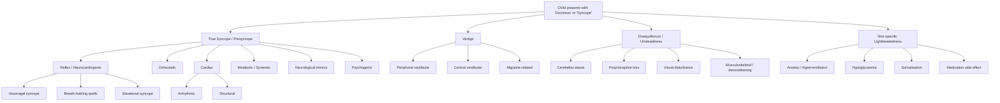

## Differential Diagnosis of Syncope / Dizziness in Children

The differential diagnosis of a child presenting with "syncope" or "dizziness" is one of the broadest in paediatric medicine. The critical first step — as covered in the earlier section — is to **unpack what the child and caregiver mean** by their complaint. A structured approach prevents you from chasing the wrong diagnoses entirely.

Think of it this way: a child who says "I feel dizzy" could have anything from benign positional vertigo to a cardiac channelopathy. Your job is to systematically narrow the field using the history, age, context, and examination.

---

### Organising the Differential: The Master Framework

The differentials split into **two broad presentations** — each then branches by mechanism:

<Callout title="The Number One Exam Mistake" type="error">
Students often jump straight to cardiac causes of syncope because they are dramatic and memorable. But ***> 60–80% of paediatric syncope is neurocardiogenic (reflex)*** [1][3]. The differentials must be ranked by probability AND danger. You need to exclude the dangerous (cardiac, metabolic) quickly, but the most likely answer in any exam stem about an otherwise well adolescent who fainted is vasovagal syncope.
</Callout>

---

### A. Differential Diagnosis of TRUE SYNCOPE (Transient Loss of Consciousness)

This is the child who **actually lost consciousness** transiently with spontaneous recovery. The key differentials are between causes of **syncope** (cerebral hypoperfusion), **seizure** (electrical brain dysfunction), and **pseudosyncope** (psychogenic).

#### A1. Reflex (Neurocardiogenic) Syncope — ~60–80% of Paediatric Syncope

All subtypes share the **final common pathway**: an exaggerated autonomic reflex causes inappropriate vagal activation ± sympathetic withdrawal → ↓HR and/or ↓SVR → ↓BP → ↓cerebral perfusion → TLOC [1][3][4].

| Diagnosis | Age Group | Key Differentiating Features | Why This Mechanism? |
|---|---|---|---|
| ***Vasovagal syncope*** | Older children, adolescents (peak 15–19 yr) | ***Usually when standing; a/w situational trigger (hot/crowded environment, prolonged standing, fear, pain); prodrome of nausea, lightheadedness, sweating, pallor; LOC < 1 min; rapid recovery without confusion*** [1][3][4] | Bezold-Jarisch reflex: venous pooling → ↓VR → vigorous contraction of underfilled LV → vagal afferent activation → paradoxical ↑vagal + ↓sympathetic → ↓HR + vasodilation |
| ***Expiratory apnoea syncope ("blue/cyanotic breath-holding spell")*** | ***6 months – 5 years*** | ***Trigger: anger, crying; hold breath in expiration → go blue, stiff then limp ± LOC; rapid recovery*** [1] | Prolonged forced expiration → ↑intrathoracic pressure (Valsalva) + apnoea → ↓VR → ↓CO + hypoxia → cyanosis + LOC |
| ***Reflex asystolic syncope ("pallid breath-holding spell")*** | ***6 months – 5 years*** | ***Trigger: sudden pain/discomfort, head trauma, cold food, fright, fever; stop breathing → go pale (not blue), stiff ± brief GTCS; usually rapid recovery but occasionally ≥ 1 hour if severe*** [1] | ***Excess vagal stimulation → cardiac asystole*** → ↓cerebral perfusion → pallor (no blood flow to skin) → LOC ± anoxic convulsion |
| **Situational syncope** | Any age (more common in adolescence) | Syncope during/after specific triggers: micturition, defecation, coughing, swallowing cold food, hair-grooming | Each trigger has a specific vagal afferent pathway (e.g., bladder distension → pelvic parasympathetics; oesophageal cold stimulus → vagal reflex; cough → ↑intrathoracic pressure → ↓VR) |

> **How to differentiate vasovagal from cardiac syncope on history alone:**
> - Vasovagal: ***prodrome present (nausea, lightheadedness, sweating)*** [3][4], positional (standing), identifiable trigger, pallor, rapid recovery
> - Cardiac: ***often no prodrome ("usually sudden")*** [3][4], can occur in any position including supine, ***± preceded by palpitation, chest pain*** [3][4], extreme "death-like" pallor, may occur during exertion

#### A2. Orthostatic Syncope — ~8–10%

Mechanism: impaired compensatory vasoconstriction or volume depletion on assuming the upright position → ↓BP → ↓cerebral perfusion.

| Diagnosis | Key Differentiating Features | Why? |
|---|---|---|
| **Dehydration / hypovolaemia** | History of GI losses (vomiting, diarrhoea), poor intake, hot weather, exercise; signs of dehydration; postural BP drop ≥ 20 mmHg systolic | ↓Intravascular volume → ↓VR → ↓SV → exaggerated postural ↓BP |
| ***Hypovolaemic syncope (e.g., haemorrhage, dehydration, anaphylaxis)*** [1] | Acute pallor, tachycardia, hypotension; look for source of bleeding or anaphylactic features (urticaria, wheeze, angioedema) | Severe volume loss → ↓CO → ↓cerebral perfusion. In anaphylaxis: vasodilation + capillary leak compound the hypovolaemia |
| **Postural orthostatic tachycardia syndrome (POTS)** | Adolescent (esp. female), chronic symptoms (≥ 3 months), HR ↑ ≥ 40 bpm on standing WITHOUT BP drop; presyncope, fatigue, palpitations, brain fog; increasingly recognised post-COVID | Impaired peripheral vasoconstriction → excessive venous pooling → compensatory ↑HR; frank syncope is uncommon in pure POTS |
| **Drug-induced orthostatic hypotension** | Recent medication change (antihypertensives — rare in children; antipsychotics, TCAs, α-blockers) | Drug-mediated vasodilation or volume depletion → inadequate reflex compensation |
| **Adrenal insufficiency** | Fatigue, weight loss, hyperpigmentation (primary), hypoglycaemia, hypoNa, hyperK; may present as adrenal crisis with shock [5] | ↓Cortisol → ↓vascular tone + ↓ability to retain Na/H₂O → hypovolaemia + vasodilation → orthostatic hypotension |
| **Autonomic neuropathy** (rare in children) | Guillain-Barré syndrome, familial dysautonomia (Riley-Day — Ashkenazi Jewish children); absent sweating, fixed HR | Damage to autonomic nerves → failure of vasoconstriction + HR response on standing |

#### A3. Cardiac Syncope — ~2–6% (but Potentially Fatal)

Mechanism: arrhythmia or structural cardiac disease → sudden ↓CO → ↓cerebral perfusion. The key distinguishing feature: ***often none (usually sudden); ± preceded by palpitation, chest pain*** [3][4].

##### A3a. Arrhythmic Causes

| Diagnosis | Age | Key Differentiating Features | Why? |
|---|---|---|---|
| ***Long QT syndrome (LQTS)*** [1] | Any age; present in childhood | ***Family Hx of sudden death, syncope triggered by exertion (LQTS1), auditory stimuli (LQTS2), or sleep (LQTS3)***; prolonged QTc on ECG ( > 470 ms M, > 480 ms F); torsades de pointes | Delayed cardiac repolarisation (K⁺ or Na⁺ channel mutations) → early after-depolarisations → polymorphic VT (TdP) → ↓CO → LOC |
| **Catecholaminergic polymorphic VT (CPVT)** | School-age and adolescent | Syncope/cardiac arrest during exercise or emotional stress; **resting ECG often normal**; diagnosis by exercise stress test showing bidirectional VT | Ryanodine receptor (RyR2) mutation → abnormal Ca²⁺ release during adrenergic stimulation → triggered activity → bidirectional or polymorphic VT |
| **Wolff-Parkinson-White (WPW)** | Any age (congenital accessory pathway) | Palpitations preceding syncope; delta wave on resting ECG; SVT or pre-excited AF → very rapid ventricular rate → ↓diastolic filling → ↓CO | Accessory pathway (Bundle of Kent) allows re-entrant circuit (SVT) or rapid conduction of AF directly to ventricles bypassing AV node delay |
| **Brugada syndrome** | Adolescent / young adult | Syncope or cardiac arrest at rest or during sleep; coved ST elevation V1–V3; more common in SE Asian males | Na⁺ channelopathy → transmural voltage gradient in RV → phase 2 re-entry → VT/VF |
| **Complete heart block (3° AV block)** | Neonatal–childhood | Congenital: neonatal lupus (maternal anti-Ro/La); acquired: post-cardiac surgery, myocarditis; low resting HR; may present as hydrops fetalis | No conduction atria → ventricles → ventricular escape rhythm at 30–50 bpm → inadequate CO during exertion → syncope |
| **SVT / AF / VT** | Any age | Preceding palpitations; rapid onset/offset; pallor; ECG during event diagnostic | Rapid rate → ↓diastolic filling time → ↓SV → ↓CO |

***Causes of exercise-related syncope*** [3][4]:
1. ***LVOT obstruction: AS, HCM***
2. ***RVOT obstruction: pulmonary HTN***
3. ***Cardiomyopathy: DCM, HCM, ARVC***
4. ***Coronary artery disease: atherosclerotic, anomalous origin of coronary arteries***
5. ***Arrhythmogenic: VT, SVT, WPW, LQTS***

##### A3b. Structural Cardiac Causes

| Diagnosis | Key Differentiating Features | Why? |
|---|---|---|
| **Hypertrophic cardiomyopathy (HCM)** | Exertional syncope, family Hx of HCM or sudden death, systolic murmur at LLSE ↑ with Valsalva, abnormal ECG (LVH, deep Q waves), pathological hypertrophy on echo | Dynamic LVOT obstruction + diastolic dysfunction → inability to ↑CO during exertion → ↓cerebral perfusion; also substrate for VT/VF |
| **Severe aortic stenosis** | Exertional syncope/presyncope, ejection systolic murmur radiating to carotids; may be congenital bicuspid valve | Fixed LVOT obstruction → inability to ↑CO during exertion + exertional vasodilation → ↓cerebral perfusion |
| **Anomalous origin of coronary artery** | Exertional syncope or sudden death in an otherwise well young person; may have no murmur | Aberrant course (typically LCA from right sinus with interarterial course between aorta and PA) → extrinsic compression during exertion → myocardial ischaemia → VT/VF or ↓CO [3][4] |
| **Pulmonary hypertension** | Exertional syncope, exertional dyspnoea, loud P2, RV heave; may be primary or secondary (e.g., congenital heart disease with Eisenmenger) | ↑RV afterload → inability to ↑CO during exercise → exertional syncope |
| **Cardiac tamponade / myocarditis / DCM** | Signs of heart failure (tachycardia, hepatomegaly, gallop, poor perfusion); preceding viral illness (myocarditis); pulsus paradoxus (tamponade) | ↓Systolic function or ↓diastolic filling → ↓CO → ↓cerebral perfusion |
| **Cardiac tumour (e.g., atrial myxoma, rhabdomyoma)** | Positional syncope (may occur with specific body positions that cause tumour to obstruct valve orifice); rhabdomyoma in infancy a/w tuberous sclerosis | Mechanical obstruction of intracardiac blood flow |

#### A4. Neurological Mimics of Syncope (Seizure and Other)

These are **not true syncope** (mechanism is not cerebral hypoperfusion) but present with **TLOC** and are the most important differential to distinguish.

| Diagnosis | Key Differentiating Features | Why This is Different From Syncope |
|---|---|---|
| ***Epileptic seizure*** | ***Preceded by aura (déjà vu, olfactory hallucinations); LOC typically > 1 min; tonic-clonic movements BEGIN at onset of LOC (not after); a/w incontinence, tongue-biting, uprolling eyeballs; recovery slow with prolonged post-ictal confusion, headache, focal neurological signs*** [1][3][4] | ***Mechanism: abnormal electrical activities in the brain*** [3][4] — not hypoperfusion. Key: convulsions in epilepsy begin simultaneously with LOC; in syncopal anoxic convulsion, the movements come AFTER LOC from a clearly syncopal prodrome |
| ***Febrile seizure*** | ***Fever ≥ 38°C, age 6 months – 5 years; brief GTCS; absence of CNS infection, metabolic disturbance, Hx of afebrile seizure*** [1] | Not hypoperfusion; temperature-dependent lowering of seizure threshold in immature brain |
| **Absence seizure** | Brief staring spells (5–15 seconds) without falling; can be provoked by hyperventilation; 3 Hz spike-and-wave on EEG | Not true LOC in the sense of collapse — child "blanks out" but remains upright. Parents may describe as "dizzy" or "zoning out" |
| **Migraine with brainstem aura** | Vertigo, visual aura, ataxia, dysarthria ± LOC; followed by headache; family Hx of migraine | Transient brainstem dysfunction (possibly cortical spreading depression extending to brainstem) — not simple hypoperfusion |
| **Raised ICP** | Morning headache worsened by coughing/straining, vomiting, papilloedema, progressive neurological signs, personality change; posterior fossa tumour in children may present with ataxia and vertigo | Mass effect → compression of brainstem → impaired consciousness; or transient herniation during Valsalva |

<Callout title="Anoxic Convulsion vs Epileptic Seizure — The Exam Trap" type="error">
***A brief tonic-clonic movement AFTER the onset of syncope is an anoxic (syncopal) convulsion***, NOT epilepsy [1]. The key differentiator: (1) timing — movements come AFTER LOC in syncope but FROM THE START in seizure; (2) duration — anoxic convulsions last < 15 seconds vs. seizures typically > 1 min; (3) recovery — rapid in syncope, slow with confusion in seizure; (4) EEG — normal interictally in anoxic convulsion. This is ***commonly tested*** because misdiagnosis leads to inappropriate anti-seizure medication.
</Callout>

#### A5. Metabolic / Systemic Causes

| Diagnosis | Key Differentiating Features | Why? |
|---|---|---|
| ***Hypoglycaemia*** | ***Adrenergic symptoms (palpitation, sweating, anxiety, tremor, tachycardia) followed by neuroglycopenic symptoms (hunger, paraesthesia, seizures, focal weakness, ↓consciousness, drowsiness, coma)*** [5]; relevant in diabetic children on insulin, neonates, ketotic hypoglycaemia of childhood, adrenal insufficiency | ↓Glucose to brain → neuroglycopenia → CNS dysfunction; confirmed by Whipple's triad [5] |
| **Severe anaemia (acute)** | Pallor, tachycardia, postural dizziness, SOB; Hx of acute blood loss, haemolytic crisis (e.g., splenic sequestration in SCD), heavy menstrual loss in adolescent girls; ***SOB on exertion, palpitation, dizziness/syncope (may be postural)*** [6] | Severe or acute ↓Hb → ↓O₂-carrying capacity → ↓O₂ delivery to brain → presyncope/syncope |
| **Hyperventilation** | Anxious adolescent; perioral and distal tingling/numbness; feeling of SOB with normal SpO₂; carpopedal spasm | ↓PaCO₂ → cerebral vasoconstriction → ↓cerebral blood flow; also respiratory alkalosis → ↑Ca²⁺ binding to albumin → relative hypocalcaemia → paraesthesia |
| **Carbon monoxide poisoning** | Headache, nausea, confusion, LOC; exposure history (gas heater, closed car, charcoal burning — relevant in HK self-harm context); "cherry red" skin (late/unreliable); normal SpO₂ on pulse ox (CO mimics O₂ on standard pulse ox) | CO displaces O₂ from Hb (CO affinity 200–250× O₂) → ↓O₂ delivery → tissue hypoxia; also direct mitochondrial toxicity |
| **Electrolyte disturbance** | Hyponatraemia (seizures, confusion); hypokalaemia (weakness, arrhythmia); hypocalcaemia (tetany, seizures) | Various — hypoNa causes cerebral oedema → impaired neuronal function; hypoCa causes neuronal hyperexcitability |
| **Drug / toxin ingestion** | Adolescents: recreational drugs, intentional overdose; younger children: accidental ingestion | Mechanism varies by agent: sedatives → CNS depression; sympathomimetics → arrhythmia; anticholinergics → altered consciousness |

#### A6. Psychogenic Pseudosyncope

| Diagnosis | Key Differentiating Features | Why? |
|---|---|---|
| **Psychogenic pseudosyncope / non-epileptic attacks** | Episodes longer than typical syncope (minutes to hours); eyes often **closed** and actively resisting opening (in true syncope eyes are usually open); no pallor; normal HR and BP during episodes; no injury despite frequent "collapses"; underlying psychiatric comorbidity; adolescents under psychosocial stress | ***Mechanism: psychogenic*** [4] — no cerebral hypoperfusion, no abnormal electrical discharge. This is a conversion/functional neurological symptom disorder. Normal haemodynamics during the event differentiate it from true syncope |

<Callout title="Clinical Pearl — Eyes Open vs Closed">
In **true syncope**, the eyes are typically **open** (sometimes rolled upward) because the brainstem's reticular activation system is suppressed — it takes active cortical effort to close the eyes. In **psychogenic pseudosyncope**, the eyes are typically **closed** and the patient may resist passive eye-opening. This is a quick bedside clue but not 100% reliable — always consider the overall clinical picture.
</Callout>

---

### B. Differential Diagnosis of DIZZINESS (Without True TLOC)

For children who describe "dizziness" without actual LOC, the differentials pivot depending on which of the four subtypes of dizziness is present:

#### B1. Vertigo (Illusion of Movement)

| Diagnosis | Age / Context | Key Differentiating Features | Why? |
|---|---|---|---|
| **Benign paroxysmal vertigo of childhood (BPVC)** | 2–6 years (migraine equivalent) | Episodic vertigo lasting seconds to minutes; pallor, nystagmus, ataxia during attack; NO LOC; completely normal between episodes; often family Hx of migraine; may evolve into migraine in later childhood | Thought to be a migraine equivalent affecting the vestibular system; mechanism likely similar to cortical spreading depression affecting vestibular nuclei |
| **Vestibular neuritis / labyrinthitis** | Any age (often post-viral) | Acute onset of sustained severe rotatory vertigo, nausea/vomiting; horizontal nystagmus (fast phase away from affected side); hearing loss if labyrinthitis (cochlea involved) | Inflammation of vestibular nerve (CN VIII) → asymmetric vestibular input → brain perceives rotation |
| **Otitis media with effusion / middle ear disease** | Young children | Dizziness/unsteadiness with concurrent ear symptoms (otalgia, hearing loss, otorrhoea); abnormal tympanic membrane | Middle ear inflammation/effusion → secondary labyrinthine irritation |
| **Benign paroxysmal positional vertigo (BPPV)** | Rare in children (adults/elderly); adolescents possible post-trauma | Brief (< 1 min) episodes provoked by specific head positions; positive Dix-Hallpike test with characteristic geotropic torsional nystagmus | Otoconia dislodged from utricle into semicircular canal (usually posterior) → endolymph displacement → inappropriate cupula stimulation |
| **Post-traumatic vertigo** | Post head injury | Vertigo following head trauma; may be BPPV-type or more prolonged (labyrinthine concussion) | Trauma → otolith displacement or labyrinthine damage |
| **Posterior fossa tumour** | Any age (peak 5–10 yr for medulloblastoma, ependymoma, cerebellar astrocytoma) | ***Progressive*** vertigo, ataxia, headache (especially morning, worsened by Valsalva), vomiting, papilloedema, cranial nerve palsies; signs of ↑ICP | Mass effect on cerebellum/brainstem → direct vestibular nuclear compression + ↑ICP from obstructive hydrocephalus (4th ventricle obstruction) |
| **Migraine with brainstem aura (basilar migraine)** | Adolescents | Vertigo, visual aura (scotoma, blurring), dysarthria, tinnitus ± LOC; followed by headache; family Hx | Cortical spreading depression affecting brainstem/vestibular structures |

#### B2. Disequilibrium / Unsteadiness

| Diagnosis | Key Differentiating Features | Why? |
|---|---|---|
| **Acute post-infectious cerebellitis** | Acute ataxia 1–2 weeks after viral illness (varicella, EBV); unsteady wide-based gait; truncal ataxia; self-limiting | Immune-mediated inflammation of cerebellum → cerebellar dysfunction → impaired coordination and balance |
| **Cerebellar tumour** | Progressive ataxia, headache, vomiting, papilloedema | Mass effect on cerebellum → progressive loss of balance and coordination |
| **Friedreich's ataxia** | Adolescent; progressive ataxia + pes cavus + scoliosis + cardiomyopathy; AR inheritance | GAA trinucleotide repeat in frataxin gene → mitochondrial dysfunction in dorsal root ganglia + cerebellum + heart |
| **Peripheral neuropathy** | Glove-and-stocking sensory loss, ↓reflexes; Charcot-Marie-Tooth in children; GBS if acute | Loss of proprioceptive input → impaired balance (sensory ataxia) |

#### B3. Non-specific Lightheadedness

| Diagnosis | Key Differentiating Features | Why? |
|---|---|---|
| **Anxiety / panic attacks** | Adolescent; ***feelings of dizziness, unsteadiness, light-headedness, or faint*** [7]; associated palpitations, SOB, trembling, chest discomfort, paraesthesia, derealization; recurrent unexpected attacks (panic disorder) or situational (social anxiety, specific phobia, GAD) | Hyperventilation → ↓PaCO₂ → cerebral vasoconstriction → ↓cerebral blood flow; autonomic arousal mimics presyncope [7][8] |
| **Somatisation / somatic symptom disorder** | ***Non-specific: fatigue, syncope, dizziness*** [9]; chronic, causes distress/impairment; excessive health-related thoughts and behaviours; multiple somatic complaints without adequate medical explanation | Amplification of normal somatic sensations through excessive attention and anxiety; central sensitisation |
| **Medication side effects** | Temporal relationship with drug initiation/dose change; sedating antihistamines, anti-seizure medications, antipsychotics | Drug-specific mechanisms: sedation, vasodilation, vestibular suppression |
| **Hypoglycaemia (mild)** | Shakiness, hunger, irritability, difficulty concentrating, lightheadedness; resolves with food; timing related to meals or insulin | ↓Glucose → ↓substrate for neuronal function → non-specific CNS symptoms |

---

### C. Age-Based Differential Approach

Because the differential in paediatrics varies dramatically with age, here is a practical age-stratified summary:

| Age Group | Most Likely Causes of Syncope | Most Likely Causes of Dizziness |
|---|---|---|
| **Neonate – 6 months** | Cardiac arrhythmia (congenital LQTS, complete heart block from neonatal lupus), cardiac structural disease, metabolic (hypoglycaemia, inborn errors), sepsis/shock | Rarely reported; consider seizure, metabolic |
| **6 months – 5 years** | ***Breath-holding spells (cyanotic and pallid)*** [1], febrile seizures (differential), cardiac arrhythmia (rare), intussusception (pallor/lethargy can mimic syncope) | **Benign paroxysmal vertigo of childhood**, otitis media, acute cerebellitis |
| **5–12 years** | Vasovagal syncope (becoming more common), orthostatic (dehydration), cardiac (HCM, LQTS, CPVT), epilepsy | BPVC, migraine, anxiety (emerging), posterior fossa tumour |
| **12–18 years (adolescence)** | ***Vasovagal syncope*** (most common), POTS, orthostatic hypotension (dehydration, eating disorders), cardiac (LQTS, HCM, WPW, CPVT), anxiety/hyperventilation, psychogenic pseudosyncope, pregnancy | Migraine (with/without aura), anxiety/panic, vestibular neuritis, BPPV (post-trauma), hyperventilation, somatisation |

<Callout title="Don't Forget in Adolescents">
Always ask about **eating disorders** (anorexia → dehydration, electrolyte disturbance, bradycardia, orthostatic hypotension), **pregnancy** (in any post-menarchal adolescent), **substance use** (recreational drugs, energy drinks → arrhythmias), and **self-harm / intentional overdose** (carbon monoxide, medication overdose) — particularly relevant in the Hong Kong context where these presentations are increasingly common.
</Callout>

---

### D. Summary Table: Key Differentiating Features at a Glance

| Feature | Vasovagal | Cardiac | Seizure | Breath-Holding (Cyanotic) | Breath-Holding (Pallid) | POTS | Psychogenic |
|---|---|---|---|---|---|---|---|
| **Age** | Adolescent | Any | Any | 6 mo–5 yr | 6 mo–5 yr | Adolescent | Adolescent |
| **Prodrome** | Nausea, lightheaded, sweating | Often none | Aura | Crying, anger | Pain, fright | Lightheaded, palpitations | Variable |
| **Trigger** | Standing, heat, pain, emotion | Exertion, swimming, sleep, loud noise | Often none / sleep deprivation | Temper tantrum | Sudden pain/head bump | Standing | Psychosocial stress |
| **Colour** | Pale | Death-like pallor | Normal → cyanotic (if prolonged) | ***Blue*** | ***Pale/white*** | Normal | Normal |
| **Duration LOC** | < 1 min | < 1 min | > 1 min | Seconds | Seconds | Rarely true LOC | Minutes–hours |
| **Convulsive movements** | Brief anoxic seizure possible (after LOC) | Brief anoxic seizure possible | From onset of LOC | ± brief GTCS after LOC | ***± brief GTCS*** | No | Variable, non-stereotyped |
| **Recovery** | Rapid, no confusion | Rapid if self-terminating | ***Slow, prolonged confusion*** | Rapid | Rapid (may be prolonged if severe) | Rapid | Variable |
| **ECG** | Normal | Often abnormal | Normal (between episodes) | Normal | Normal | Normal (↑HR on standing) | Normal |

---

### E. Approach to Distinguishing the Differential — Clinical Reasoning

The history alone will give you the answer in **60–80% of cases** [3]. Here is how to reason through it systematically:

**Step 1: Was there true LOC?**
- Yes → syncope vs seizure vs pseudosyncope
- No → vertigo vs disequilibrium vs lightheadedness

**Step 2: If true LOC — what was the context?**
- During exertion → **cardiac until proven otherwise** (HCM, LQTS, CPVT, anomalous coronary)
- After exertion → vasovagal (vasodilation persists, CO drops)
- Standing/hot room/emotional trigger → vasovagal
- Crying/temper tantrum (age < 5 yr) → cyanotic breath-holding
- Sudden pain/head bump (age < 5 yr) → pallid breath-holding
- Supine/sleeping → cardiac arrhythmia (LQTS type 3, Brugada)
- During swimming → LQTS type 1 (cold water + exertion)

**Step 3: Was there a prodrome?**
- Yes (nausea, lightheadedness, sweating) → neurocardiogenic
- Yes (aura: déjà vu, smell, taste) → seizure
- No prodrome (sudden drop) → cardiac

**Step 4: What happened during the event?**
- Convulsive movements FROM the start + LOC > 1 min + incontinence + tongue bite → seizure
- Brief twitch AFTER LOC → anoxic convulsion (not epilepsy)
- Blue coloration → cyanotic breath-holding OR prolonged seizure
- Pallor → pallid breath-holding, vasovagal, or cardiac

**Step 5: How fast was recovery?**
- Rapid, no confusion → syncope (any type) or breath-holding
- ***Slow with prolonged confusion, headache, focal neurological signs → seizure*** [3][4]

**Step 6: Red flags for cardiac?**
- Family Hx sudden death < 40 yr
- Syncope during exertion / swimming / auditory stimulus
- Preceding palpitations
- Known heart disease
- Abnormal ECG
→ **If any present: urgent cardiology referral, ECG, echo**

**Step 7: Red flags for something sinister?**
- Progressive neurological symptoms → tumour / ↑ICP
- Focal neurological signs → stroke (extremely rare in children unless SCD, cardiac, prothrombotic)
- Papilloedema → ↑ICP

---

<Callout title="High Yield Summary — Differential Diagnosis">

1. **> 60–80% of paediatric syncope is neurocardiogenic (reflex)** — vasovagal in adolescents, breath-holding spells in toddlers.
2. **Cardiac syncope is only 2–6% but potentially lethal** — red flags: exertional, no prodrome, family Hx sudden death, palpitations, abnormal ECG.
3. **The key differential for syncope is seizure** — differentiate by timing of convulsive movements (after LOC = anoxic convulsion of syncope; from onset = seizure), duration of LOC ( < 1 min syncope vs > 1 min seizure), and speed of recovery (rapid = syncope; slow with confusion = seizure).
4. **Breath-holding spells** are paediatric-specific (6 mo–5 yr): cyanotic type = expiratory apnoea from crying; pallid type = vagal-mediated asystole from pain/fright.
5. **Dizziness without LOC**: vertigo (vestibular — BPVC most common in young children, migraine in adolescents), disequilibrium (cerebellar), lightheadedness (anxiety/hyperventilation most common in adolescents).
6. **In adolescents, always consider**: POTS, anxiety/panic, eating disorders, pregnancy, substance use, self-harm.
7. **Age-based approach is essential**: the differential diagnosis changes dramatically from neonates (cardiac, metabolic) to toddlers (breath-holding, febrile seizures) to adolescents (vasovagal, POTS, anxiety, cardiac channelopathies).
</Callout>

---

<ActiveRecallQuiz
  title="Active Recall - Differential Diagnosis of Syncope/Dizziness in Paediatrics"
  items={[
    {
      question: "A 3-year-old child bumps his head on a table, immediately turns pale, becomes stiff, and has brief tonic-clonic movements for 10 seconds before going limp and recovering within 1 minute. What is the most likely diagnosis and its key mechanism?",
      markscheme: "Reflex asystolic (pallid) breath-holding spell. Mechanism: sudden pain triggers excess vagal stimulation leading to cardiac asystole, causing transient cerebral hypoperfusion. Pallor occurs due to absent cardiac output (no blood flow to skin). Brief tonic-clonic movements are anoxic convulsions secondary to brain hypoxia, not epilepsy."
    },
    {
      question: "List five red flag features in the history that should raise suspicion for cardiac syncope in a child and explain why each is concerning.",
      markscheme: "1. Syncope during exertion - cardiac output cannot meet demand due to obstruction or arrhythmia. 2. No prodrome/sudden onset - arrhythmia causes abrupt drop in CO with no time for autonomic warning. 3. Family history of sudden death under age 40 - suggests inherited channelopathy or cardiomyopathy. 4. Preceding palpitations or chest pain - suggests arrhythmia or ischaemia. 5. Syncope while supine, swimming, or triggered by auditory stimuli - specific patterns of LQTS subtypes. Also accept: abnormal ECG, known structural heart disease."
    },
    {
      question: "A 14-year-old girl describes episodic 'dizziness' on standing with palpitations, fatigue, and brain fog for the past 4 months. She has not lost consciousness. Lying-to-standing HR increases from 72 to 118 bpm without significant BP change. What is the most likely diagnosis and what defines it in adolescents?",
      markscheme: "Postural orthostatic tachycardia syndrome (POTS). Defined as sustained heart rate increase of 40 bpm or more (or absolute HR above 120 bpm) within 10 minutes of standing, WITHOUT orthostatic hypotension, with symptoms persisting for at least 3 months. Frank syncope is uncommon in pure POTS."
    },
    {
      question: "How do you differentiate an anoxic convulsion from syncope versus an epileptic seizure using four clinical features?",
      markscheme: "1. Timing of movements: anoxic convulsion occurs AFTER LOC (from syncopal prodrome), epileptic seizure begins at onset of LOC. 2. Duration: anoxic convulsion is brief (under 15 seconds), seizure typically over 1 minute. 3. Recovery: rapid without confusion in syncope, slow with prolonged post-ictal confusion in seizure. 4. Inter-ictal EEG: normal in anoxic convulsion, may show epileptiform discharges in epilepsy."
    },
    {
      question: "Name the most common cause of episodic vertigo in a 3-year-old child with no hearing loss and completely normal examination between episodes. What is its natural history?",
      markscheme: "Benign paroxysmal vertigo of childhood (BPVC). It is considered a migraine equivalent. Episodes last seconds to minutes with pallor, nystagmus, and ataxia during the attack but no LOC. Child is completely normal between episodes. Natural history: tends to resolve by school age and often evolves into typical migraine headaches in later childhood. Family history of migraine is common."
    }
  ]}
/>

## References

[1] Senior notes: Adrian Lui Pediatrics.pdf (p117 — Paroxysmal disorders, breath-holding spells, vasovagal syncope, cardiac syncope, febrile seizures)
[3] Senior notes: Ryan Ho Fundamentals.pdf (p208–210, p323 — Syncope mechanisms, cardiogenic vs neurocardiogenic vs seizure table, exercise-related syncope causes)
[4] Senior notes: Ryan Ho Cardiology.pdf (p63–66 — Syncope mechanisms, neurocardiogenic pathogenesis, structural/arrhythmic causes, exercise-related syncope causes, tilt-table test)
[5] Senior notes: Ryan Ho Endocrine.pdf (p71, p94 — Adrenal insufficiency, hypoglycaemia clinical features and Whipple's triad)
[6] Senior notes: Ryan Ho Haemtology.pdf (p10 — Symptoms of anaemia including dizziness/syncope)
[7] Senior notes: Ryan Ho Psychiatry.pdf (p173, p178–179 — Panic disorder clinical features, GAD somatic features including dizziness)
[8] Senior notes: Ryan Ho Psychiatry.pdf (p75 — Delirium differential including non-convulsive status epilepticus)
[9] Senior notes: Ryan Ho Psychiatry.pdf (p202 — Somatic symptom disorder including syncope and dizziness as non-specific presentations)
