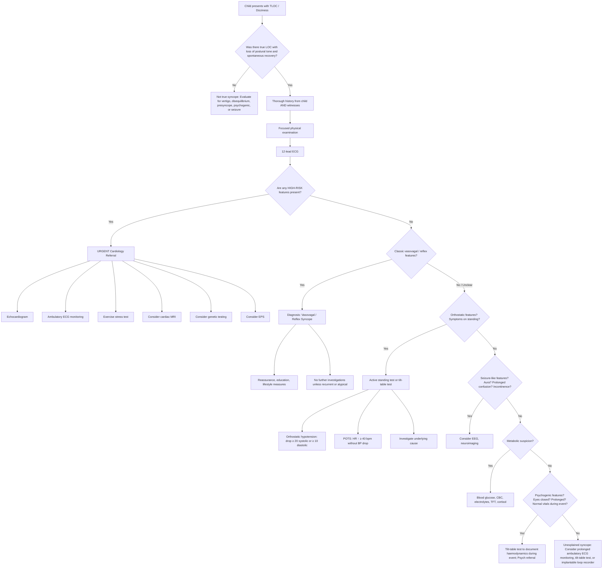

## Diagnostic Criteria, Algorithm, and Investigations for Paediatric Syncope / Dizziness

---

### 1. Diagnostic "Criteria" — Why There Is No Single Set

Unlike conditions such as rheumatic fever or Kawasaki disease, **syncope is a symptom, not a disease**. There is no single set of "diagnostic criteria" for syncope itself. Instead, the diagnostic process aims to:

1. **Confirm that the event was true syncope** (transient global cerebral hypoperfusion with LOC and spontaneous recovery)
2. **Identify the specific aetiology** (reflex, orthostatic, cardiac, or other)
3. **Risk-stratify** the child — is this benign, or does it carry a risk of sudden death?

The **European Society of Cardiology (ESC) 2018 Guidelines** (applicable to all ages, adapted for paediatrics) and the **American Heart Association/American College of Cardiology (AHA/ACC) 2017 Guideline for the Evaluation and Management of Syncope** provide the framework. For paediatrics specifically, the approach is informed by **Paediatric Cardiology Society** consensus statements and the ESC paediatric addendum [3][4][10].

The fundamental principle: ***the history is the single most powerful diagnostic tool — it determines the cause in up to 60–80% of cases*** [3][4].

---

### 2. Defining Syncope — ESC Criteria

The ESC 2018 defines syncope as requiring ALL of:

| Criterion | Explanation |
|---|---|
| **Transient loss of consciousness (TLOC)** | The child truly lost consciousness — not just "felt faint" (that is presyncope) |
| **Loss of postural tone** | The child fell or would have fallen if unsupported |
| **Rapid onset** | Sudden or near-sudden — not a gradual decline in consciousness |
| **Short duration** | Typically seconds to < 2 minutes |
| **Spontaneous and complete recovery** | No resuscitation required; full return to baseline. If a child requires intervention to regain consciousness, this is NOT simple syncope — think seizure, cardiac arrest, metabolic coma |
| **Due to transient global cerebral hypoperfusion** | This is what separates syncope from other causes of TLOC (seizure, concussion, psychogenic) |

<Callout title="Clinical Pearl — Not Every 'Blackout' is Syncope">
If the child did not lose consciousness (presyncope), if recovery was slow with prolonged confusion (seizure), if there was no loss of postural tone (absence seizure), or if resuscitation was needed (cardiac arrest), it is NOT syncope by definition. Getting the definition right is the first diagnostic step.
</Callout>

---

### 3. Risk Stratification — Identifying the Dangerous Minority

The whole point of the diagnostic workup is to **separate the ~95% of children with benign syncope from the ~2–6% with life-threatening cardiac causes**. Multiple scoring systems exist for adults (San Francisco Syncope Rule, OESIL, EGSYS), but **none are validated in the paediatric population**. Therefore, in children we rely on **clinical red flags** [3][4][10].

#### High-Risk Features (Requiring Urgent Cardiac Workup)

| Red Flag | Why It Points to Cardiac | Action |
|---|---|---|
| ***Syncope during exertion*** | Exercise ↑cardiac demand → structural obstruction or arrhythmia unmasked | Urgent ECG + echo + cardiology referral |
| ***Syncope while supine or swimming*** | Posture-independent syncope not explained by reflex mechanism; cold water + exertion triggers LQTS1 | Urgent ECG + cardiology |
| ***No prodrome — sudden collapse*** | Abrupt ↓CO from arrhythmia — no time for autonomic warning symptoms [3][4] | Urgent ECG |
| ***Preceded by palpitations or chest pain*** | Suggests arrhythmia or coronary ischaemia preceding the syncope [4] | ECG + ambulatory monitoring |
| ***Family Hx of sudden cardiac death < 40 years, LQTS, HCM, drowning, SIDS*** | Inherited channelopathies and cardiomyopathies are familial | ECG on patient AND first-degree relatives |
| ***Abnormal cardiac examination*** (murmur, irregular rhythm, signs of HF) | Structural heart disease | Echo + ECG + cardiology |
| ***Abnormal ECG*** | Direct evidence of electrical substrate for arrhythmia | See ECG interpretation section below |
| ***Known congenital heart disease*** (repaired or unrepaired) | Substrate for arrhythmia or haemodynamic compromise | Specialist follow-up |
| ***Recurrent syncope refractory to treatment*** | May have been misdiagnosed as vasovagal | Extended monitoring |

#### Low-Risk Features (Typical Reflex Syncope)

- Classic prodrome (nausea, lightheadedness, sweating, visual dimming)
- Identifiable trigger (standing, heat, pain, blood/needle, emotion)
- Age-appropriate context (adolescent at school assembly)
- Normal cardiac examination
- Normal ECG
- Rapid and complete recovery
- Family history of fainting (not sudden death)

> In a child with ALL low-risk features and a classic vasovagal history, **minimal or no further investigation beyond history, examination, and ECG is required** [10].

---

### 4. Diagnostic Algorithm — Paediatric Syncope Workup

---

### 5. Investigation Modalities — Detailed

#### 5.1 History (The Most Important "Investigation")

This bears repeating because it cannot be overemphasised: ***clear Hx most important*** [3][4]. In paediatrics, you must get the history from **multiple sources** — the child, the parent/caregiver, any witness (teacher, friend, coach).

Key history components covered in prior sections. The structured "5 Ws" approach is useful:
- **Who**: age, sex, background medical history, family history
- **What**: exactly what happened — description from the child AND witnesses
- **When**: timing relative to meals, sleep, menstrual cycle; time of day
- **Where**: school assembly (heat/standing), swimming pool, bed (supine)
- **Why**: identifiable trigger or provoking factor

<Callout title="Family History — Ask Specifically" type="idea">
Don't just ask "Is there any family history?" — be specific: "Has anyone in the family died suddenly before age 40? Has anyone had unexplained drowning, a single-vehicle car accident, seizures, fainting spells, or a pacemaker/defibrillator?"
</Callout>

#### 5.2 Physical Examination

| Component | What to Check | Why |
|---|---|---|
| **Vitals: HR, BP (supine AND standing), RR, SpO₂, temp** | Active standing test: check BP and HR supine, then at 1, 3, and 5 minutes of standing | To detect orthostatic hypotension (↓SBP ≥ 20 or ↓DBP ≥ 10 within 3 min) or POTS (↑HR ≥ 40 in adolescents) [4] |
| **Cardiovascular exam** | Murmurs (HCM: systolic at LLSE ↑ Valsalva; AS: ejection systolic RUSE → carotids), rhythm irregularity, S2 splitting, RV heave, apex displacement, gallop | To detect structural heart disease or arrhythmia |
| **Hydration status** | Mucous membranes, skin turgor, cap refill, JVP (older children) | To identify dehydration as contributor |
| **Neurological exam** | Tone, power, reflexes, coordination, cranial nerves, fundoscopy (papilloedema) | To exclude neurological cause (raised ICP, posterior fossa lesion) — focal signs are NOT expected in true syncope |
| **Growth parameters** | Height, weight, BMI plotted on growth charts | Poor growth → chronic disease; low BMI → eating disorder; tall with arachnodactyly → Marfan |
| **Skin** | Café-au-lait spots (NF1), ash-leaf macules (tuberous sclerosis), hyperpigmentation (Addison's) | Syndromic associations with cardiac/metabolic disease |

#### 5.3 Twelve-Lead ECG — The Mandatory First-Line Investigation

> **A 12-lead ECG should be performed in EVERY child presenting with syncope.** This is the single most important investigation after the history and examination [3][4][10].

**Why?** Because an ECG can directly identify an arrhythmic substrate that would explain (or predict) cardiac syncope. It is cheap, non-invasive, widely available, and can be life-saving.

**Interpretation — What to look for systematically:**

| ECG Finding | What It Suggests | Pathophysiology |
|---|---|---|
| ***Prolonged QTc > 470 ms in males, > 460 ms in females*** [4] | ***Long QT syndrome (LQTS)*** | Delayed ventricular repolarisation → ↑vulnerability to triggered activity → torsades de pointes (TdP) |
| ***Biphasic/notched T waves*** [4] | ***LQTS (commonly found but insensitive)*** | Abnormal repolarisation morphology from channelopathy |
| **Delta wave (short PR + slurred QRS upstroke)** | Wolff-Parkinson-White (WPW) | Accessory pathway (Bundle of Kent) pre-excites the ventricle → short PR, delta wave |
| **Coved ST elevation in V1–V3** | Brugada syndrome | Na⁺ channelopathy → transmural voltage gradient in RV epicardium → characteristic ST morphology |
| **Deep Q waves in lateral/inferior leads + LVH pattern** | Hypertrophic cardiomyopathy (HCM) | Septal hypertrophy → "dagger-like" Q waves from septal depolarisation; ↑voltage from thickened myocardium |
| **Complete heart block (dissociated P waves and QRS)** | 3° AV block | No conduction from atria to ventricles → risk of bradycardia-related syncope |
| **Sinus bradycardia below normal range for age** | Sick sinus syndrome, athletic heart, drug effect | ↓SA node automaticity → insufficient HR → ↓CO |
| **Ventricular pre-excitation** | WPW or other accessory pathway | Allows re-entrant tachycardia |
| **ST-segment changes** | Myocarditis, coronary anomaly (rare in children) | Myocardial ischaemia or inflammation |
| **RV strain pattern (RAD, RVH, RBBB)** | Pulmonary hypertension, PE (rare in children), ARVC | ↑RV pressure/volume overload |
| **Epsilon waves (small potentials at terminal QRS in V1–V3)** | Arrhythmogenic RV cardiomyopathy (ARVC) | Fibrofatty replacement of RV myocardium → delayed depolarisation |
| **Normal ECG** | Reassuring but does NOT exclude all cardiac causes (CPVT has normal resting ECG!) | CPVT only shows arrhythmia during adrenergic stimulation (exercise) |

**Paediatric ECG norms differ from adults** — key age-specific considerations:
- **Neonates**: right axis deviation and RV dominance are NORMAL (because of the high pulmonary vascular resistance in utero). Don't call this "RVH."
- **QTc calculation**: use Bazett's formula (QTc = QT / √RR). In neonates, QTc up to 460 ms can be normal in the first week, but persistent QTc > 470 ms warrants investigation.
- **HR norms**: resting HR decreases with age (neonate 120–160 bpm → adolescent 60–100 bpm). Sinus bradycardia below the age-appropriate range is concerning.

<Callout title="CPVT Trap" type="error">
***Catecholaminergic polymorphic VT (CPVT) has a normal resting ECG.*** If you suspect exercise-triggered cardiac syncope and the resting ECG is normal, you MUST proceed to exercise stress testing. A normal resting ECG does not exclude cardiac syncope.
</Callout>

#### 5.4 Blood Tests

Routine blood tests are **not needed for classic vasovagal syncope** but are indicated when the history suggests a non-reflex cause:

| Test | When to Order | Key Findings & Interpretation |
|---|---|---|
| **Capillary/venous blood glucose** | Suspicion of hypoglycaemia (diabetic on insulin, neonatal, prolonged fasting) | Low glucose concurrent with symptoms + resolution with correction = Whipple's triad [5] |
| **CBC with differential** | Pallor, menorrhagia, poor diet, suspected anaemia [6] | ↓Hb → anaemia contributing to presyncope; MCV guides type (microcytic → iron deficiency most common in paediatrics) |
| **Electrolytes (Na, K, Ca, Mg)** | Vomiting, diarrhoea, diuretic use, seizure features, recurrent syncope [4][11] | HypoK → arrhythmia; hypoNa → seizure; hypoCa → tetany/seizure; hypoMg → arrhythmia |
| **TFT** | Tachycardia, weight loss, tremor, goitre | Hyperthyroidism → ↑HR → tachyarrhythmia; hypothyroidism → bradycardia |
| **Cortisol / ACTH** (synacthen test) | Hypotension, hyperpigmentation, hypoNa, hyperK, hypoglycaemia | ↓Cortisol → adrenal insufficiency → inability to maintain vascular tone [5] |
| **β-hCG** (in post-menarchal adolescents) | ALL adolescent females with syncope or dizziness | Pregnancy → supine hypotension (IVC compression), ↓SVR, anaemia |
| **Cardiac enzymes (troponin)** | Chest pain, ECG changes, suspected myocarditis | ↑Troponin → myocardial injury |
| **BNP / NT-proBNP** | Suspected heart failure | ↑BNP → ventricular wall stress from volume/pressure overload |
| **Drug levels / toxicology screen** | Suspected ingestion, adolescent with unexplained LOC | Detection of causative agent |
| ***ABG + lactate*** | Shock, prolonged collapse, respiratory symptoms [11] | Metabolic acidosis with ↑lactate → poor tissue perfusion |

#### 5.5 Echocardiography

| Indication | What to Look For | Interpretation |
|---|---|---|
| **Any clinical suspicion of structural heart disease** (murmur, signs of HF, abnormal ECG) | Chamber dimensions, wall thickness, valve function, LVOT gradient, coronary origins, pericardial effusion | HCM: asymmetric septal hypertrophy ≥ 15 mm (or > 2 SD for body surface area in children), LVOT gradient ≥ 30 mmHg at rest |
| **Exertional syncope** [3][4] | As above + specifically assess for dynamic LVOT obstruction (HCM), fixed obstruction (AS), anomalous coronary origins, RV function (ARVC, pulmonary HTN) | Anomalous coronary: LCA from right sinus coursing between aorta and PA |
| **Family Hx of HCM or sudden death** | Screen for subclinical HCM | LV wall thickness, systolic anterior motion of mitral valve |
| **Abnormal ECG** | Assess for structural correlate | E.g., deep Q waves on ECG → check for septal hypertrophy |

**Paediatric-specific point**: In young children, echocardiography is the primary imaging modality (no radiation, widely available, excellent acoustic windows in children due to thinner chest walls). It can usually visualize coronary artery origins in children (harder in adults).

#### 5.6 Ambulatory ECG Monitoring — Achieving Symptom-Rhythm Correlation

The gold standard for diagnosing arrhythmic syncope is ***demonstrating the arrhythmia at the time of symptoms*** — this is known as **symptom-rhythm correlation** [4].

| Modality | Duration | When to Use | How It Works |
|---|---|---|---|
| ***Holter monitoring*** | ***24–72 hours (up to 7 days)*** | ***Daily or near-daily symptoms*** | ***Continuous recording with patient-activated event markers; child presses a button when symptomatic*** [3][4] |
| ***Event (loop) monitors*** | ***2–4 weeks*** | ***Weekly or monthly symptoms*** | ***Continuous "loop" recording that overwrites itself; patient activates the device to save the rhythm strip when symptoms occur*** [3][4] |
| ***Patch recorder (e.g., Zio patch)*** | ***Up to 14 days*** | ***Intermediate frequency symptoms*** | ***Small adhesive patch on chest; continuous recording; sent for analysis after wearing period*** [3][4] |
| ***Implantable loop recorder (ILR)*** | ***Up to 3 years*** | ***Very infrequent (< 1/month) but recurrent, concerning symptoms*** | ***Subcutaneously implanted in prepectoral region; continuous monitoring; auto-detects arrhythmias and patient-activated events*** [3][4] |

**Paediatric considerations:**
- Holter monitors are well-tolerated even in young children. Use paediatric-sized electrodes.
- ILRs are increasingly used in children (e.g., Reveal LINQ™ — very small device). Requires brief general anaesthesia for implantation in young children.
- ***The key principle: the monitoring duration must match the symptom frequency.*** Putting a 24-hour Holter on a child who faints once every 3 months is almost guaranteed to yield nothing useful.

#### 5.7 Exercise Stress Test (Treadmill or Bicycle Ergometry)

| Indication | What to Look For | Interpretation |
|---|---|---|
| **Exertional syncope** | Arrhythmia during/after exercise, BP response, exercise capacity | VT during exercise = CPVT or other exercise-triggered arrhythmia |
| ***Suspected CPVT (resting ECG normal, exertional syncope)*** | Bidirectional or polymorphic VT provoked by exercise | Diagnostic for CPVT |
| **Suspected LQTS** | QTc behaviour during exercise and recovery | ***Maladaptation of QT interval to changing HR*** [4] — QTc should shorten with ↑HR; failure to shorten or paradoxical prolongation suggests LQTS |
| **Suspected exercise-related structural syncope (HCM, AS)** | BP response, occurrence of arrhythmia, ST changes | Failure of SBP to rise ≥ 20 mmHg with exercise or a drop during exercise → ominous in HCM |

**Paediatric considerations**: Performed on age-appropriate equipment (bicycle ergometry more feasible in younger children). Must have resuscitation equipment immediately available. Contraindicated in acute myocarditis, severe AS with symptoms, or known unstable arrhythmia.

#### 5.8 Tilt-Table Test (Head-Up Tilt Test, HUTT)

***Workup: usually not required (dx by exclusion) but may be useful when atypical/recurrent*** [3][4].

| Aspect | Detail |
|---|---|
| **Indication** | Recurrent unexplained syncope when clinical features are atypical for vasovagal; differentiating convulsive syncope from epilepsy; diagnosing psychogenic pseudosyncope; confirming delayed orthostatic hypotension or POTS [3][4] |
| ***Procedure*** | ***Patient tilted from supine to 60–70° for 20–45 minutes ± pharmacological provocation (low-dose isoproterenol or sublingual nitrates)*** [3][4] |
| ***Positive result*** | ***↓HR (cardioinhibitory type) and/or ↓BP (vasodepressor type) reproducing the patient's typical symptoms*** [3][4] |
| **Negative result** | No haemodynamic change and no symptoms during the entire test |
| **Limitations** | ***Findings are suggestive of tendency/predisposition to reflex syncope only*** [3][4] — it does not definitively prove that the presenting episode was vasovagal. Sensitivity ~60–70%, specificity ~85–90%. False negatives are common in children. |
| **POTS diagnosis** | During tilt: sustained HR ↑ ≥ 40 bpm in adolescents (or HR > 120 bpm absolute) within 10 minutes WITHOUT significant BP drop |

***Pharmacological provocation:***
- ***Isoproterenol may paradoxically trigger vasovagal syncope, presumably due to activation of central circulation mechanoreceptors*** [4] — this ↑sensitivity but ↓specificity.
- ***Nitroglycerin causes venodilation → ↓VR → ↓SV without impeding SN response of ↑HR and arterial vasoconstriction*** [4].

**Paediatric considerations**: Can be performed in children from about age 6–7 years. Younger children may not tolerate the prolonged standing period. In centres without tilt-table facilities, a supervised **active standing test** (standing motionless against a wall for up to 10 minutes with HR and BP monitoring) can serve as a simpler alternative.

#### 5.9 Electroencephalography (EEG)

| Indication | What to Look For | Interpretation |
|---|---|---|
| **Suspicion of epileptic seizure** (aura, LOC > 1 min, post-ictal confusion, tongue-biting, incontinence) | Epileptiform discharges (spikes, sharp waves, spike-wave complexes) | If present → supports epilepsy diagnosis; if normal → does NOT exclude epilepsy (only ~50% sensitivity on single routine EEG) |
| **Differentiating convulsive syncope from epilepsy** | Normal inter-ictal EEG → favours syncopal anoxic seizure, not epilepsy | Anoxic seizures show diffuse slowing during the event (if captured on simultaneous EEG/tilt), not epileptiform discharges |
| **Video-EEG telemetry** | Correlation of clinical event with EEG findings | Can definitively diagnose psychogenic non-epileptic events (normal EEG during clinical "seizure") |

> **An EEG should NOT be routinely ordered for syncope** unless there are specific features suggesting seizure. An EEG is a test for epilepsy, not for syncope.

#### 5.10 Neuroimaging (CT Brain / MRI Brain)

| Indication | Modality | What to Look For |
|---|---|---|
| **Focal neurological signs on examination** | CT brain (urgent) → MRI brain | Space-occupying lesion, haemorrhage, structural abnormality |
| **Papilloedema** | MRI brain with MRV | Posterior fossa tumour, hydrocephalus, cerebral venous sinus thrombosis |
| **Progressive headache + ataxia + vomiting (raised ICP)** | MRI brain | Posterior fossa tumour (medulloblastoma, ependymoma, pilocytic astrocytoma) |
| **New focal seizure** | MRI brain | Structural lesion |

> **Neuroimaging is NOT indicated for typical vasovagal syncope** or breath-holding spells with normal examination. Ordering a CT brain for every fainting child is unnecessary and exposes them to radiation.

#### 5.11 Cardiac MRI (CMR)

| Indication | What to Look For |
|---|---|
| **Suspected ARVC** | Fibrofatty replacement of RV myocardium, RV wall motion abnormalities, RV dilation |
| **Equivocal echocardiography for HCM** | Precise wall thickness measurement, fibrosis on late gadolinium enhancement (LGE) |
| **Suspected myocarditis** | Myocardial oedema (T2-weighted), LGE pattern (subepicardial/mid-wall) |
| **Anomalous coronary artery assessment** | Precise delineation of coronary origin and course |

**Paediatric consideration**: May require sedation or general anaesthesia in young children. CT coronary angiography is an alternative for coronary anatomy assessment (lower spatial resolution for myocardial tissue characterization but excellent for coronary origins).

#### 5.12 Electrophysiological Study (EPS)

***Indication: suspected arrhythmic aetiology in cardiomyopathy, BBB, SVT, WPW; undiagnosed syncope with multiple recurrence*** [3][4].

***NOT indicated if normal ECG, normal cardiac structure/function unless arrhythmic aetiology suspected*** [3][4].

***Procedure:***
- ***Multipolar catheters placed in different sites of heart***
- ***Record intracardiac electrical signals***
- ***Pace at different areas and look for abnormalities***
- ***Induce arrhythmias by injection of pro-arrhythmic drugs → search for abnormal pathways*** [3][4]

**Paediatric considerations**: Performed under general anaesthesia in children. Risk–benefit must be carefully weighed. Usually reserved for cases where non-invasive testing has not been diagnostic and there is strong clinical suspicion.

#### 5.13 Genetic Testing

| Indication | Genes Tested | When |
|---|---|---|
| **Clinical or ECG diagnosis of LQTS** | KCNQ1 (LQT1), KCNH2 (LQT2), SCN5A (LQT3), and others | After clinical/ECG diagnosis established; also cascade screening of first-degree relatives |
| **Clinical suspicion of CPVT** | RYR2, CASQ2 | After positive exercise stress test |
| **Brugada syndrome** | SCN5A (only ~20–30% yield) | After clinical/ECG diagnosis |
| **HCM** | MYH7, MYBPC3, and others | After echo diagnosis; cascade family screening |
| **ARVC** | PKP2, DSP, DSG2, DSC2 | After clinical/imaging diagnosis |

***Clinical syndrome recognition by family history, symptoms and ECG findings → Schwartz score guides genetic testing for LQTS: low (≤ 1), intermediate (1.5–3), high (≥ 3.5)*** [4].

***Identification of LQTS gene mutation is diagnostic; however, only 50% positive for known LQTS gene mutation → negative genetic test has limited diagnostic value*** [4].

**Paediatric-specific point**: Cascade genetic screening of first-degree relatives (including asymptomatic siblings and parents) is essential when a pathogenic variant is identified. This is a key family-centred care aspect — the diagnosis in one child may save the life of a sibling or parent. Genetic counselling should be offered before and after testing.

---

### 6. Special Diagnostic Scenarios by Age

#### 6.1 Neonates and Young Infants (0–6 months)

Syncope is very rare in this age group. Any episode of LOC or an apparent life-threatening event (ALTE) / brief resolved unexplained event (BRUE) must be taken seriously:
- **ECG** (including QTc measurement) is mandatory
- **Blood glucose, electrolytes, blood gas, septic screen**
- **Echocardiography** if any cardiac suspicion
- **Consider congenital LQTS** (especially Jervell and Lange-Nielsen syndrome if sensorineural hearing loss is present)
- **Consider congenital complete heart block** (especially if maternal SLE/anti-Ro antibodies)

#### 6.2 Infants and Toddlers (6 months – 5 years)

- **Breath-holding spells**: diagnosed clinically based on typical history (trigger → apnoea → colour change → stiffness ± LOC → rapid recovery). **No investigations required** unless features are atypical.
- If atypical: check **ECG** (r/o LQTS, as pallid breath-holding can rarely be the first presentation of a channelopathy), **Hb** (iron deficiency is associated with breath-holding spells and iron supplementation may reduce frequency)
- **Febrile seizures**: diagnosis of exclusion — ***should perform infection screen for all → r/o meningitis!*** [1]. LP if meningitis suspected (especially in < 12 months or if Haemophilus/pneumococcal vaccination incomplete).

#### 6.3 Children and Adolescents (5–18 years)

Standard workup as described in the algorithm above. **ECG in every case. Blood tests only if indicated by history.** Echocardiography and ambulatory monitoring for cardiac suspicion. Tilt-table test for recurrent atypical syncope.

---

### 7. Investigation Summary Table

| Investigation | First-Line (All) | Second-Line (Selected) | Third-Line (Specialist) |
|---|---|---|---|
| **History** | ✓✓✓ — Most important | | |
| **Physical exam** (incl. lying-standing BP/HR) | ✓✓✓ | | |
| **12-lead ECG** | ✓✓✓ — Mandatory for all | | |
| **Blood glucose** | If hypoglycaemia suspected | | |
| **CBC** | If anaemia suspected | | |
| **Electrolytes** | If dehydration/metabolic suspected | | |
| **Echocardiography** | | Murmur, abnormal ECG, exertional syncope | |
| **Holter / Event monitor** | | Palpitations, suspected arrhythmia | |
| **Exercise stress test** | | Exertional syncope, suspected CPVT/LQTS | |
| **Tilt-table test** | | Recurrent atypical syncope, suspected POTS | |
| **EEG** | | Seizure features | |
| **MRI brain** | | Focal neuro signs, ↑ICP, progressive symptoms | |
| **Implantable loop recorder** | | | Unexplained recurrent syncope |
| **EPS** | | | Suspected arrhythmia, abnormal ECG/echo |
| **Cardiac MRI** | | | Suspected ARVC, myocarditis, equivocal echo |
| **Genetic testing** | | | After clinical diagnosis of channelopathy/cardiomyopathy |

---

<Callout title="High Yield Summary — Diagnosis and Investigation">

1. **Syncope is a symptom, not a disease** — the diagnostic process aims to confirm true syncope, identify the cause, and risk-stratify.
2. **History is the most powerful tool** — determines diagnosis in 60–80% of cases.
3. **ECG is mandatory in EVERY child with syncope** — look for prolonged QTc, delta wave, Brugada pattern, deep Q waves (HCM), complete heart block, RV strain.
4. **A normal resting ECG does NOT exclude cardiac syncope** — CPVT has a normal resting ECG; exercise stress testing is required if exertional syncope is suspected.
5. **Ambulatory ECG monitoring must match symptom frequency** — Holter for daily, loop monitor for weekly/monthly, ILR for very infrequent.
6. **Tilt-table test** is for recurrent atypical syncope, suspected POTS, or to distinguish convulsive syncope from epilepsy — it shows predisposition only, not definitive proof.
7. **Blood tests, neuroimaging, and EEG are NOT routinely needed** for typical vasovagal syncope — only order when the history or examination suggests a specific non-reflex cause.
8. **Breath-holding spells in toddlers**: clinical diagnosis — check ECG if atypical, and check Hb (iron deficiency associated).
9. **Genetic testing** for channelopathies/cardiomyopathies + cascade family screening = key family-centred care action.
10. **Schwartz score** guides genetic testing for LQTS: low ≤ 1, intermediate 1.5–3, high ≥ 3.5.
</Callout>

---

<ActiveRecallQuiz
  title="Active Recall - Diagnosis and Investigation of Paediatric Syncope/Dizziness"
  items={[
    {
      question: "A 13-year-old collapses during a basketball game. The resting ECG is completely normal. Does this exclude cardiac syncope? What investigation should you order next and why?",
      markscheme: "No, a normal resting ECG does NOT exclude cardiac syncope. Catecholaminergic polymorphic VT (CPVT) has a normal resting ECG. The next investigation should be an exercise stress test, which may provoke bidirectional or polymorphic VT during adrenergic stimulation. Also order echocardiography to assess for structural causes such as HCM or anomalous coronary arteries."
    },
    {
      question: "List the key ECG findings that should raise suspicion for cardiac syncope in a child and name the associated condition for each.",
      markscheme: "Prolonged QTc above 470 ms male or above 460 ms female - LQTS. Delta wave with short PR - WPW syndrome. Coved ST elevation V1 to V3 - Brugada syndrome. Deep Q waves with LVH voltage - HCM. Complete heart block with P-QRS dissociation - congenital or acquired 3rd degree AV block. Epsilon waves in V1 to V3 - ARVC. Right heart strain pattern with RBBB - pulmonary hypertension."
    },
    {
      question: "A child has syncope about once every 2 months. A 24-hour Holter recording is normal. What is the next most appropriate monitoring strategy and why?",
      markscheme: "A 24-hour Holter is unlikely to capture an event that occurs every 2 months. The next step is an event (loop) monitor for 2 to 4 weeks, or a patch recorder for up to 14 days. If episodes are less frequent than monthly, consider an implantable loop recorder (ILR) which can monitor for up to 3 years. The principle is that monitoring duration must match symptom frequency to achieve symptom-rhythm correlation."
    },
    {
      question: "Describe the procedure and interpretation of a tilt-table test in a paediatric patient. What are its three main clinical utilities?",
      markscheme: "Procedure: Patient tilted from supine to 60 to 70 degrees for 20 to 45 minutes, optionally with pharmacological provocation using isoproterenol or sublingual nitrates. Interpretation: Positive if reproduction of symptoms with decrease in HR (cardioinhibitory) and/or decrease in BP (vasodepressor). Findings are suggestive of predisposition only. Three utilities: 1. Diagnosis of neurocardiogenic syncope and delayed orthostatic hypotension. 2. Distinguishing convulsive syncope from epilepsy. 3. Establishing diagnosis of psychogenic pseudosyncope."
    },
    {
      question: "A 2-year-old has recurrent pallid breath-holding spells. The parents are very anxious. What investigations, if any, would you order, and what specific blood test may be clinically useful?",
      markscheme: "Pallid breath-holding spells are a clinical diagnosis and usually require no investigation. However: 1. ECG should be checked if episodes are atypical (to rule out LQTS, as pallid spells can rarely be the first presentation of a channelopathy). 2. Full blood count/haemoglobin should be checked because iron deficiency anaemia is associated with increased frequency of breath-holding spells, and iron supplementation may reduce episode frequency. Reassurance to parents is a key part of management."
    },
    {
      question: "What is the Schwartz score used for, and what do its three probability categories mean for further management?",
      markscheme: "The Schwartz score is used to estimate the clinical probability of Long QT syndrome based on ECG findings, clinical history (syncope triggers, family history), and family history of LQTS or sudden death. Low probability score 1 or less - LQTS unlikely, no genetic testing. Intermediate 1.5 to 3 - consider genetic testing. High 3.5 or more - LQTS highly likely, genetic testing recommended. Importantly, a positive gene mutation is diagnostic, but a negative result has limited diagnostic value as only about 50 percent of clinical LQTS patients have an identifiable known mutation."
    }
  ]}
/>

## References

[1] Senior notes: Adrian Lui Pediatrics.pdf (p117 — Febrile seizure investigation: infection screen to rule out meningitis; breath-holding spells diagnosis)
[3] Senior notes: Ryan Ho Fundamentals.pdf (p207–211, p323 — Syncope workup, ambulatory ECG types and indications, tilt-table test procedure and interpretation, EPS indications, structural causes of cardiac syncope, neurocardiogenic syncope pathogenesis)
[4] Senior notes: Ryan Ho Cardiology.pdf (p62, p65–66, p196 — Palpitation/syncope workup, ambulatory ECG modalities, tilt-table test utility and procedure, exercise-related syncope causes, EPS indications and procedure, LQTS ECG findings and Schwartz score, Brugada syndrome)
[5] Senior notes: Ryan Ho Endocrine.pdf (p71, p94 — Adrenal insufficiency diagnosis, hypoglycaemia Whipple's triad)
[6] Senior notes: Ryan Ho Haemtology.pdf (p10 — Approach to anaemia, symptoms including dizziness/syncope)
[10] ESC 2018 Guidelines on Syncope (adapted for paediatrics) — referenced as standard of care framework
[11] Senior notes: Ryan Ho Critical Care.pdf (p17 — Early investigations in shock: ECG, CBC, L/RFT, ABG + lactate)
