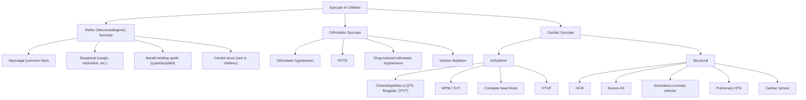

# Syncope / Dizziness in Paediatrics

## 1. Definition and Terminology

**Syncope** derives from the Greek *synkoptein* — "syn" (together) + "koptein" (to cut off) — literally meaning "to cut off together," i.e., a sudden interruption of blood supply to the brain.

> **Syncope** is defined as a **sudden, transient loss of consciousness (TLOC) and postural tone with spontaneous and complete recovery**, caused by **transient global cerebral hypoperfusion** [1][2].

The key physiological point: loss of consciousness occurs within **≤ 8–10 seconds of cessation of cerebral blood flow** to the **reticular activating system (RAS)** in the brainstem/midbrain. This is true in adults and children alike, but the paediatric brain is somewhat more vulnerable to transient hypoperfusion because of its relatively higher metabolic rate [1].

**Presyncope** ("near-faint") is the subjective feeling that one is about to lose consciousness — lightheadedness, dimming of vision, warmth, nausea — but the child does not actually lose consciousness. Presyncope shares the same pathophysiology and differential diagnosis as syncope; it is just a milder form along the same spectrum.

**Dizziness** is a broader, less specific symptom that children (and parents) may describe. It is critical to **unpack what "dizzy" means** before jumping to conclusions. In paediatrics, especially in younger children who lack the vocabulary, the history is almost entirely from caregivers and observers [1][2].

Dizziness encompasses several distinct syndromes:

| Symptom | What the child/parent means | Underlying mechanism |
|---|---|---|
| **Vertigo** | "The room is spinning" or "I'm spinning" | Abnormal perception of movement — vestibular (peripheral or central) |
| **Presyncope / syncope** | "I feel faint," "everything goes black," "I nearly passed out" | Global cerebral hypoperfusion |
| **Unsteadiness / disequilibrium** | "I feel wobbly," "I can't walk straight" | Cerebellar ataxia, proprioceptive dysfunction, visual disturbance, joint disease |
| **Non-specific lightheadedness** | "I feel weird in my head," "spaced out" | Anxiety, hyperventilation, panic attacks, hypoglycaemia, psychogenic non-epileptic attacks |

***It is essential to distinguish these categories because the differential diagnosis, workup, and management differ entirely*** [1][2].

<Callout title="Clinical Pearl — The First Question to Ask">
When a child or adolescent presents with "dizziness," the single most important question is: **"What exactly do you mean by dizzy?"** Get them to describe it without using the word "dizzy." Are things spinning? Do you feel like you might faint? Do you feel off-balance? This one question redirects your entire diagnostic pathway.
</Callout>

---

## 2. Epidemiology

### 2.1 Syncope in Children and Adolescents

- **Very common**: syncope accounts for **~1% of paediatric emergency department visits** [1].
- **Lifetime prevalence**: approximately **15–25% of children** will experience at least one syncopal episode before adulthood; the peak incidence is in **adolescence (ages 10–19 years)**, particularly around **15–19 years** [3].
- **Sex**: slight female predominance in adolescence (F > M, approximately 2:1), partly because vasovagal syncope is more common in females, and partly because the hormonal and autonomic changes of puberty trigger more episodes in girls.
- **Benign aetiology in the vast majority**: **> 60–80% of paediatric syncope is neurocardiogenic (vasovagal or reflex syncope)** [1][2].
- **Cardiac syncope is rare but life-threatening**: accounts for only **2–6% of paediatric syncope** but carries a significantly increased mortality risk (up to **30% if undiagnosed cardiac cause**) [1][2].
- **Breath-holding spells** (a form of reflex syncope in young children) occur in **~5% of children** aged 6 months to 5 years, with peak at 1–3 years [1].

### 2.2 Dizziness in Children

- Less well-studied than in adults.
- Most common cause in young children: **benign paroxysmal vertigo of childhood** (a migraine equivalent, distinct from BPPV in adults).
- In adolescents: **vasovagal presyncope** and **anxiety-related dizziness** (hyperventilation) are the most common causes.
- True vestibular pathology is relatively rare in children.

### 2.3 Hong Kong Context

- In HK's subtropical climate, hot and humid environments (especially during summer) are a common trigger for vasovagal syncope during school assemblies, sports, and public transport.
- Postural orthostatic tachycardia syndrome (POTS) is increasingly recognized in Hong Kong adolescents, particularly in the post-COVID era.
- **Long QT syndrome (LQTS)** — an important cause of cardiac syncope — is relevant in HK because specific LQTS-associated mutations (e.g., KCNQ1, KCNH2) are found in the Chinese population. Family screening is important [2].
- School-based screening ECGs are not routine in HK, so a high index of suspicion for cardiac syncope is essential.

---

## 3. Risk Factors

Risk factors can be divided into those predisposing to **benign (reflex/neurocardiogenic) syncope** vs. those raising suspicion for **cardiac syncope**:

### 3.1 Risk Factors for Vasovagal / Reflex Syncope (benign)
- **Adolescence**, especially female sex
- **Dehydration** (poor fluid intake, hot weather, exercise without adequate hydration)
- **Prolonged standing** (school assemblies, bus queues)
- **Hot, stuffy, crowded environments**
- **Emotional triggers**: pain, fear, sight of blood, needles (very common in paediatrics — think vaccination clinics!)
- **Sleep deprivation** (extremely common in HK adolescents due to academic pressures)
- **Skipping meals** (common in HK secondary school students)
- **Family history of fainting** (genetic predisposition to vasovagal sensitivity)

### 3.2 Red Flag Risk Factors for Cardiac Syncope
- **Family history of sudden cardiac death** (especially < 40 years), LQTS, Brugada syndrome, hypertrophic cardiomyopathy (HCM), arrhythmogenic right ventricular cardiomyopathy (ARVC)
- **Syncope during exertion** (as opposed to after exertion)
- **Syncope while supine or swimming**
- **Preceding palpitations or chest pain**
- **Known structural heart disease** (e.g., repaired or unrepaired congenital heart disease)
- **Abnormal ECG** (prolonged QTc, pre-excitation/delta wave, Brugada pattern, pathological Q waves)
- **Use of QT-prolonging medications**
- **History of seizures refractory to anti-seizure medications** (may actually be cardiac syncope with anoxic convulsions misdiagnosed as epilepsy)

<Callout title="High Yield — Red Flags for Cardiac Syncope" type="error">
Any child with **syncope during exertion**, **syncope while supine or in water**, **family history of sudden death < 40 years**, **preceding palpitations**, or **abnormal ECG** must be evaluated urgently for cardiac causes. Missing cardiac syncope can be fatal. The 30% mortality figure for undiagnosed cardiac syncope should keep you awake at night [1][2].
</Callout>

---

## 4. Relevant Anatomy and Physiology

### 4.1 Cerebral Perfusion and the Reticular Activating System (RAS)

- Consciousness depends on adequate perfusion of the **reticular activating system (RAS)** in the **brainstem (midbrain/pons)** and both **cerebral hemispheres**.
- The brain receives ~15% of cardiac output but accounts for ~20% of total body oxygen consumption — it has essentially **no energy reserves** and no capacity for anaerobic metabolism in the acute setting.
- In paediatric patients, the brain-to-body metabolic ratio is even higher, making children potentially more sensitive to transient hypoperfusion.
- **LOC occurs within 8–10 seconds** of cessation of cerebral blood flow (or a drop in mean arterial pressure [MAP] below the lower limit of autoregulation) [1].

### 4.2 Blood Pressure Regulation — The Autonomic Reflex Arc

Understanding syncope requires understanding **how blood pressure is maintained**:

**Blood Pressure = Cardiac Output × Systemic Vascular Resistance (SVR)**

Where: **Cardiac Output = Stroke Volume × Heart Rate**

Any mechanism that ↓CO or ↓SVR (or both) → ↓BP → ↓cerebral perfusion → syncope.

**Normal BP Maintenance on Standing (Orthostatic Reflex):**
1. On standing, ~500–700 mL of blood pools in the lower extremities and splanchnic circulation due to gravity.
2. This reduces venous return → ↓preload → ↓stroke volume → initial ↓BP (transient drop of ~10–20 mmHg systolic).
3. **Baroreceptors** in the carotid sinus and aortic arch detect the ↓BP → signals via CN IX (glossopharyngeal) and CN X (vagus) to the **nucleus tractus solitarius (NTS)** in the medulla.
4. The NTS orchestrates the response:
   - **↑Sympathetic outflow**: ↑HR (via β1 receptors on SA node), ↑contractility, ↑SVR (via α1 receptors on arterioles), venoconstriction (to ↑venous return)
   - **↓Parasympathetic (vagal) outflow**: removes the "brake" on heart rate
5. Net result: BP is restored within seconds.

**In children**, this reflex arc is still maturing, which is one reason why adolescents are particularly prone to vasovagal syncope — their autonomic nervous system is "learning" to calibrate, and the overshoot or paradoxical vagal response is more common.

### 4.3 The Vasovagal Reflex (Bezold-Jarisch Reflex)

This is the key mechanism behind the **most common type of paediatric syncope** — vasovagal syncope:

1. A trigger (e.g., prolonged standing, dehydration, emotional stress) causes **venous pooling** → ↓venous return → ↓preload.
2. The heart compensates by beating more vigorously (↑sympathetic tone → ↑contractility with a relatively empty ventricle).
3. **Mechanoreceptors (C-fibres)** in the **left ventricular wall** are paradoxically activated by the vigorous contraction of a near-empty ventricle.
4. These C-fibres send afferents via the **vagus nerve** to the **NTS**, which misinterprets this as hypertension/hypercontractility.
5. The NTS triggers an **exaggerated vagal response**:
   - **↑Parasympathetic output → bradycardia** (cardioinhibitory component)
   - **↓Sympathetic output → vasodilation → ↓SVR** (vasodepressor component)
6. The combined effect: **↓↓BP** and/or **↓↓HR** → ↓cerebral perfusion → syncope.

This is why vasovagal syncope is also called **neurocardiogenic syncope** — the nervous system (neuro-) causes inappropriate cardiac (-cardiogenic) slowing/vasodilation.

### 4.4 Paediatric-Specific Physiology

| Feature | Implication for Syncope |
|---|---|
| **Relatively higher vagal tone** in children vs. adults | More susceptible to bradycardia-mediated syncope |
| **Immature autonomic nervous system** in adolescents | Exaggerated or paradoxical responses to orthostatic stress |
| **Lower blood volume per kg** in young children | More susceptible to dehydration-related syncope |
| **Higher metabolic rate of the brain** | Less tolerance for transient hypoperfusion |
| **Growth spurts in adolescence** | Rapid increase in body size may outpace cardiovascular adaptation → orthostatic intolerance |

### 4.5 Normal Cardiovascular Values by Age (for context)

| Age | Heart Rate (bpm) | Systolic BP (mmHg) | Diastolic BP (mmHg) |
|---|---|---|---|
| Neonate | 120–160 | 60–80 | 30–50 |
| Infant (1–12 months) | 100–150 | 70–90 | 40–60 |
| Toddler (1–3 years) | 80–130 | 80–100 | 50–70 |
| Pre-school (3–6 years) | 80–120 | 85–110 | 55–75 |
| School-age (6–12 years) | 70–110 | 90–120 | 60–80 |
| Adolescent (12–18 years) | 60–100 | 100–130 | 65–85 |

> Remember: blood pressure norms in paediatrics are defined by **age, sex, and height percentile**. A systolic BP < 5th percentile for age = hypotension.

---

## 5. Aetiology (with Paediatric Focus, Relevant to Hong Kong)

The **aetiological classification** of syncope in children follows the same framework as adults but with very different proportions and some unique paediatric entities [1][2]:

### 5.1 Overview of Causes

| Category | Proportion | Mechanism |
|---|---|---|
| ***Neurocardiogenic (reflex) syncope*** | ***~60–80%*** | ***Exaggerated autonomic reflex → ↓HR and/or ↓SVR → ↓BP → ↓cerebral perfusion*** |
| **Orthostatic syncope** | ~8–10% | Impaired vasoconstriction on standing → ↓BP |
| **Cardiac syncope** | ~2–6% | Arrhythmia or structural heart disease → ↓CO |
| **Neurological causes** | ~1–3% | Seizure (not true syncope but a key differential), basilar migraine, subclavian steal |
| **Metabolic / other** | ~2–5% | Hypoglycaemia, hyperventilation, anaemia, drugs |
| **Psychogenic** | ~3–5% | Psychogenic pseudosyncope (conversion disorder) |
| **Unexplained** | ~5–20% | No identifiable cause after workup |

### 5.2 Neurocardiogenic (Reflex) Syncope — The Most Common Cause in Children

"Reflex syncope" is the umbrella term. It encompasses several subtypes, all sharing the **final common pathway of inappropriate vagal activation ± sympathetic withdrawal → ↓BP and/or ↓HR**:

#### 5.2.1 Vasovagal Syncope (VVS) — "Simple Faint"

- **The single most common cause** of syncope in older children and adolescents [1][2].
- **Trigger**: prolonged standing, hot/crowded environments, emotional stress, pain, fear, blood/needle phobia.
- **Mechanism**: Bezold-Jarisch reflex (described above).
- Three subtypes based on the predominant efferent limb:
  - **Vasodepressor** (most common in paediatrics): predominantly ↓SVR (vasodilation) → ↓BP
  - **Cardioinhibitory**: predominantly ↓HR (bradycardia or asystole)
  - **Mixed**: both components
- ***Usually when standing*** [1][2].
- ***A/w situational trigger*** [1][2].
- ***Usually brief (in minutes)*** [1][2].
- ***Pallor*** [1][2].

**Pathophysiology in detail (vasodepressor type):**
Trigger → venous pooling → ↓venous return → vigorous contraction of underfilled LV → activation of LV mechanoreceptors → vagal afferents → NTS → paradoxical ↑vagal efferent + ↓sympathetic efferent → vasodilation + bradycardia → ↓cerebral perfusion → presyncope → syncope.

#### 5.2.2 Breath-Holding Spells (Paediatric-Specific, Age 6 months – 5 years)

These are a form of **reflex syncope unique to young children**. They are NOT voluntary and the name "breath-holding" is misleading — the child does not choose to hold their breath [1].

**Two types:**

**(a) ***Expiratory apnoea syncope ("cyanotic" or "blue" breath-holding spells)***:**
- ***Trigger: anger, frustration, crying*** [1]
- ***Feature: child holds breath in expiration → goes blue (cyanotic), becomes stiff then limp ± LOC; rapid recovery*** [1]
- **Mechanism**: Vigorous crying → prolonged forced expiration → ↑intrathoracic pressure (Valsalva-like effect) → ↓venous return → ↓CO → ↓cerebral perfusion → syncope. The cyanosis is from hypoxia during apnoea.
- Not dangerous, self-limiting. The child resumes breathing reflexively.

**(b) ***Reflex asystolic (anoxic) syncope ("pallid" breath-holding spells)***:**
- ***MoA: excess vagal stimulation → cardiac asystole*** [1]
- ***Trigger: sudden pain/discomfort, head trauma, cold food, fright, fever*** [1]
- ***Feature: stop breathing and go pale (pallid), become stiff ± brief GTCS; usually rapid recovery but occasionally ≥ 1 hour if severe*** [1]
- **Mechanism**: The trigger (e.g., a bump to the head) provokes an **exaggerated vagal reflex** → **cardiac asystole** (pause of several seconds) → ↓cerebral perfusion → LOC + pallor (no blood reaching the skin). If the asystole is prolonged enough, **anoxic seizure** (brief tonic-clonic movements) may occur — this is NOT epilepsy, it is a consequence of brain hypoperfusion.
- Often confused with epileptic seizures — important differential.

<Callout title="Anoxic Convulsion ≠ Epilepsy" type="error">
***A brief tonic-clonic movement following syncope*** (of any type) is an **anoxic convulsion**, not an epileptic seizure. It occurs because the hypoxic brain generates abnormal electrical discharges. It does NOT require anti-seizure medication. The key differentiator: the convulsion occurs AFTER LOC (not before), and the episode is preceded by a clear syncopal trigger/prodrome. The EEG between episodes is normal [1].
</Callout>

#### 5.2.3 Situational Syncope

- **Trigger-specific** subtypes of reflex syncope:
  - **Micturition syncope**: occurs during or after urination, typically in adolescent males. Mechanism: bladder emptying → ↓intra-abdominal pressure → vagal activation + ↓venous return.
  - **Defecation syncope**: straining → Valsalva → ↓venous return.
  - **Cough syncope**: severe coughing bout → ↑intrathoracic pressure → ↓venous return. More relevant in children with pertussis or severe asthma.
  - **Swallow syncope**: cold drink or bolus → vagal reflex via oesophageal afferents.
  - **Hair-grooming syncope**: hair brushing/combing → CN V stimulation → vagal response (described in adolescent girls).

#### 5.2.4 Carotid Sinus Hypersensitivity

- **Rare in children** (primarily a disease of elderly adults).
- Mechanism: hypersensitivity of carotid sinus baroreceptors → exaggerated vagal response to minimal carotid stimulation (e.g., tight collar, head turning).
- Mentioned for completeness; not a significant paediatric entity.

### 5.3 Orthostatic Syncope

#### 5.3.1 Orthostatic Hypotension (OH)

- Defined as a **drop in systolic BP ≥ 20 mmHg** or **diastolic BP ≥ 10 mmHg** within **3 minutes of standing** (same definition applies to paediatrics, though less studied in children) [2].
- **Causes in paediatrics**:
  - **Dehydration** (most common in children — gastroenteritis, poor fluid intake, hot weather)
  - **Acute blood loss / haemorrhage** (e.g., trauma, GI bleed)
  - **Medications**: antihypertensives (rare in children), antipsychotics, TCAs, diuretics
  - **Autonomic neuropathy**: rare in children; seen in diabetes (uncommon in paediatric DM), Guillain-Barré syndrome, familial dysautonomia (Riley-Day syndrome)
  - **Adrenal insufficiency**: Addison's disease, congenital adrenal hyperplasia → ↓cortisol and/or ↓aldosterone → inability to maintain vascular tone/volume

#### 5.3.2 Postural Orthostatic Tachycardia Syndrome (POTS)

- **Increasingly recognized in paediatric/adolescent population**, especially post-COVID-19.
- Defined as: **sustained ↑HR ≥ 40 bpm (or HR > 120 bpm)** within 10 minutes of standing in adolescents (≥ 30 bpm in adults), WITHOUT orthostatic hypotension, AND with symptoms present for ≥ 3 months [3].
- **Symptoms**: lightheadedness, presyncope (frank syncope is uncommon in pure POTS), palpitations, tremulousness, exercise intolerance, nausea, fatigue, brain fog.
- **Pathophysiology**: likely heterogeneous; proposed mechanisms include:
  - Peripheral autonomic neuropathy (neuropathic POTS): impaired lower extremity vasoconstriction → excessive venous pooling → compensatory tachycardia
  - Hyperadrenergic POTS: excessive sympathetic drive
  - Hypovolaemic POTS: low blood volume → compensatory tachycardia
- **HK relevance**: increasingly diagnosed post-COVID in HK adolescents. Important to recognize because it significantly affects school attendance and quality of life.

### 5.4 Cardiac Syncope — Rare but Dangerous

***Cardiac syncope accounts for only 2–6% of paediatric syncope but is the most dangerous category*** [1][2].

#### 5.4.1 Arrhythmic Causes

These produce syncope via ↓CO from either **too slow** (↓diastolic filling is not the issue here — it's ↓HR × SV → ↓CO) or **too fast** (↓diastolic filling time → ↓SV → ↓CO) a heart rate.

| Arrhythmia | Mechanism | Key Features |
|---|---|---|
| **Long QT Syndrome (LQTS)** | Delayed repolarization → torsades de pointes (polymorphic VT) → ↓CO | ***Family Hx of sudden death, syncope during exertion/emotion/swimming (LQTS1), auditory stimuli (LQTS2), or sleep (LQTS3). QTc > 470 ms in males, > 480 ms in females*** |
| **Brugada Syndrome** | Sodium channelopathy → VT/VF | Coved ST elevation in V1–V3, typically presents in adolescence/young adulthood, more common in SE Asian males |
| **Wolff-Parkinson-White (WPW)** | Accessory pathway → re-entrant SVT or AF with rapid ventricular response | Delta wave on ECG, palpitations preceding syncope |
| **Catecholaminergic polymorphic VT (CPVT)** | Abnormal calcium handling in cardiomyocytes → exercise- or emotion-triggered bidirectional/polymorphic VT | Syncope or cardiac arrest during exercise or emotional stress; resting ECG often normal |
| **Complete heart block (3° AV block)** | No conduction from atria to ventricles → bradycardia | Can be congenital (associated with maternal anti-Ro/La antibodies in neonatal lupus) or acquired (post-cardiac surgery, myocarditis) |

#### 5.4.2 Structural Cardiac Causes

| Condition | Mechanism | Clinical Clues |
|---|---|---|
| ***Hypertrophic cardiomyopathy (HCM)*** | ***LVOT obstruction → inability to ↑CO during exertion + vasodilation → ↓cerebral perfusion*** | ***Syncope/presyncope during exertion, family Hx of HCM or sudden death, systolic murmur that ↑ with Valsalva*** [2] |
| **Severe aortic stenosis (AS)** | Fixed outflow obstruction → inability to ↑CO during exertion | Ejection systolic murmur radiating to carotids |
| **Anomalous origin of coronary artery** | Extrinsic compression during exertion → myocardial ischaemia → arrhythmia or ↓CO | Exertional syncope in an otherwise well young person; often a cause of sudden death in young athletes |
| **Pulmonary hypertension** | ↑RV afterload → inability to ↑CO → exertional syncope | Exertional dyspnoea, loud P2, RV heave |
| **Cardiac tumours (e.g., atrial myxoma, rhabdomyoma)** | Obstruction of blood flow, especially position-dependent | Rare; rhabdomyoma in infancy a/w tuberous sclerosis |
| **Acute myocarditis / dilated cardiomyopathy** | ↓systolic function → ↓CO | Preceding viral illness, signs of heart failure |

<Callout title="Exertional Syncope = Cardiac Until Proven Otherwise" type="error">
In paediatrics, ***syncope occurring DURING exercise*** (not after, not at rest) must be assumed cardiac until proven otherwise. The most common causes are ***LQTS, HCM, CPVT, and anomalous coronary artery origin***. These children need urgent cardiology referral, ECG, and echocardiography [2].
</Callout>

### 5.5 Neurological Causes (Not True Syncope, but Key Differentials)

| Condition | Mechanism | Distinguishing Features |
|---|---|---|
| **Epileptic seizure** | ***Abnormal electrical activities in the brain*** [1][2] | ***Preceded by aura (déjà vu, olfactory hallucinations), LOC typically > 1 min, a/w incontinence, tongue-biting, uprolling eyeball, slow recovery with prolonged confusion*** [1][2] |
| **Migraine with brainstem aura (basilar migraine)** | Transient brainstem ischaemia → vertigo, ataxia, visual changes, LOC | Vertigo + headache, visual aura, family Hx migraine |
| **Benign paroxysmal vertigo of childhood** | Migraine equivalent; ?transient vestibular dysfunction | Episodic vertigo lasting minutes, no LOC, age 2–6 years, normal between episodes, often evolves into migraine later |
| **Subclavian steal syndrome** | Proximal subclavian stenosis → arm exercise "steals" blood from vertebrobasilar circulation | Extremely rare in children; possible in repaired coarctation of aorta |

### 5.6 Metabolic and Other Causes

| Cause | Mechanism |
|---|---|
| **Hypoglycaemia** | ↓glucose supply to brain → neuroglycopenia → confusion, LOC. More relevant in diabetic children on insulin, adrenal insufficiency, ketotic hypoglycaemia of childhood |
| **Anaemia (severe)** | ↓O₂-carrying capacity → ↓O₂ delivery to brain. Must be severe or acute (e.g., acute haemorrhage, splenic sequestration in sickle cell disease) |
| **Hyperventilation / panic attacks** | ↓PaCO₂ → cerebral vasoconstriction → ↓cerebral blood flow. Also causes perioral and distal tingling. Common in anxious adolescents |
| **Drug-related** | QT-prolonging drugs (macrolides, antipsychotics, ondansetron), β-blockers (bradycardia), vasodilators |
| **Pregnancy** (in older adolescents) | ↓SVR + mechanical IVC compression → orthostatic hypotension |
| **Toxins / poisoning** | Carbon monoxide, organophosphates — always consider in HK context (e.g., charcoal burning for self-harm, gas heaters) |

### 5.7 Psychogenic Pseudosyncope

- **Not true syncope**: no cerebral hypoperfusion.
- **Mechanism**: conversion disorder / functional neurological symptom disorder.
- **Clues**: episodes last longer than typical syncope (minutes to hours), eyes often closed (in true syncope eyes are usually open), no pallor, no injury, normal HR and BP during episodes, often in the context of underlying psychiatric comorbidity.
- **Important**: this is a diagnosis of exclusion. Do not label a child "psychogenic" without ruling out dangerous causes.

---

## 6. Classification of Syncope in Children

The **European Society of Cardiology (ESC) classification** (adapted for paediatrics) is the most widely used framework [3]:

---

## 7. Classification of Dizziness in Children

| Category | Common Paediatric Causes |
|---|---|
| **Vertigo (peripheral vestibular)** | Benign paroxysmal vertigo of childhood, vestibular neuritis, labyrinthitis, otitis media with effusion, post-traumatic |
| **Vertigo (central)** | Migraine with brainstem aura, posterior fossa tumour, demyelination (rare), Chiari malformation |
| **Presyncope / syncope** | All causes above |
| **Disequilibrium** | Cerebellar ataxia (acute: post-infectious cerebellitis; chronic: posterior fossa tumour, Friedreich's ataxia), peripheral neuropathy |
| **Non-specific lightheadedness** | Anxiety, hyperventilation, panic disorder, depression, somatization |

---

## 8. Clinical Features — Symptoms and Signs

### 8.1 Symptoms

The clinical history is **by far the most important diagnostic tool** in evaluating syncope and dizziness. In paediatrics, you must obtain the history from **both the child and the witnesses (parents, teachers, bystanders)** [1][2].

#### 8.1.1 Pre-Event (Prodrome)

| Symptom | Pathophysiological Basis | Suggests |
|---|---|---|
| ***Nausea*** | ***Vagal activation → ↑GI motility*** | ***Neurocardiogenic syncope*** [1][2] |
| ***Lightheadedness*** | ***↓Cerebral perfusion (early, before LOC)*** | ***Neurocardiogenic syncope*** [1][2] |
| ***Sweating (diaphoresis)*** | ***Sympathetic activation (early phase before vagal takeover) + vagal cholinergic stimulation of sweat glands*** | ***Neurocardiogenic syncope*** [1][2] |
| Visual dimming / "greying out" / "tunnel vision" | ↓perfusion to retina → retinal ischaemia (retinal ganglion cells are exquisitely sensitive to hypoperfusion) | Presyncope of any cause |
| Tinnitus / ringing in ears | ↓perfusion to cochlea | Presyncope |
| Warmth / flushing | Vasodilation in the cutaneous circulation (paradoxical vasodilation before collapse) | Vasovagal |
| Palpitations / chest pain | ↑HR (sympathetic compensation) or arrhythmia | If prominent and preceding syncope → **think cardiac cause** [2] |
| ***Aura: déjà vu, olfactory hallucinations, peculiar taste, anxiety, abdominal pain*** | ***Focal cortical electrical discharge*** | ***Epileptic seizure*** [1][2] |
| **No prodrome** | Sudden ↓CO without time for compensatory symptoms | ***Cardiac syncope (often none — usually sudden)*** [1][2] |

#### 8.1.2 During the Event

| Feature | Pathophysiological Basis | Suggests |
|---|---|---|
| ***Extreme "death-like" pallor*** | ***↓CO + reflex vasoconstriction of cutaneous vessels (sympathetic vasoconstriction diverting blood to vital organs)*** | ***Cardiac syncope*** [1][2] |
| ***Pallor*** | ***Vasodilation + ↓CO*** | ***Vasovagal syncope*** [1][2] |
| ***Cyanosis (blue spells)*** | ***Apnoea during expiration → hypoxia*** | ***Cyanotic breath-holding spell*** [1] |
| ***Sudden onset, in any position ± a/w exertion*** | ***Arrhythmia or outflow obstruction not dependent on posture*** | ***Cardiac syncope*** [1][2] |
| ***Usually brief (< 1 min)*** | ***Self-terminating arrhythmia or transient obstruction*** | ***Cardiac syncope*** [1][2] |
| Duration typically seconds to minutes | Once supine, cerebral perfusion restores quickly | Vasovagal |
| ***LOC > 1 min, a/w incontinence, tongue-biting, uprolling eyes*** | ***Sustained abnormal cortical electrical activity*** | ***Epileptic seizure*** [1][2] |
| Tonic-clonic movements **AFTER** LOC (brief, < 15 seconds) | Anoxic brain → transient cortical discharge secondary to hypoperfusion (NOT epilepsy) | Anoxic convulsion in syncope — this is a common exam trap! |
| Eyes open and rolled up | Brainstem reflex during LOC | Can be seen in both syncope and seizures |
| Eyes closed, resisting eye-opening | Voluntary | Psychogenic pseudosyncope |

#### 8.1.3 Post-Event (Recovery)

| Feature | Pathophysiological Basis | Suggests |
|---|---|---|
| ***Recovery quick and without confusion*** | ***Cerebral perfusion restores immediately once supine; no neuronal injury*** | ***Vasovagal or cardiac syncope*** [1][2] |
| ***Recovery slow with prolonged confusion, headache, focal neurological signs*** | ***Post-ictal state: neuronal exhaustion and metabolic debt after sustained abnormal electrical activity*** | ***Epileptic seizure*** [1][2] |
| Fatigue / emotional upset after event | Normal post-syncopal or post-breath-holding response | Reflex syncope / breath-holding spells |
| Todd's paralysis (transient focal weakness) | Focal cortical exhaustion post-seizure | Seizure |

### 8.2 Signs (On Examination)

In most children with syncope, the examination is **normal between episodes**. The purpose of examination is to:
1. **Assess haemodynamic status** (is the child still compromised?)
2. **Look for clues to an underlying cause**
3. **Exclude structural heart disease**

#### 8.2.1 General Assessment

| Sign | Pathophysiological Basis | Significance |
|---|---|---|
| **Pallor** (conjunctivae, palms) | ↓Hb → ↓O₂ delivery; or vasospasm/vasoconstriction | Anaemia as cause or consequence; recent haemorrhage |
| **Tachycardia** at rest | Compensatory ↑HR for ↓SV or ↓volume | Dehydration, anaemia, ongoing blood loss, heart failure |
| **Orthostatic BP changes** (lying → standing) | ↓venous return → ↓SV → ↓BP on standing | Orthostatic hypotension (drop ≥ 20 mmHg systolic or ≥ 10 mmHg diastolic within 3 min of standing) |
| **Postural tachycardia** (HR ↑ ≥ 40 bpm on standing without BP drop) | Excessive sympathetic compensation for poor venous return | POTS |
| **Dehydration signs** (dry mucous membranes, sunken eyes, ↓skin turgor, ↓UO) | Inadequate fluid intake or excessive losses | Hypovolaemic predisposition to syncope |

#### 8.2.2 Cardiovascular Examination

| Sign | Pathophysiological Basis | Significance |
|---|---|---|
| **Murmur**: ejection systolic at LLSE ↑ with Valsalva | Dynamic LVOT obstruction (HCM) — Valsalva ↓preload → ↓LV cavity size → more obstruction → louder murmur | HCM |
| **Murmur**: ejection systolic at RUSE radiating to carotids | Fixed LVOT obstruction (aortic stenosis) — turbulent flow across narrowed valve | Severe AS |
| **Murmur**: widely fixed split S2 | ASD → equalization of filling times | Congenital heart disease |
| **Loud P2** | Pulmonary hypertension → forceful closure of pulmonary valve | Pulmonary HTN |
| **Displaced apex**, gallop rhythm (S3) | Dilated cardiomyopathy, myocarditis | ↓CO as cause |
| **Irregular pulse** | Arrhythmia | Arrhythmic syncope |

#### 8.2.3 Neurological Examination

| Sign | Significance |
|---|---|
| **Focal neurological deficit** | NOT expected in syncope — suggests stroke, space-occupying lesion, or post-ictal Todd's paralysis |
| **Papilloedema** | ↑ICP (tumour, IIH) — important to check fundoscopy |
| **Nystagmus** | Peripheral or central vestibular pathology (for dizziness presentations) |
| **Ataxia** | Cerebellar or proprioceptive pathology |

#### 8.2.4 Other Important Signs

| Sign | Significance |
|---|---|
| **Skin stigmata**: café-au-lait spots, ash-leaf macules | NF1 (associated with phaeochromocytoma), tuberous sclerosis (associated with cardiac rhabdomyoma) |
| **Marfanoid habitus** (tall, arachnodactyly, pectus) | Marfan syndrome → mitral valve prolapse, aortic root dilation |
| **Hearing impairment** | Jervell and Lange-Nielsen syndrome (autosomal recessive LQTS with sensorineural deafness) |
| **Iron deficiency features** (koilonychia, angular stomatitis) | Anaemia contributing to syncope |

---

## 9. Important Pathophysiology-to-Clinical Feature Connections

This section explicitly links "why" to "what you see":

1. **Why does prolonged standing cause vasovagal syncope?** Because gravity causes venous pooling in the legs → ↓venous return → ↓preload → vigorous contraction of underfilled LV → paradoxical vagal activation (Bezold-Jarisch reflex) → ↓HR + vasodilation → ↓cerebral perfusion.

2. **Why do children with cyanotic breath-holding spells turn blue?** Because the child holds breath in expiration → no gas exchange → ↓PaO₂ → desaturation → visible cyanosis. The ↑intrathoracic pressure also ↓venous return → ↓CO → eventual LOC.

3. **Why do children with pallid breath-holding spells turn white (not blue)?** Because the primary mechanism is ***vagal-mediated cardiac asystole***, not apnoea. The heart stops briefly → no blood being pumped → skin becomes pale/white due to lack of perfusion. The anoxia is from ↓CO, not from ↓oxygenation.

4. **Why can syncope cause brief convulsive movements?** Because after ~10–15 seconds of cerebral hypoperfusion, cortical neurons discharge aberrantly due to hypoxia → brief tonic or tonic-clonic movements. This is an **anoxic seizure**, not epilepsy. The EEG shows diffuse slowing (not epileptiform discharges).

5. **Why is syncope during exertion a red flag for cardiac disease?** Because during exercise, normal physiology demands ↑CO. If there is a fixed obstruction (HCM, AS) or an exercise-triggered arrhythmia (LQTS, CPVT), the heart cannot meet demand → ↓cerebral perfusion → syncope. In contrast, vasovagal syncope typically occurs AFTER exercise (during the recovery phase when peripheral vasodilation persists but CO drops).

6. **Why does cardiac syncope occur without a prodrome?** Because arrhythmias (e.g., VT, VF, complete heart block) cause an abrupt ↓CO. There is no time for the gradual sympathetic → vagal shift seen in vasovagal syncope. The child drops without warning.

7. **Why is the recovery from syncope quick but from seizures slow?** In syncope, once the child falls flat, gravity restores venous return → CO ↑ → cerebral perfusion restores → rapid recovery. In seizures, the brain has been in a state of sustained electrical hyperactivity → post-ictal neuronal exhaustion and metabolic debt → slow recovery with confusion.

---

## 10. Approach to History-Taking in Paediatric Syncope

The history is the **single most important diagnostic tool** — it determines the cause in up to **60–80%** of cases without any investigations [2].

### 10.1 Key History Elements

**Before the event:**
- What was the child doing? (Standing, sitting, lying, exercising, swimming)
- Was there a trigger? (Pain, blood, needle, emotion, hot room, dehydration)
- Any prodromal symptoms? (Nausea, lightheadedness, visual changes, palpitations)
- Any preceding illness? (Viral illness → myocarditis; gastroenteritis → dehydration)

**During the event:**
- Who witnessed it? (Get their account)
- Duration of LOC?
- Colour change? (Pale, blue, flushed)
- Movements? (Tonic-clonic — and if so, did they start before or after LOC?)
- Incontinence? Tongue-biting?
- Position of eyes?

**After the event:**
- How quickly did the child recover?
- Post-ictal confusion?
- Any focal weakness?
- Nausea, fatigue?

**Background:**
- Previous similar episodes?
- Past medical history (especially cardiac history, epilepsy)
- ***Family history of sudden cardiac death < 40 years, LQTS, HCM, deafness, drowning*** [2]
- ***Drug history (QT-prolonging medications)***
- Exercise history
- Psychosocial history (stress, anxiety, school problems — especially in HK adolescents)
- Menstrual history (in adolescent females — pregnancy, anaemia)

---

## 11. Key Differences: Paediatric vs. Adult Syncope

| Feature | Paediatric | Adult |
|---|---|---|
| Most common cause | Vasovagal (~70%) | Vasovagal (~60%) |
| Unique paediatric entities | Breath-holding spells (6 mo – 5 yr) | Not applicable |
| Cardiac syncope proportion | 2–6% | ~15% |
| Common cardiac causes | LQTS, HCM, CPVT, anomalous coronary, WPW | AF, VT, AS, MI |
| POTS | Increasingly recognized (esp post-COVID) | Well-recognized |
| Orthostatic hypotension | Usually dehydration, rarely autonomic | Often medications, autonomic neuropathy |
| Psychogenic pseudosyncope | Consider in adolescents | More common |

---

<Callout title="High Yield Summary">

**Definition:**
- Syncope = transient LOC + loss of postural tone + spontaneous recovery, due to ↓global cerebral perfusion (LOC within 8–10 sec of hypoperfusion to the RAS).
- Dizziness = broad term — must differentiate vertigo vs. presyncope vs. disequilibrium vs. non-specific lightheadedness.

**Epidemiology:**
- Lifetime prevalence ~15–25% in children; peak in adolescence; F > M.
- > 60–80% neurocardiogenic; cardiac syncope only 2–6% but potentially fatal.

**Most Common Causes:**
- ***Vasovagal syncope*** is the #1 cause overall.
- ***Breath-holding spells*** (cyanotic and pallid) are the key paediatric-specific entities (age 6 mo – 5 yr).
- ***Cardiac syncope*** (LQTS, HCM, CPVT, anomalous coronary) = rare but life-threatening.

**Red Flags for Cardiac Syncope:**
- Syncope during exertion
- Syncope while supine or in water
- Family Hx of sudden death < 40 years
- Preceding palpitations / chest pain
- Abnormal ECG
- No prodrome (sudden collapse)

**Pathophysiology:**
- Vasovagal: venous pooling → ↓VR → vigorous LV contraction → Bezold-Jarisch reflex → paradoxical vagal activation → ↓HR + ↓SVR → ↓BP → syncope.
- Breath-holding (cyanotic): crying → forced expiration → ↑intrathoracic pressure + apnoea → ↓VR + hypoxia → syncope.
- Breath-holding (pallid): trigger → excess vagal stimulation → cardiac asystole → ↓cerebral perfusion → pallor → syncope.
- Cardiac: arrhythmia/obstruction → abrupt ↓CO → syncope without warning.

**Anoxic Seizure ≠ Epilepsy:**
Brief tonic-clonic movements after LOC in syncope = anoxic convulsion from brain hypoperfusion, NOT epilepsy.

**Clinical Differentiators:**
- Vasovagal: prodrome (nausea, lightheadedness, sweating), standing, trigger, pallor, brief, rapid recovery.
- Cardiac: no prodrome, sudden, any position, exertional, death-like pallor, brief, rapid recovery BUT risk of death.
- Seizure: aura, LOC > 1 min, tonic-clonic movements from onset, incontinence, tongue-biting, slow recovery with post-ictal confusion.
</Callout>

---

<ActiveRecallQuiz
  title="Active Recall - Syncope / Dizziness in Paediatrics"
  items={[
    {
      question: "A 15-year-old girl faints during a school assembly on a hot day. She felt nauseated and lightheaded beforehand, was pale, LOC lasted 30 seconds, and recovered fully within 2 minutes. What is the most likely diagnosis and what is the underlying mechanism?",
      markscheme: "Vasovagal syncope. Mechanism: prolonged standing plus heat causes venous pooling, decreased venous return, vigorous contraction of underfilled LV triggers Bezold-Jarisch reflex with paradoxical vagal activation causing bradycardia plus vasodilation, leading to decreased cerebral perfusion."
    },
    {
      question: "A 2-year-old is brought in because he turned blue and went limp during a temper tantrum, with brief stiffness then LOC lasting about 20 seconds. He recovered quickly. What is the diagnosis, and how does the mechanism differ from the pallid type?",
      markscheme: "Cyanotic (blue) breath-holding spell. Mechanism: crying leads to prolonged forced expiration (increased intrathoracic pressure), decreased venous return, decreased CO, plus apnoea causes hypoxia and cyanosis. In pallid type, the mechanism is excessive vagal stimulation causing cardiac asystole (not apnoea), so the child turns pale not blue."
    },
    {
      question: "List four red flag features in a child with syncope that suggest a cardiac aetiology.",
      markscheme: "Any four of: syncope during exertion, syncope while supine or in water, family history of sudden cardiac death under 40, preceding palpitations or chest pain, abnormal ECG (prolonged QTc, delta wave, Brugada pattern), no prodrome (sudden onset), known structural heart disease."
    },
    {
      question: "A child has a brief tonic-clonic movement lasting 10 seconds after losing consciousness from a faint. Is this epilepsy? Explain the mechanism.",
      markscheme: "No, this is an anoxic convulsion, not epilepsy. Mechanism: prolonged cerebral hypoperfusion (more than 10-15 seconds) causes transient hypoxic cortical neuronal discharge. Key differentiator: convulsion occurs AFTER LOC (not before), follows a clear syncopal trigger or prodrome, and EEG between episodes is normal. Does not require anti-seizure medication."
    },
    {
      question: "What is the definition of POTS in adolescents, and what is the proposed pathophysiology of the neuropathic subtype?",
      markscheme: "Definition: sustained heart rate increase of 40 bpm or more (or HR above 120 bpm) within 10 minutes of standing, without orthostatic hypotension, with symptoms for at least 3 months. Neuropathic subtype: impaired sympathetic vasoconstriction in lower extremity vasculature leads to excessive venous pooling on standing, compensatory tachycardia to maintain cardiac output."
    },
    {
      question: "How would you differentiate syncope from an epileptic seizure based on the prodrome, event, and recovery phases?",
      markscheme: "Prodrome: syncope has nausea, lightheadedness, sweating, visual dimming; seizure has aura (deja vu, olfactory hallucinations, abdominal sensation). Event: syncope has brief LOC (under 1 min), pallor, and if convulsive movements occur they are brief and after LOC; seizure has LOC typically over 1 min, tonic-clonic from onset, incontinence, tongue-biting. Recovery: syncope has rapid recovery without confusion; seizure has slow recovery with prolonged post-ictal confusion, headache, and possibly Todd's paralysis."
    }
  ]}
/>

---

## References

[1] Senior notes: Adrian Lui Pediatrics.pdf (p117 — Paroxysmal disorders, breath-holding spells, vasovagal syncope, cardiac syncope)
[2] Senior notes: Ryan Ho Fundamentals.pdf (p208–210 — Syncope section: mechanisms, cardiogenic vs neurocardiogenic vs seizure table, arrhythmic and structural causes)
[3] Senior notes: Ryan Ho Cardiology.pdf (p63 — Syncope: mechanisms, epidemiology, differential table)
