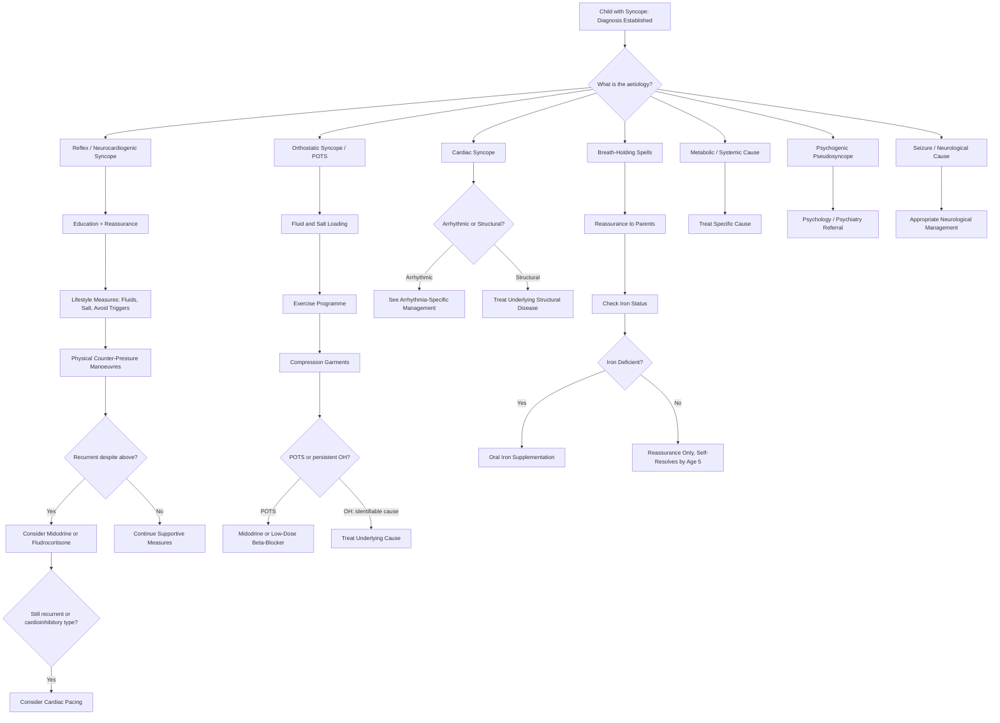

## Management of Paediatric Syncope / Dizziness

### 1. General Principles of Management

The management of syncope in children flows directly from the diagnosis. Since the vast majority (~60–80%) is **benign reflex (neurocardiogenic) syncope**, the majority of management is **education, reassurance, and lifestyle measures** rather than pharmacotherapy or procedures [1][3][4].

The overarching goals are:
1. **Prevent injury** from falls during syncopal episodes
2. **Reduce frequency and severity** of episodes
3. **Treat the underlying cause** when one is identified (especially cardiac)
4. **Prevent sudden cardiac death** in the rare cases of cardiac syncope
5. **Minimise impact on quality of life**, school attendance, and physical activity
6. **Family-centred care**: educate the child AND the parents/caregivers — anxiety from the family often exceeds the medical severity of the condition

---

### 2. Management Algorithm — Overview

---

### 3. Management by Aetiology

#### 3.1 Reflex (Neurocardiogenic / Vasovagal) Syncope — The Most Common Scenario

This is the bread-and-butter of paediatric syncope management. The key message to families: **this is benign, not dangerous, and almost always outgrown or well-controlled with simple measures** [3][4].

##### Step 1: Education and Reassurance (ALL patients — The Therapeutic Foundation)

This is the single most important intervention and alone resolves the problem for many families:

- **Explain the mechanism in simple terms**: "When your child stands for a long time, blood pools in the legs. The heart then beats very hard on an almost empty chamber, which tricks the brain into thinking the blood pressure is too high. The brain responds by slowing the heart and relaxing the blood vessels — the opposite of what's needed — so blood pressure drops and the child faints. It's a reflex, not a disease."
- **Reassure that it is not epilepsy, not a heart attack, and not dangerous** (once cardiac causes have been excluded)
- **Explain that it is extremely common** in adolescents and most children outgrow it or learn to control it
- **Educate about prodromal symptoms**: teach the child to recognize the warning signs (nausea, lightheadedness, visual dimming, sweating) and act immediately
- **What to do during a prodrome**: **lie down immediately with legs elevated** (or at minimum sit down and put the head between the knees) — this rapidly restores venous return and prevents full syncope
- **What to do if the child faints**: lay them flat, elevate the legs, turn to recovery position if vomiting. They will recover spontaneously within seconds to minutes. Do NOT try to sit them up or give them water while they are unconscious (aspiration risk)

<Callout title="Family Communication — Key Talking Points">
In Hong Kong, parental anxiety about "fainting" is often extreme — many fear epilepsy or heart disease. The fact that you have done an ECG and examination and found them normal should be explicitly communicated. A written information sheet (in both Chinese and English) is highly valuable.
</Callout>

##### Step 2: Lifestyle Measures (ALL patients)

These address the underlying physiological predisposition:

| Measure | How It Works | Practical Advice |
|---|---|---|
| **↑Fluid intake** | ↑Intravascular volume → ↑venous return → less venous pooling on standing → ↓trigger for Bezold-Jarisch reflex | Aim for **1.5–2.5 L/day** depending on age and weight (more in summer, during exercise). In adolescents, this often means doubling their usual intake. Water and electrolyte-containing fluids are preferred over sugary drinks |
| **↑Salt intake** | Na⁺ retains water in the intravascular space → ↑blood volume → ↑BP → less orthostatic stress | Add salt to meals, eat salty snacks. Some centres recommend **oral salt tablets (1–2 g NaCl tablets)** in adolescents. Caution: not appropriate if hypertension or renal disease (very rare in this population) |
| **Avoid triggers** | Prevent the autonomic cascade from being initiated | Avoid prolonged standing (if must stand, shift weight, cross legs, tense muscles); avoid hot, stuffy, crowded environments; avoid dehydration; do NOT skip breakfast (very common in HK secondary school students) |
| **Avoid rapid postural changes** | Prevent sudden orthostatic stress | Rise slowly from bed (sit at edge for 30 seconds before standing) |
| **Regular exercise** | Improves cardiovascular conditioning → better autonomic reflex buffering → less prone to venous pooling | Moderate regular aerobic exercise (swimming, cycling, jogging) — 30 minutes 3–5 times/week. Avoid sudden cessation of vigorous exercise (cool down gradually) |
| **Adequate sleep** | Sleep deprivation worsens autonomic dysregulation | Aim for age-appropriate sleep duration (adolescents: 8–10 hours). This is a major issue in HK with late-night studying |
| **Avoid alcohol and recreational drugs** (adolescents) | Both cause vasodilation and impair autonomic reflexes | Anticipatory guidance in older adolescents |

##### Step 3: Physical Counter-Pressure Manoeuvres (PCM)

These are **first-line acute interventions** that the child can perform when they feel the prodrome:

| Manoeuvre | How It Works | How to Teach |
|---|---|---|
| **Leg crossing with tensing of leg, abdominal, and buttock muscles** | Compresses venous capacitance vessels in the lower limbs and abdomen → ↑venous return → ↑preload → ↑CO → ↑BP | Cross legs at ankles and squeeze thigh/calf muscles hard for 30 seconds; repeat |
| **Hand grip / arm tensing** | Isometric muscle contraction → ↑sympathetic outflow → ↑SVR + ↑HR | Grip one fist with the other hand and pull apart as hard as possible for 30 seconds |
| **Squatting** | Compresses lower limb veins + raises intra-abdominal pressure → ↑venous return | Squat down immediately when prodromal symptoms appear |
| **Toe-raising / muscle pumping** | Activates the skeletal muscle pump in the calves → ↑venous return from lower limbs | Rise onto toes repeatedly; shift weight from one foot to the other |

These manoeuvres have been shown in RCTs (PC-Trial) to reduce syncope recurrence by ~39% and are completely safe with no cost.

##### Step 4: Pharmacotherapy (Recurrent Syncope Despite Lifestyle + PCM)

Drug therapy is reserved for children with **frequent, recurrent, disabling vasovagal syncope** that significantly impairs quality of life (school attendance, physical activity, injury risk) despite adequate lifestyle measures and PCM.

<Callout title="Pharmacotherapy is NOT First-Line" type="error">
A common mistake is to jump to medication before giving lifestyle measures a proper trial. In paediatric vasovagal syncope, education + fluids + salt + PCM should be tried for at least 3–6 months before considering drugs. Most children improve with non-pharmacological measures alone.
</Callout>

| Drug | Mechanism | Dose (Paediatric) | Evidence | Contraindications / Side Effects |
|---|---|---|---|---|
| **Midodrine** | α₁-adrenergic agonist → ↑SVR via arteriolar and venous vasoconstriction → ↑BP → counteracts the vasodepressor component of reflex syncope | Start 2.5 mg BD–TDS (adolescents); titrate up to 10 mg TDS. Use lowest effective dose. **Give last dose ≥ 4 hours before bedtime** (to avoid supine hypertension) | Best available evidence in paediatric vasovagal syncope (small RCTs showing reduced recurrence). Currently considered **first-line pharmacotherapy** | **C/I**: supine hypertension, severe heart disease, urinary retention, phaeochromocytoma, thyrotoxicosis. **S/E**: supine hypertension (most important — monitor BP), piloerection ("goosebumps"), urinary retention, scalp tingling |
| **Fludrocortisone** | Mineralocorticoid → ↑renal Na⁺ and H₂O reabsorption → ↑blood volume → ↑preload → ↑CO | 0.05–0.2 mg daily (paediatric); start low and titrate | Mixed evidence (POST2 trial negative in adults, but still used in paediatrics based on physiological rationale and small positive studies) | **C/I**: heart failure, renal failure, hypertension. **S/E**: hypokalaemia (monitor K⁺ — the drug causes kaliuresis), oedema, weight gain, supine hypertension, headache. Need to monitor electrolytes |
| **Low-dose β-blockers** (e.g., propranolol, atenolol, metoprolol) | Proposed mechanism: ↓the initial vigorous ventricular contraction that triggers the Bezold-Jarisch reflex; also ↓adrenergic overshoot | Propranolol 0.5–1 mg/kg/day in 2–3 divided doses; atenolol 0.5–1 mg/kg/day once daily | Evidence is mixed — the POST trial (adults) was negative. Some paediatric data suggest modest benefit. **Avoid in adolescents < 42 years old (per POST trial caveat: may be harmful in young adults)** | **C/I**: asthma (β₂ blockade → bronchospasm), severe bradycardia, heart block, decompensated HF. **S/E**: fatigue, exercise intolerance, sleep disturbance, hypotension, depression, bronchospasm. Generally avoided in athletic adolescents |
| **SSRIs** (fluoxetine) | Proposed mechanism: serotonin modulates central autonomic control → may blunt the exaggerated vagal response | Fluoxetine 10–20 mg daily | Limited evidence; used off-label in highly refractory cases | **C/I**: concurrent MAO inhibitors. **S/E**: GI upset, agitation, ↑suicidality risk in adolescents (black box warning — close monitoring essential). Not first-line |

##### Step 5: Cardiac Pacing (Highly Select Cases Only)

| Indication | Rationale | Details |
|---|---|---|
| **Documented prolonged asystole ( > 3 seconds) during syncopal episodes** (cardioinhibitory type on tilt-table or ILR) in **older children/adolescents with recurrent, disabling, injurious syncope refractory to all other measures** | If the dominant mechanism is profound bradycardia/asystole (cardioinhibitory), a pacemaker can prevent the heart rate from dropping below a set threshold, preventing LOC | Dual-chamber pacemaker with rate-drop response (DDI with rate hysteresis) — the pacemaker detects the sudden HR drop and provides temporary pacing. Evidence from ISSUE-3 trial (adults) showed benefit in highly selected patients. Very rarely indicated in paediatrics. Lifetime pacemaker commits a child to decades of device management |

<Callout title="Pacing is Last Resort in Paediatrics">
Pacing is almost never needed for vasovagal syncope in children. The overwhelming majority can be managed with lifestyle + PCM ± pharmacotherapy. Pacing is only considered when there is documented prolonged asystole ( > 3 seconds) causing recurrent injurious syncope despite maximal medical therapy, AND the child is old enough to provide assent for a lifelong implanted device.
</Callout>

---

#### 3.2 Breath-Holding Spells (Age 6 Months – 5 Years)

***Management: reassurance ± PR diazepam PRN if seizure lasts > 5 min*** [1] — although this last point applies to prolonged anoxic seizures, which are extremely rare.

| Management Step | Rationale | Details |
|---|---|---|
| **Reassurance** | The single most important intervention. Parents are terrified their child is having seizures or is going to die | Explain: "This is a reflex, not something your child is doing on purpose. The child cannot control it. It is not epilepsy. It is not dangerous. Your child will NOT die from a breath-holding spell. Almost all children outgrow this by age 5–6 years." |
| **What to do during a spell** | Prevent injury and allow natural recovery | Place the child on their side (recovery position). Do NOT shake the child, splash cold water on them, or put anything in their mouth. The child will resume breathing spontaneously. Time the episode |
| **Check iron status (Hb and ferritin)** | Iron deficiency is associated with ↑frequency of breath-holding spells (mechanism unclear — possibly related to altered autonomic function or neurotransmitter synthesis) | If iron deficient or low-normal ferritin ( < 20–30 μg/L): prescribe **oral iron supplementation** (3–6 mg/kg/day of elemental iron). Studies show iron supplementation reduces frequency of breath-holding spells even in non-anaemic children with low ferritin |
| **Behavioural advice** | Reduce triggers for cyanotic spells (anger, frustration) | Consistent, calm parenting approach. Avoid reinforcing the tantrum behaviour, but do NOT punish the child for the spells (they are involuntary). Distraction techniques |
| **Do NOT give anti-seizure medications** | Breath-holding spells are NOT epileptic seizures — anti-seizure drugs are ineffective and expose the child to unnecessary side effects | This is a common parental request driven by fear of "seizures." Reassure firmly |
| **Piracetam** (some centres) | GABA analogue; proposed to modulate autonomic reflexes | Limited evidence from small RCTs showing reduced frequency. Used in some European and Asian centres. Dose: 40 mg/kg/day in 2 divided doses. Not standard practice |
| **Atropine** (very rare indication) | Blocks vagal-mediated bradycardia/asystole in severe, recurrent pallid breath-holding spells with documented prolonged asystole | Oral atropine 0.01–0.02 mg/kg/dose BD. Only in severe cases with documented cardiac asystole > 4–6 seconds. Rarely needed. Side effects: anticholinergic (dry mouth, constipation, urinary retention, pupil dilation) |
| **Cardiac pacing** | Prevent asystole in the most severe pallid breath-holding spells with documented prolonged asystole | Extremely rare; reserved for pallid spells with documented asystole > 6 seconds causing recurrent injuries. Almost never needed — most children outgrow spells |

---

#### 3.3 Orthostatic Syncope and POTS

##### 3.3.1 Orthostatic Hypotension

| Step | Management |
|---|---|
| **Treat the underlying cause** | Dehydration → rehydrate (oral or IV as appropriate for severity; see paediatric fluid management guidelines). Drug-induced → review and adjust medications. Adrenal insufficiency → hydrocortisone replacement [5]. Acute blood loss → resuscitate (ABC, IV fluids, blood products) |
| **Fluid and salt loading** | As per vasovagal syncope measures |
| **Rise slowly** | Education on slow positional changes |
| **Compression garments** | Abdominal binder or lower limb compression stockings → ↓venous pooling → ↑venous return |
| **Midodrine** | If above measures fail (same dosing as vasovagal section) |

##### 3.3.2 Postural Orthostatic Tachycardia Syndrome (POTS) in Adolescents

POTS management is challenging and requires a **multidisciplinary approach**. These patients are often significantly debilitated (unable to attend school, reduced quality of life).

| Step | Intervention | How It Works |
|---|---|---|
| **1. Education** | Explain the condition and that it is real (not "just anxiety") | Adolescents with POTS often feel dismissed — validation is therapeutic |
| **2. Fluid and salt loading** | ↑Blood volume → ↓compensatory tachycardia | 2–3 L/day fluids + 6–10 g salt/day (adolescents) — use electrolyte drinks, salt tablets |
| **3. Graduated exercise programme** | Reconditions the cardiovascular system → ↑blood volume, ↑stroke volume, improved autonomic regulation | Start with **recumbent exercise** (swimming, rowing, recumbent cycling) because upright exercise initially worsens symptoms. Gradually progress over months. This is the single most effective long-term treatment |
| **4. Compression garments** | Abdominal binder (more effective than leg stockings) → ↓splanchnic venous pooling | Medical-grade abdominal compression (not just tight clothes) |
| **5. Pharmacotherapy** (if above inadequate) | Various options targeting different mechanisms | See table below |
| **6. Psychology/psychiatry support** | Comorbid anxiety and depression are very common; chronic illness adjustment; school liaison | CBT for anxiety management; school liaison to arrange modified attendance/PE participation |

**POTS Pharmacotherapy:**

| Drug | Mechanism | Paediatric Notes |
|---|---|---|
| **Midodrine** (2.5–10 mg TDS) | α₁-agonist → ↑SVR → ↓compensatory tachycardia | Often first-line. Same precautions as vasovagal section |
| **Low-dose propranolol** (10–20 mg TDS in adolescents) | ↓HR; ↓excessive sympathetic activation (in hyperadrenergic POTS) | Use LOW doses — high doses worsen symptoms by ↓CO. Avoid in patients with low BP |
| **Fludrocortisone** (0.05–0.2 mg daily) | ↑Blood volume via renal Na⁺/H₂O retention | Monitor K⁺ and BP |
| **IV saline infusions** (bolus 10–20 mL/kg) | Acutely ↑blood volume | Sometimes used for acute exacerbations or as a "rescue" treatment in severe flares. Not sustainable long-term |
| **Pyridostigmine** (30–60 mg TDS) | Acetylcholinesterase inhibitor → ↑cholinergic activity at autonomic ganglia → ↑peripheral vasoconstriction without supine hypertension | Used in some centres. S/E: GI cramping, diarrhoea, sweating |
| **Ivabradine** (2.5–7.5 mg BD) | Selective Iₓ (funny current) inhibitor in SA node → ↓HR without affecting contractility or BP | Increasingly used off-label in adolescent POTS. Reduces tachycardia without the BP-lowering effects of β-blockers. Not yet universally recommended in paediatric guidelines |

---

#### 3.4 Cardiac Syncope — Cause-Specific Management

This is where management becomes life-saving. Every child with confirmed or suspected cardiac syncope needs **paediatric cardiology involvement**.

##### 3.4.1 Long QT Syndrome (LQTS)

***Treatment: indicated in both symptomatic and asymptomatic individuals*** [4].

| Treatment | Indication | How It Works | Paediatric Details |
|---|---|---|---|
| ***β-blocker*** | ***First-line for ALL LQTS patients (symptomatic and asymptomatic)*** | ***Can prevent cardiac events in ~70% of patients*** [4] — ↓adrenergic trigger for arrhythmias by ↓sympathetic stimulation to the heart | **Nadolol** preferred (longest-acting, most evidence). Dose: 1–2 mg/kg/day once daily. **Propranolol** alternative (0.5–1 mg/kg TDS). Must NOT be abruptly discontinued (rebound sympathetic surge → arrhythmia). **C/I**: asthma (relative — use cardioselective β₁ if needed), high-degree AV block |
| **Lifestyle modification** | All LQTS patients | Avoid specific triggers based on subtype | **LQTS1**: avoid strenuous exercise, especially swimming. **LQTS2**: avoid sudden auditory stimuli (alarm clocks, phone ringtones — use vibration). **LQTS3**: avoid sleep (controversial — ensure adequate monitoring). **All**: avoid QT-prolonging drugs (www.crediblemeds.org — mandatory counselling) |
| ***Left cardiac sympathetic denervation (LCSD)*** | ***Patients with recurrence of cardiac events despite β-blocker*** | ***Removal of cervicothoracic sympathetic ganglia (anti-adrenergic) → ↓sympathetic innervation to the heart → ↓trigger for TdP*** [4] | Surgical procedure. Preserves exercise capacity (unlike β-blockers). Bridge or adjunct to ICD |
| ***ICD (implantable cardioverter-defibrillator)*** | ***Most effective treatment for high-risk patients: previous cardiac arrest, recurrent syncope failing β-blocker + LCSD*** [4] | Detects VT/VF and delivers shock to restore normal rhythm | Lifelong commitment to device. In children, epicardial leads or subcutaneous ICD may be used. Complications: inappropriate shocks (significant psychological impact in children/adolescents), lead fracture, infection. Decision requires extensive family discussion |

***Prognosis: good overall if on β-blocker, very good if on ICD. TdP episodes usually self-terminating with ~4–5% of events being fatal*** [4].

> **Drug avoidance in LQTS**: Children and families must receive a list of QT-prolonging drugs to avoid. Common paediatric offenders: **macrolide antibiotics (azithromycin, erythromycin), ondansetron (commonly used for paediatric vomiting — use with extreme caution or avoid), domperidone, antipsychotics (haloperidol, risperidone), certain antihistamines**. Always check www.crediblemeds.org before prescribing.

##### 3.4.2 Catecholaminergic Polymorphic VT (CPVT)

| Treatment | Details |
|---|---|
| **β-blocker (nadolol or propranolol)** | First-line. Must achieve high doses (nadolol up to 2.5 mg/kg/day) for adequate adrenergic blockade. Exercise restriction to < 60–80% maximum HR |
| **Flecainide** (Na⁺ channel blocker) | Add-on therapy if β-blocker alone insufficient. Blocks RyR2-mediated Ca²⁺ release → ↓triggered arrhythmias. Dose: 2–4 mg/kg/day in 2 divided doses |
| **LCSD** | If recurrent events on β-blocker + flecainide |
| **ICD** | Cardiac arrest survivors or refractory cases. Same considerations as LQTS |
| **Exercise restriction** | Avoid competitive sports and strenuous exercise. This is one of the most important counselling points for adolescents |

##### 3.4.3 WPW Syndrome with Syncope

| Treatment | Details |
|---|---|
| **Acute SVT**: vagal manoeuvres → IV adenosine | Vagal manoeuvres (ice to face in infants; Valsalva, carotid massage in older children) → if fails: **IV adenosine 0.1 mg/kg rapid push** (max first dose 6 mg; max second dose 12 mg) → blocks AV node transiently → terminates re-entrant circuit. **C/I**: pre-excited AF (can accelerate conduction through accessory pathway → VF) |
| **Catheter ablation** | Definitive treatment. Radiofrequency or cryoablation of the accessory pathway. Indicated for symptomatic WPW, especially with syncope or haemodynamically significant arrhythmia. High success rate ( > 95%). Preferred over long-term antiarrhythmics in children |
| **Antiarrhythmics** (bridge or if ablation not possible) | Flecainide, propafenone, or amiodarone. **Avoid digoxin, verapamil, and β-blockers** if pre-excited AF is possible (these slow AV node conduction preferentially, allowing faster conduction down the accessory pathway → can precipitate VF) |

##### 3.4.4 Complete Heart Block

| Treatment | Details |
|---|---|
| **Congenital complete heart block (neonatal lupus)** | Permanent pacemaker if symptomatic or HR < 50–55 bpm or wide QRS escape rhythm. Even asymptomatic children may need pacing prophylactically depending on escape rate and exercise tolerance |
| **Acquired complete heart block (post-cardiac surgery, myocarditis)** | Temporary transvenous pacing → permanent pacemaker if no recovery within 7–14 days post-surgery |

##### 3.4.5 Structural Cardiac Disease

| Condition | Management |
|---|---|
| **HCM** | Avoid competitive sports. β-blocker (first-line) or verapamil/disopyramide for LVOT obstruction. ICD for high-risk patients (family Hx SCD, massive LVH > 30 mm, unexplained syncope, NSVT on Holter). Septal myectomy or alcohol septal ablation for refractory LVOT gradient |
| **Severe aortic stenosis** | Balloon valvuloplasty (neonates/infants) or surgical aortic valve replacement (older children) when symptomatic or gradient > 50 mmHg |
| **Anomalous coronary artery** | Surgical re-implantation — this is a **surgical emergency** when diagnosed after syncope or cardiac arrest |
| **Pulmonary hypertension** | Pulmonary vasodilators (sildenafil, bosentan, epoprostenol), manage underlying cause (e.g., congenital heart disease repair), consideration of lung or heart-lung transplantation in end-stage disease |

---

#### 3.5 Metabolic and Systemic Causes

| Cause | Management |
|---|---|
| **Hypoglycaemia** | Oral glucose/carbohydrate if conscious. **IV dextrose** if unconscious (D10 2–5 mL/kg in neonates; D10 or D25 in older children). **IM glucagon** if no IV access (dose: < 25 kg: 0.5 mg; ≥ 25 kg: 1 mg). Treat underlying cause (insulin dose adjustment, adrenal insufficiency treatment, investigation of persistent hypoglycaemia in infants) [5] |
| **Anaemia** | Iron supplementation for iron deficiency (most common in paediatrics — oral ferrous sulfate 3–6 mg/kg/day of elemental iron). Transfusion if severe/symptomatic. Treat underlying cause |
| **Dehydration** | Oral rehydration therapy (ORT) for mild-moderate; IV normal saline (10–20 mL/kg boluses) for severe. See paediatric fluid resuscitation guidelines |
| **Adrenal insufficiency** | Acute crisis: **IV hydrocortisone** (infant 25 mg, child 50 mg, adolescent 100 mg stat, then Q6–8h) + IV NS boluses for shock. Chronic: oral hydrocortisone 8–10 mg/m²/day in 3 divided doses + fludrocortisone 0.05–0.15 mg daily for primary AI [5] |
| **Anaphylaxis** | ***IM adrenaline (epinephrine) 0.01 mg/kg (max 0.5 mg) of 1:1000 in mid-outer thigh — first and most important treatment*** [12]. Repeat every 5–15 minutes as needed. ABC support. Paediatric doses: < 6 yr: 0.15 mg (EpiPen Jr); 6–12 yr: 0.3 mg; > 12 yr: 0.5 mg. IV fluid bolus 20 mL/kg NS |

---

#### 3.6 Psychogenic Pseudosyncope

| Management | Details |
|---|---|
| **Acknowledge the reality of the symptoms** | "I can see you're experiencing real symptoms" — do NOT say "It's all in your head." Invalidation worsens outcomes |
| **Explain the mechanism** | "Your body is generating these episodes because of the way your nervous system is processing stress, not because of a structural problem. This is a recognized medical condition" |
| **Psychology / psychiatry referral** | CBT is the evidence-based treatment. Address underlying anxiety, depression, or trauma. School liaison |
| **Physiotherapy** | Graded exercise programme if deconditioning is present |
| **Avoid unnecessary investigations** | Repeated normal investigations reinforce health anxiety |

---

#### 3.7 Dizziness-Specific Management

| Cause | Management |
|---|---|
| **Benign paroxysmal vertigo of childhood (BPVC)** | Reassurance. Usually self-limiting. No specific treatment needed. Consider migraine prophylaxis (cyproheptadine, propranolol) if episodes are frequent and disabling |
| **Vestibular neuritis** | Supportive: antiemetics (ondansetron — caution in LQTS; prochlorperazine not recommended in children < 12 yr due to dystonic reactions), short course of vestibular suppressants, early vestibular rehabilitation exercises |
| **BPPV** (rare in children) | Epley manoeuvre (canalith repositioning). Safe, effective, immediate |
| **Migraine with brainstem aura** | Acute: rest in quiet dark room, paracetamol/ibuprofen. Prophylaxis if recurrent: propranolol, topiramate, amitriptyline (paediatric doses) |
| **Anxiety/hyperventilation** | Reassurance, breathing retraining, CBT. Acute: paper bag re-breathing is NOT recommended (risk of hypoxia) — instead, coach slow diaphragmatic breathing |
| **Posterior fossa tumour** | Urgent neurosurgery referral |

---

### 4. Activity Restriction and Return to Play

This is a critically important aspect of paediatric syncope management that directly impacts the child's quality of life and psychosocial development:

| Diagnosis | Activity Recommendation |
|---|---|
| **Vasovagal syncope** | NO restriction of physical activity or sport. In fact, exercise should be encouraged (it helps). Avoid specific triggers (prolonged standing in heat). If recent syncope, avoid activities where loss of consciousness would be dangerous (e.g., swimming alone, climbing) until stable |
| **POTS** | Encourage exercise (start recumbent). No restriction once exercise programme is established. Avoid prolonged standing in heat |
| **LQTS** | Avoid competitive sports (especially swimming for LQTS1, and sudden auditory-stimulus-heavy sports for LQTS2). Recreational exercise generally allowed with β-blocker and AED availability. Decision should be individualized with cardiology |
| **CPVT** | Avoid competitive sports and strenuous exercise. This is one of the most restrictive diagnoses |
| **HCM** | Avoid competitive sports if moderate-to-severe hypertrophy or risk factors for SCD. Low-intensity recreational exercise generally permitted after cardiology discussion |
| **WPW post-ablation** | Full activity after successful ablation (usually cleared at 1–2 weeks) |
| **Breath-holding spells** | No restrictions — these children are NOT at risk during physical activity |

<Callout title="The Importance of Not Over-Restricting Activity" type="idea">
For vasovagal syncope (the vast majority of cases), over-restriction of physical activity is harmful. It leads to deconditioning, social isolation, school avoidance, and anxiety. Unless there is a diagnosed cardiac cause, the child should be encouraged to participate fully in all activities including sport. The only caveat is to avoid situations where a faint would be dangerous (e.g., swimming alone, working at heights).
</Callout>

---

### 5. Follow-Up and Prognosis

| Diagnosis | Follow-Up | Prognosis |
|---|---|---|
| **Vasovagal syncope** | Review if recurrent or new features. Most need only a single visit with education | Excellent. Most adolescents have ↓frequency with age. ~25% have long-term recurrence into adulthood, but episodes are benign |
| **Breath-holding spells** | Reassurance at routine well-child visits. Review if features change | Self-resolves by age 5–6 years in the vast majority |
| **POTS** | Regular follow-up (every 3–6 months) with adolescent medicine/cardiology. Multidisciplinary approach | Variable. ~50% of adolescents improve significantly over 1–3 years. Complete remission in ~20% by 5 years |
| **LQTS / CPVT / HCM** | Lifelong cardiology follow-up. Regular ECG and echo. Genetic counselling. Cascade family screening | Depends on subtype and treatment compliance. Good if on appropriate therapy |
| **Psychogenic pseudosyncope** | Psychology/psychiatry follow-up | Variable. Better with early intervention and CBT |

---

<Callout title="High Yield Summary — Management">

**Vasovagal syncope (most common):**
- Step 1: Education + reassurance (most important)
- Step 2: Lifestyle measures (↑fluids 1.5–2.5 L/day, ↑salt, avoid triggers, regular exercise, adequate sleep)
- Step 3: Physical counter-pressure manoeuvres (leg crossing + tensing, hand grip, squatting)
- Step 4: Pharmacotherapy if recurrent/refractory: midodrine (first-line drug), fludrocortisone, low-dose β-blocker
- Step 5: Cardiac pacing — only for documented prolonged asystole refractory to all else

**Breath-holding spells:**
- Reassurance is THE treatment
- Check iron status → supplement if deficient (even non-anaemic children with low ferritin benefit)
- Do NOT give anti-seizure medication
- Self-resolves by age 5–6

**LQTS:**
- β-blocker for ALL patients (nadolol preferred)
- Avoid QT-prolonging drugs (always check crediblemeds.org)
- LCSD if refractory to β-blocker
- ICD for cardiac arrest survivors or recurrent syncope failing β-blocker + LCSD
- Lifestyle: avoid subtype-specific triggers (swimming for LQTS1, auditory stimuli for LQTS2)

**POTS:**
- Fluid + salt loading
- Graduated recumbent exercise programme (most effective long-term treatment)
- Compression garments
- Pharmacotherapy: midodrine, low-dose propranolol, fludrocortisone, ivabradine

**Do NOT over-restrict activity** in vasovagal syncope or breath-holding spells — deconditioning worsens outcomes.
</Callout>

---

<ActiveRecallQuiz
  title="Active Recall - Management of Paediatric Syncope/Dizziness"
  items={[
    {
      question: "A 15-year-old with recurrent vasovagal syncope asks what she can do to prevent episodes. Describe the stepwise non-pharmacological management approach.",
      markscheme: "Step 1: Education and reassurance - explain the mechanism, that it is benign, not epilepsy or heart disease. Step 2: Lifestyle measures - increase fluid intake to 1.5-2.5 L per day, increase dietary salt, avoid triggers such as prolonged standing in heat, avoid skipping meals, regular aerobic exercise 30 minutes 3-5 times per week, adequate sleep. Step 3: Physical counter-pressure manoeuvres - when prodromal symptoms appear, immediately cross legs and tense muscles, hand grip/arm tensing, or squat. Also teach the child to recognise prodromal symptoms and lie down immediately with legs elevated."
    },
    {
      question: "A 2-year-old has frequent cyanotic breath-holding spells. The mother asks if her child needs anti-seizure medication. What do you advise, and what specific blood test should you order?",
      markscheme: "Anti-seizure medication is NOT indicated because breath-holding spells are NOT epileptic seizures. They are reflex events and anti-seizure drugs are ineffective and have unnecessary side effects. Reassure the mother that spells are benign, involuntary, and self-resolving by age 5-6 years. Order a full blood count and serum ferritin to check iron status. Iron deficiency is associated with increased frequency of breath-holding spells, and oral iron supplementation at 3-6 mg/kg/day of elemental iron can reduce episode frequency even in non-anaemic children with low ferritin."
    },
    {
      question: "Name the first-line treatment for ALL patients with Long QT Syndrome, the preferred agent, and two other escalation therapies for refractory cases.",
      markscheme: "First-line: beta-blocker for ALL LQTS patients, both symptomatic and asymptomatic. Preferred agent: nadolol (longest-acting, most evidence) at 1-2 mg/kg/day. Escalation therapies: 1. Left cardiac sympathetic denervation (LCSD) - removal of cervicothoracic sympathetic ganglia for patients with recurrent cardiac events despite beta-blocker. 2. Implantable cardioverter-defibrillator (ICD) - for highest-risk patients including cardiac arrest survivors or recurrent syncope failing beta-blocker plus LCSD."
    },
    {
      question: "What is the single most effective long-term treatment for adolescent POTS, and why must it be started in a specific way?",
      markscheme: "A graduated exercise programme is the single most effective long-term treatment. It must be started with recumbent exercise (swimming, rowing, recumbent cycling) because upright exercise initially worsens symptoms due to venous pooling and excessive tachycardia. Over weeks to months, gradually progress to upright exercise. The mechanism of benefit includes increased blood volume, increased stroke volume, and improved autonomic regulation through cardiovascular reconditioning."
    },
    {
      question: "A 14-year-old with known LQTS presents to the emergency department with nausea and vomiting. The junior doctor plans to give ondansetron. What is your concern and what should you advise?",
      markscheme: "Ondansetron is a QT-prolonging drug and should be used with extreme caution or avoided in patients with LQTS, as it can precipitate torsades de pointes. Advise using alternative antiemetics that do not prolong the QT interval, such as cyclizine. Always check www.crediblemeds.org before prescribing any medication to a patient with LQTS. Other common paediatric QT-prolonging drugs to avoid include macrolide antibiotics (azithromycin, erythromycin), domperidone, and antipsychotics."
    }
  ]}
/>

## References

[1] Senior notes: Adrian Lui Pediatrics.pdf (p117 — Breath-holding spell management: reassurance ± PR diazepam PRN; vasovagal syncope triggers and features)
[3] Senior notes: Ryan Ho Fundamentals.pdf (p207–211 — Syncope workup and management, tilt-table test, neurocardiogenic syncope pathogenesis and consequences, ambulatory ECG types, structural cardiac causes)
[4] Senior notes: Ryan Ho Cardiology.pdf (p65–66, p196 — Neurocardiogenic syncope pathogenesis and workup, tilt-table test procedure and interpretation, LQTS treatment including beta-blocker, LCSD, ICD, and prognosis)
[5] Senior notes: Ryan Ho Endocrine.pdf (p71, p94 — Adrenal insufficiency acute management with IV hydrocortisone; hypoglycaemia management with oral carbohydrates, IV dextrose, IM glucagon)
[12] Senior notes: Ryan Ho Critical Care.pdf (p24 — Anaphylaxis management: IM adrenaline first-line, paediatric dosing 0.01 mg/kg)
