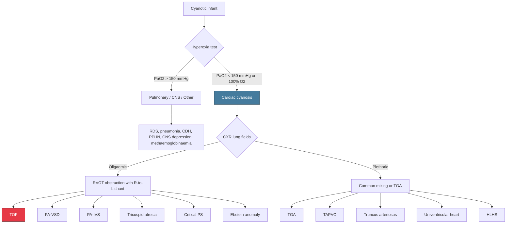

# Differential Diagnosis of Tetralogy of Fallot

## Framing the Problem — What Are We Actually Differentiating?

Before diving into the list, let's think about what clinical scenario brings TOF into the differential. A child with TOF can present in **three main ways**, and each mode of presentation generates a different differential list:

1. **The cyanotic infant/child** — central cyanosis, low SpO₂, ± clubbing
2. **The infant with a hypercyanotic spell** — acute, paroxysmal, profound cyanosis with distress
3. **The acyanotic infant with heart failure ("Pink Fallot")** — tachypnoea, poor feeding, failure to thrive at ~4–6 weeks

The most important and exam-relevant differential is **Scenario 1 — the cyanotic infant** — so we will build the differential around this, then briefly address the other two.

---

## A. Differential Diagnosis of the Cyanotic Infant/Child (Central Cyanosis)

Central cyanosis in a neonate/infant has a broad differential. The key first step is to distinguish **cardiac** from **non-cardiac** causes.

### Step 1: Cardiac vs. Non-Cardiac Cyanosis

| Feature | Cardiac Cyanosis | Pulmonary Cyanosis | CNS / Other |
|---|---|---|---|
| **Hyperoxia test** | SpO₂ does NOT rise above 85–90% (or PaO₂ remains < 150 mmHg on 100% FiO₂) | SpO₂ usually rises significantly (PaO₂ > 150 mmHg) | Variable |
| **Respiratory distress** | Often minimal (quiet tachypnoea) — "happy cyanosis" | Prominent (grunting, retractions, nasal flaring) | May be absent or present depending on cause |
| **CXR** | Abnormal cardiac silhouette, oligaemic or plethoric lung fields depending on lesion | Pulmonary parenchymal disease (RDS, pneumonia, effusion) | Normal or non-specific |
| **Response to supplemental O₂** | Minimal improvement | Significant improvement | Variable |

> The **hyperoxia test** is the critical bedside discriminator. In TOF, because the cyanosis results from R→L shunting of deoxygenated blood that **bypasses the lungs entirely**, giving 100% O₂ cannot improve the saturation of blood that never reaches the alveoli. Hence, the SpO₂ does not rise appropriately.

### Step 2: Among Cyanotic CHDs — Structured Differential

Once cardiac cyanosis is confirmed, the differential narrows to **cyanotic congenital heart disease**. The lecture slides classify these into clear physiological categories [3]:

***"(I) Right-to-Left Shunts with RV Outflow Obstruction"*** [3]:
- ***Tetralogy of Fallot*** [3]
- ***Tetralogy of Fallot with pulmonary atresia (PA with VSD)*** [3]
- ***Pulmonary atresia with intact ventricular septum (PA-IVS)*** [3]

Other major categories of cyanotic CHD [1]:
- **Common mixing conditions** (venous/atrial level: TAPVC; ventricular level: univentricular heart; outflow level: persistent truncus arteriosus) [1]
- **Transposition of great arteries (TGA)** [1]
- **Ebstein anomaly** [1]
- **Hypoplastic left heart syndrome (HLHS)** [1]

---

## B. Systematic Differential — Condition by Condition

### I. Cyanotic CHD with Reduced Pulmonary Blood Flow (Oligaemic Lung Fields on CXR)

These are the closest mimics of TOF because they share the same physiology: **RVOT obstruction → R→L shunting → cyanosis + oligaemic lungs**.

#### 1. ***TOF with Pulmonary Atresia (PA-VSD)*** [3]

| Feature | How to Distinguish from Classic TOF |
|---|---|
| **Pathophysiology** | Extreme end of the TOF spectrum — complete atresia of the RVOT. No antegrade pulmonary blood flow at all. Pulmonary flow is entirely ***duct-dependent*** or via ***major aorto-pulmonary collateral arteries (MAPCAs)*** |
| **Presentation** | ***Severe cyanosis from birth*** — duct-dependent, becomes critically cyanotic when ductus closes (day 1–3). Much more severe than typical TOF |
| **Murmur** | ***Continuous murmur*** of PDA or MAPCAs (NOT the ESM of RVOT obstruction — there is no RVOT to create turbulence) |
| **CXR** | Similar boot-shaped heart but with severely oligaemic lung fields; may see variable pulmonary vascularity if MAPCAs present |
| **Key differentiator** | No antegrade flow across RVOT on echo; requires PGE₁ at birth; often associated with 22q11.2 deletion |

#### 2. ***Pulmonary Atresia with Intact Ventricular Septum (PA-IVS)*** [3]

| Feature | How to Distinguish from TOF |
|---|---|
| **Pathophysiology** | Atretic pulmonary valve but **intact IVS** (no VSD). The RV is often **hypoplastic** with thick walls. Coronary sinusoids may be present (RV-dependent coronary circulation). Blood reaches the lungs only via PDA |
| **Presentation** | Profound cyanosis from birth — ***duct-dependent*** |
| **Murmur** | Continuous PDA murmur; **NO ESM** (no flow across atretic valve) |
| **CXR** | Small heart (hypoplastic RV); oligaemic lung fields. **NOT boot-shaped** (the RV is small, not hypertrophied) |
| **Key differentiator** | Echo shows intact IVS, hypoplastic RV, atretic PV, ± coronary sinusoids. Very different surgical approach (may need single-ventricle palliation) |

#### 3. **Tricuspid Atresia**

| Feature | How to Distinguish from TOF |
|---|---|
| **Pathophysiology** | Complete absence of the tricuspid valve → no direct communication between RA and RV. Blood must shunt R→L at atrial level (via ASD/PFO) to reach the LV, then to the lungs via a VSD or PDA |
| **Presentation** | Cyanosis from birth (degree depends on VSD size and presence of PS) |
| **Murmur** | Variable; may have ESM of PS or PSM of VSD |
| **CXR** | Oligaemic lung fields; heart may be normal-sized or slightly enlarged |
| **ECG** | ***Left axis deviation*** (unusual in neonatal cyanotic CHD — most have RAD). This is because the hypoplastic RV means left ventricular dominance |
| **Key differentiator** | LAD on ECG + cyanosis = think tricuspid atresia. Echo shows absent tricuspid valve, hypoplastic RV |

#### 4. **Critical Pulmonary Stenosis (without VSD)**

| Feature | How to Distinguish from TOF |
|---|---|
| **Pathophysiology** | Severe isolated valvar PS with intact IVS. RV pressure is suprasystemic, but the only escape for deoxygenated blood is R→L across a PFO/ASD at the atrial level (not ventricular level as in TOF) |
| **Presentation** | Cyanosis from birth if severe enough; may be duct-dependent |
| **Murmur** | Harsh ESM at LUSB (similar location to TOF) but **S2 is widely split** with soft P2 (vs. single S2 in TOF) |
| **CXR** | May show post-stenotic dilatation of the MPA (vs. concave MPA segment in TOF) |
| **Key differentiator** | No VSD on echo; intact IVS; may have post-stenotic MPA dilatation |

#### 5. **Ebstein Anomaly** [1]

| Feature | How to Distinguish from TOF |
|---|---|
| **Pathophysiology** | Apical displacement of the tricuspid valve leaflets → "atrialisation" of the RV → massive RA dilatation → R→L shunt at atrial level (via PFO/ASD) → cyanosis |
| **Presentation** | Cyanosis (variable severity); in severe neonatal form, can be duct-dependent |
| **Murmur** | TR murmur (PSM at LLSB); may have multiple clicks |
| **CXR** | ***Massive cardiomegaly*** ("wall-to-wall heart") — very different from the normal-sized boot-shaped heart of TOF |
| **ECG** | Tall P waves (RA enlargement); RBBB; WPW in ~20% |
| **Key differentiator** | Massive cardiomegaly on CXR; displaced tricuspid valve on echo |

### II. Cyanotic CHD with Increased Pulmonary Blood Flow (Plethoric Lung Fields on CXR)

These conditions cause cyanosis through **mixing** (not obstruction), so lung fields are **plethoric** (increased pulmonary vascular markings) — the opposite of TOF.

#### 6. **Transposition of Great Arteries (TGA)** [1]

| Feature | How to Distinguish from TOF |
|---|---|
| **Pathophysiology** | ***Aorta arises from RV (anteriorly), PA arises from LV (posteriorly)*** [1] → two parallel circulations. Survival depends on inter-circulatory mixing (via PFO, ASD, VSD, or PDA) |
| **Presentation** | ***Cyanosis soon after birth*** [1] — often the **most common cyanotic CHD presenting at birth** (while TOF is most common at 1 year). Severity depends on adequacy of mixing |
| **Murmur** | ***No murmur or non-specific ESM/PSM*** [1] — often surprisingly silent |
| **CXR** | ***"Egg on side" appearance*** [1]: narrow upper mediastinum (due to A-P relationship of great vessels) + ***increased pulmonary vascular markings*** [1] (the stronger LV pumps to the lungs) |
| **ECG** | ***Typically normal for age*** [1] (RV dominance is normal in neonates) |
| **Key differentiator** | Plethoric lung fields (vs. oligaemic in TOF); egg-on-side silhouette (vs. boot-shaped); cyanosis at birth (vs. progressive in TOF); no significant murmur |

<Callout title="TOF vs TGA — The Big Two">
These are the two most common cyanotic CHDs overall. The **age of presentation** is a key differentiator:
- **TGA** → cyanosis at **birth** (parallel circulations, duct-dependent mixing)
- **TOF** → cyanosis in **infancy** (progressive RVOT obstruction)

**CXR** is also highly distinguishing:
- **TGA** → ***egg on side + plethoric lungs*** [1]
- **TOF** → ***boot-shaped heart + oligaemic lungs*** [3]
</Callout>

#### 7. **Total Anomalous Pulmonary Venous Connection (TAPVC)** [1]

| Feature | How to Distinguish from TOF |
|---|---|
| **Pathophysiology** | All 4 pulmonary veins drain anomalously (to SVC, coronary sinus, IVC, etc.) instead of the LA. All oxygenated blood returns to the RA → mixes with deoxygenated blood → common mixing → R→L shunt via ASD to maintain systemic output |
| **Presentation** | Cyanosis (mild if unobstructed, severe if obstructed); heart failure |
| **CXR** | **"Snowman/figure-of-8"** appearance in supracardiac type (dilated vertical vein + SVC); **plethoric** lung fields (vs. oligaemic in TOF). Obstructed TAPVC may show pulmonary oedema |
| **Key differentiator** | Plethoric lungs; snowman sign; no ESM of PS; echo shows anomalous PV drainage |

#### 8. **Truncus Arteriosus (Persistent)** [1]

| Feature | How to Distinguish from TOF |
|---|---|
| **Pathophysiology** | Single arterial trunk overriding both ventricles → complete common mixing of oxygenated and deoxygenated blood. VSD always present. The pulmonary arteries arise from the common trunk |
| **Presentation** | Mild cyanosis + early heart failure (high pulmonary flow from the common trunk) |
| **CXR** | Plethoric lung fields; cardiomegaly; absent MPA shadow (single trunk) |
| **Key differentiator** | Plethoric lungs; only mild cyanosis; early CHF; single trunk on echo; strongly associated with 22q11.2 deletion |

#### 9. **Univentricular Heart (Single Ventricle Physiology)** [1]

| Feature | How to Distinguish from TOF |
|---|---|
| **Pathophysiology** | Both AV valves or a common AV valve open into a single functioning ventricle → complete mixing. Cyanosis depends on the balance of pulmonary vs. systemic flow |
| **Presentation** | Variable cyanosis; may present with heart failure if pulmonary flow is unobstructed |
| **Key differentiator** | Echo demonstrates single ventricle anatomy |

#### 10. **Hypoplastic Left Heart Syndrome (HLHS)** [1]

| Feature | How to Distinguish from TOF |
|---|---|
| **Pathophysiology** | Underdevelopment of left-sided structures (LV, mitral valve, aortic valve, ascending aorta). The RV supports both pulmonary and systemic circulations. Systemic blood flow is ***duct-dependent*** (via PDA → retrograde flow into ascending aorta) |
| **Presentation** | Presents with shock and cyanosis when PDA closes (day 1–3). Not subtle cyanosis — these babies are **critically ill** |
| **Key differentiator** | Profound shock (not just cyanosis); absent femoral pulses; echo shows hypoplastic LV and aorta. Very different from TOF |

---

### III. Non-Cardiac Causes of Cyanosis (Important to Exclude)

| Category | Examples | How to Differentiate from TOF |
|---|---|---|
| **Respiratory** | RDS (preterm), pneumonia, meconium aspiration, pneumothorax, CDH, pulmonary hypoplasia | Respiratory distress is prominent; CXR shows parenchymal disease; hyperoxia test usually positive (SpO₂ improves); echocardiogram normal |
| **Persistent pulmonary hypertension of the newborn (PPHN)** | Failed transition → persistent high PVR → R→L shunt at ductal/atrial level | Pre-post ductal SpO₂ difference > 10%; echocardiogram shows structurally normal heart with elevated PA pressures and R→L shunting at PDA/PFO; may partially respond to O₂/iNO |
| **CNS** | Birth asphyxia, central apnoea, seizures, neuromuscular disorders | Cyanosis improves with assisted ventilation; history of perinatal distress; abnormal neurological exam; normal echocardiogram |
| **Haematological** | ***Methaemoglobinaemia*** — *"meta"* = changed, *"haemo"* = blood, *"globin"* = protein → the haemoglobin is in an oxidised (Fe³⁺) form that cannot carry O₂ | Chocolate-brown blood that does NOT turn red on exposure to O₂; normal PaO₂ on ABG but low SpO₂ on pulse oximetry (pulse ox reads metHb as deoxyHb); responds to methylene blue |
| **Peripheral cyanosis** | Cold exposure, polycythaemia, vasomotor instability | Acrocyanosis (hands/feet only, NOT mucous membranes); warm the extremities → resolves; tongue and mucous membranes are pink |

<Callout title="Peripheral vs Central Cyanosis" type="error">
**Acrocyanosis** (blue hands and feet with pink tongue) is common and **normal** in the first 24–48 hours of life — it does NOT indicate cardiac disease. TOF causes **central cyanosis** — look at the tongue, lips, and mucous membranes.
</Callout>

---

## C. Differential for "Pink Fallot" Presenting with Heart Failure at 4–6 Weeks

When a child with TOF has ***mild RVOT obstruction***, they present with ***L→R shunting and heart failure*** [1][2], mimicking acyanotic CHD with volume overload:

| Condition | Distinguishing Feature |
|---|---|
| **Large VSD** | Most common mimic. Both have PSM + heart failure. Echo differentiates: TOF has RVOT obstruction + overriding aorta |
| **AVSD (Complete)** | Common in Down syndrome; superior axis on ECG; echo shows common AV valve |
| **Large PDA** | Continuous "machinery" murmur at LUSB; wide pulse pressure; bounding pulses |
| **Truncus arteriosus** | Single S2; mild cyanosis; common trunk on echo |
| **Aortopulmonary window** | Very rare; continuous murmur; echo shows AP communication |

---

## D. Differential Diagnosis Flow Diagram

---

## E. Key Distinguishing Features — Summary Table

| Feature | TOF | TGA | PA-IVS | Tricuspid Atresia | TAPVC | Ebstein |
|---|---|---|---|---|---|---|
| **Age at cyanosis** | Months (progressive) | Birth | Birth | Birth–weeks | Variable | Variable |
| **CXR heart shape** | ***Boot-shaped*** | ***Egg on side*** | Small | Normal | Snowman | Massive |
| **CXR lung fields** | ***Oligaemic*** | ***Plethoric*** | Oligaemic | Oligaemic | Plethoric | Oligaemic |
| **S2** | ***Single (P2 absent)*** | ***Single, loud (anterior A2)*** | Single | Normal/single | Wide split | Multiple clicks |
| **Murmur** | ***ESM at LUSB*** | ***None or soft*** | PDA murmur | Variable | Non-specific | TR murmur |
| **ECG axis** | RAD | Normal | RAD or normal | ***LAD*** | RAD | RAD, WPW |
| **Duct-dependent?** | Only if PA | Usually yes | Always | Variable | No | Variable |

<Callout title="High Yield Summary">

**Differential Diagnosis of TOF — Key Exam Points:**

1. **Hyperoxia test** separates cardiac from non-cardiac cyanosis (PaO₂ fails to rise in cardiac causes because blood bypasses the lungs)
2. **CXR lung fields** separate RVOT obstruction lesions (oligaemic) from mixing/TGA lesions (plethoric)
3. ***TOF = boot-shaped heart + oligaemic lungs*** [3]; ***TGA = egg on side + plethoric lungs*** [1]
4. ***TGA presents at birth; TOF presents in infancy*** (progressive RVOT obstruction) [1][2]
5. **Tricuspid atresia** is the cyanotic CHD with ***left axis deviation*** on ECG — unique!
6. **PA-IVS** and **PA-VSD** are both duct-dependent → need PGE₁
7. **"Pink Fallot"** mimics a large VSD with heart failure — echo differentiates
8. Always consider **methaemoglobinaemia** in a cyanotic neonate with normal PaO₂ on ABG but low pulse oximetry
9. **PPHN** can mimic cardiac cyanosis but shows pre-post ductal SpO₂ gradient and structurally normal heart on echo
10. ***Echocardiography is the definitive diagnostic tool*** — it confirms the anatomy in all cases

</Callout>

---

<ActiveRecallQuiz
  title="Active Recall - Differential Diagnosis of Tetralogy of Fallot"
  items={[
    {
      question: "A cyanotic neonate is placed on 100% FiO2 and the PaO2 remains at 45 mmHg. What does this indicate and what is the next key investigation to differentiate among cardiac causes?",
      markscheme: "Failed hyperoxia test indicates cyanotic congenital heart disease (R-to-L shunt bypassing lungs, so supplemental O2 cannot improve oxygenation of shunted blood). Next key investigation: CXR to assess lung fields (oligaemic vs plethoric) and cardiac silhouette, followed by echocardiography as the definitive diagnostic tool."
    },
    {
      question: "Compare the CXR findings in TOF vs TGA and explain the pathophysiological basis of each.",
      markscheme: "TOF: Boot-shaped heart (RVH lifts apex, concave MPA segment) + oligaemic lung fields (reduced pulmonary blood flow from RVOT obstruction). TGA: Egg-on-side appearance (narrow mediastinum due to A-P relationship of great arteries) + plethoric lung fields (stronger LV pumps to pulmonary circulation). The key difference is reduced vs increased pulmonary blood flow."
    },
    {
      question: "Which cyanotic CHD characteristically shows left axis deviation on ECG and why?",
      markscheme: "Tricuspid atresia. The tricuspid valve is absent so the RV is hypoplastic with minimal RV myocardium. The LV is dominant, producing left axis deviation. This is unique among cyanotic CHDs which typically show RAD from RV pressure or volume overload."
    },
    {
      question: "A 5-week-old acyanotic infant presents with tachypnoea, poor feeding, and a pansystolic murmur. How would you differentiate Pink Fallot from an isolated large VSD?",
      markscheme: "Both present with heart failure from L-to-R shunting at around 4-6 weeks. Differentiation requires echocardiography: Pink Fallot will show RVOT obstruction (even if mild), overriding aorta, and malalignment VSD, whereas isolated VSD has no RVOT obstruction and a normally positioned aorta. Pink Fallot will eventually develop cyanosis as RVOT obstruction progresses."
    },
    {
      question: "Name three duct-dependent cyanotic CHDs and explain why they depend on the PDA.",
      markscheme: "1) PA-IVS: atretic pulmonary valve with no VSD, so no antegrade flow to lungs; PDA is sole source of pulmonary blood flow. 2) TOF with pulmonary atresia (PA-VSD): complete RVOT atresia, pulmonary flow depends on PDA or MAPCAs. 3) TGA with intact ventricular septum: parallel circulations require mixing; PDA provides one site of inter-circulatory mixing. All require PGE1 to maintain ductal patency."
    }
  ]}
/>

## References

[1] Senior notes: Adrian Lui Pediatrics.pdf (p190 — classification of CHD by physiology; p219 — TGA section)
[2] Senior notes: Ryan Ho Cardiology.pdf (p187 — Tetralogy of Fallot section)
[3] Lecture slides: GC 147. Heart failure and cyanosis in children acyanotic and cyanotic congenital heart disease - Part 2.pdf (p10 — classification of R-to-L shunts with RV outflow obstruction)
