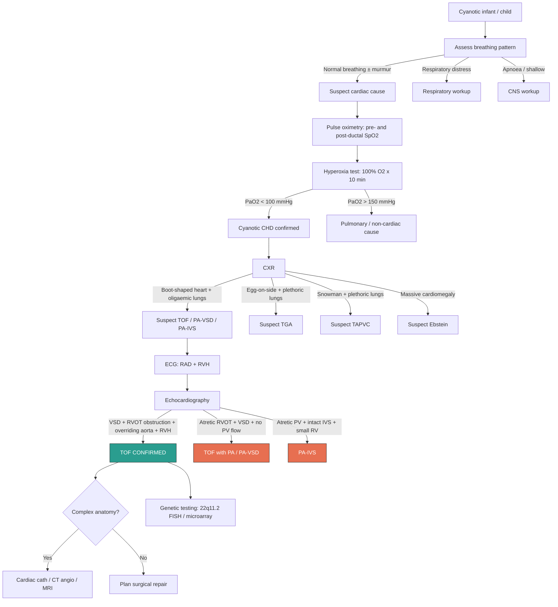

# Diagnosis of Tetralogy of Fallot — Criteria, Algorithm & Investigations

## 1. Diagnostic Criteria

TOF is an **anatomical diagnosis** — there is no scoring system or point-based criteria. The diagnosis is established when **all four cardinal structural features are demonstrated**, typically by echocardiography:

1. ***Right ventricular outflow tract (RVOT) obstruction / Pulmonary stenosis*** — at one or more levels (infundibular, valvar, supravalvar, branch PA) [1][2]
2. ***Large, malalignment-type ventricular septal defect (VSD)*** — non-restrictive, perimembranous/outlet [1][2]
3. ***Overriding aorta*** — aortic root straddles the VSD, receiving blood from both ventricles [1][2]
4. ***Right ventricular hypertrophy (RVH)*** — secondary to the RV facing systemic-level pressures [1][2]

> In practice, features 1–3 are the primary anatomical abnormalities. Feature 4 (RVH) is always a **secondary consequence** — it develops because the non-restrictive VSD equalises RV and LV pressures, and the RVOT obstruction imposes additional afterload on the RV. Even in the fetus, RVH may be present by mid-gestation.

### What Confirms vs. Excludes the Diagnosis?

| Confirms TOF | Excludes / Requires Reclassification |
|---|---|
| All four features on echocardiography | Absence of VSD → consider isolated PS or PA-IVS |
| RVOT obstruction is the dominant lesion | Complete pulmonary atresia with VSD → reclassify as ***TOF with pulmonary atresia (PA-VSD)*** [3][5] — the extreme end of the TOF spectrum |
| Aortic override < 50% | Override > 50% → consider double outlet right ventricle (DORV) |
| Concordant ventriculoarterial connections (aorta from LV/override, PA from RV) | Discordant connections → consider TGA |

<Callout title="No Formal Diagnostic Criteria — It Is Anatomical" type="idea">
Unlike conditions such as Kawasaki disease or rheumatic fever, TOF does not have a checklist of criteria. The diagnosis is made when the characteristic anatomy is visualised on imaging (almost always echocardiography). The clinical features (cyanosis, ESM, boot-shaped heart on CXR) raise suspicion, but **echocardiography is the definitive diagnostic modality**.
</Callout>

---

## 2. Diagnostic Algorithm — Clinical Approach to the Cyanotic Infant

The diagnostic pathway for TOF typically follows the general approach to neonatal/infantile cyanosis, narrowing progressively to a specific anatomical diagnosis.

### Step-by-Step Clinical Approach

**Step 1: Recognise central cyanosis**
- Central cyanosis is clinically apparent when ***deoxyhaemoglobin ≥ 3–5 g/dL*** [6] — this equates to SpO₂ roughly < 85% in a child with normal Hb
- ***Anaemia can mask cyanosis*** (fewer total Hb molecules → fewer deoxyHb molecules → less visible cyanosis despite severe hypoxia); ***polycythaemia can cause apparent cyanosis*** even with relatively preserved saturation [6]
- Central cyanosis = blue tongue, lips, mucous membranes (not just acrocyanosis of hands/feet)

**Step 2: Assess breathing pattern — quick clinical triage** [6]
- ***Shallow breathing / apnoea → CNS cause***
- ***Respiratory distress (grunting, retractions, tachypnoea) → Respiratory cause***
- ***Normal breathing pattern ± murmurs → Cardiovascular cause*** ("happy hypoxaemia")

**Step 3: Pulse oximetry — pre- and post-ductal**
- Right hand (pre-ductal) SpO₂ vs. either foot (post-ductal) SpO₂
- Differential > 10% suggests a duct-dependent lesion with R→L ductal shunting (e.g., coarctation + PPHN). In classic TOF without PDA, there is typically no significant pre-post ductal difference (the R→L shunt is at the ventricular level, proximal to the ductus)

**Step 4: Hyperoxia test (nitrogen washout test)** [6]
- ***Method: administer 100% O₂ for 10 minutes → measure PaO₂ from right radial artery*** [6]
- ***Interpretation***:
  - ***PaO₂ > 150 mmHg (> 20 kPa)***: likely pulmonary or other non-cardiac cause (the O₂ reaches functional alveoli and diffuses into blood)
  - ***PaO₂ remains < 100 mmHg (< 15 kPa)***: strongly suggests cyanotic CHD [6] — because deoxygenated blood bypasses the lungs via R→L shunt; no amount of supplemental O₂ can oxygenate blood that never reaches the alveoli
- ***Caution: increased FiO₂ can promote ductal closure in duct-dependent circulation → potentially dangerous!*** [6] — use with care and have PGE₁ ready

**Step 5: CXR — pattern recognition**
- ***Boot-shaped heart + oligaemic lung fields*** = classic TOF [3][5]
- This narrows the differential to cyanotic CHD with reduced pulmonary blood flow (RVOT obstruction group)

**Step 6: ECG — supportive findings**
- RAD + RVH pattern

**Step 7: Echocardiography — definitive diagnosis**
- ***Bedside echo: directly visualise cardiac defects*** [6]
- Demonstrates all four features of TOF and allows precise anatomical delineation

**Step 8: Further investigations as needed**
- Cardiac catheterisation / CT angiography / cardiac MRI — for complex anatomy (PA-VSD with MAPCAs, coronary anomalies, branch PA anatomy)
- Genetic testing — 22q11.2 microdeletion screening

### Diagnostic Algorithm — Mermaid Diagram

---

## 3. Investigation Modalities — Key Findings and Interpretation

### 3.1 Pulse Oximetry

| Parameter | Findings in TOF | Interpretation |
|---|---|---|
| **SpO₂** | Typically ***75–85%*** in moderate-severe TOF; may be normal (> 95%) in "pink Fallot" | Reflects degree of R→L shunting. Lower SpO₂ = more severe RVOT obstruction |
| **Pre-post ductal difference** | Usually minimal (< 3%) because the R→L shunt is at the VSD (proximal to the ductus) | A large pre-post ductal difference suggests duct-dependent lesion or coexisting aortic arch pathology |
| **During tet spell** | SpO₂ plummets to < 60–70% | Near-occlusion of RVOT → almost all RV blood shunts R→L |

> **Why pulse oximetry is a screening tool**: Newborn pulse oximetry screening (performed at 24–48 hours of life in Hong Kong) can detect TOF if significant desaturation is present. However, "pink Fallot" with mild RVOT obstruction may pass the screening — this is a limitation. A normal newborn screen does NOT exclude TOF.

### 3.2 Hyperoxia Test

| Parameter | Findings in TOF | Interpretation |
|---|---|---|
| **PaO₂ on 100% O₂** | ***Remains < 100 mmHg*** (typically 30–50 mmHg) | Deoxygenated blood bypasses the lungs entirely via R→L shunt; supplemental O₂ cannot oxygenate blood that never reaches alveoli |
| **Comparison with respiratory disease** | Respiratory disease: PaO₂ rises > 150–200 mmHg | In parenchymal lung disease, V/Q mismatch improves with high FiO₂ as O₂ reaches functional alveoli |

<Callout title="Hyperoxia Test — First Principles" type="idea">
Think about it this way: in TOF, a proportion of blood goes RV → VSD → aorta WITHOUT passing through the lungs. It doesn't matter how much oxygen you pump into the alveoli — that blood never gets there. Hence PaO₂ stays low. In lung disease, the blood DOES pass through the lungs but the alveoli are diseased; flooding them with O₂ can still improve gas exchange at the alveolar level. Hence PaO₂ rises.
</Callout>

### 3.3 Chest X-Ray (CXR)

The CXR is the **single most useful initial imaging tool** after clinical assessment and pulse oximetry. In TOF, the CXR has a classic and highly recognisable pattern:

| Feature | Finding in TOF | Pathophysiological Basis |
|---|---|---|
| ***Heart shape*** | ***"Boot-shaped heart" (coeur en sabot)*** [3][5] | **Upturned apex**: RVH causes the RV to push the apex upward and laterally. **Concave pulmonary bay**: the main pulmonary artery segment is hypoplastic/absent, creating a concavity where the MPA shadow normally appears between the aortic knob and the left heart border |
| ***Heart size*** | ***Usually normal*** (cardiothoracic ratio < 0.55 in children, < 0.6 in infants) | The VSD is non-restrictive → the RV is pressure-overloaded (hypertrophied) but NOT volume-overloaded (not dilated). Unlike a large isolated VSD which causes cardiomegaly from volume overload |
| ***Lung fields*** | ***Oligaemic (decreased pulmonary vascular markings)*** [3][5] | Reduced pulmonary blood flow due to RVOT obstruction → fewer and thinner pulmonary vessels visible |
| **Aortic arch** | Right-sided in ~25% | Right aortic arch is associated with TOF (due to abnormal aortic arch development); visible as aortic knob on the right side |
| **In "pink Fallot"** | May show cardiomegaly + pulmonary plethora | Mild RVOT obstruction → L→R shunt → volume overload → mimics VSD on CXR |

<Callout title="CXR Pattern: Boot-shaped Heart + Oligaemic Lungs = TOF">
***Boot-shaped heart*** [3] — the apex is tilted upward (RVH) and the pulmonary bay is concave (hypoplastic MPA). ***Oligaemic lung fields*** [3] — reduced pulmonary vascular markings due to decreased pulmonary blood flow from RVOT obstruction. This combination on CXR in a cyanotic infant is virtually diagnostic of TOF.
</Callout>

**Contrast with other CXR patterns:**

| Condition | Heart Shape | Lung Fields |
|---|---|---|
| **TOF** | Boot-shaped | Oligaemic |
| **TGA** | Egg-on-side | Plethoric |
| **TAPVC (supracardiac)** | Snowman / figure-of-8 | Plethoric |
| **Ebstein** | Massive cardiomegaly ("wall-to-wall") | Oligaemic |
| **PA-VSD** | Boot-shaped (similar to TOF) | Severely oligaemic or variable (MAPCAs) |
| **PA-IVS** | Normal or small heart | Oligaemic |

#### Understanding CXR Anatomy in TOF — Why "Boot-Shaped"?

Normal cardiac silhouette on CXR from top to bottom on the left border:
1. **Aortic knob** (1st mogul)
2. **Main pulmonary artery** (2nd mogul)
3. **Left atrial appendage** (3rd mogul)
4. **Left ventricle** (4th mogul — the apex)

In TOF:
- The **MPA segment is absent/concave** (hypoplastic PA) → loss of the 2nd mogul → a "scooped out" appearance in the upper left heart border
- The **apex is tilted upward** (RVH lifts the apex) → the inferior heart border resembles the **toe of a boot**
- Together: concave waist + upturned toe = **boot shape** (*coeur en sabot* — French for "heart in a clog/wooden shoe")

### 3.4 Electrocardiogram (ECG)

| Feature | Finding in TOF | Interpretation |
|---|---|---|
| **Axis** | ***Right axis deviation (RAD)*** — axis typically +120° to +150° | RVH shifts the net electrical vector rightward and inferiorly |
| **RVH pattern** | ***Tall R wave in V1*** (qR or rsR' pattern); ***deep S wave in V5–V6*** [1][6] | Increased RV muscle mass generates dominant right-sided forces |
| **Right atrial enlargement** | Tall, peaked P waves (P pulmonale) > 2.5 mm in lead II | RA pressure overload from stiff, hypertrophied RV |
| **In neonates** | May be difficult to interpret — RV dominance is **normal** in neonates | Compare with age-matched norms. Persistent or exaggerated RV dominance beyond the neonatal period is abnormal |

> **Key point**: The ECG of TOF shows **RV pressure overload** — not volume overload. This is distinguished from RV volume overload (e.g., large ASD) which shows rSR' in V1 with normal axis.

**RV Pressure Overload ECG pattern in TOF** [6]:
- Right axis deviation
- Tall R in V1, deep S in V6 → ***uptilting of cardiac apex on CXR = "boot-shaped heart"*** [6]
- Unlike LV pressure overload which shows LAD + deep S in V1 + tall R in V6

### 3.5 Echocardiography — The Definitive Diagnostic Modality

***Bedside echocardiography directly visualises the cardiac defects*** [6] and is the **gold standard** for diagnosing TOF. It answers every clinically relevant question:

| What Echo Demonstrates | Specific Findings | Clinical Importance |
|---|---|---|
| **VSD** | Large, malalignment-type, perimembranous/outlet. Non-restrictive (no significant Doppler gradient) | Confirms non-restrictive nature; r/o multiple VSDs |
| **RVOT obstruction** | Infundibular narrowing (dynamic muscular obstruction); ± valvar stenosis (bicuspid, dysplastic, hypoplastic annulus); ± supravalvar stenosis; ± branch PA stenosis | Determines level and severity of obstruction. Measures RVOT gradient (though this underestimates severity if flow is reduced by R→L shunting) |
| **Overriding aorta** | Aortic root displaced anteriorly, straddling the VSD. Degree of override measured (< 50% = TOF; > 50% → consider DORV) | Quantifies override; important for surgical approach |
| **RVH** | Thickened RV free wall (> 2 SD above normal for age) | Confirms pressure overload |
| **Pulmonary artery anatomy** | MPA size, branch PA sizes (LPA, RPA), confluent vs. non-confluent PAs | Critical for surgical planning — small or discontinuous PAs may require staged repair |
| **PV annulus size** | Measured and compared to Z-score for body surface area | Determines if transannular patch is needed during repair (if annulus too small) |
| **Associated anomalies** | ASD/PFO (pentalogy), additional VSDs, AVSD, right aortic arch, coronary artery anatomy | Changes surgical approach and classification |
| **Direction and magnitude of VSD shunt** | Colour Doppler shows R→L, bidirectional, or L→R flow | Correlates with clinical presentation (cyanotic vs. pink Fallot) |
| **Coronary artery anatomy** | Origin, course of LAD, RCA — specifically whether LAD crosses the RVOT | An anomalous LAD crossing the RVOT is present in ~5% of TOF patients and precludes a standard transannular patch (would transect the LAD → fatal) |

<Callout title="Must Assess on Echo Before Surgery" type="error">
Three features on echo are **critical for surgical planning** and must not be missed:
1. **Pulmonary artery anatomy** — size of MPA, LPA, RPA; Z-scores; confluence
2. **Coronary artery anatomy** — anomalous LAD crossing the RVOT?
3. **Level(s) of RVOT obstruction** — infundibular, valvar, supravalvar, branch PA

Missing an anomalous LAD can lead to **fatal intraoperative coronary transection**.
</Callout>

### 3.6 Cardiac Catheterisation

| Indication | What It Provides |
|---|---|
| **Not routinely required** for straightforward TOF — echo is sufficient | — |
| **Complex anatomy** — especially ***TOF with pulmonary atresia and MAPCAs*** [1] | ***Detailed delineation of MAPCAs***, their origins, courses, and the segments of lung they supply — this cannot be fully assessed by echo alone [1] |
| **Haemodynamic assessment** | Direct pressure measurements in RV, PA, LV, aorta; calculation of Qp:Qs; assessment of PVR |
| **Pre-operative assessment** when PA anatomy is unclear | Confirms PA confluence, measures PA sizes, identifies stenoses |
| **Interventional** | Balloon pulmonary valvuloplasty (rarely in typical TOF — more in PA-IVS); stenting of duct-dependent circulation; coil occlusion of MAPCAs |

> Cardiac catheterisation was historically the gold standard but has been largely replaced by **echocardiography + cardiac MRI/CT** for most TOF patients. It remains essential for complex variants and interventional procedures.

### 3.7 Cardiac MRI (CMR)

| Indication | What It Provides |
|---|---|
| **Pre-operative** (complex cases) | 3D anatomy of RVOT, PAs, aortic arch, MAPCAs; RV volume and function |
| **Post-operative follow-up** (main role in current practice) | Quantification of pulmonary regurgitation (PR fraction), RV volumes (RVEDV, RVESV), RV ejection fraction — critical for deciding timing of pulmonary valve replacement in repaired TOF |
| **Advantages over echo** | No acoustic window limitations; excellent for RV (which is difficult to image by echo); can quantify PR precisely; can visualise branch PAs and distal anatomy |

> In the **post-operative** setting, cardiac MRI becomes the most important imaging modality. It is the gold standard for quantifying PR and RV dilatation — the two key determinants of when to re-intervene with pulmonary valve replacement.

### 3.8 CT Angiography

| Indication | What It Provides |
|---|---|
| **Complex pulmonary artery anatomy** | Alternative to catheterisation for delineating PA anatomy, MAPCAs in TOF/PA-VSD |
| **Coronary artery anatomy** | If echo is inadequate; confirms or excludes anomalous coronary crossing RVOT |
| **Airway assessment** | In TOF with absent pulmonary valve syndrome — massively dilated PAs may compress the bronchi |
| **Limitations** | Radiation exposure (concern in paediatrics); requires IV contrast; provides anatomy but NOT haemodynamics |

### 3.9 Laboratory Investigations

| Test | Findings | Rationale |
|---|---|---|
| **Arterial blood gas (ABG)** | Metabolic acidosis during tet spell (lactic acidosis from tissue hypoxia); chronic compensated respiratory alkalosis (mild hyperventilation driven by hypoxia) | Assesses severity of hypoxia and metabolic derangement |
| **Full blood count (FBC)** | ***Polycythaemia*** (↑ Hb, ↑ Hct) — Hb may be 18–22 g/dL in severe chronic cyanosis. ***Relative iron deficiency*** may coexist (microcytic RBCs despite high Hb) | Polycythaemia is a compensatory response to chronic hypoxia (↑ EPO); iron deficiency worsens hyperviscosity (microcytic RBCs are rigid and deform poorly) |
| **Coagulation profile** | May show coagulopathy in severe polycythaemia (Hct > 65%) — thrombocytopenia, low fibrinogen, prolonged PT/APTT | Extreme polycythaemia causes consumption coagulopathy and platelet sequestration |
| **Genetic testing** | ***22q11.2 microdeletion*** — FISH or chromosomal microarray/SNP array | Present in ~15% of TOF; affects surgical planning, immunological management, long-term neurodevelopmental follow-up |
| **Calcium, immunoglobulins** | May be low if 22q11.2 deletion present (hypoparathyroidism → hypocalcaemia; thymic hypoplasia → T-cell deficiency) | Important to identify pre-operatively — hypocalcaemia can cause neonatal seizures; T-cell deficiency affects use of irradiated blood products and live vaccines |

### 3.10 Prenatal Diagnosis (Fetal Echocardiography)

- TOF can be diagnosed antenatally on **fetal echocardiography** at 18–22 weeks gestation (anomaly scan)
- Key findings: malalignment VSD, overriding aorta, RVOT obstruction
- Prenatal diagnosis allows:
  - Parental counselling and psychological preparation
  - Genetic testing (amniocentesis for 22q11.2)
  - Planned delivery at a centre with paediatric cardiology and cardiac surgery
  - Avoids emergency neonatal presentation

---

## 4. Putting It All Together — Summary of Investigation Findings in TOF

| Investigation | Classic TOF Findings | "Pink Fallot" Findings | TOF with PA |
|---|---|---|---|
| **SpO₂** | 75–85% | > 95% | < 70% (duct-dependent) |
| **Hyperoxia test** | PaO₂ < 100 mmHg | May pass (> 150) | PaO₂ very low |
| **CXR** | ***Boot-shaped heart, oligaemic lungs*** [3] | Cardiomegaly, plethoric lungs | Boot-shaped, severely oligaemic or variable |
| **ECG** | RAD, RVH | RAD, RVH (may be less marked) | RAD, RVH |
| **Echo** | VSD + RVOT obstruction + overriding aorta + RVH | Same + mild RVOT gradient, L→R VSD flow | Atretic RVOT, VSD, overriding aorta, ± MAPCAs |
| **Hb** | Elevated (polycythaemia) | Normal | Elevated |
| **Genetics** | Screen for 22q11.2 | Screen for 22q11.2 | Screen for 22q11.2 (even higher prevalence) |

---

<Callout title="High Yield Summary">

**Diagnosis of TOF — Key Exam Points:**

1. ***TOF is an anatomical diagnosis*** — confirmed by echocardiography demonstrating all four features [1][2]
2. ***No formal diagnostic criteria or scoring system*** — the anatomy IS the diagnosis
3. ***Hyperoxia test***: PaO₂ remains < 100 mmHg on 100% O₂ → confirms cardiac cyanosis; ***caution: can promote ductal closure*** [6]
4. ***CXR = boot-shaped heart + oligaemic lung fields*** [3][5] — the most recognisable radiological pattern
5. ***ECG: RAD + RVH*** (tall R in V1, deep S in V6) [6] — reflects RV pressure overload
6. ***Echocardiography is the definitive diagnostic tool*** [6] — demonstrates all anatomy, quantifies RVOT obstruction, delineates PA and coronary anatomy
7. ***Must assess on echo before surgery***: PA sizes/Z-scores, coronary anatomy (anomalous LAD?), level of RVOT obstruction
8. ***Cardiac cath*** mainly for ***TOF with PA/MAPCAs*** — delineates collateral anatomy [1]
9. ***Cardiac MRI*** is the gold standard for ***post-operative follow-up*** — quantifies PR and RV volumes
10. ***Screen ALL TOF patients for 22q11.2 microdeletion*** — affects immunology, calcium, development, surgical planning
11. ***Check FBC***: polycythaemia (compensatory to chronic hypoxia); iron deficiency worsens hyperviscosity
12. ***Prenatal diagnosis possible*** at 18–22 weeks on fetal echo

</Callout>

---

<ActiveRecallQuiz
  title="Active Recall - Diagnosis of Tetralogy of Fallot"
  items={[
    {
      question: "Describe the classic CXR findings of TOF and explain the pathophysiological basis of each feature.",
      markscheme: "Boot-shaped heart (coeur en sabot): upturned apex from RVH + concave pulmonary bay from hypoplastic MPA segment. Oligaemic lung fields: reduced pulmonary vascular markings due to decreased pulmonary blood flow from RVOT obstruction. Heart size is usually normal because RV is pressure-overloaded (hypertrophied) not volume-overloaded (not dilated)."
    },
    {
      question: "Why does the hyperoxia test fail to raise PaO2 in TOF, and what is the major danger of performing it?",
      markscheme: "In TOF, deoxygenated blood shunts R-to-L across the VSD directly into the aorta, bypassing the lungs entirely. No amount of supplemental O2 can oxygenate blood that never reaches the alveoli. The danger is that high FiO2 can promote closure of the ductus arteriosus, which may be the sole source of pulmonary blood flow in duct-dependent variants like TOF with pulmonary atresia, causing acute decompensation."
    },
    {
      question: "Name three critical features that must be assessed on echocardiography before surgical repair of TOF and explain why each matters.",
      markscheme: "1) Pulmonary artery anatomy (MPA, LPA, RPA sizes and Z-scores) - determines if PAs are adequate for repair or if staging is needed. 2) Coronary artery anatomy - anomalous LAD crossing the RVOT (5%) precludes standard transannular patch. 3) Level and severity of RVOT obstruction - infundibular vs valvar vs supravalvar determines the surgical technique needed."
    },
    {
      question: "A 6-month-old with repaired TOF has progressive exercise intolerance. What imaging modality is the gold standard for post-operative assessment and what key parameters does it measure?",
      markscheme: "Cardiac MRI is the gold standard for post-operative TOF follow-up. Key parameters: pulmonary regurgitation fraction (quantifies severity of PR), RV end-diastolic volume (RVEDV), RV end-systolic volume (RVESV), and RV ejection fraction. These determine the timing of pulmonary valve replacement."
    },
    {
      question: "Why should all patients with TOF be screened for 22q11.2 microdeletion, and what specific pre-operative concerns does this diagnosis raise?",
      markscheme: "22q11.2 microdeletion is present in approximately 15% of TOF patients (higher in TOF with PA). Pre-operative concerns: (1) Hypocalcaemia from absent parathyroids - risk of perioperative seizures and arrhythmias. (2) Thymic hypoplasia with T-cell deficiency - need irradiated and CMV-negative blood products to prevent transfusion-associated GVHD; avoid live vaccines. (3) Palatal abnormalities may affect intubation. (4) Long-term neurodevelopmental implications."
    }
  ]}
/>

## References

[1] Senior notes: Adrian Lui Pediatrics.pdf (p213 — TOF section; p215 — PA-VSD section)
[2] Senior notes: Ryan Ho Cardiology.pdf (p187 — TOF section)
[3] Lecture slides: GC 147. Heart failure and cyanosis in children acyanotic and cyanotic congenital heart disease - Part 2.pdf (p10–12 — TOF CXR, classification)
[5] Lecture slides: GC 147. Heart failure and cyanosis in children acyanotic and cyanotic congenital heart disease - Part 2.pdf (p14–15, 19 — TOF surgical correction, PA-VSD)
[6] Senior notes: Adrian Lui Pediatrics.pdf (p195 — approach to cyanosis, hyperoxia test; p198 — CXR approach; p190 — ECG patterns in pressure overload)
