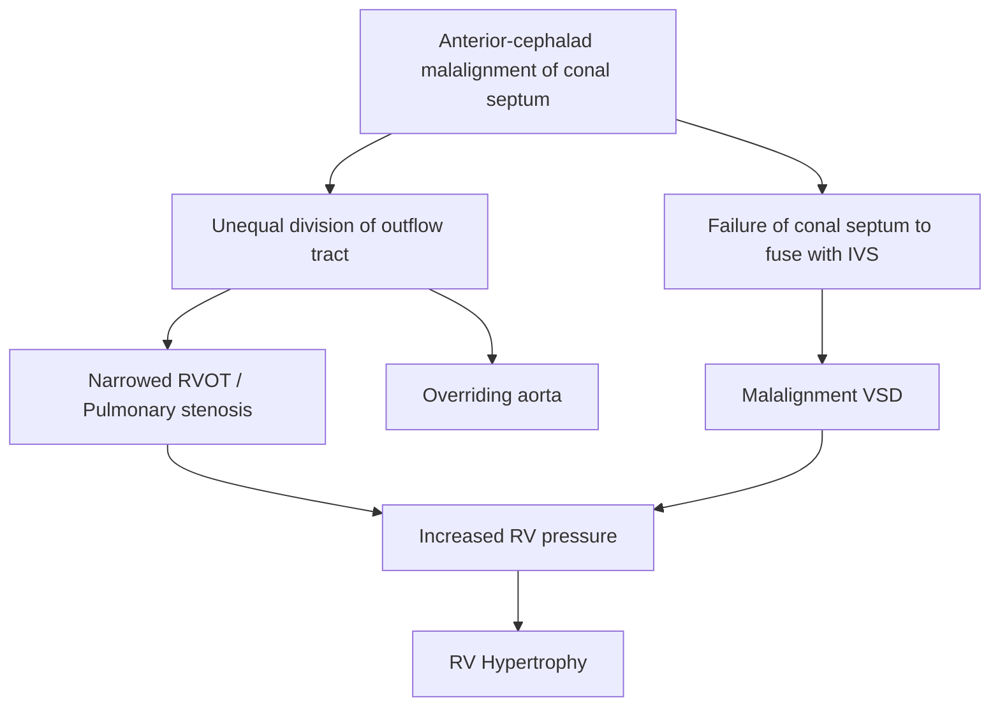
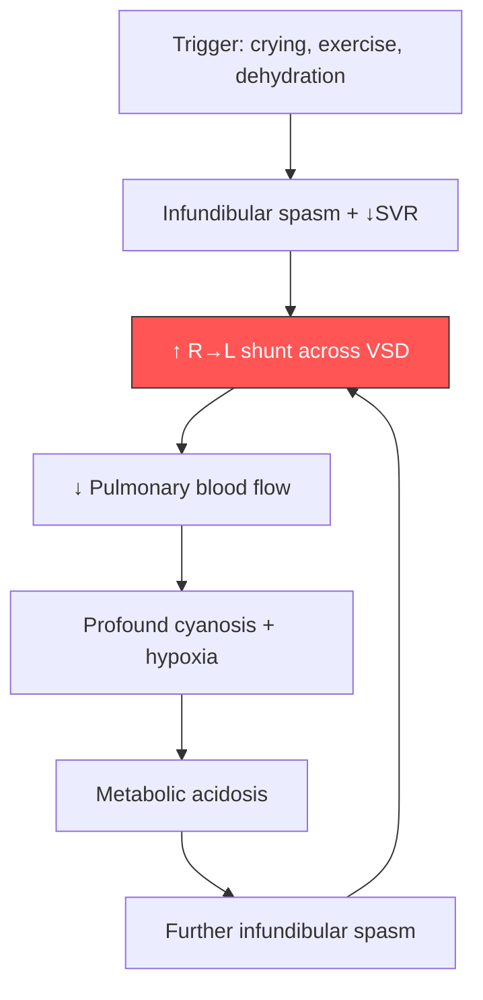

# Tetralogy of Fallot (TOF) — Paediatric Cardiology

> **法樂氏四聯症** — *"Tetra"* (Greek: four) + *"logos"* (study/collection) + *"Fallot"* (Étienne-Louis Arthur Fallot, 1888). Four anatomical defects arising from a single embryological error.

---

## 1. Definition

Tetralogy of Fallot (TOF) is the **most common cyanotic congenital heart disease (CHD) presenting beyond the neonatal period** [1][2][3]. It is defined by **four cardinal anatomical features**, all traceable to a single embryological event — ***anterior and cephalad malalignment of the conal (infundibular/outlet) septum***:

1. ***Pulmonary stenosis*** (usually infundibular/subvalvar — the narrowest level) [1][2]
2. ***Ventricular septal defect*** (VSD — large, malalignment type, non-restrictive) [1][2]
3. ***Overriding aorta*** (aortic root straddles the VSD, receiving blood from both ventricles) [1][2]
4. ***Right ventricular hypertrophy*** (RVH — a secondary consequence of the RV facing systemic-level pressure through the non-restrictive VSD and RVOT obstruction) [1][2]

<Callout title="Core Concept">
The **main haemodynamic determinant is the degree of RVOT obstruction**, NOT the VSD (because the VSD is always large and non-restrictive — pressures equalise across it). The severity of pulmonary stenosis dictates whether blood shunts R→L (cyanosis), is balanced, or even L→R ("pink Fallot").
</Callout>

---

## 2. Epidemiology

| Parameter | Data |
|---|---|
| ***Proportion of all CHD*** | ***~7–10%*** of all congenital heart defects [2]; some sources cite 3.5% [1] |
| ***Incidence*** | ***~4–5 per 10,000 live births*** [1][2] |
| ***Sex ratio*** | ***M : F ≈ 1 : 1*** [1][2] |
| **Most common cause of cyanosis** | ***Most common cause of cyanosis in infancy at 1 year of age*** [1][2] — note that TGA is the most common cyanotic CHD presenting at *birth*, but TOF surpasses it by 1 year because many TGA patients are corrected/palliated early or present in the neonatal period |
| **Frequency in Hong Kong** | CHD overall affects ~0.8–1% of live births in HK; TOF is consistently among the top cyanotic lesions seen at paediatric cardiac centres (QMH, PYNEH) |

### Risk Factors and Associations

- **Genetic/chromosomal**:
  - ***22q11.2 microdeletion (DiGeorge / velocardiofacial syndrome)*** — present in **~15% of TOF patients**; always screen! This matters because it also causes hypocalcaemia (absent parathyroids), immunodeficiency (thymic hypoplasia), palatal abnormalities, and learning difficulties [4]
  - Trisomy 21 (Down syndrome) — TOF with AVSD is a recognised combination
  - Trisomy 18 (Edwards syndrome)
  - Trisomy 13 (Patau syndrome)
  - ***Alagille syndrome*** (JAG1 mutation) — peripheral pulmonary stenosis + TOF spectrum
- **Maternal factors**: Uncontrolled maternal diabetes, maternal phenylketonuria, rubella infection in first trimester, exposure to retinoic acid/lithium/anticonvulsants
- **Sporadic** — most cases are multifactorial with no identifiable single cause

<Callout title="High Yield – 22q11.2 Deletion" type="idea">
Any child with TOF (especially TOF with pulmonary atresia or absent pulmonary valve) should be tested for **22q11.2 microdeletion** using FISH or chromosomal microarray. This has major implications for calcium homeostasis, immune function, and long-term neurodevelopment — and affects anaesthetic/surgical planning.
</Callout>

---

## 3. Anatomy and Embryological Basis

### 3.1 Normal Conotruncal Development (First Principles)

To understand TOF, you need to understand how the primitive heart tube becomes two separate outflow tracts:

1. The **conotruncal ridges** (also called the bulbar or conal septum) normally develop in a **spiral fashion** within the outflow tract (conus arteriosus + truncus arteriosus).
2. These ridges grow **distally to proximally**, spiralling to divide the single outflow into the **pulmonary trunk** (anterior and leftward) and the **aorta** (posterior and rightward).
3. The proximal end of the conal septum normally fuses with the **interventricular septum (IVS)**, closing the outlet portion of the ventricular septum.

### 3.2 What Goes Wrong in TOF

***The bulbar (conal) septum is displaced anteriorly and cephalad (superiorly)*** → this causes **unequal division of the conotruncal outflow tract** [1][2]:

- The **pulmonary outflow** receives a smaller share → ***subvalvar (infundibular) pulmonary stenosis*** + narrowed RVOT
- The **aorta** receives a larger share → ***overriding aorta*** (shifted to sit over the VSD instead of solely over the LV)
- The malaligned conal septum ***fails to fuse with the muscular interventricular septum*** → large, perimembranous, malalignment-type ***VSD***
- The RV must now generate systemic-level pressures to overcome the RVOT obstruction and push blood across the non-restrictive VSD into the overriding aorta → ***RV hypertrophy*** (compensatory, not a primary defect)



### 3.3 Levels of RVOT Obstruction

The obstruction in TOF can occur at **multiple levels** (and often does):

| Level | Anatomy | Notes |
|---|---|---|
| ***Infundibular (subvalvar)*** | Muscular narrowing of the RV outflow tract (crista supraventricularis region) | ***Most common and usually the narrowest level*** [1][2]. This is the **dynamic** component — can spasm during tet spells |
| ***Valvar*** | Thickened, dysplastic, often **bicuspid** pulmonary valve with **hypoplastic annulus** [1][2] | Present in ~2/3 of TOF patients |
| ***Supravalvar*** | Narrowing at the sinotubular ridge of the main pulmonary artery [1][2] | |
| ***Branch PA stenosis*** | Stenosis of the left and/or right pulmonary arteries [1][2] | More common with 22q11.2 deletion and Alagille syndrome |

<Callout title="Why the Infundibulum Matters Most">
The infundibulum contains **muscle** — and muscle can undergo dynamic spasm. During a **hypercyanotic (tet) spell**, it is the infundibular spasm that acutely worsens obstruction, slashing pulmonary blood flow and causing profound cyanosis. Fixed valvar or supravalvar stenosis doesn't change acutely.
</Callout>

### 3.4 The VSD in TOF

- ***Large, non-restrictive, malalignment-type***
- Usually **perimembranous** (outlet-extending, or conoventricular)
- Because it is non-restrictive, **pressures between RV and LV are always equalised** — therefore, the direction of shunting depends entirely on the relative resistances downstream (i.e., RVOT obstruction vs. systemic vascular resistance)
- This is why the VSD in TOF does **not** cause a loud pansystolic murmur — the pressure gradient across it is small

### 3.5 The Overriding Aorta

- The aortic root is ***displaced anteriorly and to the right***, so it sits directly over (straddles) the VSD
- Receives blood from **both** the LV (normally) and the RV (via the VSD) — this is one mechanism by which deoxygenated blood enters the systemic circulation
- The degree of override can vary: < 50% override = TOF; > 50% override = some classify this as double outlet right ventricle (DORV) with a TOF-type physiology

---

## 4. Pathophysiology

### 4.1 Haemodynamic Spectrum — Determined by RVOT Obstruction

***The main haemodynamic determinant is the degree of RVOT obstruction*** [1][2]. This is the single most important concept in TOF:

| Degree of RVOT Obstruction | Haemodynamics | Shunt Direction | Clinical Presentation |
|---|---|---|---|
| ***Severe*** | RV pressure exceeds LV pressure | ***R → L shunt*** through VSD | ***Cyanosis*** — may be severe and neonatal [1][2] |
| ***Moderate*** | RV ≈ LV pressure | ***Balanced*** — minimal net shunting | Mild or intermittent cyanosis |
| ***Mild*** | RV < LV (relatively) | ***L → R shunt*** ("**pink Fallot**") | ***Presents like a large VSD with heart failure*** at ~4–6 weeks of age [1][2] — acyanotic initially |

#### Why does R→L shunting cause cyanosis?

- In a normal circulation, deoxygenated blood from the RV goes to the lungs → picks up O₂ → returns to the LA → LV → aorta.
- In TOF with significant RVOT obstruction, the path of least resistance for RV blood is **not** through the obstructed RVOT into the lungs, but rather **across the non-restrictive VSD into the overriding aorta** → deoxygenated blood enters the systemic circulation → **cyanosis**.
- The more severe the RVOT obstruction, the more R→L shunting, and the more profound the cyanosis.

### 4.2 Progressive Nature of RVOT Obstruction

***The majority of RVOT obstruction in TOF is progressive*** [1][2]:

- The infundibular muscle is hypertrophic and grows with the child
- The pulmonary valve annulus may fail to grow proportionally
- Therefore, a child who is "pink" at birth may become increasingly cyanotic over weeks to months as the infundibular narrowing worsens
- This explains why cyanosis typically develops in ***infancy/childhood*** rather than at birth (unless the RVOT obstruction is severe from the outset) [1][2]

### 4.3 The Balance of Resistances (Key Physiological Model)

Think of the non-restrictive VSD as a "decision point" where blood can go in one of two directions:

```
                          ┌──→ Lungs (via RVOT) — Resistance = RVOT obstruction
RV blood → VSD → 
                          └──→ Aorta (systemic) — Resistance = SVR
```

- **Anything that ↑ RVOT obstruction** (infundibular spasm, dehydration reducing preload) → more R→L shunt → more cyanosis
- **Anything that ↓ SVR** (crying, exercise, warm bath, fever) → also more R→L shunt → more cyanosis (because it's "easier" for blood to go to the body than the lungs)
- **Anything that ↑ SVR** (squatting, phenylephrine) → less R→L shunt → less cyanosis

This is the physiological basis of **Fallot's sign** and the management of **tet spells**.

---

## 5. Classification

### 5.1 Standard TOF Subtypes

| Subtype | Features | Notes |
|---|---|---|
| **Classic TOF** | All four components; PS is predominantly infundibular | Most common form |
| ***"Pink Fallot"*** | ***Mild RVOT obstruction*** → net ***L→R shunting*** → acyanotic | ***Presents with heart failure at ~4–6 weeks*** [1][2] like a large VSD. Will become cyanotic as RVOT obstruction progresses |
| ***TOF with pulmonary atresia (PA-VSD)*** | ***The extreme end of the TOF spectrum — complete obstruction of RVOT*** [3][5] | Pulmonary blood flow is entirely ***duct-dependent*** (or via ***major aorto-pulmonary collateral arteries — MAPCAs***). ***Total surgical repair in infancy to early childhood*** [5] |
| **TOF with absent pulmonary valve syndrome** | Pulmonary valve leaflets are rudimentary/absent → severe PI + aneurysmal dilatation of PAs | Massively dilated PAs can compress bronchi → airway obstruction; associated with 22q11.2 deletion |
| **TOF with AVSD** | TOF physiology + atrioventricular septal defect | Commonly seen in **Trisomy 21** |

<Callout title="TOF with Pulmonary Atresia – Duct-Dependent" type="error">
***TOF with pulmonary atresia*** is a **duct-dependent** cyanotic lesion. When the ductus arteriosus closes in the first hours to days of life, the neonate becomes profoundly cyanotic. These babies need ***prostaglandin E₁ (PGE₁ / alprostadil)*** infusion to keep the duct open as a bridge to surgery [3][5].
</Callout>

### 5.2 Spectrum Concept

TOF exists on a **spectrum of RVOT obstruction** [3]:

***Tetralogy of Fallot → TOF with pulmonary atresia (PA with VSD) → Pulmonary atresia with intact ventricular septum (PA-IVS)*** — these are grouped as **"Right-to-Left Shunts with RV Outflow Obstruction"** [3].

> Note: PA-IVS is pathophysiologically quite different (RV is often hypoplastic, coronary sinusoids present) despite sharing the RV outflow obstruction theme.

---

## 6. Clinical Features

### 6.1 Symptoms (with Pathophysiological Basis)

#### A. ***Cyanosis***

- **The hallmark symptom of TOF.**
- ***Timing depends on the degree of RVOT obstruction*** [1][2]:
  - ***Neonatal cyanosis***: in those with ***profound RVOT obstruction*** (or TOF with pulmonary atresia) — cyanosis from birth because almost all RV blood shunts R→L across the VSD [1][2]
  - ***Infancy/childhood onset cyanosis***: in the ***majority***, because ***RVOT obstruction is progressive*** — the infant may appear pink initially and develop cyanosis over weeks to months as infundibular hypertrophy worsens [1][2]
  - ***Absent cyanosis ("Pink Fallot")***: in those with ***mild RVOT obstruction*** — there is actually net L→R shunting through the VSD, so no cyanosis initially. These children present with ***heart failure at ~4–6 weeks*** [1][2], mimicking a large isolated VSD. They will eventually develop cyanosis as obstruction progresses.

*Why cyanosis?* → Deoxygenated RV blood bypasses the lungs via the VSD into the overriding aorta → reduced arterial O₂ saturation → central cyanosis (visible when deoxyHb > 5 g/dL, typically at SpO₂ < 85%).

#### B. ***Hypercyanotic (Tet / Fallot) Spells***

- ***Transient spells of near-occlusion of the RVOT with profound cyanosis*** [2]
- Typically occur in **infants aged 2–4 months** (can occur up to 2 years)
- Usually triggered by:
  - Crying, feeding, defecation (Valsalva manoeuvre → ↓venous return)
  - Morning (on waking — catecholamine surge + relative dehydration)
  - Exercise/agitation → ↓SVR + ↑catecholamines → infundibular spasm
  - Fever, dehydration, anaemia (reduced O₂ carrying capacity and ↓preload)

*Mechanism of a tet spell*:
1. A trigger causes ↑ infundibular (muscular) spasm → acute ↑ RVOT obstruction
2. Simultaneously, SVR may ↓ (exercise/crying) → favours R→L shunting
3. The resulting ↓ pulmonary blood flow → ↓ oxygenated blood returning to LA → ↓ systemic O₂ → metabolic acidosis
4. Acidosis + hypoxia → further infundibular spasm → **vicious cycle**
5. If not interrupted: loss of consciousness, seizures, stroke, death



#### C. ***Fallot's Sign (Squatting)***

- ***Characteristic in older children*** [1][2]
- The child instinctively **squats** after exertion to relieve dyspnoea and cyanosis
- ***Mechanism: ↑SVR (by kinking the femoral arteries and compressing the iliac vessels) → ↓ R→L shunt; also ↑ venous return (by compressing venous capacitance in the legs → ↑ pulmonary blood flow)*** [1][2]
- Squatting is **almost pathognomonic** for TOF in a child — it is rarely seen in other conditions

#### D. Exercise Intolerance / Exertional Dyspnoea

- During exercise, SVR drops (peripheral vasodilatation for active muscles) and catecholamine surge worsens infundibular spasm → increased R→L shunting → cyanosis → dyspnoea
- Older children learn to self-limit exercise or squat

#### E. ***Heart Failure (in "Pink Fallot")***

- ***Heart failure at ~4–6 weeks of age*** [1][2] in those with ***mild RVOT obstruction***
- Mechanism: With minimal RVOT obstruction, the haemodynamics resemble a **large non-restrictive VSD** → L→R shunt → pulmonary overcirculation → volume overload of the LV → congestive heart failure
- Symptoms: tachypnoea, diaphoresis during feeds, poor feeding, failure to thrive
- These children are acyanotic initially — "pink Fallot"

#### F. ***Failure to Thrive / Poor Growth***

- Chronic hypoxia → reduced tissue oxygen delivery → impaired caloric utilisation → poor weight gain
- Also: increased work of breathing, poor feeding, increased metabolic demand

### 6.2 Signs (with Pathophysiological Basis)

#### A. General Examination

| Sign | Basis |
|---|---|
| ***Central cyanosis*** | R→L shunting of deoxygenated blood into systemic circulation [1][2] |
| ***Clubbing*** | Chronic hypoxia → proliferation of connective tissue in nail beds (likely mediated by megakaryocytes/platelet clumps bypassing the pulmonary capillary bed — these normally fragment in the lungs; with R→L shunt they enter systemic circulation and release PDGF/VEGF in nail bed capillaries) [2] |
| ***Failure to thrive*** | Chronic hypoxia and increased metabolic demands [2] |

#### B. Precordial Examination

| Sign | Basis |
|---|---|
| ***RV impulse (RV heave)*** | ***RV hypertrophy*** — the RV is working against systemic-level pressures (non-restrictive VSD equalises pressures + RVOT obstruction) [2] |
| ***Systolic thrill*** (±, at LUSB) | Turbulent flow across the stenotic RVOT [2] |
| ***Single S2*** (with soft or ***inaudible P2***) | ***P2 is the sound of the pulmonary valve closing. In TOF, the pulmonary valve closes softly because pulmonary arterial pressure is low (reduced pulmonary blood flow) and the valve may be dysplastic/immobile. Hence P2 is soft or absent, and you hear only A2 — giving a "single S2"*** [2] |
| ***Ejection systolic murmur (ESM) at the left upper sternal border (LUSB), radiating posteriorly*** | ***This murmur is due to the pulmonary stenosis, NOT the VSD*** [2]. Turbulent flow across the narrowed RVOT creates the ESM. The VSD is too large (non-restrictive) to generate significant turbulence — the pressure gradient across it is negligible, so the ***pansystolic murmur of the VSD is very soft*** [2] |

<Callout title="Critical Exam Point – The Murmur of TOF" type="error">
***The ESM of TOF is due to PS, NOT the VSD*** [2]. Because the VSD is large and non-restrictive (pressures equalise), there is minimal pressure gradient across it → minimal turbulence → very soft or absent PSM. The dominant murmur is the ESM of RVOT obstruction.

**Key corollary for tet spells**: ***During a hypercyanotic spell, the murmur DISAPPEARS or becomes softer*** [2]. This is because the RVOT is nearly occluded → almost no blood crosses the RVOT → no turbulence → no murmur. This is the ***opposite*** of what happens in isolated valvar PS (where increased flow → louder murmur). The disappearing murmur is an ominous sign — it means the RVOT is critically obstructed and the child is in danger.

***Unlike valvar PS, ↑ obstruction → ↑ shunting → ↓ pulmonary flow → ↓ murmur*** [2].
</Callout>

#### C. Murmur Behaviour with Physiological Manoeuvres

| Manoeuvre | Effect on SVR/RVOT | Effect on Murmur | Rationale |
|---|---|---|---|
| **Squatting** | ↑ SVR, ↑ venous return | **Louder** | More blood pushed through RVOT (less R→L shunt) → more turbulence |
| **Standing** / Valsalva | ↓ Venous return | **Softer** | Less blood in RV → less flow through RVOT |
| **Tet spell** | Near-occlusion of RVOT | ***Murmur disappears*** [2] | Virtually no flow through the RVOT |
| **Crying / exercise** | ↓ SVR, ↑ catecholamines → infundibular spasm | **Softer** | More R→L shunt, less pulmonary flow |

#### D. Other Signs

- **Oxygen saturation**: Typically 75–85% on pulse oximetry in a cyanotic TOF patient (can be lower during spells); may be normal in "pink Fallot"
- **No hepatomegaly or peripheral oedema** (usually) — because the non-restrictive VSD prevents RV failure (RV is never truly "overloaded" — it can decompress into the LV/aorta). Exception: "pink Fallot" presenting with CHF.

### 6.3 Investigations — Characteristic Findings (Pre-Diagnostic Workup; Full Diagnostic Approach in Next Section)

While the full diagnostic algorithm will be covered later, key characteristic findings worth noting here as they relate to clinical features:

#### ***Chest X-Ray***

- ***"Boot-shaped heart" (coeur en sabot)*** [3][5] — caused by:
  - **Upturned apex** (RVH lifts the apex upward)
  - **Concavity in the region of the main pulmonary artery** (hypoplastic MPA segment — reduced pulmonary outflow)
- ***Oligaemic (dark) lung fields*** [3] — reduced pulmonary blood flow due to RVOT obstruction → fewer pulmonary vascular markings
- Heart size is usually **normal** (the RV is hypertrophied but not dilated; the non-restrictive VSD prevents volume overload)

<Callout title="CXR Pattern Recognition">
**Boot-shaped heart + oligaemic lung fields** on CXR in a cyanotic infant = Think TOF until proven otherwise [3].
</Callout>

#### ECG

- **Right axis deviation** (RAD) — due to RVH
- **RV hypertrophy** — tall R waves in V1 (rsR' or qR pattern in V1), deep S waves in V5/V6
- **Right atrial enlargement** may be present (P pulmonale)

#### Echocardiography (Definitive)

- Demonstrates all four features: VSD, overriding aorta, RVOT obstruction (with the level and severity), RVH
- Also delineates PA anatomy, coronary artery anatomy (important for surgical planning), presence of ASD/PFO (pentalogy), additional VSDs

---

## 7. Associations and Variants Worth Knowing

| Feature | Details |
|---|---|
| **Pentalogy of Fallot** | TOF + ASD (or PFO). The ASD provides an additional R→L shunt at the atrial level |
| **Right-sided aortic arch** | Present in ~25% of TOF patients — visible on CXR (aortic knob on the right) |
| **Anomalous coronary arteries** | e.g., LAD arising from RCA crossing the RVOT — **critical to identify pre-operatively** because surgical RVOT patch would transect it |
| **Associated with 22q11.2 deletion** | ~15% — screen all TOF patients |
| **VACTERL association** | Vertebral, Anorectal, Cardiac (TOF), Tracheo-Esophageal fistula, Renal, Limb |

---

## 8. Natural History (Untreated)

- Without surgical correction, **~25% die within the first year**, **~50% by age 6**, and **~95% by age 40**
- Death is from:
  - Hypercyanotic spells → cerebral hypoxia → death
  - Polycythaemia → hyperviscosity → cerebral vein thrombosis, stroke
  - Cerebral abscess (R→L shunt bypasses the pulmonary filter for bacteria)
  - Infective endocarditis
  - Progressive cyanosis and heart failure

<Callout title="Why Does Polycythaemia Occur?">
Chronic hypoxia → kidney detects low O₂ via hypoxia-inducible factor (HIF) → ↑ erythropoietin (EPO) production → ↑ red cell production → polycythaemia → ↑ blood viscosity → ↑ risk of thrombosis (stroke, cerebral vein thrombosis).
</Callout>

---

## 9. Summary of Key Pathophysiology Connections

| Clinical Feature | Pathophysiological Link |
|---|---|
| Cyanosis | R→L shunt across VSD due to RVOT obstruction → deoxygenated blood in systemic circulation |
| Progressive cyanosis | Infundibular hypertrophy is progressive → worsening RVOT obstruction over months |
| Tet spells | Acute infundibular spasm → near-complete RVOT occlusion → vicious cycle of ↓ pulmonary flow → acidosis → more spasm |
| Squatting relieves cyanosis | ↑ SVR + ↑ venous return → ↓ R→L shunt + ↑ pulmonary blood flow |
| ESM at LUSB | Turbulent flow across stenotic RVOT (NOT VSD) |
| Murmur disappears in tet spell | RVOT nearly occluded → no flow → no turbulence |
| Single S2 | P2 inaudible because low PA pressure + dysplastic valve |
| Boot-shaped heart on CXR | RVH (upturned apex) + absent MPA shadow (hypoplastic PA segment) |
| Oligaemic lung fields | Reduced pulmonary blood flow due to RVOT obstruction |
| Clubbing | Chronic hypoxia → bypassed platelet clumps release growth factors in nail beds |
| Heart failure in "pink Fallot" | Mild RVOT obstruction → L→R shunt through VSD → pulmonary overcirculation |

---

<Callout title="High Yield Summary">

**Tetralogy of Fallot — Key Facts for Exams:**

1. ***Four features***: Pulmonary stenosis (infundibular), VSD (large, malalignment), overriding aorta, RVH
2. ***All arise from one embryological defect***: anterior-cephalad malalignment of the conal septum
3. ***Most common cyanotic CHD at 1 year of age*** (~7–10% of all CHD)
4. ***Haemodynamic determinant = degree of RVOT obstruction***, NOT the VSD
5. ***RVOT obstruction is progressive*** → cyanosis develops/worsens over infancy
6. ***"Pink Fallot"*** = mild RVOT obstruction → L→R shunt → HF at 4–6 weeks (acyanotic)
7. ***Tet spells***: infundibular spasm → vicious cycle → profound cyanosis. Murmur ***disappears*** (dangerous sign)
8. ***Fallot's sign***: squatting ↑SVR + ↑VR → ↓ R→L shunt → relieves cyanosis
9. ***ESM at LUSB = due to PS, NOT VSD*** (VSD is non-restrictive → minimal gradient)
10. ***CXR***: boot-shaped heart + oligaemic lung fields
11. ***Single S2*** (inaudible P2 — low PA pressure)
12. ***Screen for 22q11.2 microdeletion*** in all TOF patients (~15%)
13. ***TOF with pulmonary atresia*** is duct-dependent → needs PGE₁
14. ***Total surgical correction at ~6–12 months of age*** [5]

</Callout>

---

<ActiveRecallQuiz
  title="Active Recall - Tetralogy of Fallot: Definition, Epidemiology, Pathophysiology and Clinical Features"
  items={[
    {
      question: "What is the single embryological defect that causes all four features of TOF? What are the four features?",
      markscheme: "Anterior and cephalad malalignment of the conal (infundibular/bulbar) septum. Four features: (1) Pulmonary stenosis (usually infundibular), (2) VSD (large, malalignment, non-restrictive), (3) Overriding aorta, (4) RV hypertrophy."
    },
    {
      question: "What is the main haemodynamic determinant in TOF and why does the VSD not contribute significantly to the murmur?",
      markscheme: "Degree of RVOT obstruction. The VSD is large and non-restrictive so pressures equalise between RV and LV with minimal gradient across the VSD, hence minimal turbulence and very soft or absent PSM. The dominant murmur is the ESM of PS at the LUSB."
    },
    {
      question: "Why does the murmur of TOF disappear during a hypercyanotic (tet) spell?",
      markscheme: "During a tet spell, there is near-complete infundibular spasm causing near-occlusion of the RVOT. Almost no blood flows through the RVOT, so there is no turbulence and the murmur disappears. This is an ominous sign. (Opposite to valvar PS where increased obstruction increases murmur.)"
    },
    {
      question: "Explain the mechanism by which squatting relieves cyanosis in TOF (Fallots sign).",
      markscheme: "Squatting increases SVR by kinking femoral/iliac arteries, which reduces R-to-L shunting across the VSD (harder for blood to go to systemic circulation). It also increases venous return by compressing venous capacitance in the legs, increasing pulmonary blood flow. Net effect: less deoxygenated blood enters aorta, more goes to lungs."
    },
    {
      question: "A newborn with TOF and pulmonary atresia becomes profoundly cyanotic at day 2 of life. What is happening and what is the immediate pharmacological management?",
      markscheme: "The ductus arteriosus is closing, which was the sole source of pulmonary blood flow in TOF with pulmonary atresia (duct-dependent circulation). Immediate management: IV prostaglandin E1 (PGE1 / alprostadil) infusion to maintain ductal patency as a bridge to surgery."
    },
    {
      question: "What genetic screening should be performed in all children diagnosed with TOF and why?",
      markscheme: "22q11.2 microdeletion testing (FISH or chromosomal microarray). Present in approximately 15% of TOF patients. Important because it is associated with DiGeorge syndrome: hypocalcaemia (absent parathyroids), immune deficiency (thymic hypoplasia), palatal abnormalities, learning difficulties. Affects surgical and anaesthetic planning."
    }
  ]}
/>

---

## References

[1] Senior notes: Adrian Lui Pediatrics.pdf, Section 6.2.3 (p213)
[2] Senior notes: Ryan Ho Cardiology.pdf, Section 3.7.2 (p187)
[3] Lecture slides: GC 147. Heart failure and cyanosis in children acyanotic and cyanotic congenital heart disease - Part 2.pdf (p10 — classification of R→L shunts with RV outflow obstruction)
[4] Lecture slides: GC 151. The malformed child hereditary syndromes and anomalies.pdf (22q11.2 deletion associations)
[5] Lecture slides: GC 147. Heart failure and cyanosis in children acyanotic and cyanotic congenital heart disease - Part 2.pdf (p11–19 — TOF clinical features, CXR, surgical correction, TOF with pulmonary atresia)
