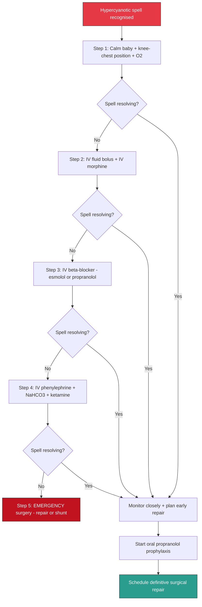
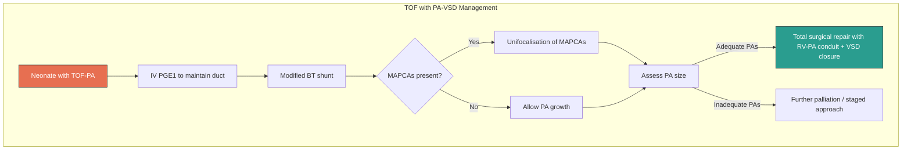
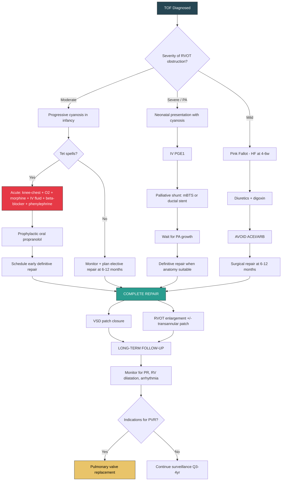

# Management of Tetralogy of Fallot

## Overview — Management Framework

The management of TOF is best understood as a **staged, time-dependent approach** that addresses the child's physiology at each point in their journey. Think of it in three temporal phases:

1. **Acute/Emergency management** — hypercyanotic (tet) spells; neonatal presentation with severe cyanosis
2. **Pre-operative stabilisation and palliation** — bridging to definitive repair
3. **Definitive surgical repair** — the curative treatment
4. **Long-term follow-up** — managing late complications of repair

Each phase has its own logic, and understanding *why* each intervention works requires understanding the pathophysiology established in earlier sections.

---

## 1. Emergency Management of Hypercyanotic (Tet) Spells

***Hypercyanotic spells*** [3][5] are **life-threatening emergencies**. They result from acute infundibular spasm → near-occlusion of the RVOT → vicious cycle of ↓ pulmonary blood flow → hypoxia → acidosis → more spasm. Every intervention is aimed at **breaking this cycle** by either (a) relaxing the infundibulum, (b) increasing SVR to oppose R→L shunting, or (c) improving RV preload.

### Stepwise Management [1][2]

The approach is **escalating** — start with simple measures and escalate if the spell does not resolve:

#### Step 1: Non-Pharmacological ("First Aid")

| Intervention | Mechanism | Details |
|---|---|---|
| ***Calm the baby, avoid agitation*** | Agitation → catecholamine surge → infundibular spasm + ↓SVR. Removing the trigger stops the cycle from worsening | Pick up and comfort; avoid unnecessary procedures; dim lights; parental holding |
| ***Knee-chest position*** [1][2] | ***↑ SVR*** (kinks femoral arteries, compresses iliac vessels — same principle as squatting/Fallot's sign) → opposes R→L shunting. Also ***↑ venous return*** → ↑ RV preload → ↑ pulmonary blood flow | Hold infant against shoulder with knees tucked to chest. In older children, encourage squatting |
| ***Supplemental O₂*** [1][2] | O₂ acts as a ***pulmonary vasodilator*** (↓PVR → ↑ pulmonary blood flow) and a ***systemic vasoconstrictor*** (↑SVR → ↓R→L shunt) | High-flow O₂ via face mask. Note: O₂ alone is often insufficient because the problem is not V/Q mismatch but R→L shunting bypassing the lungs |

#### Step 2: First-Line Pharmacological

| Intervention | Mechanism | Dose / Route | Notes |
|---|---|---|---|
| ***IV fluid bolus*** [1][2] | ***Improves RV filling (preload)*** → ↑ RV volume → more blood pushed through the RVOT → ↑ pulmonary blood flow | Normal saline 10–20 mL/kg bolus IV | Dehydration is a common trigger of tet spells (↓ preload → ↓ pulmonary flow) |
| ***IV morphine*** [1][2] | ***Sedation*** (reduces agitation → ↓ catecholamine release → ↓ infundibular spasm); mild ***systemic venodilation*** (↑ venous capacitance → mixed effect); ***suppresses hyperpnoeic respiratory drive*** (hyperpnoea worsens the spell by creating negative intrathoracic pressure → ↓ venous return) | 0.1–0.2 mg/kg IV/IM/SC | Also ***improves RV filling and pulmonary flow*** [1][2] by breaking the hyperpnoea → ↓ venous return → ↓ pulmonary flow cycle. Caution: respiratory depression — have naloxone available |

#### Step 3: Second-Line Pharmacological (If Spell Persists)

| Intervention | Mechanism | Dose / Route | Notes |
|---|---|---|---|
| ***IV β-blocker (esmolol or propranolol)*** [1][2] | ***Relaxation of RVOT infundibular muscle*** (β₁-blockade reduces contractility of the hypertrophied infundibular muscle → widens the RVOT) [1][2]; also ↓ heart rate → ↑ diastolic filling time → ↑ RV filling; ↓ chronotropy reduces myocardial O₂ demand | **Esmolol**: 500 µg/kg IV loading then 50–200 µg/kg/min infusion (ultra-short acting — advantage if haemodynamically unstable). **Propranolol**: 0.05–0.1 mg/kg slow IV (then 0.5–1 mg/kg/dose PO q6–8h for prophylaxis) | ***Propranolol*** is the classic drug for tet spells. Esmolol is preferred in the acute setting due to its short half-life (minutes). β-blockers are the **key pharmacological intervention** — they directly target the infundibular spasm |

#### Step 4: Third-Line Pharmacological (Refractory Spell)

| Intervention | Mechanism | Dose / Route | Notes |
|---|---|---|---|
| ***IV phenylephrine*** [1][2] | ***Pure α₁-agonist → ↑ SVR*** → opposes R→L shunting (makes it "harder" for blood to go to the systemic circulation, forcing more through the RVOT to the lungs) [1][2] | 5–20 µg/kg IV bolus; infusion 0.1–0.5 µg/kg/min | ***Vasoconstrictor — last pharmacological resort*** [1][2]. Use with caution; monitor BP closely |
| **IV sodium bicarbonate** | Corrects metabolic acidosis (which perpetuates infundibular spasm and further ↓ SVR) | 1–2 mEq/kg IV | Acidosis is part of the vicious cycle — correcting it helps break the cycle |
| **IV ketamine** | Sedation + ↑ SVR (ketamine uniquely increases systemic vascular resistance via sympathetic stimulation) | 1–2 mg/kg IV | Useful if procedural sedation is needed or as a bridge. Also provides analgesia |

#### Step 5: Surgical Emergency (If All Medical Measures Fail)

| Intervention | Mechanism | Notes |
|---|---|---|
| ***Emergency surgical repair or aorticopulmonary shunting*** [1][2] | Definitively relieves the RVOT obstruction (repair) or bypasses it (shunt) | ***If failed all of above*** [1][2] — this is the last resort for a refractory spell. Modified Blalock-Taussig shunt or emergent complete repair depending on the child's size and anatomy |

<Callout title="The Logic of Tet Spell Management — Every Drug Targets the Vicious Cycle">
| Target | Intervention |
|---|---|
| **↑ SVR** (oppose R→L shunting) | Knee-chest position, phenylephrine, ketamine |
| **Relax infundibulum** (↓ RVOT obstruction) | β-blocker (propranolol, esmolol), morphine (sedation) |
| **↑ RV preload** (↑ pulmonary blood flow) | IV fluid, knee-chest position |
| **↓ agitation / catecholamines** | Calming, morphine |
| **Correct acidosis** | NaHCO₃ |
| **↑ pulmonary blood flow directly** | O₂ (pulmonary vasodilator) |
</Callout>

<Callout title="Do NOT Give ACE Inhibitors in TOF!" type="error">
***Avoid ACEI/ARB in TOF → ↓SVR → can trigger tet spells*** [1][2]. While ACEIs are a mainstay of paediatric heart failure management [7], they are ***contraindicated*** in TOF because reducing SVR shifts the balance toward more R→L shunting, worsening cyanosis. This is the opposite of their beneficial effect in VSD/PDA where ↓SVR reduces L→R shunting.
</Callout>

### Prophylaxis Against Tet Spells

After a child has had a tet spell, **oral propranolol** is started as prophylaxis while awaiting surgical repair:
- **Dose**: 0.5–1 mg/kg/dose PO every 6–8 hours (up to 2 mg/kg/dose in some protocols)
- **Mechanism**: Chronic β-blockade keeps the infundibular muscle relaxed, preventing dynamic spasm
- **This is a bridge to surgery, not a definitive treatment** — the child should be scheduled for early definitive repair after a tet spell

---

## 2. Neonatal Presentation with Severe Cyanosis (Duct-Dependent Physiology)

This applies to:
- TOF with **severe RVOT obstruction** presenting at birth
- ***TOF with pulmonary atresia (PA-VSD)*** [3][5] — where pulmonary blood flow is entirely duct-dependent

### Management

| Intervention | Mechanism | Details |
|---|---|---|
| ***IV PGE₁ (prostaglandin E₁ / alprostadil)*** [1][2] | ***Maintains ductal patency*** → the PDA provides the only path for blood to reach the lungs. Without it, the ductus closes → no pulmonary blood flow → death | Dose: 5–10 ng/kg/min IV initially, titrate to maintain SpO₂ 75–85%. Side effects: apnoea (have intubation equipment ready), fever, hypotension, flushing |
| ***Early surgical shunting*** [1][2] | Provides a permanent (until taken down) systemic-to-pulmonary connection, independent of the ductus | ***Modified Blalock-Taussig shunt (mBTS)*** [2][5] or ductal/RVOT stenting |

> **Why do we target SpO₂ 75–85% and not 100%?** In a mixing or parallel physiology, aiming for very high saturations would require excessive pulmonary blood flow at the expense of systemic perfusion. A SpO₂ of 75–85% represents balanced circulation and adequate tissue oxygen delivery with normal Hb levels.

---

## 3. Management of "Pink Fallot" (Heart Failure)

***Heart failure at 4–6 weeks in those with mild RVOT obstruction*** [1][2] is managed differently:

- The physiology is that of a ***large VSD with L→R shunting*** → pulmonary overcirculation → volume overload → CHF
- ***General management of paediatric heart failure*** [7]: identification of cause, tackling precipitating factors, general supportive management, medical therapy (diuretics, digoxin, possibly carvedilol), then surgical correction
- ***Medical Mx of HF*** [1][2]: Diuretics (furosemide ± spironolactone), digoxin
- ***Avoid ACEI/ARB*** [1][2] — even though these are standard HF drugs, in TOF they ***↓SVR → can trigger tet spells*** as RVOT obstruction progresses. This is a key difference from managing an isolated VSD, where ACEIs are beneficial
- Definitive treatment is **surgical repair** — which corrects both the VSD and RVOT obstruction

---

## 4. Palliative Procedures (Bridge to Definitive Repair)

Palliation is used when **definitive repair cannot be safely performed** — usually because of:
- ***Severe cyanosis or uncontrolled tet spells in neonates*** [1][2]
- ***Pulmonary artery hypoplasia that would not tolerate biventricular repair*** [1][2] — the PAs are too small to handle full cardiac output after repair; a shunt allows them to grow before definitive repair
- Very low birth weight / prematurity

### 4.1 ***Modified Blalock-Taussig Shunt (mBTS)*** [1][2][5]

| Feature | Details |
|---|---|
| **What it is** | ***Synthetic graft (Gore-Tex) from the innominate or subclavian artery to the ipsilateral pulmonary artery*** [1][2] |
| **Mechanism** | Creates a ***L→R shunt*** at the arterial level → deoxygenated blood mixes with oxygenated blood in the systemic arteries, but more importantly, ***provides adequate pulmonary blood flow*** [1][2] bypassing the obstructed RVOT |
| **Indications** | ***Severe cyanosis or uncontrolled tet spells in neonates; PA hypoplasia*** [1][2]. Also indicated in ***PA-VSD with duct dependence*** [1] |
| **Follow-up** | ***Always listen for shunt murmur on follow-up → blocked BT shunt can kill*** [1][2]. A continuous murmur heard over the shunt site confirms patency. Loss of this murmur = urgent investigation for shunt thrombosis |
| **Anticoagulation** | Low-dose aspirin is typically given to maintain shunt patency |

> *"Blalock-Taussig"* — named after Alfred Blalock (surgeon) and Helen Taussig (paediatric cardiologist) at Johns Hopkins, 1944 — one of the first successful palliative cardiac surgeries. The original BTS used the native subclavian artery; the ***modified*** BTS uses a synthetic graft (preserves the subclavian artery and upper limb blood supply).

<Callout title="Blocked BT Shunt — A Life-Threatening Emergency" type="error">
***Always listen for the shunt murmur on follow-up. A blocked BT shunt can kill*** [1][2]. If the continuous murmur disappears, the shunt may be occluded by thrombus. This results in acute loss of pulmonary blood flow → profound cyanosis → cardiac arrest. Treatment: urgent heparinisation, consideration of thrombolysis, and emergency surgical revision or conversion to definitive repair.
</Callout>

### 4.2 Transcatheter Alternatives

| Procedure | Mechanism | Notes |
|---|---|---|
| ***Ductal stenting*** [1][2] | A stent is placed in the PDA via cardiac catheterisation to keep it permanently open → maintains pulmonary blood flow without open surgery | Alternative to mBTS in selected centres; avoids sternotomy |
| ***RVOT stenting*** [1][2] | A stent is placed across the narrowed RVOT to relieve obstruction → improves antegrade pulmonary blood flow | Technically challenging; centre-dependent |
| **Balloon pulmonary valvuloplasty** | Dilates stenotic pulmonary valve | Rarely used in TOF (the obstruction is mainly infundibular, not valvar); more useful in isolated valvar PS |

---

## 5. Definitive Surgical Repair — ***Total Surgical Correction***

### ***Complete Repair: Usually at 6–12 Months of Age (Ideal)*** [1][2][5]

This is the curative operation. The lecture slides state: ***"total surgical correction at about 6 to 12 months of age"*** [5].

### Surgical Procedure [1][2]

The repair addresses two of the four components (the other two resolve with correction):

| Component of Repair | What Is Done | Why |
|---|---|---|
| ***VSD patch closure*** [1][2] | A synthetic (Gore-Tex/Dacron) or autologous pericardial patch is sutured over the VSD, closing the communication between RV and LV | Eliminates the R→L (or L→R) shunt. The aorta is now committed entirely to the LV. This also corrects the "overriding" because the patch is placed to route the aorta to the LV |
| ***RVOT enlargement*** [1][2] | ***Resection of infundibular and subinfundibular muscle bundles*** [1][2] to widen the infundibulum; ***± transannular patch*** if the PV annulus is hypoplastic [1][2] | Relieves the RVOT obstruction → restores antegrade pulmonary blood flow. Muscle resection addresses the muscular infundibular component. A transannular patch is a patch that extends across the PV annulus into the MPA — it widens the entire RVOT but ***obligatorily destroys PV competence → causes PR*** |

**What about RVH and the overriding aorta?**
- ***RVH*** — resolves gradually after repair as the RV is no longer facing systemic-level pressures (the VSD is closed and the RVOT obstruction is relieved → RV pressure drops to normal pulmonary levels)
- ***Overriding aorta*** — corrected by the VSD patch placement, which routes the aorta to the LV

### Additional Surgical Considerations

| Consideration | Details |
|---|---|
| **Anomalous coronary crossing RVOT** | If the LAD crosses the RVOT (seen in ~5%), a standard transannular patch cannot be used (would transect the LAD). An RV-to-PA conduit is used instead, placed lateral to the anomalous coronary |
| **Branch PA stenosis** | May require patch augmentation of the branch PAs at the time of repair |
| **ASD/PFO** | Closed at the time of repair (or a small fenestration may be left in high-risk cases to allow R→L pop-off if RV is stiff post-operatively) |
| **Right aortic arch** | Does not change the surgical approach but is noted |

### Perioperative Outcomes [1][2]

- ***Perioperative mortality: 0–3%*** [1][2] at experienced centres
- ***Mortality is significantly higher for smaller children*** [1][2] — this is one reason why repair is ideally deferred to 6–12 months rather than the neonatal period
- Most children can be extubated within 24–48 hours and discharged within 5–7 days

### Indications for Early Repair (Before 6 Months)

| Indication | Rationale |
|---|---|
| Recurrent tet spells despite medical therapy | Medical management has failed; continued spells risk cerebral injury |
| Severe cyanosis (SpO₂ consistently < 70–75%) | Chronic severe hypoxia causes end-organ damage |
| Failure to thrive despite optimisation | The cyanosis and metabolic stress are impairing growth |
| Favourable anatomy (adequate PA sizes, no anomalous coronary) | If anatomy is suitable, earlier repair avoids the risks of palliation |

### Contraindications / Reasons to Defer Complete Repair

| Factor | Reason to Defer |
|---|---|
| ***PA hypoplasia*** (small pulmonary arteries with low Z-scores) | The PAs cannot handle full cardiac output post-repair → high RV pressure → RV failure. A palliative shunt (mBTS) is performed first to allow PA growth |
| **Very low birth weight / extreme prematurity** | Technical difficulty; higher surgical risk. Palliate with mBTS and wait for the child to grow |
| **Significant comorbidities** (e.g., sepsis, NEC, severe non-cardiac anomalies) | Stabilise the child first |
| **Anomalous coronary anatomy** requiring conduit rather than transannular patch | May be performed at a slightly later age for technical reasons at some centres |

---

## 6. Management of TOF with Pulmonary Atresia (PA-VSD) [3][5]

This is the extreme end of the TOF spectrum and requires a more complex approach:

| Phase | Management | Notes |
|---|---|---|
| **Neonatal** | ***IV PGE₁*** to maintain ductal patency | Duct-dependent pulmonary circulation |
| **Palliative** | ***Surgical palliation by systemic-pulmonary arterial shunt (e.g., modified Blalock-Taussig shunt)*** [5] | Provides pulmonary blood flow; allows PAs to grow |
| **If MAPCAs present** | ***Unifocalisation of aortopulmonary collaterals*** [5] — surgical procedure to connect multiple MAPCAs into the native PA system, creating a single, unified pulmonary arterial supply | MAPCAs supply different lung segments erratically; unifocalisation creates a single PA tree that can be connected to the RV at definitive repair |
| **Definitive repair** | ***Total surgical repair in infancy to early childhood*** [5] — VSD closure + RV-to-PA conduit (since there is no native RVOT/PV to patch) | Timing depends on PA growth and unifocalisation success |

---

## 7. Overall Management Algorithm

---

## 8. Long-Term Follow-Up After Repair

### ***Pulmonary Regurgitation — The Principal Late Complication*** [1][2]

This is covered comprehensively in the Complications section, but key management points:

| Issue | Detail |
|---|---|
| ***Cause*** | ***More aggressive repair → higher risk of PV damage, especially if transannular patch used → obligatory PR*** [1][2] |
| ***Problems*** | ***RV dilatation and dysfunction, ↓ exercise tolerance, arrhythmia (VT, atrial flutter, AF), sudden cardiac death*** [1][2] |
| **Monitoring** | ***Long-term follow-up with exercise testing every 3–4 years*** [1][2]; cardiac MRI for RV volumes and PR quantification |
| ***Indications for pulmonary valve replacement (PVR)*** | ***(1) MRI shows RVH + > 25% regurgitant fraction*** [1][2]; ***(2) Symptomatic (RV failure, arrhythmia)*** [1][2] |
| **PVR modalities** | Surgical PVR (bioprosthetic valve — most common); transcatheter PVR (Melody valve or SAPIEN valve) in selected patients with suitable RVOT anatomy |

### Other Long-Term Considerations

| Consideration | Details |
|---|---|
| **Residual RVOT obstruction** | May require re-intervention (balloon dilatation, further surgical resection) |
| **Residual VSD** | Small residual leaks are common and usually haemodynamically insignificant; large residual VSDs may require re-operation |
| **Arrhythmias** | QRS duration > 180 ms on ECG is a risk factor for VT and sudden death; consider ICD or EP study |
| **Endocarditis prophylaxis** | Required for 6 months after repair (prosthetic patch); lifelong if residual defect adjacent to prosthetic material |
| **Exercise** | Most children after successful repair can participate in moderate exercise; formal exercise testing guides recommendations |
| **Pregnancy counselling** | Women with repaired TOF have good pregnancy outcomes but need pre-conception cardiac assessment (RV function, PR severity, arrhythmia risk) |
| **Genetic counselling** | Recurrence risk ~3–5% for CHD in offspring; higher if 22q11.2 deletion |

### Prognosis [1][2]

- ***Good after complete repair: 93% 25-year survival*** [1][2]
- ***Unrepaired TOF is compatible with survival to adulthood*** [1] — rare patients present in adulthood, but with significant complications (polycythaemia, brain abscess, endocarditis)
- Quality of life is generally excellent after repair, though many patients require one or more re-interventions in their lifetime (most commonly PVR)

---

## 9. Summary Table — Treatment Modalities, Indications, and Contraindications

| Treatment | Indication | Contraindication / Caution |
|---|---|---|
| **IV PGE₁** | Duct-dependent cyanosis (severe TOF, PA-VSD) | Apnoea risk — intubation equipment must be ready; may cause hypotension |
| **Knee-chest position + calming** | First-line for tet spell | None — always do this first |
| **IV morphine** | Tet spell (sedation, ↓hyperpnoea) | Respiratory depression; avoid in apnoeic child |
| **IV β-blocker (esmolol/propranolol)** | Tet spell (relax infundibulum) | Severe bradycardia; hypotension; bronchospasm in asthmatic child |
| **Oral propranolol** | Prophylaxis against tet spells while awaiting surgery | As above; check blood glucose in small infants (risk of hypoglycaemia with β-blockers) |
| **IV phenylephrine** | Refractory tet spell (↑SVR) | Hypertension; coronary vasospasm; use with continuous BP monitoring |
| ***ACEI/ARB*** | ***CONTRAINDICATED in TOF*** [1][2] | ***↓SVR → triggers tet spells*** |
| **Modified BT shunt** | Neonate with severe cyanosis / uncontrolled tet spells / PA hypoplasia / PA-VSD | Shunt thrombosis risk; requires anticoagulation; must monitor shunt murmur |
| **Ductal / RVOT stenting** | Alternative to mBTS in selected centres | Centre-dependent; vascular access issues in neonates |
| **Complete repair (VSD closure + RVOT enlargement)** | All TOF patients; ideally at 6–12 months | PA hypoplasia (may need palliation first); anomalous coronary crossing RVOT (needs conduit, not transannular patch) |
| **Transannular patch** | PV annulus too small (low Z-score) to accommodate repair without patch | Causes ***obligatory PR*** — the principal late complication |
| **PVR** | Post-repair PR with RVH + > 25% regurgitant fraction; or symptomatic | Timing must balance risks of RV deterioration vs. valve lifespan |
| ***Unifocalisation*** [5] | ***TOF with PA-VSD and MAPCAs*** | Complex, staged surgery; may require multiple operations |

---

<Callout title="High Yield Summary">

**Management of TOF — Key Exam Points:**

1. ***Tet spell management is stepwise***: calm + knee-chest + O₂ → IV fluid + morphine → IV β-blocker (propranolol/esmolol) → IV phenylephrine → emergency surgery [1][2]
2. ***Every intervention targets the vicious cycle***: ↑SVR, relax infundibulum, ↑RV preload, ↓catecholamines, correct acidosis
3. ***Avoid ACEI/ARB in TOF*** → ↓SVR → triggers tet spells [1][2]
4. ***IV PGE₁*** for neonates with severe/duct-dependent TOF or PA-VSD [1][2]
5. ***Modified Blalock-Taussig shunt***: synthetic graft from innominate/subclavian to PA → provides pulmonary blood flow as palliation [1][2][5]
6. ***Always listen for shunt murmur on follow-up — blocked BT shunt can kill*** [1][2]
7. ***Complete repair at 6–12 months***: VSD patch closure + RVOT enlargement (infundibular resection ± transannular patch) [1][2][5]
8. ***Perioperative mortality 0–3%***; ***25-year survival 93%*** after repair [1][2]
9. ***Transannular patch → obligatory PR*** (the principal late complication) [1][2]
10. ***PR management***: long-term follow-up + exercise testing Q3–4yr; PVR if MRI shows RVH + > 25% regurgitant fraction or symptomatic [1][2]
11. ***TOF with PA-VSD***: PGE₁ → mBTS → ***unifocalisation of MAPCAs*** → total repair [5]
12. ***"Pink Fallot"***: treat heart failure with diuretics/digoxin but AVOID ACEI → plan surgical repair [1][2]

</Callout>

---

<ActiveRecallQuiz
  title="Active Recall - Management of Tetralogy of Fallot"
  items={[
    {
      question: "Describe the stepwise management of a hypercyanotic (tet) spell, explaining the mechanism of each intervention.",
      markscheme: "Step 1: Calm baby + knee-chest position (increases SVR and venous return) + O2 (pulmonary vasodilator, systemic vasoconstrictor). Step 2: IV fluid bolus (increases RV preload and pulmonary flow) + IV morphine (sedation, reduces hyperpnoea and catecholamine release). Step 3: IV beta-blocker (propranolol/esmolol - relaxes infundibular muscle spasm). Step 4: IV phenylephrine (pure alpha-1 agonist, increases SVR to oppose R-to-L shunting). Step 5: Emergency surgery (repair or shunt) if all medical measures fail."
    },
    {
      question: "Why are ACE inhibitors contraindicated in TOF, and what alternative medications are used for heart failure in Pink Fallot?",
      markscheme: "ACEIs cause systemic vasodilation (decrease SVR), which in TOF shifts the haemodynamic balance towards more R-to-L shunting through the VSD, worsening cyanosis and potentially triggering tet spells. For Pink Fallot with heart failure, alternatives are diuretics (furosemide, spironolactone) and digoxin for symptom control while awaiting surgical repair."
    },
    {
      question: "What are the two components of definitive TOF repair and what late complication is caused by the transannular patch?",
      markscheme: "1) VSD patch closure (eliminates intracardiac shunt, commits aorta to LV). 2) RVOT enlargement by resecting infundibular and subinfundibular muscle bundles, with or without a transannular patch. The transannular patch extends across the PV annulus and obligatorily destroys PV competence, causing pulmonary regurgitation (PR) - the principal late complication. PR leads to RV dilatation, dysfunction, arrhythmias, and may require pulmonary valve replacement."
    },
    {
      question: "What are the indications for a modified Blalock-Taussig shunt in TOF, and what critical follow-up step must never be missed?",
      markscheme: "Indications: severe cyanosis or uncontrolled tet spells in neonates, PA hypoplasia that would not tolerate biventricular repair, duct-dependent PA-VSD. Critical follow-up: always listen for the continuous shunt murmur. A blocked BT shunt can kill - loss of the murmur suggests shunt thrombosis, causing acute loss of pulmonary blood flow, requiring emergency intervention."
    },
    {
      question: "Describe the management strategy for TOF with pulmonary atresia and MAPCAs from birth to definitive repair.",
      markscheme: "Birth: IV PGE1 to maintain ductal patency. Palliation: Modified BT shunt to provide pulmonary blood flow. If MAPCAs present: Unifocalisation surgery to connect multiple aortopulmonary collaterals into a single unified PA system. Allow PA growth and assess adequacy. Definitive repair: Total surgical repair (VSD closure + RV-to-PA conduit) in infancy to early childhood when PA anatomy is adequate."
    },
    {
      question: "What are the indications for pulmonary valve replacement after TOF repair and what monitoring modality is used?",
      markscheme: "Indications: (1) Cardiac MRI shows RVH plus greater than 25% regurgitant fraction, OR (2) Symptomatic with RV failure or arrhythmia. Monitoring: Cardiac MRI is the gold standard for post-operative follow-up - quantifies PR fraction, RV end-diastolic volume, and RV ejection fraction. Exercise testing is performed every 3-4 years."
    }
  ]}
/>

## References

[1] Senior notes: Adrian Lui Pediatrics.pdf (p214 — TOF management; p200 — paediatric heart failure management)
[2] Senior notes: Ryan Ho Cardiology.pdf (p187–188 — TOF management)
[3] Lecture slides: GC 147. Heart failure and cyanosis in children acyanotic and cyanotic congenital heart disease - Part 2.pdf (p10 — classification; p13 — hypercyanotic spell)
[5] Lecture slides: GC 147. Heart failure and cyanosis in children acyanotic and cyanotic congenital heart disease - Part 2.pdf (p14 — total surgical correction at 6–12 months; p15, 17 — PA-VSD, modified BT shunt; p18 — unifocalisation of MAPCAs; p19 — total repair in infancy to early childhood)
[7] Lecture slides: GC 147. Heart failure and cyanosis in children acyanotic and cyanotic congenital heart disease - Part 1.pdf (p36 — management of paediatric heart failure)
