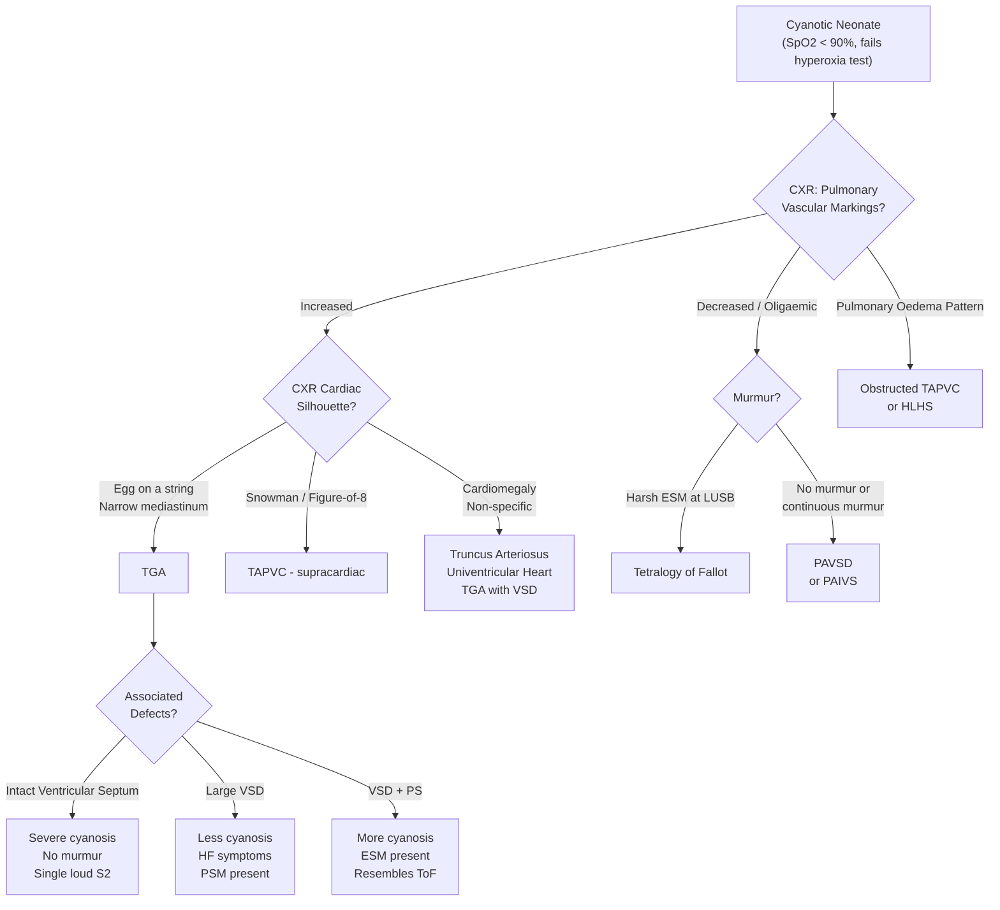

## Differential Diagnosis of Transposition of the Great Arteries

### Framing the Problem

The differential diagnosis of TGA is really the differential of a **cyanotic neonate** — because that is how TGA presents. Let's think about this from first principles.

A neonate is cyanotic. Why? There are only a few pathophysiological buckets:

1. **Cardiac causes** — structural heart disease causing deoxygenated blood to reach the systemic circulation
2. **Respiratory causes** — lung disease preventing adequate gas exchange
3. **Other causes** — persistent pulmonary hypertension of the newborn (PPHN), methaemoglobinaemia, sepsis/shock, CNS depression

The key clinical question when you see a cyanotic neonate is: **Is this cardiac or respiratory cyanosis?** The **hyperoxia test** helps differentiate (PaO₂ remains < 100 mmHg on 100% FiO₂ in cardiac cyanosis, rises > 150 mmHg in respiratory causes). Once you've established it's cardiac, you need to differentiate among cyanotic congenital heart diseases.

> The specific clinical scenario that most closely mimics TGA and must be differentiated is a **cyanotic neonate with increased pulmonary vascular markings on CXR** (i.e., cyanosis WITH high pulmonary blood flow). This is the hallmark of TGA — most other cyanotic CHDs have **decreased** pulmonary flow.

---

### Systematic Differential Diagnosis

#### A. Cyanotic Congenital Heart Diseases (The Main Differentials)

I'll organise these by physiology, matching the ***classification of CHD by physiology*** from lectures [2][3]:

##### 1. RVOT Obstruction with Right-to-Left Shunt → **Decreased Pulmonary Blood Flow**

| Condition | Key Distinguishing Features from TGA |
|---|---|
| ***Tetralogy of Fallot (ToF)*** | Most common cyanotic CHD overall; cyanosis usually presents **later** (months, not hours) as RVOT obstruction is progressive; **harsh ESM at LUSB** (from PS — unlike TGA which has no murmur); CXR shows **boot-shaped heart with oligaemic lung fields** (↓ pulmonary vascular markings — opposite to TGA); "pink Fallot" may present with HF like TGA/VSD [3][4] |
| ***Pulmonary atresia with VSD (PAVSD)*** | ***An extreme variant of ToF with complete atresia of the pulmonary valve*** [2]; presents with cyanosis within hours (like TGA/IVS) and is duct-dependent; **no PS murmur** (like TGA); CXR shows ***boot-shaped heart with oligaemic lung fields*** [2] — the lung field appearance differs from TGA's plethoric fields; ***±continuous collateral murmur*** if MAPCAs present [2] |
| ***Pulmonary atresia with intact ventricular septum (PAIVS)*** | ***RVOT obstruction at atrial level*** [3]; severely duct-dependent; tiny RV (hypoplastic); **decreased** pulmonary blood flow; tricuspid regurgitation murmur may be present |

<Callout title="Key Distinguishing Principle">
TGA has **increased** pulmonary vascular markings on CXR (the strong LV pumps to the lungs). ToF, PAVSD, and PAIVS have **decreased/oligaemic** lung fields because of RVOT obstruction reducing pulmonary blood flow. This single CXR finding is one of the most powerful differentiators.
</Callout>

##### 2. Common Mixing Conditions → **Variable/Increased Pulmonary Blood Flow**

These are the conditions most likely to be confused with TGA because they also present with cyanosis AND increased pulmonary blood flow:

| Condition | Key Distinguishing Features from TGA |
|---|---|
| ***Total anomalous pulmonary venous connection (TAPVC/TAPVD)*** | ***Venous/atrial level common mixing*** [3]; all pulmonary veins drain into the systemic venous system instead of LA → common mixing in RA; cyanosis + **increased** pulmonary vascular markings (like TGA); CXR may show **"snowman/figure-of-8"** appearance (supracardiac type) vs TGA's "egg on a string"; obstructed TAPVC presents with severe cyanosis and pulmonary oedema (a unique finding not seen in simple TGA) |
| ***Univentricular heart (single ventricle)*** | ***Ventricular level common mixing*** [3]; complete mixing of systemic and pulmonary venous blood in one ventricle; cyanosis is usually mild-moderate with increased pulmonary blood flow; specific echo findings of single ventricle morphology |
| ***Persistent truncus arteriosus*** | ***VOT level common mixing*** [3]; single great vessel overriding a VSD supplies both systemic and pulmonary circulations; cyanosis + increased pulmonary flow + early HF; **wide pulse pressure** (aortic run-off into pulmonary bed); associated with ***DiGeorge syndrome*** (like TGA) [4]; single S2 (only one semilunar valve) — but truncus has a **systolic ejection click** |

##### 3. Other Cyanotic CHDs

| Condition | Key Distinguishing Features from TGA |
|---|---|
| ***Ebstein anomaly*** | ***Displacement of the tricuspid valve into the RV*** → "atrialised" RV; presents with cyanosis (R-to-L shunt via ASD/PFO due to elevated RA pressure); **massive cardiomegaly** on CXR ("wall-to-wall" heart — very different from TGA's egg shape); characteristic ECG: tall P waves (RAE), RBBB, pre-excitation (WPW) in ~20% |
| ***Hypoplastic left heart syndrome (HLHS)*** | Underdeveloped left-sided structures (LV, mitral valve, aortic valve); duct-dependent for systemic perfusion (blood flows PA → PDA → aorta); presents with **shock/collapse** + cyanosis when duct closes; CXR shows cardiomegaly + pulmonary oedema; **absent femoral pulses** (systemic flow dependent on duct); RV heave prominent (like TGA), but clinical picture dominated by **shock** rather than isolated cyanosis |

##### 4. Acyanotic CHDs That May Occasionally Enter the Differential

| Condition | Why It Could Be Confused | Key Differentiator |
|---|---|---|
| ***Large VSD with Eisenmenger physiology*** | Presents with cyanosis when pulmonary vascular disease develops (late) | Eisenmenger develops over **months to years**, not neonatally; loud **pansystolic murmur** initially; ECG shows biventricular hypertrophy |
| ***Coarctation of the aorta / Interrupted aortic arch*** | ***LVOT obstruction → shock at day 2*** [2][3]; duct-dependent for lower body perfusion; can have mild cyanosis | Presents primarily with **shock and absent femoral pulses**, not primary cyanosis; differential blood pressures (upper > lower limbs); often associated with DiGeorge (interrupted aortic arch) |

#### B. Non-Cardiac Causes of Neonatal Cyanosis

These must be excluded before attributing cyanosis to CHD:

| Cause | Distinguishing Features |
|---|---|
| **Respiratory distress syndrome (RDS)** | Preterm neonate; grunting, nasal flaring, intercostal recession; CXR shows ground-glass opacification with air bronchograms; responds to surfactant and oxygen |
| **Meconium aspiration syndrome** | Post-term; meconium-stained liquor; CXR shows patchy infiltrates ± pneumothorax; improves with respiratory support |
| **Persistent pulmonary hypertension of the newborn (PPHN)** | Severe hypoxaemia with labile saturations; echocardiography shows structurally normal heart with elevated PA pressures and R-to-L shunting at PDA/PFO; responds to inhaled nitric oxide |
| **Congenital diaphragmatic hernia (CDH)** | Scaphoid abdomen; CXR shows bowel loops in thorax; associated with pulmonary hypoplasia |
| **Pneumonia / Sepsis** | Fever or hypothermia; raised inflammatory markers; responds to antibiotics + supportive care |
| **Methaemoglobinaemia** | "Chocolate-brown" blood that doesn't turn red with oxygen exposure; co-oximetry diagnostic; SpO₂ characteristically reads ~85% and doesn't change; treat with methylene blue |
| **CNS depression** (birth asphyxia, maternal sedation) | Poor respiratory effort; hypoventilation; responds to stimulation/ventilation |

<Callout title="The Hyperoxia Test — The Critical Bedside Tool" type="idea">
Place the neonate on 100% FiO₂ for 10 minutes and measure PaO₂ (right radial artery = pre-ductal):
- **PaO₂ > 150 mmHg**: likely respiratory cause (lungs can oxygenate if given enough O₂)
- **PaO₂ remains < 100 mmHg**: likely cyanotic CHD (fixed structural shunt — O₂ can't help if oxygenated blood doesn't reach the systemic circuit)
- **PaO₂ 100–150 mmHg**: equivocal — may be significant intracardiac mixing or PPHN

In TGA specifically, PaO₂ typically remains **< 50 mmHg** even on 100% FiO₂ because the parallel circuits prevent oxygenated blood from reaching the systemic circulation regardless of how well the lungs are oxygenated.
</Callout>

---

### Differentiating TGA from Its Closest Mimics — A Decision Framework

---

### Key Differentiating Features — Summary Table

| Feature | **TGA** | **ToF** | **TAPVC** | **Truncus Arteriosus** | **PAVSD** | **HLHS** |
|---|---|---|---|---|---|---|
| **Age at cyanosis** | Hours–days | Months (progressive) | Days–weeks | Days–weeks | Hours | Hours–days |
| **Pulmonary blood flow** | ***Increased*** [1] | Decreased | Increased (unless obstructed) | Increased | Decreased | Variable |
| **CXR silhouette** | ***Egg on a string*** [2] | Boot-shaped | Snowman (supracardiac) | Cardiomegaly ± right aortic arch | Boot-shaped | Cardiomegaly |
| **Murmur** | ***None or non-specific*** [2] | Harsh ESM at LUSB | Flow murmur | Systolic ejection click + ESM | ***No PS murmur, ± continuous*** [2] | Non-specific |
| **S2** | ***Loud, single*** [2] | Single (soft P2) | Wide fixed split | Single (one valve) | Single | Single |
| **ECG** | ***Normal for age*** [2] | RAD, RVH | RAD, RVH ± RAE | Biventricular hypertrophy | RAD, RVH | RVH |
| **Primary problem** | Parallel circuits, inadequate mixing | RVOT obstruction → R-to-L shunt | Anomalous pulmonary venous drainage → common mixing | Single outflow → common mixing | Complete RVOT obstruction → R-to-L shunt | Underdeveloped left heart → duct-dependent systemic flow |
| **Duct-dependent?** | Yes (for mixing) | If severe obstruction | No (unless obstructed) | No | Yes (for pulmonary flow) | Yes (for systemic flow) |

---

### The Most Important Differential: TGA vs TAPVC

Both present as a **cyanotic neonate with increased pulmonary vascular markings**. Here's how to tell them apart:

| Feature | TGA | TAPVC |
|---|---|---|
| **Mechanism of cyanosis** | Parallel circuits — oxygenated blood doesn't reach the body | All pulmonary venous blood returns to RA → common mixing → obligatory R-to-L shunt for systemic output |
| **CXR** | "Egg on a string" with narrow mediastinum | "Snowman" (supracardiac type); obstructed TAPVC shows pulmonary oedema |
| **S2** | Loud single S2 (anterior aortic valve) | Wide fixed split S2 (increased flow through right heart) |
| **ECG** | Normal for age | RAD + RVH + RAE (all blood returns to RA → RA and RV volume overload) |
| **Pulmonary oedema** | Absent (unless severe HF in TGA/VSD) | Present in obstructed TAPVC (pulmonary venous obstruction → elevated hydrostatic pressure in pulmonary capillaries) |
| **Response to PGE₁** | Improves mixing via PDA | May worsen obstructed TAPVC (↑ pulmonary blood flow against obstructed drainage → worsens pulmonary oedema) |

<Callout title="Critical DDx Pearl" type="error">
In obstructed TAPVC, prostaglandin E₁ can **worsen** the clinical condition by increasing pulmonary blood flow into a circuit that cannot drain. This is the opposite of TGA where PGE₁ is life-saving. Always obtain an echocardiogram before or as soon as possible after starting PGE₁ in a cyanotic neonate to confirm the diagnosis and guide management.
</Callout>

---

### Approach to the Cyanotic Neonate — Putting It Together

The systematic bedside approach to differentiating cardiac causes:

1. **History**: Timing of cyanosis onset, gestational age, maternal history (diabetes → TGA; rubella → PDA), family history, prenatal echo findings
2. **Examination**: Murmur characteristics, S2 quality, pulse character (bounding → PDA/truncus; weak femorals → CoA/HLHS), hepatomegaly, respiratory effort
3. **Pulse oximetry**: Pre- and post-ductal saturations — calculate the gradient
4. **Hyperoxia test**: Differentiates cardiac from respiratory causes
5. **CXR**: Pulmonary vascular markings (increased vs decreased) + cardiac silhouette
6. **ECG**: Axis, hypertrophy pattern, atrial enlargement
7. **Echocardiography**: ***Definitive diagnostic tool*** — demonstrates the ventriculoarterial connections and associated defects

> **Rule of thumb for exams**: Cyanotic neonate + no murmur + loud single S2 + "egg on a string" CXR + increased pulmonary vascular markings + normal ECG for age = **TGA with intact ventricular septum** until proven otherwise.

---

<Callout title="High Yield Summary">

**Differential diagnosis of TGA is the differential of the cyanotic neonate:**

1. **Cardiac causes** — classified by pulmonary blood flow:
   - ***Increased pulmonary blood flow*** (like TGA): TAPVC, truncus arteriosus, univentricular heart, TGA/VSD
   - ***Decreased pulmonary blood flow***: ToF, PAVSD, PAIVS — distinguished by **oligaemic lung fields** on CXR and presence of murmurs
   - ***Duct-dependent systemic circulation***: HLHS, critical CoA/interrupted aortic arch — present primarily with **shock** and weak/absent femoral pulses

2. **Non-cardiac causes**: RDS, meconium aspiration, PPHN, CDH, sepsis, methaemoglobinaemia, CNS depression — distinguished by hyperoxia test and clinical context

3. **Key differentiators for TGA**:
   - ***"Egg on a string" CXR with increased pulmonary vascular markings*** [2]
   - ***No murmur in TGA/IVS*** [2]
   - ***Loud, single S2*** [2]
   - ***ECG normal for age*** [2]
   - Fails hyperoxia test (PaO₂ < 50 mmHg on 100% FiO₂)
   - Echocardiography is **definitive**

4. **Closest mimic**: TAPVC — also cyanosis + increased pulmonary blood flow; differentiated by CXR pattern, S2 quality, ECG, and response to PGE₁ (helps TGA, may worsen obstructed TAPVC)
</Callout>

---

<ActiveRecallQuiz
  title="Active Recall - Differential Diagnosis of TGA"
  items={[
    {
      question: "Name three cyanotic CHDs that present with INCREASED pulmonary vascular markings on CXR, like TGA. How does this differ from Tetralogy of Fallot?",
      markscheme: "TGA, TAPVC, truncus arteriosus (also univentricular heart, TGA with VSD). ToF has DECREASED pulmonary vascular markings (oligaemic lung fields) because RVOT obstruction reduces pulmonary blood flow. In TGA, the strong LV pumps to the PA, causing increased pulmonary flow; cyanosis is from inadequate mixing, not reduced pulmonary flow.",
    },
    {
      question: "A cyanotic neonate has no murmur, a loud single S2, and a CXR showing an egg-shaped cardiac silhouette with a narrow mediastinum and increased pulmonary vascular markings. What is the most likely diagnosis, and what two findings on CXR explain the narrow mediastinum?",
      markscheme: "TGA with intact ventricular septum. Narrow mediastinum explained by: (1) AP relationship of the great arteries (aorta anterior, PA posterior) rather than normal side-by-side arrangement, and (2) stress-induced thymic involution in the sick neonate.",
    },
    {
      question: "How does obstructed TAPVC differ from TGA in terms of CXR findings and response to prostaglandin E1?",
      markscheme: "Obstructed TAPVC CXR: pulmonary oedema with normal or small heart size (pulmonary venous obstruction causes hydrostatic oedema). TGA CXR: egg on a string with increased vascular markings but no oedema. PGE1 helps TGA by maintaining the PDA as a mixing site. PGE1 may WORSEN obstructed TAPVC by increasing pulmonary blood flow into an obstructed drainage pathway, worsening pulmonary oedema.",
    },
    {
      question: "Explain the hyperoxia test. What PaO2 result would you expect in TGA, and why does supplemental oxygen fail to correct the hypoxaemia?",
      markscheme: "Hyperoxia test: administer 100% FiO2 for 10 min and measure pre-ductal PaO2. In TGA, PaO2 typically remains below 50 mmHg. Oxygen fails because the problem is not inadequate gas exchange in the lungs (lungs are well perfused) but rather two parallel circuits where oxygenated blood recirculates through the pulmonary circuit and cannot reach the systemic circulation. Increasing alveolar PO2 does not fix the structural mixing problem.",
    },
    {
      question: "A cyanotic neonate presents with absent femoral pulses, shock, and metabolic acidosis when the ductus arteriosus closes. Is this TGA or another condition? Explain the mechanism.",
      markscheme: "This is more consistent with hypoplastic left heart syndrome (HLHS) or critical coarctation/interrupted aortic arch rather than TGA. In HLHS/critical CoA, the duct provides systemic blood flow to the lower body (the left heart is inadequate); when the duct closes, the lower body loses perfusion causing shock and absent femoral pulses. In TGA, the duct provides inter-circulatory mixing; duct closure causes worsening cyanosis, not primarily shock with absent femorals.",
    },
  ]}
/>

## References

[1] Lecture slides: GC 147. Heart failure and cyanosis in children acyanotic and cyanotic congenital heart disease - Part 2.pdf (slides 23–25)
[2] Senior notes: Adrian Lui Pediatrics.pdf (p190, p215, p219)
[3] Senior notes: Ryan Ho Cardiology.pdf (p184–185, p188–189)
[4] Senior notes: Ryan Ho Cardiology.pdf (p185)
