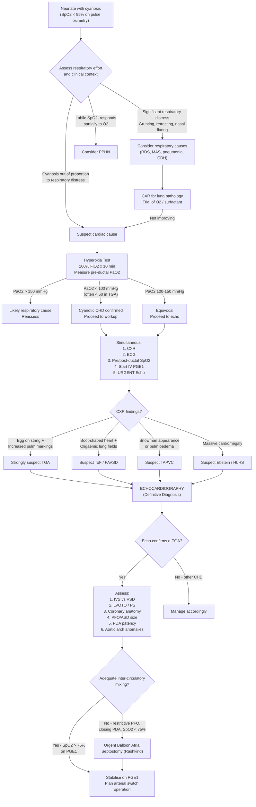

## Diagnostic Criteria, Diagnostic Algorithm, and Investigation Modalities for TGA

### 1. Diagnostic Criteria

TGA does not have formal "diagnostic criteria" in the way that, say, Kawasaki disease or rheumatic fever does. It is a **structural cardiac diagnosis** confirmed by imaging. However, the diagnosis is established through a combination of **clinical suspicion** (based on presentation) and **definitive imaging confirmation**.

#### 1.1 Clinical Diagnostic Criteria (Triggers for Suspicion)

The clinical constellation that should trigger immediate suspicion of TGA in a neonate:

| Criterion | Detail | Pathophysiological Basis |
|---|---|---|
| **1. Early-onset cyanosis** | Within hours to days of birth; out of proportion to respiratory distress | ***Parallel circulations*** [1] — deoxygenated blood recirculates systemically |
| **2. Cyanosis refractory to supplemental oxygen** | Failed hyperoxia test: PaO₂ remains < 100 mmHg (often < 50 mmHg) on 100% FiO₂ | Oxygen improves alveolar PO₂ but cannot fix the structural mixing problem — oxygenated blood stays in the pulmonary circuit |
| **3. Minimal or no respiratory distress** (initially) | "Quiet cyanosis" — the neonate is deeply blue but not grunting/retracting (at least initially) | Lungs are well-ventilated and well-perfused (***high pulmonary blood flow*** [1]); the problem is not gas exchange but circulatory routing |
| **4. Characteristic CXR** | ***"Egg on a string" with narrow mediastinum + increased pulmonary vascular markings*** [2] | AP great vessel relationship + thymic involution; strong LV pumps to PA |
| **5. Loud single S2, no murmur** (in TGA/IVS) | ***Loud and single S2 from anteriorly positioned aortic valve; no murmur in intact ventricular septum*** [2] | No obstruction or shunt to generate turbulence |

#### 1.2 Definitive Diagnosis

> **Echocardiography is the gold standard** for definitive diagnosis of TGA. It demonstrates the ventriculoarterial discordance — the aorta arising from the morphological RV and the PA arising from the morphological LV.

The echocardiographic diagnostic criteria for d-TGA:
1. **Ventriculoarterial discordance**: Aorta connects to the morphological RV; PA connects to the morphological LV
2. **Atrioventricular concordance**: RA connects to morphological RV; LA connects to morphological LV (this distinguishes d-TGA from cc-TGA)
3. **Great artery spatial relationship**: Aorta is anterior and usually rightward of the PA (d-position)
4. **Parallel great arteries**: The two great arteries run in parallel rather than the normal criss-cross/spiral relationship

<Callout title="Why No Formal Criteria Like Kawasaki?">
Kawasaki disease needs clinical criteria because there is no single confirmatory test. TGA is a structural abnormality directly visualised on echocardiography — the anatomy IS the diagnosis. The "criteria" are the anatomical findings on echo. Clinical features and CXR/ECG raise suspicion; echo confirms it.
</Callout>

---

### 2. Diagnostic Algorithm

The diagnostic pathway follows the general approach to the **cyanotic neonate**, ultimately converging on echocardiography for definitive diagnosis.

#### Key Decision Points Explained

**Step 1 — Recognise cyanosis:** Universal newborn pulse oximetry screening (standard in Hong Kong public hospitals) detects SpO₂ < 95%. This is the first trigger.

**Step 2 — Differentiate cardiac vs respiratory:** "Quiet cyanosis" (blue but not distressed) is the hallmark of cardiac cyanosis. Respiratory causes usually have proportionate respiratory distress.

**Step 3 — Hyperoxia test:** The single most important bedside test to confirm cardiac cyanosis.
- Mechanism: In respiratory disease, V/Q mismatch or hypoventilation can be overcome by giving 100% O₂. In structural cardiac disease, the fixed shunt/parallel circulation cannot be overcome by increasing alveolar PO₂.
- **In TGA, PaO₂ typically remains < 50 mmHg** even on 100% FiO₂ because oxygenated pulmonary venous blood recirculates through the lungs and never reaches the sampled pre-ductal artery.

**Step 4 — Start PGE₁ BEFORE echo if cardiac cyanosis is suspected:** Do not wait for echocardiographic confirmation before starting prostaglandin E₁. ***Severe systemic hypoxaemia occurs with closure of the duct*** [2] — maintaining ductal patency is life-saving.

**Step 5 — Echocardiography confirms diagnosis and delineates anatomy:** This is the definitive step. All management decisions (need for balloon septostomy, timing of surgery, surgical approach) depend on the echo findings.

<Callout title="Do NOT Wait for Echo to Start PGE₁" type="error">
In any neonate with suspected duct-dependent cyanotic CHD (failed hyperoxia test), **start IV PGE₁ immediately**. The echo will confirm the specific diagnosis, but delaying PGE₁ while waiting for echo can be fatal. PGE₁ keeps the ductus arteriosus patent, maintaining the critical inter-circulatory mixing site in TGA.
</Callout>

---

### 3. Investigation Modalities — Detailed Findings and Interpretation

#### 3.1 Pulse Oximetry — The First-Line Screening Tool

| Parameter | Finding in TGA | Interpretation |
|---|---|---|
| **Pre-ductal SpO₂** (right hand) | Low (typically 60–85%) | Deoxygenated blood from RV enters aorta; some mixing via PFO/PDA raises SpO₂ above purely venous levels |
| **Post-ductal SpO₂** (either foot) | Usually similar to pre-ductal | Unlike CoA/HLHS (where post-ductal is selectively low), in simple TGA both circuits are equally deoxygenated systemically |
| **Pre-post ductal gradient** | Usually < 3% difference | In TGA with CoA or pHTN: ***reverse differential cyanosis*** (pre-ductal **lower** than post-ductal) [2] |
| **Response to O₂** | Minimal improvement | Parallel circuits — more O₂ to the lungs doesn't help if oxygenated blood can't cross to the systemic circuit |

**Screening protocol in Hong Kong:** Critical congenital heart disease (CCHD) screening uses pulse oximetry at 24–48 hours of life. A positive screen is SpO₂ < 95% in either extremity or > 3% difference between right hand and foot. TGA/IVS is one of the primary targets of this screening programme.

#### 3.2 Hyperoxia Test

| Component | Method | Expected Result in TGA |
|---|---|---|
| **Procedure** | 100% FiO₂ via head box or close-fitting mask for 10 minutes | — |
| **Measurement** | Pre-ductal PaO₂ (right radial arterial blood gas) | **PaO₂ < 50 mmHg** (severe cases) to < 100 mmHg |
| **Interpretation** | PaO₂ < 100 mmHg → cyanotic CHD highly likely | The lungs are fully oxygenating blood (PaO₂ in pulmonary veins may be > 500 mmHg), but this oxygenated blood recirculates to the lungs and does not reach the pre-ductal arterial sample |
| **SpO₂ change** | < 10% increase from baseline | Fixed structural mixing — cannot be overcome by increasing FiO₂ |

**Why does this work?**
- In respiratory disease: V/Q mismatch → supplemental O₂ "floods" even poorly ventilated alveoli → PaO₂ rises significantly (> 150 mmHg)
- In TGA: the problem is routing, not oxygenation. Pulmonary venous blood is excellently oxygenated but returns to the LV and gets pumped back to the PA. The pre-ductal artery samples blood from the RV→aorta circuit, which is deoxygenated. Increasing FiO₂ makes the pulmonary venous blood even more oxygenated, but this barely helps systemic oxygenation because only a tiny fraction crosses via the PFO/PDA

#### 3.3 Chest X-Ray (CXR)

***CXR findings in TGA*** [2]:

| Finding | Description | Pathophysiological Explanation |
|---|---|---|
| ***"Egg on side/string" appearance*** | ***Oval cardiac silhouette with a narrowed upper mediastinum*** | The "egg" = the ovoid heart shape due to RV dilatation (supporting systemic pressure). The "string" = ***narrow mediastinum*** caused by: (1) ***abnormal A/P relationship of the aorta and pulmonary trunk*** — normally side-by-side, in TGA they are stacked front-to-back, producing a narrow shadow on AP film [2]; (2) ***stress-induced thymic involution*** — sick neonates have cortisol-mediated thymic shrinkage [2] |
| ***Increased pulmonary vascular markings*** | Prominent, plethoric lung fields | ***As the stronger LV is supplying the lungs*** [1][2] — the LV (which was the systemic ventricle in utero) pumps forcefully into the pulmonary circulation → increased pulmonary blood flow |
| **Mild-moderate cardiomegaly** | Especially if VSD present | Volume overload from inter-circulatory mixing |
| **Normal or mildly enlarged heart** | In TGA/IVS | Less volume overload when mixing sites are small |

<Callout title="CXR Sensitivity Warning" type="error">
The classic "egg on a string" appearance is **not always present**, especially in the first 24 hours when the thymus hasn't fully involuted. CXR has a sensitivity of only ~60% for TGA. A normal-appearing CXR does NOT exclude TGA. Always proceed to echocardiography if clinical suspicion exists.
</Callout>

**Comparison with other cyanotic CHD CXR appearances:**

| Condition | CXR Silhouette | Pulmonary Vascularity |
|---|---|---|
| **TGA** | Egg on a string, narrow mediastinum | **Increased** |
| **ToF** | Boot-shaped (coeur-en-sabot) [3] | **Decreased** (oligaemic) |
| **PAVSD** | ***Boot-shaped, oligaemic lung fields*** [2] | **Decreased** (± uneven if MAPCAs) |
| **TAPVC (supracardiac)** | Snowman / figure-of-8 | **Increased** (± pulmonary oedema if obstructed) |
| **Ebstein anomaly** | Massive "wall-to-wall" cardiomegaly | Decreased |
| **HLHS** | ***Cardiomegaly with dilated RA/RV*** [2] | Increased or pulmonary congestion |
| **Truncus arteriosus** | Cardiomegaly ± right aortic arch | **Increased** |

#### 3.4 Electrocardiogram (ECG)

***ECG in TGA: typically normal for age*** [2]

| ECG Feature | Finding | Explanation |
|---|---|---|
| **Axis** | Normal neonatal rightward axis | RV dominance is normal in neonates; in TGA the RV remains the systemic ventricle, perpetuating rightward axis |
| **RV dominance** | Tall R waves in V1, dominant R in right precordial leads | This is physiologically normal in neonates (the RV is the dominant ventricle in fetal life). In TGA, RV continues to work at systemic pressure → RVH, but it looks identical to the normal neonatal pattern |
| **P waves** | Normal | Unless associated with large ASD causing RA overload |
| **ST/T changes** | Usually normal | Unlike HLHS (which shows ***ST depression, T wave inversion due to coronary insufficiency*** [2]) |

**Why is this misleading?**
- The ECG of a normal neonate shows right axis deviation and RV predominance (because the RV was the dominant pump in utero)
- In TGA, the RV remains the systemic ventricle at systemic pressure → continues to show RV dominance
- Therefore, the ECG appears **identical to normal** — it cannot distinguish TGA from a normal heart in the neonatal period
- This is precisely why ECG has **low diagnostic utility** for TGA and why reliance on ECG alone is dangerous

**Over time (weeks to months)** in uncorrected TGA:
- RVH becomes more prominent (the RV stays at systemic pressure instead of the normal neonatal regression)
- LVH may develop if there is a large VSD or LVOTO
- Combined ventricular hypertrophy if significant mixing with volume overload

#### 3.5 Echocardiography — The Gold Standard

Echocardiography is the **definitive diagnostic modality**. In the paediatric setting, transthoracic echocardiography (TTE) is performed.

| Echo Assessment | Findings in d-TGA | Clinical Significance |
|---|---|---|
| **Ventriculoarterial connections** | Aorta arises from morphological RV (anterior); PA arises from morphological LV (posterior) | **Diagnostic** — this IS the definition of TGA |
| **Great artery relationship** | Parallel great arteries (rather than normal spiral/criss-cross); aorta anterior and to the right (d-position) | Confirms d-TGA (vs l-TGA where aorta is anterior and left) |
| **Atrial septum** | Assess PFO/ASD size; may show bowing of septum primum (restrictive) | ***Degree of mixing depends on size of interatrial communication*** [2]; restrictive PFO = inadequate mixing = urgent septostomy needed |
| **Ventricular septum** | Intact (TGA/IVS) or VSD (location, size) | Determines haemodynamic subtype; large VSD = better mixing but HF risk |
| **LVOT / Subpulmonary region** | Assess for LVOTO / subpulmonary stenosis | If present, changes surgical planning; may preclude simple ASO |
| **PDA patency** | Open, restrictive, or closed | Critical mixing site; guides PGE₁ management |
| **Coronary artery anatomy** | Origin, course, branching pattern (Yacoub classification) | ***Critical for arterial switch operation — coronary transfer is the key surgical step***; anomalous patterns (intramural, single coronary) increase complexity [2] |
| **Aortic arch** | Assess for coarctation, hypoplasia, interruption | Associated anomalies; TGA + CoA = more complex management |
| **Ventricular function** | RV function (systemic ventricle), LV function | Baseline assessment; LV "preparedness" affects surgical timing (LV must retain enough mass to support systemic circulation post-ASO) |
| **Additional anomalies** | Mitral/tricuspid valve abnormalities, additional VSDs | Complete anatomical delineation for surgical planning |

**Key echo views for TGA diagnosis:**
- **Parasternal long axis (PLAX):** In the normal heart, the posterior great artery (PA) bifurcates. In TGA, the posterior great artery is the PA arising from the LV, while the anterior great artery (aorta) gives rise to head and neck vessels.
- **Parasternal short axis (PSAX):** Normally shows the "sausage and circle" (RV wrapping around the aorta). In TGA, both great arteries appear as circles side-by-side ("double barrel" or "shotgun" sign) because they run in parallel rather than spiralling.
- **Subcostal views:** Best for assessing atrial septum (PFO size, direction of shunting) and ventricular septum (VSD).
- **Suprasternal view:** Aortic arch assessment for CoA.

#### 3.6 Arterial Blood Gas (ABG)

| Parameter | Expected Finding | Explanation |
|---|---|---|
| **PaO₂** | Severely low (25–50 mmHg in TGA/IVS) | Parallel circuits with poor mixing → systemic blood is nearly fully deoxygenated |
| **SaO₂** | 50–85% (depends on mixing) | Corresponds to low PaO₂ on the oxygen-haemoglobin dissociation curve |
| **pH** | Low (metabolic acidosis) | Tissue hypoxia → anaerobic metabolism → lactic acid production |
| **Lactate** | Elevated | Direct marker of tissue hypoperfusion/hypoxia |
| **PaCO₂** | Normal or low | Lungs are well-ventilated; may be low from tachypnoea (respiratory compensation for metabolic acidosis) |
| **Base excess** | Negative (base deficit) | Consumed bicarbonate buffering lactic acid |

**The ABG is not diagnostic of TGA specifically** but confirms the severity of hypoxaemia and guides resuscitation. A pre-ductal PaO₂ that doesn't rise above 100 mmHg on 100% FiO₂ essentially rules out primary respiratory causes.

#### 3.7 Cardiac Catheterisation

In current practice, cardiac catheterisation is **not routinely needed for diagnosis** of TGA (echo is sufficient). However, it has two specific roles:

| Role | Indication | Procedure |
|---|---|---|
| ***Balloon atrial septostomy (Rashkind procedure)*** | ***Inadequate inter-circulatory mixing despite PGE₁*** [1] — i.e., SpO₂ remains < 75% despite PDA being open; restrictive PFO on echo | A balloon catheter is advanced from femoral vein → IVC → RA → across PFO → LA. Balloon inflated and pulled sharply back across the atrial septum, tearing the septum primum → creates a large ASD for unrestricted mixing |
| **Haemodynamic assessment** | Complex anatomy (e.g., TGA with VSD + multiple associated anomalies) where echo is insufficient | Oximetry run and pressure measurements; may include angiography |

***Balloon atrial septostomy*** [1] is a therapeutic rather than purely diagnostic procedure, but it is performed in the catheterisation lab (or sometimes at bedside under echo guidance in the NICU).

#### 3.8 Cardiac MRI

| Role | Details |
|---|---|
| **Preoperative (rarely needed acutely)** | Detailed coronary anatomy if echo is suboptimal; aortic arch anatomy; quantification of ventricular volumes |
| **Postoperative follow-up** | Assessment of neo-aortic root dilatation, anastomotic stenosis, coronary patency, ventricular function after arterial switch operation |
| **When to use** | Not a first-line neonatal investigation (sedation challenges, time-consuming); reserved for complex cases or long-term follow-up |

#### 3.9 Fetal Echocardiography (Prenatal Diagnosis)

| Aspect | Detail |
|---|---|
| **Screening window** | 18–22 week anomaly scan |
| **Detection rate** | Historically ~50% for TGA (lower than other major CHDs) because the **four-chamber view is normal** in TGA — the atria and ventricles are structurally normal |
| **Key views** | **Outflow tract views** (three-vessel-trachea view, long-axis outflow views) are essential to detect the parallel great arteries |
| **Benefit of prenatal detection** | Planned delivery at a tertiary centre with paediatric cardiology and cardiac surgery → immediate postnatal PGE₁ → significantly improved outcomes; avoids the catastrophic scenario of undiagnosed TGA with PDA closure at a peripheral hospital |

<Callout title="Why is TGA Missed on Prenatal Screening?" type="error">
The four-chamber view — the standard screening view at the 18–22 week scan — appears **completely normal** in TGA because the atria and ventricles are normally formed. TGA is only detected when outflow tract views are performed, showing the parallel (non-crossing) great arteries. This is why prenatal detection rates for TGA have historically lagged behind conditions like AVSD or HLHS, which have obvious four-chamber abnormalities. The three-vessel-trachea view is now mandated in many screening guidelines specifically to improve TGA detection.
</Callout>

---

### 4. Summary Table: Investigation Findings in TGA

| Investigation | Key Findings | Sensitivity/Role |
|---|---|---|
| **Pulse oximetry** | SpO₂ < 90%, minimal pre-post ductal gradient, unresponsive to O₂ | Screening — high sensitivity for CCHD |
| **Hyperoxia test** | PaO₂ < 50–100 mmHg on 100% FiO₂ | Confirms cardiac cause of cyanosis |
| **CXR** | ***"Egg on side" + narrow mediastinum + increased pulmonary vascular markings*** [2] | Suggestive but ~60% sensitivity; normal CXR does not exclude TGA |
| **ECG** | ***Typically normal for age*** [2] | Low utility for diagnosis; misleadingly normal |
| **Echocardiography** | Ventriculoarterial discordance; parallel great arteries; delineates all associated anatomy | **Gold standard — definitive diagnosis** |
| **ABG** | Severe hypoxaemia, metabolic acidosis, elevated lactate | Confirms severity; supports hyperoxia test |
| **Cardiac catheterisation** | ***Balloon atrial septostomy*** [1]; rarely for diagnosis in the modern era | Therapeutic (Rashkind) more than diagnostic |
| **Cardiac MRI** | Coronary anatomy, ventricular volumes, arch anatomy | Complex cases; postoperative follow-up |
| **Fetal echo** | Parallel outflow tracts; normal four-chamber view | Prenatal diagnosis — allows planned delivery |

---

<Callout title="High Yield Summary">

**Diagnostic approach to TGA:**

1. **Suspect** TGA in any neonate with early-onset cyanosis that is refractory to supplemental oxygen, particularly if "quiet cyanosis" (blue without respiratory distress).

2. **Hyperoxia test**: PaO₂ remains < 100 mmHg (often < 50) on 100% FiO₂ → confirms cyanotic CHD.

3. **Start PGE₁ immediately** — do NOT wait for echo.

4. **CXR** provides supportive evidence: ***"Egg on a string" + increased pulmonary vascular markings*** [2]. But a normal CXR does not exclude TGA.

5. **ECG** is ***typically normal for age*** [2] — misleadingly normal; cannot diagnose or exclude TGA.

6. **Echocardiography** is the **gold standard**: confirms ventriculoarterial discordance, delineates associated defects (VSD, LVOTO, CoA), assesses mixing adequacy (PFO size, PDA status), and maps coronary anatomy for surgical planning.

7. If mixing is inadequate despite PGE₁ → ***urgent balloon atrial septostomy (Rashkind procedure)*** [1] to create an ASD.

8. Fetal echo can detect TGA prenatally but requires **outflow tract views** (four-chamber view is normal in TGA).
</Callout>

---

<ActiveRecallQuiz
  title="Active Recall - Diagnosis and Investigations for TGA"
  items={[
    {
      question: "A neonate has SpO2 of 70% at 6 hours of life. You perform the hyperoxia test and the PaO2 is 40 mmHg on 100% FiO2. What does this tell you, and what is your immediate next step before obtaining an echo?",
      markscheme: "PaO2 under 100 mmHg on 100% FiO2 confirms a cyanotic congenital heart disease (fixed structural shunt or parallel circulation cannot be overcome by supplemental oxygen). Immediate next step: start IV prostaglandin E1 to maintain ductal patency and ensure inter-circulatory mixing. Do NOT wait for echocardiographic confirmation.",
    },
    {
      question: "Describe the classic CXR findings in TGA and explain the pathophysiology behind each finding.",
      markscheme: "Egg on a string/side: oval cardiac silhouette with narrow upper mediastinum. Narrow mediastinum due to (1) AP stacking of great arteries (aorta anterior, PA posterior rather than side-by-side) and (2) stress-induced thymic involution. Increased pulmonary vascular markings: the strong LV (which was the systemic ventricle in utero) pumps into the PA, causing high pulmonary blood flow.",
    },
    {
      question: "Why is the ECG typically normal for age in a neonate with TGA? How can this be clinically misleading?",
      markscheme: "In normal neonates, the ECG shows right axis deviation and RV dominance because the RV was the dominant ventricle in fetal life. In TGA, the RV remains the systemic ventricle (pumps to aorta) at systemic pressure, so RV dominance persists. The ECG therefore looks identical to a normal neonatal ECG. This is misleading because a normal ECG may falsely reassure clinicians, causing them to overlook a serious cyanotic CHD.",
    },
    {
      question: "What echocardiographic findings confirm the diagnosis of d-TGA? Name five specific assessments the echocardiographer must make for surgical planning.",
      markscheme: "Diagnosis confirmed by: ventriculoarterial discordance (aorta from RV, PA from LV) with atrioventricular concordance; parallel great arteries with aorta anterior and rightward. Five assessments for surgical planning: (1) VSD presence, location and size; (2) coronary artery anatomy; (3) PFO/ASD size (mixing adequacy); (4) PDA patency and size; (5) LVOT/subpulmonary stenosis; also aortic arch anatomy.",
    },
    {
      question: "Why is TGA commonly missed on prenatal ultrasound screening? What specific view is needed to detect it?",
      markscheme: "The four-chamber view, which is the standard screening view at the anomaly scan, appears completely normal in TGA because the atria and ventricles are structurally normal. TGA is only detected when outflow tract views are obtained (three-vessel-trachea view or long-axis outflow views), which show the parallel non-crossing great arteries. This is why outflow tract views are now mandated in many screening protocols.",
    },
    {
      question: "What is the Rashkind procedure? When is it indicated in TGA, and what does it achieve?",
      markscheme: "Balloon atrial septostomy. A balloon catheter is passed from femoral vein through IVC to RA, across the PFO into LA, inflated, and pulled sharply back to tear the septum primum, creating a large ASD. Indicated when inter-circulatory mixing remains inadequate despite PGE1 (SpO2 remains under 75%, restrictive PFO on echo). It creates an unrestricted atrial-level communication allowing bidirectional mixing of oxygenated and deoxygenated blood between the parallel circuits.",
    },
  ]}
/>

## References

[1] Lecture slides: GC 147. Heart failure and cyanosis in children acyanotic and cyanotic congenital heart disease - Part 2.pdf (slides 23–27)
[2] Senior notes: Adrian Lui Pediatrics.pdf (p219–220, p228)
[3] Senior notes: Ryan Ho Cardiology.pdf (p184, p188–190)
