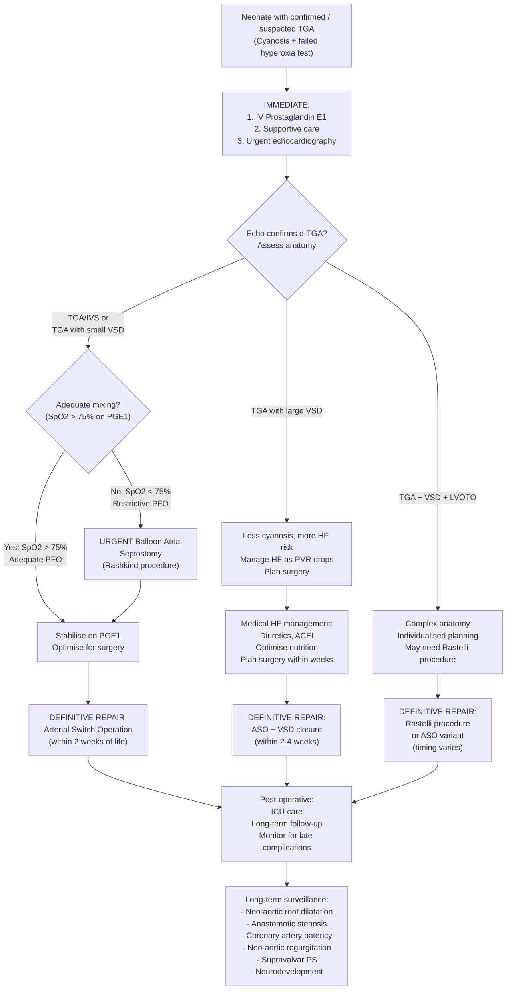

## Management Algorithm and Treatment Modalities for TGA

### Management Overview — The Therapeutic Logic

Let me walk you through the management of TGA from first principles. The entire management strategy is built on one concept: **TGA creates two parallel circulations that are incompatible with life unless inter-circulatory mixing is established and then definitively corrected.**

The management therefore follows three phases:

1. **Immediate stabilisation** — Maintain/create mixing sites (PGE₁, balloon atrial septostomy)
2. **Bridging care** — Optimise the neonate's condition for surgery
3. **Definitive surgical repair** — Restore the circulation to a series circuit

---

### Management Algorithm

---

### Phase 1: Immediate Stabilisation (Neonatal Period — Hours of Life)

#### 1.1 Intravenous Prostaglandin E₁ (PGE₁ / Alprostadil)

This is the **single most important initial intervention** and must be started as soon as cyanotic CHD is suspected — before echocardiographic confirmation.

| Aspect | Detail |
|---|---|
| **Drug** | Prostaglandin E₁ (Alprostadil) — "prosta-glandin" = from the prostate gland (where it was first isolated), but it acts on smooth muscle everywhere |
| **Mechanism** | PGE₁ relaxes the smooth muscle of the ductus arteriosus wall, reversing the physiological ductal constriction triggered by rising PaO₂ and falling PGE₂ at birth → **maintains ductal patency** → preserves the PDA as a critical ***site for inter-circulatory mixing*** [1] |
| **Dose** | Start at **0.01–0.05 mcg/kg/min** IV continuous infusion. Can increase to 0.1 mcg/kg/min if inadequate response. Once duct is open and SpO₂ stable, titrate down to lowest effective dose (often 0.01–0.02 mcg/kg/min) |
| **Route** | Central or peripheral IV; ideally via a dedicated line |
| **Onset** | Minutes to hours (faster if duct has not yet fully closed; slower if duct has already constricted significantly) |

**Why does PGE₁ work in TGA?**
- In TGA, the PDA connects the aorta (from RV, carrying deoxygenated blood) with the PA (from LV, carrying oxygenated blood)
- A patent ductus allows bidirectional mixing between these two parallel circuits
- Keeping the duct open maintains at least some oxygenated blood crossing into the systemic circulation

**Side effects of PGE₁ — must know:**

| Side Effect | Mechanism | Clinical Relevance |
|---|---|---|
| **Apnoea** (~10–12%) | PGE₁ directly depresses the brainstem respiratory centre (immature neonatal respiratory drive is particularly susceptible) | **Must be prepared for intubation** before starting PGE₁. Apnoea monitoring mandatory. Higher risk in preterm and low-birth-weight neonates |
| **Hypotension** | Vasodilatory effect of PGE₁ on systemic arterioles | May need volume resuscitation or inotropic support |
| **Fever / temperature instability** | PGE₁ is a pyrogen (acts on the hypothalamic thermoregulatory centre like endogenous prostaglandins) | Monitor temperature; do not mistake for sepsis |
| **Jitteriness / seizure-like activity** | CNS excitability (especially at higher doses) | Reduce dose; consider neurological monitoring |
| **Peripheral oedema** | Capillary leak from vasodilation | Usually mild, self-limiting |
| **Gastric outlet obstruction** (with prolonged use > 5 days) | Antral mucosal hyperplasia from chronic PGE₁ stimulation of gastric epithelium | Relevant if PGE₁ is needed for extended periods before surgery |

<Callout title="PGE₁: Be Ready to Intubate" type="error">
The most dangerous acute side effect of PGE₁ is **apnoea**. Always have intubation equipment at the bedside and be prepared to secure the airway before starting the infusion. This is especially important during inter-hospital transport of a cyanotic neonate on PGE₁. In many protocols, elective intubation is performed before transport.
</Callout>

**Contraindications to PGE₁ (relative):**
- None absolute in the acute setting of duct-dependent cyanotic CHD — the benefit overwhelmingly outweighs risks
- **Caution** in obstructed TAPVC (PGE₁ may worsen pulmonary oedema by increasing pulmonary blood flow into an obstructed circuit) — this is why echocardiography should be obtained as soon as possible

#### 1.2 General Supportive Care

| Measure | Rationale |
|---|---|
| **Airway and ventilation** | Intubate if apnoeic from PGE₁ or if in cardiovascular collapse. Avoid hyperventilation (low PaCO₂ → pulmonary vasodilation → ↑ pulmonary blood flow → may paradoxically ↓ mixing across the duct by reducing the pressure gradient) |
| **Vascular access** | Secure IV access (preferably central via UVC/UVC in neonates) for PGE₁ and resuscitation fluids |
| **Volume resuscitation** | Normal saline 10 mL/kg boluses if hypotensive; cautious with large volumes to avoid pulmonary oedema |
| **Correction of metabolic acidosis** | Sodium bicarbonate 1–2 mEq/kg IV if pH < 7.1 and lactate is rising; correcting acidosis improves myocardial function and PVR |
| **Inotropic support** | Dopamine (5–10 mcg/kg/min) or dobutamine (5–10 mcg/kg/min) if shock/poor perfusion despite volume. Avoid high-dose noradrenaline (↑SVR → theoretically could ↑ mixing but also ↑ myocardial O₂ demand) |
| **Temperature control** | Maintain normothermia — hypothermia ↑ O₂ consumption and ↑ PVR; hyperthermia (from PGE₁) also ↑ metabolic demand |
| **Glucose monitoring** | Stressed neonates are prone to hypoglycaemia; maintain blood glucose > 2.6 mmol/L |
| **Minimal handling** | Reduce O₂ consumption; cluster cares |
| **Oxygen supplementation** | Judicious — enough to maintain SpO₂ > 75% but excessive O₂ may be counterproductive (↑PaO₂ → pulmonary vasodilation → more blood pools in pulmonary circuit → less crosses to systemic side; also promotes ductal closure). Target SpO₂ 75–85% in TGA before surgical repair |

<Callout title="Oxygen Management in TGA" type="idea">
Unlike respiratory causes of cyanosis where you give high-flow O₂, in TGA you should use **supplemental oxygen cautiously**. High FiO₂ promotes ductal closure (the opposite of what you want) and may paradoxically worsen the balance of flow between the two circuits. Target SpO₂ 75–85% — this is adequate for tissue oxygen delivery in the short term while awaiting definitive intervention.
</Callout>

#### 1.3 Balloon Atrial Septostomy (Rashkind Procedure)

***Balloon atrial septostomy*** [1] is the key interventional procedure to improve mixing when PGE₁ alone is insufficient.

| Aspect | Detail |
|---|---|
| **Full name** | Rashkind balloon atrial septostomy — named after William Rashkind who developed it in 1966 |
| **Indication** | ***Inadequate inter-circulatory mixing despite PGE₁***: SpO₂ remains < 75% despite open ductus; restrictive PFO on echocardiography; severe metabolic acidosis |
| **Procedure** | A **balloon-tipped catheter** is advanced from the femoral vein → IVC → RA → across the PFO → into the LA. The balloon is inflated with saline and then **pulled sharply back** across the atrial septum, **tearing the septum primum** → creates a large, non-restrictive ASD |
| **Setting** | Cardiac catheterisation laboratory OR at the bedside in NICU under echocardiographic guidance (increasingly common — avoids the need to transport a critically ill neonate) |
| **Effect** | Immediate ↑ inter-circulatory mixing at the atrial level → SpO₂ typically rises by 10–20% → stabilises the neonate for planned surgical repair |
| **Complications** | Vascular injury (femoral vein/IVC), arrhythmia (from catheter manipulation), cardiac perforation (rare), inadequate septostomy requiring repeat procedure or blade septostomy |
| **Age limitation** | Most effective in neonates < 1 month — the atrial septum is thin and easily torn. In older infants (> 1 month), the septum becomes thicker → may need **blade atrial septostomy** (Park blade) or **trans-septal stenting** |

***Balloon atrial septostomy*** is illustrated in the lecture slides [1] showing the catheter across the atrial septum, balloon inflation in the LA, and sharp pullback into the RA.

**Why does atrial septostomy improve oxygenation?**
- It creates a large ASD → bidirectional shunting at the atrial level
- Oxygenated blood from pulmonary veins → LA → crosses ASD → RA → RV → aorta → body
- Deoxygenated blood from systemic veins → RA → crosses ASD → LA → LV → PA → lungs
- The net effect is **mixing** — both circuits now share blood, improving systemic oxygen saturation

---

### Phase 2: Bridging Care (Days to 2 Weeks)

Once the neonate is stabilised with PGE₁ ± balloon septostomy:

| Management | Details |
|---|---|
| **Continue PGE₁** | Titrate to the lowest effective dose; if good septostomy result with SpO₂ > 80%, PGE₁ may sometimes be weaned |
| **Nutritional support** | Nasogastric/orogastric feeds; high-calorie formula (aim 120–150 kcal/kg/day) — these neonates have ↑ metabolic demands from the cardiac condition |
| **Heart failure management** (if TGA with VSD) | Diuretics (furosemide 1–2 mg/kg/day), ± digoxin, ACEI (captopril 0.1–0.5 mg/kg/dose TDS) — standard ***medical therapy of heart failure: diuretics, digoxin, ACEI, carvedilol*** [5] |
| **Infection surveillance** | Central line care; blood cultures if febrile (PGE₁ causes fever, but infection must be excluded) |
| **Detailed echocardiography** | Complete anatomical assessment: coronary anatomy (crucial for ASO planning), VSD, LVOTO, aortic arch |
| **Pre-operative workup** | Blood group, cross-match, coagulation profile, renal function, cranial ultrasound (assess for hypoxic brain injury) |
| **Family counselling** | Explain the condition, the need for surgery, expected outcomes, risks. In Hong Kong, culturally sensitive counselling is essential — parents may want to involve extended family in decision-making. Provide written information in Chinese and English. |

<Callout title="The 2-Week Window" type="error">
***Arterial switch operation is usually done within 2 weeks of life*** [2]. ***Delay is associated with increased morbidity because the LV regresses as PVR falls*** [2]. 

**Why?** In TGA, the LV pumps against the low-resistance pulmonary circulation. As PVR falls in the first weeks of life, the LV's workload decreases → LV muscle mass regresses → the LV "de-trains." After ASO, the LV must support the systemic circulation (high resistance). If the LV has already regressed too much, it cannot cope → acute LV failure → death.

In TGA/IVS, ASO should ideally be done **within the first 2 weeks**. Beyond 3–4 weeks, the LV may be too regressed. In TGA with large VSD, the VSD maintains high LV pressure (the VSD exposes the LV to systemic RV pressure) → LV doesn't regress → ASO can be done slightly later (up to ~8 weeks) but should still not be delayed unnecessarily.
</Callout>

#### LV "Retraining" — When ASO Is Delayed

If a neonate with TGA/IVS presents late (> 3–4 weeks) and the LV has already regressed:
- **Rapid two-stage approach**: First, PA banding (a surgical band placed around the PA to increase LV afterload → forces the LV to hypertrophy/retrain) ± modified Blalock-Taussig shunt (to maintain pulmonary blood flow). After 1–2 weeks of LV retraining, proceed to ASO.
- This is higher risk than primary neonatal ASO and illustrates why **early diagnosis and surgery are critical**

---

### Phase 3: Definitive Surgical Repair

#### 3.1 Arterial Switch Operation (ASO / Jatene Procedure) — Surgery of Choice

***Arterial switch operation (anatomic correction, surgery of choice)*** [1]

***Arterial switch operation performed in early neonatal period*** [1]

| Aspect | Detail |
|---|---|
| **Name** | Jatene procedure (named after Adib Jatene, the Brazilian cardiac surgeon who pioneered it in 1975). "Arterial switch" = the great arteries are physically switched to their correct ventricles |
| **Type of correction** | ***Anatomic correction*** [1] — restores the normal anatomy where the LV supports the aorta and the RV supports the PA. This is superior to "physiologic correction" (venous switch) because the LV is the ventricle designed for systemic afterload |
| **Timing** | ***Usually done ≤2 weeks of life*** [2]; ***delay is associated with increased morbidity due to LV regression as PVR drops*** [2] |

**Procedure — step by step:**

1. **Cardiopulmonary bypass** with deep hypothermic circulatory arrest or low-flow bypass
2. ***Transection of both great arteries*** above the semilunar valves [2]
3. **Excision of the coronary artery buttons** — the coronary ostia are carefully excised from the old aortic root (which will become the neo-pulmonary root) with a cuff of surrounding aortic wall tissue
4. ***Re-implantation of the coronary arteries*** at the neo-aortic root [2] — the coronary buttons are sutured into corresponding positions on the old pulmonary root (which will become the neo-aortic root). This is the most technically demanding step.
5. ***Re-anastomosis of the great arteries*** [2]:
   - The PA (originally from LV) is connected to the old aortic root → becomes the neo-aorta → ***LV supports the neo-aorta*** [2] (systemic circulation)
   - The aorta (originally from RV) is connected to the old PA root → becomes the neo-PA → ***RV supports the neo-PA*** [2] (pulmonary circulation)
6. **LeCompte manoeuvre** — the branch pulmonary arteries are brought anterior to the aorta to prevent compression. Named after Yves LeCompte.
7. VSD closure (if present) — using a patch
8. ASD closure — close the septostomy/ASD created earlier

**Outcome:**

***Dramatic decrease in mortality from ~90% (unoperated) to < 5% (operated) with encouraging long-term outcome*** [2]

| Metric | Data |
|---|---|
| Operative mortality | < 3–5% in experienced centres |
| 20-year survival | > 95% |
| Freedom from re-operation at 20 years | ~75–85% |
| Neurodevelopmental outcomes | Generally good; some studies show subtle deficits in executive function (likely related to pre-operative hypoxia and CPB) |

**Indications for ASO:**

| TGA Subtype | Indication | Timing |
|---|---|---|
| TGA/IVS | Primary ASO | Within first 2 weeks |
| TGA + VSD | ASO + VSD closure | Within first 2–4 weeks (can be slightly later because VSD maintains LV pressure) |
| TGA + VSD + mild LVOTO | ASO + VSD closure ± LVOTO resection | Individualised |
| Late-presenting TGA/IVS with regressed LV | Two-stage: PA banding first → then ASO | PA banding ASAP, ASO after 1–2 weeks of LV retraining |

**Contraindications / Situations where ASO may not be suitable:**

| Scenario | Reason | Alternative |
|---|---|---|
| Significant fixed LVOTO (e.g., tunnel-type subpulmonary stenosis) | The LVOTO would become sub-aortic stenosis after switch → systemic outflow obstruction | **Rastelli procedure** |
| Severely regressed LV (late presentation > 8 weeks, TGA/IVS) without successful PA banding retraining | LV cannot support systemic afterload after switch → acute LV failure | Consider venous switch (atrial switch) or cardiac transplantation (very rare) |
| Unfavourable coronary anatomy (some patterns) | Increases surgical complexity but is rarely an absolute contraindication in experienced hands | Modified coronary transfer techniques |

#### 3.2 Rastelli Procedure — For TGA + VSD + Significant LVOTO

| Aspect | Detail |
|---|---|
| **Indication** | TGA with VSD and significant LVOTO (subpulmonary stenosis). In this anatomy, the LVOTO would become sub-aortic stenosis after ASO — unacceptable. |
| **Procedure** | (1) VSD is closed with a **patch** that directs LV outflow **through the VSD into the aorta** (the native aorta arising from the RV is now connected to the LV via the VSD tunnel). (2) The main PA is divided from the LV, and an **RV-to-PA conduit** (valved homograft or synthetic conduit) is placed to establish RV → PA continuity. |
| **Timing** | Usually performed at 1–2 years of age (needs to be large enough for the conduit; earlier if symptomatic) |
| **Key limitation** | The RV-to-PA conduit does **not grow** with the child → requires serial conduit replacements throughout childhood and adolescence (typically every 5–10 years) |
| **Outcome** | Good long-term survival (> 90% at 10 years) but multiple re-operations for conduit replacement are expected |

#### 3.3 Nikaidoh Procedure (Aortic Root Translocation) — Alternative to Rastelli

- Newer technique for TGA + VSD + LVOTO
- Involves translocation of the entire aortic root (with coronaries) to the LV position, plus LVOTO relief and RV-PA conduit
- Potentially better long-term results than Rastelli (less risk of LVOTO recurrence)
- Not yet universally adopted

#### 3.4 Venous Switch Operations — Now Obsolete for Primary Repair

***Previous venous switch operations (Mustard / Senning operations)*** [1]

***Venous switch operation (physiologic correction, obsolete)*** [1]

| Aspect | Mustard Procedure | Senning Procedure |
|---|---|---|
| **Era** | Developed in the 1960s–80s | Same era |
| **Material** | ***Pericardium and synthetic material for intra-atrial baffles*** [2] | ***Atrial septal tissue for intra-atrial baffles*** [2] |
| **Mechanism** | ***Direction of systemic venous blood to the LV and pulmonary venous blood to the RV by intra-atrial baffles*** [2] — i.e., the baffles redirect blood flow at the atrial level so that deoxygenated blood (from systemic veins) goes to the LV → PA (lungs), and oxygenated blood (from pulmonary veins) goes to the RV → aorta (body) |
| **Type of correction** | ***Physiologic correction only*** [2] — the blood flow is corrected (deoxygenated goes to lungs, oxygenated goes to body) but the **RV remains the systemic ventricle** |
| **Why obsolete?** | ***Previous surgical technique does not allow re-implantation of coronary arteries*** [2]. The RV remains the systemic ventricle → it was never designed for this → progressive RV failure over decades. Plus the atrial baffles cause numerous complications. |

***Late complications in adults are common*** [2]:

| Complication | Mechanism |
|---|---|
| ***Atrial arrhythmias*** | Extensive atrial surgery → scar-related re-entrant circuits → atrial flutter, atrial fibrillation, sinus node dysfunction (sick sinus syndrome); incidence increases with age (> 50% by 20 years post-op) |
| ***Baffle obstruction*** | Fibrosis/calcification of the intra-atrial baffle → obstruction of systemic venous return (SVC/IVC) or pulmonary venous return → ***systemic or venous congestion*** [2] |
| ***Baffle leak*** | Dehiscence or fenestration of the baffle → inter-atrial shunting → cyanosis (if R-to-L) or volume overload (if L-to-R) |
| ***RV (systemic ventricle) dysfunction*** | The morphological RV was never designed to sustain systemic afterload for decades → progressive RV dilatation and failure; this is the most important long-term problem and the main reason these patients eventually need heart transplantation |
| Tricuspid regurgitation | The tricuspid valve is the AV valve of the systemic RV → it dilates and becomes regurgitant under chronic systemic pressure |
| Sudden cardiac death | From arrhythmias or RV failure |

<Callout title="Why Arterial Switch Replaced Venous Switch">
The fundamental problem with venous switch operations (Mustard/Senning) is that they leave the **RV as the systemic ventricle**. The RV is a thin-walled, crescentic chamber designed for the low-pressure pulmonary circuit. When forced to pump against systemic resistance for decades, it inevitably fails. The arterial switch operation corrects this by restoring the **LV as the systemic ventricle** — an anatomic correction rather than merely a physiologic one. This is why ASO has become the ***surgery of choice*** [1] and venous switch is ***obsolete*** [1].
</Callout>

> **Exam relevance:** You will encounter adults who had Mustard/Senning operations as children in the 1960s–80s. These patients present with **atrial arrhythmias, baffle complications, and systemic RV failure**. Recognising this cohort is important for internal medicine and cardiology exams as well.

---

### Phase 4: Post-operative and Long-term Follow-up

#### 4.1 Early Post-operative Care (ICU)

| Issue | Management |
|---|---|
| **Haemodynamic monitoring** | Arterial line, CVP, LA line (if placed intra-op), SpO₂. Target SpO₂ > 95% (now in a series circuit!) |
| **Low cardiac output syndrome** | Common in first 6–12 hours post-CPB. Inotropes (milrinone preferred — "ino-dilator" → improves CO while reducing afterload; dose 0.25–0.75 mcg/kg/min). Volume if preload-dependent. |
| **Coronary ischaemia** | The transferred coronary arteries may kink, stretch, or have technical issues → ST changes, arrhythmia, regional wall motion abnormality on echo → may need urgent re-exploration |
| **Arrhythmias** | Junctional ectopic tachycardia (JET) is the most common post-operative arrhythmia in paediatric cardiac surgery. Manage with cooling, amiodarone, temporary pacing |
| **Bleeding** | Chest drain output monitoring; FFP, platelets, cryoprecipitate as needed; surgical re-exploration if > 10 mL/kg/hr |
| **Ventilator management** | Usually extubated within 24–72 hours if uncomplicated |
| **Nutrition** | Early enteral feeds when haemodynamically stable; NG initially, transition to oral |

#### 4.2 Long-term Complications After ASO

***Late complications: stenosis at anastomotic/reimplanted sites, neo-aortic dilatation ± regurgitation*** [2]

| Complication | Mechanism | Surveillance | Management |
|---|---|---|---|
| **Supravalvar pulmonary stenosis (neo-PS)** | Most common late complication (~5–10%); suture line fibrosis at the PA anastomosis + LeCompte manoeuvre may cause branch PA distortion | Echo at regular intervals; cardiac MRI if needed | Balloon angioplasty ± stenting of branch PAs; surgical re-intervention if severe |
| **Neo-aortic root dilatation** | The original pulmonary root (now functioning as the neo-aortic root) was designed for low pressure → gradually dilates under systemic pressure | Echo measurement of neo-aortic root z-scores | Usually mild and well-tolerated; rarely requires surgery |
| **Neo-aortic regurgitation** | Accompanies root dilatation; the old pulmonary valve leaflets may not coapt perfectly under systemic pressure | Echo; severity grading | Mild: surveillance. Moderate-severe: may eventually need neo-aortic valve repair/replacement |
| **Coronary artery stenosis/occlusion** | Technical issues with coronary re-implantation → intimal hyperplasia or kinking → myocardial ischaemia | Exercise stress testing, myocardial perfusion imaging, coronary CT angiography | PCI or surgical re-intervention if symptomatic |
| ***Stenosis at anastomotic/reimplanted sites*** | Scar tissue at suture lines | Routine echo | Catheter intervention or surgical revision |
| **Neurodevelopmental outcomes** | Pre-operative hypoxia + cardiopulmonary bypass → subtle deficits in executive function, attention, motor skills in some children | Neurodevelopmental screening at 1, 2, 5 years | Early intervention programmes; educational support |

#### 4.3 Follow-up Schedule (Typical Protocol)

| Timing | Assessment |
|---|---|
| **1–2 weeks post-discharge** | Clinical review, wound check, echo |
| **3 months** | Echo, ECG, weight/growth check |
| **6 months** | Echo, growth, feeding, developmental screening |
| **Annually** | Echo, ECG, growth, developmental milestones |
| **Every 3–5 years** | Cardiac MRI (for detailed assessment of neo-aortic root, ventricular function, coronary patency), exercise stress test |
| **Adolescence** | Transition planning to adult congenital heart disease (ACHD) service |

---

### Summary of Surgical Options by TGA Subtype

| TGA Subtype | Preferred Operation | Key Points |
|---|---|---|
| **TGA/IVS** | ***Arterial switch operation (ASO)*** [1] | ***Within ≤2 weeks*** [2]; coronary transfer is the critical step |
| **TGA + VSD** | ASO + VSD patch closure | Slightly more time (VSD maintains LV pressure) but still within first weeks |
| **TGA + VSD + significant LVOTO** | Rastelli procedure (or Nikaidoh) | LV outflow tunnelled through VSD to aorta; RV-to-PA conduit; timing ~1–2 years |
| **Late-presenting TGA/IVS with regressed LV** | PA banding → ASO (two-stage) | Higher risk; LV retraining needed |
| **Historical (pre-1990s patients)** | ***Mustard or Senning (venous switch) — obsolete*** [1] | These patients present as adults with RV dysfunction, arrhythmias, baffle complications |

---

### Management of Heart Failure in TGA (Applicable to TGA with Large VSD)

***Management of paediatric heart failure*** [5]:

1. ***Identification of the cause and precipitating factors*** [5]
2. ***Tackling of precipitating factors*** [5] (e.g., infection, arrhythmias, electrolyte disturbances)
3. ***General supportive management*** [5]:
   - Bed rest with elevation of head
   - **Nutritional support**: high caloric diet (120–150 kcal/kg/day) due to ↑ metabolic demand [2]
   - **Fluid restriction** (typically 75–80% of maintenance)
   - **O₂**: cautious (see earlier note on O₂ in TGA)
4. ***Medical therapy of heart failure: diuretics, digoxin, ACEI, carvedilol*** [5]:
   - **Diuretics**: Furosemide 1–2 mg/kg/day (loop diuretic → ↓ preload → ↓ pulmonary congestion); spironolactone 1–2 mg/kg/day (K⁺-sparing + neurohormonal blockade)
   - **ACEI**: Captopril 0.1–0.5 mg/kg/dose TDS or enalapril 0.1 mg/kg/day (↓ afterload → ↓ SVR → facilitates forward flow; also ↓ neurohormonal activation)
   - **Digoxin**: 5–10 mcg/kg/day (mild inotrope + rate control; seldom used now due to narrow therapeutic index) [2]
   - **Carvedilol**: 0.05 mg/kg/dose BD, up-titrate slowly (beta-blocker → ↓ neurohormonal activation, ↓ HR → improves diastolic filling; only when stable, NOT in acute decompensation)
5. ***Treatment of underlying cause by surgical or catheter intervention*** [5] — i.e., proceed to ASO + VSD closure
6. ***Mechanical circulatory support and heart transplantation*** [5] — for refractory cases (ECMO as bridge to recovery or transplant)

---

### Family-Centred Care Considerations

| Aspect | Details |
|---|---|
| **Parental communication** | Explain the condition using diagrams. In Hong Kong, many parents prefer information in Cantonese/written Chinese. Use the analogy: "The two big pipes from the heart are switched — the blood that should go to the body goes to the lungs instead, and vice versa. We need to switch them back with an operation." |
| **Informed consent** | Both parents should be involved. Explain surgical risks (mortality < 5%, risk of coronary complications, long-term follow-up needs). In neonates, consent is given by parents; no assent needed. |
| **Psychological support** | NICU admission is traumatic for parents. Offer social work involvement, peer support groups (e.g., Hong Kong Children's Heart Foundation). Address breastfeeding/bonding concerns. |
| **Long-term counselling** | After ASO, most children lead **normal lives** with no exercise restriction. Reassure parents about excellent long-term prognosis. Emphasise the need for lifelong cardiac follow-up. |
| **Genetic counselling** | Recurrence risk ~1–2% for siblings. If DiGeorge suspected, refer for 22q11.2 FISH/microarray and genetic counselling. |

---

<Callout title="High Yield Summary">

**Management of TGA — Three Phases:**

**Phase 1 — Immediate Stabilisation (hours of life):**
- **IV PGE₁** to maintain ductal patency → preserves inter-circulatory mixing
- Side effects: apnoea (be ready to intubate), hypotension, fever
- ***Balloon atrial septostomy (Rashkind procedure)*** [1] if mixing remains inadequate (SpO₂ < 75%) despite PGE₁

**Phase 2 — Bridging (days):**
- Continue PGE₁; optimise nutrition, treat metabolic acidosis
- Detailed echo: coronary anatomy, associated defects
- Medical HF management if TGA + VSD: ***diuretics, digoxin, ACEI, carvedilol*** [5]

**Phase 3 — Definitive Repair:**
- ***Arterial switch operation (Jatene) = surgery of choice = anatomic correction*** [1]
- ***Timing: ≤2 weeks of life; delay associated with ↑morbidity from LV regression*** [2]
- Involves: ***transection and re-anastomosis of great arteries + re-implantation of coronary arteries*** [2]
- ***Outcome: mortality ↓ from ~90% (unoperated) to < 5% (operated)*** [2]
- ***Late complications: anastomotic stenosis, neo-aortic dilatation ± regurgitation*** [2]

**Special scenarios:**
- TGA + VSD + significant LVOTO → **Rastelli procedure**
- Late-presenting TGA/IVS with regressed LV → **PA banding then ASO (two-stage)**

**Obsolete:** ***Venous switch (Mustard/Senning)*** [1] — ***physiologic correction only; RV remains systemic ventricle → late RV failure, arrhythmias, baffle complications*** [2]
</Callout>

---

<ActiveRecallQuiz
  title="Active Recall - Management of TGA"
  items={[
    {
      question: "What is the immediate pharmacological intervention for a neonate with suspected TGA, and what is its mechanism of action? Name the most important side effect you must prepare for.",
      markscheme: "IV Prostaglandin E1 (alprostadil). Mechanism: relaxes the smooth muscle of the ductus arteriosus, reversing physiological ductal constriction, maintaining ductal patency as a site for inter-circulatory mixing. Most important side effect: apnoea (10-12%) due to brainstem respiratory depression. Must have intubation equipment at bedside.",
    },
    {
      question: "Describe the arterial switch operation (Jatene procedure). What are the key steps, and why must it be performed within the first 2 weeks of life in TGA with intact ventricular septum?",
      markscheme: "Key steps: (1) Transection of both great arteries above the semilunar valves; (2) Excision and re-implantation of coronary artery buttons into the neo-aortic root; (3) Re-anastomosis of great arteries so LV supports neo-aorta and RV supports neo-PA; (4) LeCompte manoeuvre to bring PAs anterior to aorta. Must be done within 2 weeks because as PVR falls, the LV workload decreases and LV muscle mass regresses. A regressed LV cannot support systemic afterload after the switch, leading to acute LV failure.",
    },
    {
      question: "What is the Rashkind balloon atrial septostomy? When is it indicated in TGA management, and what does it achieve?",
      markscheme: "A balloon-tipped catheter is advanced from femoral vein through IVC to RA, across the PFO into LA. Balloon is inflated and pulled sharply back, tearing the septum primum to create a large non-restrictive ASD. Indicated when SpO2 remains below 75% despite PGE1 (inadequate mixing, restrictive PFO). Achieves improved bidirectional atrial-level inter-circulatory mixing, typically raising SpO2 by 10-20%.",
    },
    {
      question: "Why are Mustard and Senning (venous switch) operations now obsolete for TGA? Name four late complications seen in adults who had these operations.",
      markscheme: "Obsolete because they provide only physiologic correction: the RV remains the systemic ventricle and the coronary arteries are not re-implanted. The RV is not designed for systemic afterload and progressively fails. Four late complications: (1) atrial arrhythmias (flutter, fibrillation, sick sinus syndrome); (2) baffle obstruction causing systemic/venous congestion; (3) baffle leak causing shunting; (4) systemic RV dysfunction and failure. Also tricuspid regurgitation and sudden cardiac death.",
    },
    {
      question: "A 6-week-old with undiagnosed TGA/IVS is brought to the emergency department with severe cyanosis. Echo shows a regressed, thin-walled LV. Why can you NOT proceed directly to an arterial switch operation? What is the management strategy?",
      markscheme: "The LV has regressed because PVR has dropped and the LV (pumping to the low-resistance pulmonary circulation) has lost muscle mass. A regressed LV cannot acutely support systemic afterload after ASO. Strategy: two-stage approach - first PA banding (increases LV afterload, forces LV to hypertrophy/retrain over 1-2 weeks) plus modified BT shunt (maintains pulmonary blood flow), then proceed to ASO once LV mass is adequate. This carries higher risk than primary neonatal ASO.",
    },
    {
      question: "For TGA with VSD and significant LVOTO, why is the standard ASO not suitable? What alternative procedure is used?",
      markscheme: "In ASO, the great arteries are switched so the LV supports the neo-aorta. If there is significant LVOTO (subpulmonary stenosis), this would become sub-aortic stenosis after the switch, causing systemic outflow obstruction. Alternative: Rastelli procedure. The VSD is closed with a patch that tunnels LV outflow through the VSD into the native aorta. An RV-to-PA conduit (valved homograft) is placed to establish pulmonary blood flow. Limitation: conduit does not grow and requires serial replacements.",
    },
  ]}
/>

## References

[1] Lecture slides: GC 147. Heart failure and cyanosis in children acyanotic and cyanotic congenital heart disease - Part 2.pdf (slides 23–30)
[2] Senior notes: Adrian Lui Pediatrics.pdf (p219–220)
[3] Senior notes: Ryan Ho Cardiology.pdf (p184, p188)
[5] Lecture slides: GC 147. Heart failure and cyanosis in children acyanotic and cyanotic congenital heart disease - Part 1.pdf (slide 36)
