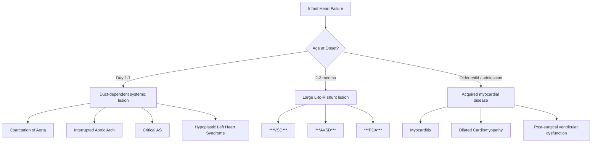
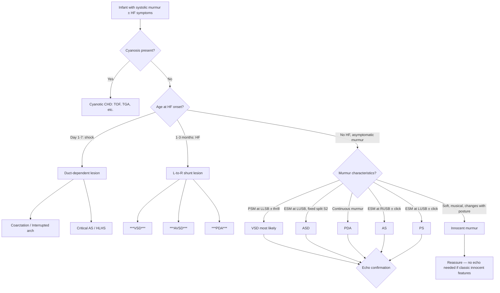

## Differential Diagnosis of Ventricular Septal Defect

When a child presents with findings suggestive of VSD — whether that's an asymptomatic systolic murmur in a well neonate, or heart failure at 1–2 months of age — you need to think systematically about what else could produce the same clinical picture. The differential diagnosis essentially falls into two clinical scenarios:

1. **The infant/child with a systolic murmur** (commonest presentation for small VSD)
2. **The infant with heart failure at 1–2 months** (presentation for moderate-to-large VSD)

Let's work through each scenario from first principles.

---

### Clinical Scenario 1: Systolic Murmur in an Infant or Child

The key question here is: **Is this murmur pathological (structural heart disease) or innocent?**

#### Innocent Murmurs

Up to **50% of children** will have an innocent murmur heard at some point [2]. These must be distinguished from VSD.

***Features of innocent murmur: aSymptomatic, Soft blowing, Systolic, Left Sternal edge*** [2] — use the mnemonic of the "**7 S's**": **S**oft, **S**ystolic, **S**hort, **S**ingle (no associated clicks/gallops), a**S**ymptomatic, **S**itting/standing diminishes, **S**ternal (left) edge.

| Feature | Innocent Murmur | VSD Murmur |
|---|---|---|
| Intensity | Soft (grade 1–2/6) | Often loud (grade 3–5/6), may have thrill |
| Character | Blowing, musical, vibratory | Harsh, blowing |
| Timing | Systolic, short | **Pan**systolic (extends to S2) |
| Variation | Changes with posture/fever/anaemia | Fixed, does not change with posture |
| Associated findings | No thrill, no heave, no click, normal S2 | Thrill, displaced apex, loud P2 if large |
| Growth | Normal | May be impaired if moderate/large |

<Callout title="Exam Pearl — When is a Murmur NOT Innocent?">
Any murmur that is **diastolic**, **pansystolic**, **loud (≥ grade 3/6)**, **associated with a thrill**, **associated with an abnormal S2**, or found in a child with **symptoms** (failure to thrive, tachypnoea, cyanosis) should be considered pathological until proven otherwise. All such murmurs require echocardiography.
</Callout>

#### Structural Heart Disease Mimicking VSD — Acyanotic Lesions with Systolic Murmur

| Condition | Murmur Character & Location | How to Distinguish from VSD |
|---|---|---|
| **Atrial Septal Defect (ASD)** | ESM at LUSB (relative PS from ↑flow), ***wide and fixed splitting of S2*** | ASD produces an ESM (not PSM); the hallmark is fixed split S2. No thrill. RV volume overload (not LV). |
| ***Atrioventricular Septal Defect (AVSD)*** | PSM at LLSB/apex (VSD + MR component), MDM at apex; ***signs similar to ASD and VSD*** [2] | Often in Down syndrome. ECG shows superior axis (left axis deviation) — a key distinguishing feature. Combined ASD + VSD features. |
| **Patent Ductus Arteriosus (PDA)** | ***Continuous*** "machinery" murmur at left infraclavicular area, best in systole | The continuous nature (extends through S2 into diastole) distinguishes PDA from the purely systolic PSM of VSD. Bounding pulses from aortic run-off. |
| **Aortic Stenosis (AS)** | ESM at RUSB/aortic area, radiating to carotids; ejection click | ESM (crescendo-decrescendo), not PSM. Loudest at RUSB, not LLSB. May have ejection click. Narrow pulse pressure. |
| **Pulmonary Stenosis (PS)** | ESM at LUSB with ejection click; wide but NOT fixed split S2 | ESM (not PSM). Click present. P2 is soft (opposite to large VSD where P2 is loud). |
| **Mitral Regurgitation (MR)** | PSM at apex radiating to axilla | PSM like VSD, but maximal at **apex** (not LLSB) and radiates to **axilla**. Often associated with mitral valve prolapse click. |
| **Tricuspid Regurgitation (TR)** | PSM at LLSB, increases with inspiration | Can be confused with VSD at LLSB, but augments with inspiration (Carvallo sign) because increased venous return to RV increases regurgitant flow. VSD does not consistently change. |
| **Hypertrophic Cardiomyopathy (HCM)** | ESM at LLSB, increases with Valsalva/standing | Dynamic LVOT obstruction. ESM (not PSM). Increases with manoeuvres that decrease preload. Family history often positive. ECG shows dramatic LVH. |
| **Coarctation of Aorta** | Soft, non-specific systolic murmur; often between scapulae | ***Coarctation is only associated with soft and non-specific murmurs → look hard for soft/absent femoral pulses*** [2]. Radio-femoral delay. Upper limb hypertension. |

<Callout title="Critical Trap — Coarctation of the Aorta" type="error">
***Coarctation of the aorta is only associated with soft and non-specific murmurs*** [2]. It can be missed if you rely on the murmur alone. The key is to **always check femoral pulses** in any infant with a murmur, heart failure, or shock. Absent or weak femoral pulses with strong upper limb pulses = coarctation until proven otherwise.
</Callout>

---

### Clinical Scenario 2: Heart Failure in Infancy

***Heart failure in CHD is more likely due to structural defects → excessive volume/pressure load instead of myocardial dysfunction*** [2].

The **timing** of heart failure presentation is a critical differentiating feature:

***Timing of HF is essential*** [2]:
- ***Neonatal: implies duct-dependent systemic circulation → HF with closure of duct*** [2] — presents in the ***first week of life*** with ***acute shock, weak lower limb pulses, oliguria, and severe metabolic acidosis*** [2]
- ***Infant (1–3 months): implies L-to-R shunt → ↓postnatal pulmonary vascular resistance at 2–3 months → ↑↑L-to-R shunting with ↑pulmonary flow*** [2]
- ***Children/adolescents: usually acquired myocardial disease (e.g., myocarditis, cardiomyopathy) or ventricular dysfunction with complex CHD despite surgery*** [2]

#### Differentiating Large L-to-R Shunt Lesions (HF at 1–2 months)

***Large left-to-right shunts: ventricular septal defect, atrioventricular septal defect, persistent arterial duct*** — all present with ***later onset of symptoms (as compared to left ventricular outflow obstructive lesions)*** [1]

| Feature | VSD | AVSD | PDA |
|---|---|---|---|
| **Typical murmur** | PSM at LLSB ± thrill | PSM at LLSB/apex + MR component | Continuous "machinery" murmur at left infraclavicular region |
| **S2** | Loud P2 if large | Loud P2 if large | Loud P2 if large |
| **Additional murmurs** | MDM at apex, ESM at LUSB if large | ASD component → fixed split S2 | Bounding pulses, wide pulse pressure |
| **ECG** | LV volume overload (tall R in V5/V6) | ***Superior (left) axis deviation*** — this is almost pathognomonic for AVSD | LV volume overload |
| **Associations** | Isolated or part of complex CHD | ***40–50% Down syndrome-related*** [2] | Prematurity, maternal rubella |
| **Mechanism of HF** | ***↑Pulmonary blood flow → ↑pulmonary venous return → volume overload of LA and LV*** [1] | Same as VSD + ASD component + AV valve regurgitation | Aorta → PA shunt → pulmonary overcirculation → LV volume overload |

#### Duct-Dependent Systemic Lesions (HF / Shock in First Week)

These present EARLIER than VSD and are more dramatic:

| Condition | Key Distinguishing Feature |
|---|---|
| **Coarctation of Aorta** | Shock at day 2–7; absent/weak femoral pulses; BP gradient between upper and lower limbs |
| **Interrupted Aortic Arch** | Complete absence of aortic segment; severe shock; associated with DiGeorge syndrome (22q11.2 deletion) |
| **Critical Aortic Stenosis** | Neonatal shock; harsh ESM at RUSB; weak pulses diffusely |
| **Hypoplastic Left Heart Syndrome (HLHS)** | Single S2; grey, shocked neonate; duct-dependent systemic circulation |

The critical distinction: ***VSD presents with HF at 1–2 months*** (because PVR must fall first), whereas duct-dependent lesions present with ***shock at day 2*** when the ductus arteriosus closes [1][2].

---

### Differential by Presentation — Syndromic Associations

If VSD is found on echocardiography, always consider whether it is **isolated** or **part of a syndrome/complex CHD**:

| Syndrome | Cardiac Defects | Dysmorphic Clues |
|---|---|---|
| ***Down syndrome (Trisomy 21)*** | ***AVSD, VSD, secundum ASD, PDA, TOF*** | ***Hypotonia, prominent medial epicanthic folds, upslanting palpebral fissures, flat nasal bridge, single transverse palmar crease*** [2][3] |
| ***DiGeorge syndrome (22q11.2 del)*** | ***Conotruncal abnormalities: interrupted aortic arch, truncus arteriosus, TOF, ASD/VSD*** | ***Abnormal facies, thymic hypo/aplasia, cleft palate, hypocalcaemia*** [2][3] |
| ***Turner syndrome (45,X)*** | ***Left-sided lesions: coarctation, bicuspid AV, valvular AS, HLHS*** | ***Short stature, webbed neck, low hairline, cubitus valgus, widely-spaced nipples*** [2][3] |
| ***Williams syndrome (7q11.23 del)*** | ***Supravalvular AS, peripheral pulmonary artery stenosis*** | ***Elfin facies, full cheeks, prominent lips, hypercalcaemia*** [2][3] |
| ***Noonan syndrome*** | ***Right-sided lesions: valvular PS (dysplastic cusps), ASD, HCM*** | ***Turner-like features, ptosis, downslanting palpebral fissures, cryptorchidism*** [2][3] |

---

### Non-Cardiac Differential Diagnoses

A child presenting with tachypnoea, poor feeding, and failure to thrive at 1–2 months may not have cardiac disease at all:

| Condition | Distinguishing Features |
|---|---|
| **Bronchiolitis (RSV)** | Seasonal; coryzal prodrome; wheeze; no murmur; no cardiomegaly on CXR |
| **Pneumonia** | Fever; focal signs; CXR shows consolidation (not pulmonary plethora) |
| **Sepsis** | Fever, lethargy, poor feeding; positive blood cultures; no murmur |
| **Metabolic disease (e.g., inborn errors of metabolism)** | Encephalopathy, metabolic acidosis, hyperammonaemia; no murmur |
| **Non-organic failure to thrive (inadequate feeding/neglect)** | No respiratory distress; no murmur; normal cardiovascular exam; social history is key |
| **Gastro-oesophageal reflux disease** | Regurgitation, irritability, feeding refusal; no respiratory distress at rest; no murmur |
| **Anaemia (severe)** | Pallor; flow murmur possible but soft and systolic; tachycardia; check FBC |

<Callout title="Clinical Approach — Always Listen and Feel">
When faced with an infant with poor feeding and tachypnoea, **auscultate the heart** (murmur? loud P2? gallop?), **palpate the precordium** (heave? thrill? displaced apex?), **feel the femoral pulses**, and **check the liver** (hepatomegaly?). A chest X-ray looking for cardiomegaly and pulmonary plethora, and a **four-limb blood pressure** can rapidly narrow the differential. Echocardiography is the definitive investigation.
</Callout>

---

### Systematic Differential Diagnosis Algorithm

---

### Summary: Key Differentiating Points for VSD

| Point | Detail |
|---|---|
| **Murmur location** | PSM at LLSB (perimembranous/muscular) or LUSB (subarterial) — distinguishes from AS (RUSB), ASD (LUSB + ESM), PDA (continuous) |
| **Timing of HF** | 1–2 months (not neonatal) — distinguishes from duct-dependent lesions |
| **S2 character** | Loud P2 in large VSD — distinguishes from PS (soft P2) and ASD (fixed split) |
| **Femoral pulses** | Normal in VSD — distinguishes from coarctation (absent/weak) |
| **Pulse pressure** | Normal in VSD — distinguishes from PDA (wide) and AS (narrow) |
| **ECG axis** | Normal or LV overload in VSD — distinguishes from AVSD (superior axis) |

<Callout title="High Yield Summary">

**Differential diagnosis of VSD centres on two clinical scenarios:**

1. **Asymptomatic systolic murmur**: Differentiate from innocent murmur (soft, systolic, short, asymptomatic, changes with posture), other acyanotic CHD (ASD, PS, AS, PDA, MR, HCM), and coarctation (feel the femorals!).

2. **Heart failure at 1–2 months**: Differentiate from other ***large L-to-R shunts (AVSD, PDA)*** [1] which present at a similar age, and from ***duct-dependent systemic lesions (coarctation, interrupted arch, critical AS, HLHS)*** which present **earlier** (day 2–7) with shock [2].

**Key discriminators**: Murmur character and location, timing of HF onset, S2 character, femoral pulses, pulse pressure, ECG axis, and syndromic features. Echocardiography is the definitive differentiating investigation.

***Heart failure in CHD is more likely due to structural defects → excessive volume/pressure load instead of myocardial dysfunction*** [2]. ***Timing of HF is essential*** [2].

</Callout>

---

<ActiveRecallQuiz
  title="Active Recall - Differential Diagnosis of VSD"
  items={[
    {
      question: "An infant presents with heart failure at 6 weeks of age. What category of cardiac defect is most likely, and name 3 specific lesions?",
      markscheme: "Large left-to-right shunt lesion. Three examples: (1) Ventricular septal defect (VSD), (2) Atrioventricular septal defect (AVSD), (3) Patent ductus arteriosus (PDA). These present at 1-3 months because PVR must fall postnatally before significant shunting occurs.",
    },
    {
      question: "How do you distinguish a VSD murmur from an ASD murmur on auscultation?",
      markscheme: "VSD: pansystolic murmur (PSM) at LLSB, often with thrill; loud P2 if large. ASD: ejection systolic murmur (ESM) at LUSB with wide and fixed splitting of S2. ASD has RV volume overload whereas VSD has LV volume overload.",
    },
    {
      question: "A neonate presents with shock on day 3 of life with weak femoral pulses and severe metabolic acidosis. What is the most likely category of cardiac defect and how does this differ from VSD in timing?",
      markscheme: "Duct-dependent systemic circulation lesion (e.g., coarctation of aorta, interrupted aortic arch, critical AS, HLHS). Presents with shock at day 2-7 when ductus arteriosus closes. VSD presents later at 1-2 months with HF (not shock) because it requires PVR to fall before significant L-to-R shunting develops.",
    },
    {
      question: "What ECG finding distinguishes AVSD from isolated VSD? What syndrome is strongly associated with AVSD?",
      markscheme: "AVSD shows superior (left) axis deviation on ECG, which is nearly pathognomonic. Isolated VSD typically shows normal axis or LV volume overload pattern. AVSD is strongly associated with Down syndrome (Trisomy 21) — 40-50% of complete AVSD cases are Down syndrome-related.",
    },
    {
      question: "List the 7 S features of an innocent murmur and state why an innocent murmur must be distinguished from VSD.",
      markscheme: "Soft, Systolic, Short, Single (no clicks/gallops), aSymptomatic, Sitting/Standing diminishes, Sternal (left) edge. Important because up to 50% of children have an innocent murmur at some point, and unnecessary investigation/referral should be avoided. However, a PSM with thrill at LLSB (VSD pattern) is never innocent.",
    },
  ]}
/>

---

## References

[1] Lecture slides: GC 147. Heart failure and cyanosis in children acyanotic and cyanotic congenital heart disease - Part 1.pdf (p26–28)
[2] Senior notes: Adrian Lui Pediatrics.pdf (p184, p190, p194, p201, p205)
[3] Senior notes: Ryan Ho Cardiology.pdf (p185, p193)
