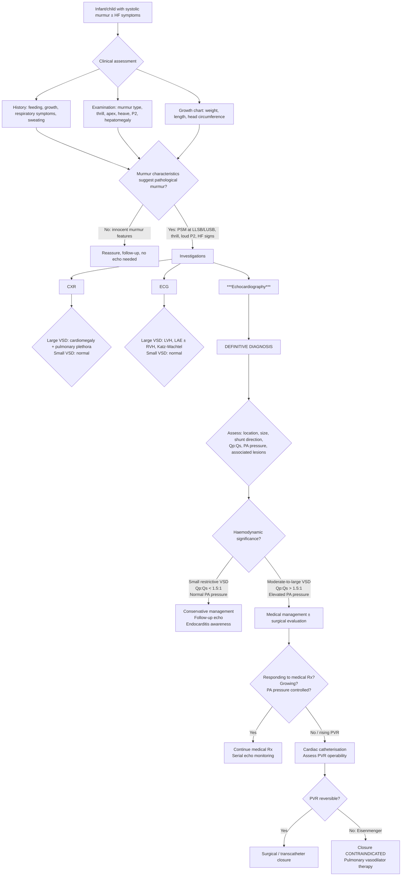

## Diagnostic Criteria, Algorithm, and Investigations for Ventricular Septal Defect

### Diagnostic Criteria — Conceptual Framework

There is no single "scoring system" or set of formal diagnostic criteria for VSD in the way there is for, say, Kawasaki disease or rheumatic fever. Instead, the diagnosis of VSD is established through a **clinical-echocardiographic approach**: clinical suspicion is raised by history, examination (murmur), and supported by ancillary investigations (CXR, ECG), with **echocardiography being the definitive diagnostic modality**.

The key diagnostic steps are:

1. **Clinical suspicion** → murmur characteristics + haemodynamic status (HF features)
2. **Supportive investigations** → CXR and ECG to assess haemodynamic impact
3. ***Echocardiography: diagnostic, estimate size and evaluate haemodynamics*** [2][3] — this is the gold standard
4. **Cardiac catheterisation** → reserved for specific indications (assessment of PVR, pre-operative evaluation of complex cases)

The clinical approach differs based on the **size** of the VSD — a small VSD with a well child and a large VSD with an infant in heart failure require very different workup intensity.

---

### Diagnostic Algorithm

---

### Investigation Modalities

#### 1. Chest X-Ray (CXR)

The CXR is a first-line investigation in any child with suspected cardiac disease. It provides information about heart size, chamber enlargement, and pulmonary vascularity. The findings differ dramatically between small and large VSD:

***CXR findings in VSD*** [2][3]:

| Feature | Large VSD | Small VSD |
|---|---|---|
| ***Heart size*** | ***Cardiomegaly (LV dilatation)*** | ***Normal*** |
| ***Pulmonary vasculature*** | ***Pulmonary plethora*** | ***Normal*** |
| Specific chambers | LA and LV enlargement; ± PA prominence | Normal cardiac contour |
| Upper lobe veins | May show upper lobe pulmonary venous distension if significant pHTN | Normal |

**How to assess on paediatric CXR:**

- ***Cardiomegaly***: assessed by the cardiothoracic ratio (CTR)
  - ***CTR ≥ 0.5 in children/adults = cardiomegaly*** [2]
  - ***CTR ≥ 0.6 in infants = cardiomegaly*** [2] (the infant heart is proportionally larger, and the thymus can obscure the mediastinal silhouette)
  
<Callout title="Thymus Trap" type="error">
***The thymus in infants/young children can simulate cardiomegaly → diagnostic difficulty*** [2]. The thymus sits in the anterior superior mediastinum and can make the cardiac silhouette appear wider than it truly is. Look for the classic "sail sign" (thymic shadow overlying the right heart border like a triangular sail). If in doubt, a lateral CXR can help distinguish thymus from true cardiomegaly. Echocardiography resolves any uncertainty.
</Callout>

- ***Pulmonary plethora***: increased pulmonary vascular markings extending to the periphery of both lung fields — indicates increased pulmonary blood flow (Qp > Qs). This is the hallmark CXR finding of a significant L-to-R shunt.
  - Mechanism: ***L-to-R shunt (e.g., VSD) → pulmonary plethora + cardiomegaly (volume overload)*** [2]
  - Contrast this with pulmonary venous congestion (e.g., MS): pulmonary plethora + hazy venous markings + **no** cardiomegaly [2]
  - And with pulmonary outflow obstruction (e.g., TOF): **pulmonary oligaemia** (decreased vascular markings) [2]

- ***Chamber-specific CXR signs*** [2]:
  - **LV enlargement (LVE)**: apex extends laterally and points downwards
  - **LA enlargement (LAE)**: small bulge on the left cardiac border (the "3rd mogul sign") inferior to the pulmonary artery shadow; also double density sign and splaying of the carina
  - **RV enlargement (RVE)**: increased CTR + cardiac apex tilts upwards and displaces laterally → "boot-shaped heart" (though this is more classically seen in TOF)

> **In a small VSD, the CXR is completely normal.** This is an important point — you cannot "rule in" a small VSD on CXR, and a normal CXR does not exclude VSD.

---

#### 2. Electrocardiogram (ECG)

***ECG is an essential diagnostic tool*** [2] in paediatric cardiology. It provides information about chamber hypertrophy/dilatation, conduction abnormalities, and rhythm. Understanding the paediatric ECG requires appreciating **age-related normal values**.

##### Paediatric ECG — Key Age-Related Principles

***Age-related changes*** [2]:
- ***↑ RR interval: corresponding to ↓ HR*** (neonatal HR ~120–160 bpm; infant ~100–150 bpm; child ~70–120 bpm)
- ***↑ PR interval, QRS duration, and QT interval: corresponding to ↓ HR***
- ***Change of ventricular dominance: from RV (infants) to LV (children/adults)*** [2]

***Ventricular dominance*** [2]:
- ***RV dominance in infants as RV is thicker → ↑ stroke volume to supply descending aorta via ductus arteriosus*** [2]
  - ***Right QRS axis: mean 125° in newborn*** [2]
  - ***Tall R in right leads (V1 and V2) and deep S in left leads (V5 and V6)*** [2]
- ***Switch to LV dominance postnatally:*** [2]
  - ***LV mass ↑ to cope with systemic circulation + ↓ RV mass due to ↓ PVR*** [2]
  - ***QRS axis shifts leftward (90° at 1 month, 60° at 1 year) + develops adult R wave progression*** [2]

<Callout title="Critical Concept — Normal Paediatric ECG Changes with Age">
What looks like "RVH" in an adult may be completely normal in a neonate (dominant R wave in V1, right axis deviation). Conversely, ***an upright T wave in V1 in children aged 3 days to 6 years should raise suspicion for RVH*** [2] — normally the T wave in V1 should be inverted in this age group (it inverts after the first 3 days of life and remains inverted until approximately 6–8 years). Always interpret paediatric ECGs with **age-appropriate normal values**.
</Callout>

##### ECG Findings in VSD

***ECG findings depend on VSD size*** [2][3]:

| Feature | Large VSD | Small VSD |
|---|---|---|
| Overall | Multiple abnormalities | ***Normal*** |
| Axis | May be normal or left | Normal |
| ***LVH*** | ***Left axis deviation with tall R in V6, deep S in V1*** | Absent |
| ***LAE*** | ***P wave duration ≥ 0.10s → may be notched or biphasic*** | Absent |
| ***± RVH*** | ***Right axis deviation with tall R in V1, deep S in V6*** (if significant pHTN) | Absent |
| ***± RAE*** | ***Tall and peaked P waves ≥ 3mm*** (if significant pHTN) | Absent |
| ***Katz-Wachtel phenomenon*** | ***Biphasic (large equiphasic) QRS complexes in mid-precordial leads V2–V5*** — ***classical for VSD*** | Absent |
| LV strain | ***± LV strain pattern with inverted T in V6 or I*** | Absent |

Let's understand each of these from first principles:

**Why LVH?** The large VSD causes a significant L-to-R shunt → increased pulmonary venous return → **LV volume overload** → LV dilation and hypertrophy → tall R waves in left-sided leads (V5, V6, I, aVL) and deep S waves in right-sided leads (V1, V2) [2].

**Why LAE?** The increased pulmonary venous return also overloads the LA → LA dilation → prolonged P wave duration (≥ 0.10s), notched P wave ("P mitrale") in lead II, and biphasic P wave in V1 [2].

**Why RVH (when present)?** If pulmonary hypertension develops, the RV faces increased afterload (pressure overload) → RV hypertrophy → tall R in V1, deep S in V6, right axis deviation. ***Upright T wave in V1 in children 3 days to 6 years suggests RVH*** [2].

**Why RAE (when present)?** Advanced pHTN → RV dysfunction → tricuspid regurgitation → RA pressure overload → RA enlargement → tall, peaked P waves ("P pulmonale") ≥ 3mm in lead II [2].

***Katz-Wachtel phenomenon*** [2][3]: This is a **classic exam favourite**. It refers to ***large equiphasic QRS complexes in mid-precordial leads (V2–V5)*** [2]. The mechanism: when **both** LVH and RVH are present simultaneously (biventricular hypertrophy — LV from volume overload, RV from pressure overload due to pHTN), the electrical forces are large but roughly balanced between left and right → the QRS in the transitional chest leads (V2–V5) is very tall but biphasic (the R and S components are roughly equal in height). ***Large VSD with pHTN → RV pressure overload + LV volume overload → Katz-Wachtel*** [2].

> **Mnemonic**: **K**atz-**W**achtel = **K**ombined **W**all hypertrophy (biventricular hypertrophy) in **V**SD.

---

#### 3. Echocardiography (ECHO) — The Gold Standard

***Echocardiography is diagnostic, estimates size, and evaluates haemodynamics*** [2][3]. This is the **single most important investigation** for VSD. It directly visualises the defect and provides comprehensive haemodynamic assessment without radiation or invasiveness.

##### What Echo Can Tell You

| Parameter | How It's Assessed | Clinical Significance |
|---|---|---|
| **Defect location** | 2D imaging in multiple views (parasternal long axis, short axis, apical 4-chamber, subcostal) | Determines VSD type (perimembranous, muscular, subarterial, inlet) — essential for surgical planning and prognosis |
| **Defect size** | 2D measurement in mm; comparison to aortic annulus diameter | Small ( < 4mm or < 1/3 aortic annulus), moderate (4–6mm), large ( > 6mm or > 2/3 aortic annulus) |
| **Shunt direction** | Colour-flow Doppler mapping | L-to-R (red flow towards transducer from LV into RV in parasternal views) confirms acyanotic physiology; bidirectional or R-to-L suggests elevated PVR / Eisenmenger |
| **Shunt velocity / RV pressure** | Continuous-wave (CW) Doppler across the VSD using modified Bernoulli equation: ΔP = 4V² | A high-velocity jet (e.g., 4–5 m/s) means a large pressure gradient = restrictive VSD (good). A low-velocity jet (e.g., 1–2 m/s) means pressures are nearly equalised = non-restrictive VSD (bad — pHTN likely). If systolic BP is 80 mmHg and ΔP across VSD is 60 mmHg → estimated RVSP = 80 – 60 = 20 mmHg (normal). If ΔP is only 20 mmHg → RVSP = 60 mmHg (significant pHTN) |
| **Qp:Qs ratio** | Calculated from Doppler flow measurements across RVOT and LVOT | Quantifies the magnitude of the shunt: < 1.5:1 = mild, 1.5–2:1 = moderate, > 2:1 = significant |
| **PA pressure estimation** | TR jet velocity (if TR present): RVSP = 4V²(TR) + estimated RAP | Estimates pulmonary artery systolic pressure; correlates with severity of pHTN |
| **Chamber dimensions** | M-mode and 2D measurements of LA, LV, RV | LA and LV dilation = significant volume overload; RV dilation/hypertrophy = pressure overload from pHTN |
| **Ventricular function** | LV ejection fraction (EF), fractional shortening (FS) | Usually preserved in early VSD; depressed EF suggests myocardial dysfunction or very longstanding volume overload |
| **Associated lesions** | Comprehensive sweep of all structures | Must rule out: aortic valve prolapse (subarterial VSD → AR), coarctation, AVSD, other complex CHD |
| **Tricuspid valve tissue herniation** | Direct visualisation | Perimembranous VSD may be partially occluded by tricuspid valve tissue forming an "aneurysm of the membranous septum" → this is a favourable sign suggesting possible spontaneous closure [2][3] |

##### Echo Views for VSD Localisation

| VSD Type | Best Echo View | What You See |
|---|---|---|
| **Perimembranous** | Parasternal long axis (PLAX); apical 5-chamber | Defect just below the aortic valve; may see TV tissue partially occluding it |
| **Muscular** | Parasternal short axis (PSAX); apical 4-chamber | Defect within the muscular septum; may be multiple ("Swiss cheese") |
| **Subarterial** | Parasternal short axis (high PSAX at great vessel level); PLAX | Defect just below both semilunar valves; look for aortic cusp prolapse |
| **Inlet** | Apical 4-chamber; subcostal | Defect posterior and inferior, beneath the AV valves; assess AV valve anatomy |

<Callout title="Exam Pearl — Subarterial VSD and Aortic Valve Assessment">
When a ***subarterial VSD*** is identified on echocardiography, the echocardiographer must specifically assess for ***coronary cusp prolapse and aortic regurgitation (AR)*** [2][3]. Use colour Doppler in the parasternal long-axis view to look for an AR jet. Even a small subarterial VSD with early cusp prolapse may warrant early surgical referral to prevent progressive AR — this is especially relevant in the **Hong Kong / East Asian** population where subarterial VSD is more prevalent [2].
</Callout>

---

#### 4. Cardiac Catheterisation

Cardiac catheterisation is **NOT routine** for VSD diagnosis — echocardiography suffices in most cases. It is reserved for specific clinical scenarios:

##### Indications in Paediatric VSD

| Indication | Rationale |
|---|---|
| **Assessment of PVR** | When echo suggests elevated PA pressure and there is concern about Eisenmenger; catheterisation directly measures PA pressure, PVR, and SVR. The key question: **is the PVR reversible?** This determines operability. |
| **Vasoreactivity testing** | In borderline cases, acute vasodilator challenge (inhaled nitric oxide, IV adenosine, or 100% O₂) during catheterisation to see if PVR drops → if it does, the patient may still be operable |
| **Qp:Qs measurement** | Gold standard for shunt quantification; uses Fick principle with oximetry: measure O₂ saturations in SVC, PA, PV, and aorta → calculate Qp:Qs = (SaO₂ – SvO₂) / (SpvO₂ – SpaO₂) |
| **Associated complex CHD** | When echo cannot fully delineate the anatomy (rare with modern echo/MRI) |
| **Transcatheter device closure** | Select muscular VSDs or post-operative residual VSDs may be amenable to percutaneous device closure rather than re-operation |

##### Key Catheterisation Findings

| Finding | Interpretation |
|---|---|
| **"Step-up" in O₂ saturation at RV level** | Oxygenated blood from LV crosses VSD into RV → O₂ saturation in RV is higher than in RA. A step-up of > 7% at the RV level is significant. This is the **hallmark** catheterisation finding of VSD. |
| **Elevated PA pressure** | PA systolic pressure > 25 mmHg at rest; correlate with severity of pHTN |
| **PVR calculation** | PVR = (mean PA pressure – mean LA pressure) / Qp. PVR index > 6–8 Wood units·m² with PVR:SVR > 0.67 suggests **inoperable** Eisenmenger |
| **Reversibility with vasodilator** | If PVR drops > 20% or to < 6 Wood units·m² with nitric oxide challenge → favourable for surgical closure |

---

#### 5. Cardiac MRI

***± MRI: in circumstances where echo is not sufficient, e.g., complex CHD*** [2]

Cardiac MRI is a **second-line** imaging modality in paediatric VSD, used when:
- Echo windows are limited (rare in paediatrics compared to adults)
- Complex anatomy with multiple associated lesions needs comprehensive mapping
- Accurate quantification of ventricular volumes, function, and Qp:Qs ratio is needed
- Assessment of pulmonary venous drainage or aortic arch anatomy is required

MRI provides radiation-free, highly detailed anatomical and functional information. Phase-contrast velocity mapping can accurately quantify shunt flow (Qp:Qs). However, younger children (typically < 6–7 years) may require general anaesthesia or deep sedation for MRI, which limits routine use.

---

#### 6. Other Investigations

| Investigation | When / Why |
|---|---|
| **Pulse oximetry (pre- and post-ductal)** | Neonatal screening; important to exclude cyanotic CHD. In isolated VSD, saturations are normal (≥ 95%). If saturation is low → consider R-to-L shunt (Eisenmenger, cyanotic CHD) |
| **Four-limb blood pressure** | To exclude coarctation of aorta (upper limb BP > lower limb BP by > 20 mmHg); should be performed in any child with a cardiac murmur |
| **Full blood count (FBC)** | Exclude anaemia (which can unmask or exacerbate HF symptoms); check for polycythaemia in Eisenmenger syndrome |
| **Blood gas (ABG/VBG)** | In acutely unwell infant: metabolic acidosis suggests poor cardiac output or shock; respiratory alkalosis from tachypnoea in HF |
| **BNP / NT-proBNP** | Elevated in heart failure; can help distinguish cardiac from respiratory causes of tachypnoea in infancy; useful for monitoring treatment response |
| **Renal function, electrolytes** | Baseline before starting diuretics and ACE inhibitors; monitor for hypokalaemia (diuretics), hyperkalaemia (ACE inhibitors), and renal impairment |
| **Genetic testing / karyotype** | If dysmorphic features suggest a syndromic cause (e.g., Trisomy 21, 22q11.2 deletion) |
| **Antenatal ultrasound** | ***Incidental findings can also be found during antenatal cardiac US in routine anomaly scan*** [2]. Large VSDs may be detected at the 18–22 week anomaly scan; small muscular VSDs are often too small to detect antenatally. |

---

### Summary: Investigation Findings by VSD Size

| Investigation | ***Large VSD*** | ***Small VSD*** |
|---|---|---|
| ***CXR*** | ***Cardiomegaly (LV dilatation), pulmonary plethora*** | ***Normal*** |
| ***ECG*** | ***LVH, LAE, ± RVH or even RAE (if significant pHTN); Katz-Wachtel phenomenon: biphasic QRS in V2–V5 (classical for VSD)*** | ***Normal*** |
| ***Echo*** | ***Diagnostic, estimate size and evaluate haemodynamics*** — large defect, LA/LV dilatation, elevated PA pressure, ↑Qp:Qs | ***Diagnostic, estimate size and evaluate haemodynamics*** — small defect, normal chamber sizes, normal PA pressure |
| Catheterisation | Reserved for PVR assessment / operability | Not indicated |

[2][3]

---

<Callout title="High Yield Summary">

**Diagnostic approach to VSD is clinical + echocardiographic:**

1. **CXR**: ***Large VSD → cardiomegaly + pulmonary plethora; Small VSD → normal*** [2][3]
2. **ECG**: ***Large VSD → LVH, LAE, ± RVH/RAE, Katz-Wachtel phenomenon (biphasic QRS V2–V5, classical for VSD); Small VSD → normal*** [2][3]
3. ***Echocardiography is the gold standard*** — diagnostic, determines location/type, estimates size, quantifies shunt (Qp:Qs), assesses PA pressure, and identifies associated lesions including aortic valve prolapse in subarterial VSD [2][3]
4. **Cardiac catheterisation** is reserved for PVR assessment and vasoreactivity testing in suspected Eisenmenger / borderline operability, and for transcatheter device closure
5. ***MRI is used when echo is not sufficient, e.g., in complex CHD*** [2]
6. **Remember paediatric ECG norms**: RV dominance in neonates is normal; ***upright T wave in V1 at age 3 days to 6 years suggests RVH***; always use age-appropriate criteria [2]
7. ***Thymus can simulate cardiomegaly on infant CXR*** — use lateral view or echo to clarify [2]
8. ***CTR ≥ 0.6 (infants) or ≥ 0.5 (children/adults) = cardiomegaly*** [2]

</Callout>

---

<ActiveRecallQuiz
  title="Active Recall - Diagnosis and Investigations of VSD"
  items={[
    {
      question: "What is the Katz-Wachtel phenomenon and in what condition is it classically seen? Explain the mechanism.",
      markscheme: "Katz-Wachtel phenomenon = large biphasic (equiphasic) QRS complexes in mid-precordial leads V2-V5. Classical for large VSD. Mechanism: biventricular hypertrophy (LV volume overload + RV pressure overload from pHTN) produces large but balanced electrical forces that cancel partially in transitional leads, resulting in equally tall R and S waves.",
    },
    {
      question: "A 3-month-old infant with a VSD has a CXR showing a large cardiac silhouette. How do you determine if this is true cardiomegaly vs thymus? What CTR threshold is used for cardiomegaly in infants vs older children?",
      markscheme: "Thymus in infants can simulate cardiomegaly (sail sign). Lateral CXR helps distinguish thymus (anterior mediastinum) from true cardiac enlargement. Echocardiography resolves any doubt. CTR threshold: >= 0.6 in infants vs >= 0.5 in children and adults.",
    },
    {
      question: "On echocardiography of a VSD, you measure a trans-VSD jet velocity of 4.5 m/s in a child with systolic BP of 90 mmHg. Estimate the RVSP and comment on significance.",
      markscheme: "Using modified Bernoulli: pressure gradient = 4 x (4.5)^2 = 81 mmHg. RVSP = systolic BP - gradient = 90 - 81 = 9 mmHg. This indicates a restrictive VSD with a large pressure gradient and near-normal RV pressure. Haemodynamically benign despite possibly loud murmur.",
    },
    {
      question: "Why is normal RV dominance on a neonatal ECG NOT indicative of RVH, and what specific finding in V1 would suggest true RVH in a 2-year-old?",
      markscheme: "In neonates, RV is physiologically dominant (thicker RV wall for supplying systemic circulation via ductus arteriosus in utero), producing right axis deviation and tall R in V1 as normal findings. After age 3 days, the T wave in V1 should become inverted and normally stays inverted until approximately 6-8 years. An upright T wave in V1 in children aged 3 days to 6 years suggests true RVH.",
    },
    {
      question: "When is cardiac catheterisation indicated in paediatric VSD? What is the key measurement that determines operability?",
      markscheme: "Indications: (1) Assessment of PVR when Eisenmenger suspected; (2) Vasoreactivity testing with inhaled NO or O2; (3) Transcatheter device closure of select muscular VSDs. Key measurement: PVR index. PVR index > 6-8 Wood units/m2 with PVR:SVR ratio > 0.67 suggests fixed irreversible pulmonary vascular disease (inoperable Eisenmenger). If PVR drops > 20% with vasodilator challenge, surgical closure may still be feasible.",
    },
  ]}
/>

---

## References

[1] Lecture slides: GC 147. Heart failure and cyanosis in children acyanotic and cyanotic congenital heart disease - Part 1.pdf (p26–27)
[2] Senior notes: Adrian Lui Pediatrics.pdf (p184, p190, p194, p195, p198, p199, p201)
[3] Senior notes: Ryan Ho Cardiology.pdf (p185, p192, p193)
[4] Senior notes: Ryan Ho Fundamentals.pdf (p455, p456, p461)
