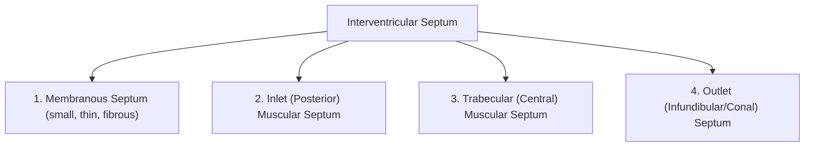
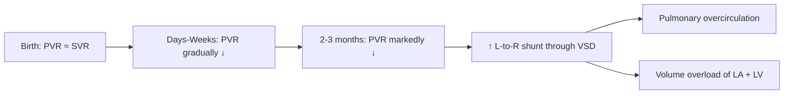

# Ventricular Septal Defect (VSD) in Paediatrics

## Definition

A ventricular septal defect (VSD) is an abnormal opening in the interventricular septum that permits communication between the left and right ventricles. The name literally tells you what it is: "ventricular" = pertaining to the ventricles, "septal" = relating to the septum (the wall dividing the chambers), "defect" = a structural hole or abnormality.

Because the left ventricle (LV) normally operates at a much higher pressure than the right ventricle (RV), blood shunts from left to right across the defect — hence VSD is classified as an **acyanotic, left-to-right shunt** lesion (at least initially). The clinical significance depends entirely on the **size of the defect** and the **relative pulmonary and systemic vascular resistances** [1][2][3].

---

## Epidemiology

| Parameter | Detail |
|---|---|
| ***Incidence*** | ***~0.3–0.5 per 1,000 live births (some sources quote ~1/500)*** — this is the ***commonest congenital heart disease (CHD)*** overall [2][3] |
| Proportion of all CHD | ~25–30% of all congenital heart defects |
| Sex | Slight female predominance (F:M ≈ 1.2:1) in isolated VSD |
| Hong Kong context | CHD prevalence ~8–9 per 1,000 live births in HK; VSD remains the most common individual lesion. Perimembranous VSD predominates; **subarterial (doubly committed subarterial or outlet) VSD** is notably **more common in Asian populations** (~15–30% in East Asian series vs. ~5% in Western series) — this is a key HK-relevant point [2][3] |
| Age at presentation | Small VSD: detected as incidental murmur in neonatal/infant period. ***Moderate-to-large VSD: heart failure symptoms emerge at ~1–2 months of age*** as PVR falls [2][3] |
| Natural history | ***Spontaneous closure in 60–80% (usually ≤5 years)*** — highest for small muscular VSDs; ***subarterial VSDs do NOT spontaneously close*** [2][3] |

<Callout title="High Yield — Asian / Hong Kong Specifics" type="idea">
Subarterial (outlet/doubly committed juxta-arterial) VSD is significantly more prevalent in East Asian populations including Hong Kong Chinese. Unlike perimembranous or muscular defects, subarterial VSD does NOT spontaneously close and is associated with progressive aortic valve prolapse and aortic regurgitation — making early surgical referral important.
</Callout>

---

## Risk Factors

### Genetic / Chromosomal
- **Trisomy 21 (Down syndrome)** — particularly associated with atrioventricular septal defect (AVSD) but also isolated VSD
- **Trisomy 13, Trisomy 18** — multiple cardiac defects including VSD
- **22q11.2 deletion (DiGeorge/velocardiofacial syndrome)** — conotruncal anomalies (TOF, truncus arteriosus) often have accompanying VSD
- **Holt-Oram syndrome** (TBX5 mutation) — ASD and VSD with upper limb anomalies
- Family history of CHD (recurrence risk ~3% if one sibling affected)

### Maternal / Environmental
- Maternal diabetes mellitus (pre-gestational > gestational)
- Maternal phenylketonuria (uncontrolled)
- Teratogens: alcohol (fetal alcohol spectrum disorder), anticonvulsants (valproate, phenytoin), lithium, retinoids
- Maternal rubella infection (first trimester) — classically PDA but VSD also reported
- Advanced maternal age (modest association)

### Syndromic Associations
- **VACTERL association** — vertebral, anal atresia, cardiac (including VSD), tracheo-esophageal fistula, renal, limb anomalies
- **CHARGE syndrome** — coloboma, heart defects, atresia choanae, retardation, genital anomalies, ear anomalies

---

## Anatomy and Function of the Interventricular Septum

Understanding VSD types requires understanding the normal anatomy of the interventricular septum:

### Components of the Interventricular Septum

The interventricular septum is **not one homogeneous structure** — it is composed of four anatomical zones (think of it as a complex wall with different building materials in different regions):

| Component | Location | Notes |
|---|---|---|
| **Membranous septum** | Small area beneath the aortic valve, adjacent to the tricuspid valve annulus | Thinnest part; most vulnerable to defects |
| **Inlet septum** | Posterior, beneath the AV valves | Separates the inflow portions of both ventricles |
| **Trabecular (muscular) septum** | Largest portion; central, apical, and marginal | Thick and muscular; can have multiple ("Swiss cheese") defects |
| **Outlet (infundibular/conal) septum** | Anterosuperior, just beneath the semilunar valves (aortic and pulmonary) | Defects here = subarterial/doubly committed; more common in Asian populations |

### Important Adjacent Structures
- **Atrioventricular (AV) node**: lies at the apex of the triangle of Koch, very close to the perimembranous septum — explains the risk of heart block during surgical repair
- **Bundle of His**: penetrates through the membranous septum → vulnerable to damage
- **Aortic valve cusps**: the right coronary cusp and non-coronary cusp sit just above the membranous septum → subarterial defects can cause cusp prolapse → aortic regurgitation (AR)

### Normal Function
The septum separates the high-pressure LV (~120/80 mmHg in older children, proportionally lower in neonates) from the low-pressure RV (~25/5 mmHg). Any breach allows pressure-driven flow from LV → RV.

---

## Aetiology

### Congenital (vast majority in paediatrics)

***VSD may occur as an isolated defect or in conjunction with other cardiac defects*** [2][3].

**Isolated VSD:**
- Result from failure of complete formation or fusion of the various septal components during embryological cardiac septation (weeks 4–8 of gestation)
- The interventricular septum forms from both the muscular ventricular septum growing upward AND the endocardial cushions/conotruncal ridges growing downward — failure of fusion at any point produces a VSD

**VSD as part of complex CHD:**
- **Tetralogy of Fallot (TOF)** — perimembranous/outlet VSD with anterior malalignment of the outlet septum
- **Transposition of the Great Arteries (TGA)** — may have associated VSD
- **Double outlet right ventricle (DORV)** — VSD is the primary exit for LV blood
- **Truncus arteriosus** — always has a large VSD beneath the single great vessel
- **Atrioventricular septal defect (AVSD)** — inlet-type VSD component
- **Coarctation of the aorta** — commonly associated with VSD

### Acquired (rare in paediatrics, included for completeness)
- ***Anterior myocardial infarction*** (relevant in adults; very rare in children) [2][3]
- Trauma (penetrating or blunt chest injury)
- Post-surgical (iatrogenic)

---

## Classification

### By Anatomical Location (most clinically relevant)

| Type | Frequency (Western) | Frequency (Asian/HK) | Location | Key Features |
|---|---|---|---|---|
| ***Perimembranous (infracristal)*** | ***~70%*** | ~60% | Membranous septum, just beneath the aortic valve, adjacent to TV | ***Most common cause of clinically significant VSD***; may be partially covered by tricuspid valve tissue ("aneurysm of membranous septum") leading to spontaneous reduction/closure [2][3] |
| **Muscular (trabecular)** | ~20% | ~15% | Entirely surrounded by muscle; can be central, apical, anterior, or multiple | ***Central muscular type more likely to spontaneously close***; multiple defects = "Swiss cheese" septum [2][3] |
| ***Subarterial (outlet / doubly committed juxta-arterial / supracristal)*** | ***~5%*** (Western) | ***~15–30%*** (Asian) | Outlet septum, immediately beneath both semilunar valves | ***Associated with coronary cusp prolapse and aortic regurgitation (AR)***; does NOT spontaneously close; **more common in Asian populations** [2][3] |
| **Inlet (AV canal-type)** | ~5% | ~5% | Posterior septum beneath the AV valves | Associated with AVSD; seen in Down syndrome |

<Callout title="Exam Pearl — Subarterial VSD and AR">
Subarterial VSD is ***associated with coronary cusp prolapse and AR*** [2][3]. The mechanism: the defect removes support from the right coronary cusp of the aortic valve → the cusp prolapses into the VSD under the high aortic pressure → progressive AR. This is a classic exam question and an important reason why subarterial VSD requires early surgical closure even if the VSD itself is haemodynamically small.
</Callout>

### By Size

| Size | Diameter | Haemodynamic Significance |
|---|---|---|
| ***Small*** | *** < 4 mm (or < 1/3 aortic annulus)*** | Restrictive; high-velocity jet across defect; minimal volume overload; ***75% spontaneously close within < 2 years; others usually benign*** [2][3] |
| ***Moderate*** | ***4–6 mm (or 1/3–2/3 aortic annulus)*** | Moderate shunt; some volume overload; ***less spontaneous closure but usually respond to medical treatment; does not develop Eisenmenger with medical treatment*** [2][3] |
| ***Large*** | *** > 6 mm (or > 2/3 aortic annulus)*** | Non-restrictive; RV pressure approaches LV pressure; significant volume overload; ***progressive ↑PVR due to pulmonary vascular changes → risk of developing Eisenmenger syndrome*** [2][3] |

### By Haemodynamic Effect
- **Restrictive VSD**: Defect is smaller than the aortic annulus → the VSD itself limits flow → high-velocity jet → loud murmur but minimal haemodynamic consequence (paradox: louder murmur = smaller VSD = less sick child)
- **Non-restrictive VSD**: Defect is large → pressures equalize between ventricles → shunt magnitude depends entirely on PVR:SVR ratio

---

## Pathophysiology

This is the key to understanding everything about VSD — from symptoms, to signs, to natural history, to complications.

### Fetal Life

***In utero: little effect on cardiac physiology*** [2][3].

Why? In fetal circulation, the pulmonary vascular resistance (PVR) is very high (lungs are fluid-filled, not ventilated) and systemic vascular resistance (SVR) is relatively low (the placenta is a low-resistance circuit). Therefore, even with a VSD, there is **minimal pressure gradient** between the two ventricles, and shunting is negligible. The fetus develops normally.

### Postnatal Transition

***Postnatal: gradual ↓PVR (at 2–3 months) → ↑L-to-R shunting*** [2][3]

Here's the critical sequence:

1. **At birth**: The baby takes the first breath → lungs inflate → alveolar oxygen increases → **pulmonary vasodilation begins** → PVR starts to fall
2. **First few days to weeks**: PVR is still relatively high → shunting across the VSD is still modest → the baby may be asymptomatic
3. **By 2–3 months**: PVR has fallen substantially (normal postnatal remodelling of pulmonary vasculature) → the pressure gradient across the VSD increases → **significant L-to-R shunting develops**
4. This explains the ***later onset of symptoms (as compared to left ventricular outflow obstructive lesions)*** — babies with large VSDs present with heart failure symptoms at **1–2 months of age**, not at birth [1]

### Haemodynamic Consequences of L-to-R Shunt

***Increased pulmonary blood flow → Increased pulmonary venous return → Volume overloading of left atrium and left ventricle*** [1][4]

Let's trace the blood:

1. **LV → VSD → RV → Pulmonary artery**: Extra blood flows through the lungs (pulmonary overcirculation)
2. **Pulmonary veins → LA → LV**: All that extra blood returns to the left heart → **LA and LV volume overload** (dilation and eventually hypertrophy)
3. ***NO RV overload in early stages as RV only acts as a conduit of blood from LV → RV → PA (i.e., no ↑preload to the RV from systemic venous return)*** [2][3] — this is a subtle but important concept. The RV is essentially a passageway; it receives the shunted blood from the LV and immediately ejects it into the PA. The excess volume load is on the **left heart** (LA and LV), not the RV.

### The "Qp:Qs Ratio"
- **Qp** = pulmonary blood flow; **Qs** = systemic blood flow
- Normal Qp:Qs = 1:1
- Small VSD: Qp:Qs < 1.5:1 (insignificant)
- Moderate VSD: Qp:Qs 1.5–2:1
- Large VSD: Qp:Qs > 2:1 (clinically significant)
- Very large / unrepaired: Qp:Qs can be 3:1 or even 4:1

### Consequences of Pulmonary Overcirculation

| Consequence | Mechanism |
|---|---|
| **Pulmonary congestion / oedema** | ↑ pulmonary blood flow → ↑ pulmonary capillary hydrostatic pressure → fluid transudation into interstitium and alveoli |
| **↑ work of breathing** | Fluid-congested lungs are stiffer (↓ compliance) → tachypnoea, subcostal/intercostal recession |
| **Feeding difficulty** | Tachypnoea makes coordinating suck-swallow-breathe impossible; also ↑ metabolic demand of breathing |
| **Failure to thrive** | ↑ caloric expenditure (from increased cardiac and respiratory work) + ↓ caloric intake (poor feeding) = energy deficit → growth faltering |
| **Recurrent LRTI** | Congested, oedematous lungs are fertile ground for infection |
| **Pulmonary hypertension (pHTN)** | Initially "hyperkinetic" (due to ↑ flow), then "reactive" (pulmonary vasoconstriction), then "fixed" (irreversible vascular remodelling → Eisenmenger) |

### Pulmonary Vascular Disease and Eisenmenger Syndrome

This is the most feared long-term complication of unrepaired large VSD:

1. **Chronic high-flow, high-pressure pulmonary circulation** → endothelial damage → medial hypertrophy of pulmonary arterioles → intimal fibrosis → plexiform lesions
2. PVR progressively rises → eventually **PVR exceeds SVR**
3. The shunt **reverses** from L-to-R → **R-to-L** → deoxygenated blood enters the systemic circulation → **cyanosis**
4. This is **Eisenmenger syndrome** — once established, it is **irreversible** and **contraindicates surgical closure** (because the RV is now dependent on the VSD to decompress against the fixed high PVR)

***Large VSD: progressive ↑PVR due to pulmonary vascular changes → risk of developing Eisenmenger syndrome*** [2][3]

In children, Eisenmenger from isolated VSD can develop as early as **1–2 years of age** if the VSD is very large and unrepaired (this is much earlier than in ASD, where Eisenmenger typically occurs in the 3rd–4th decade, because the VSD exposes the pulmonary vasculature to systemic-level pressure, not just volume).

---

## Natural History

| VSD Size | Natural History |
|---|---|
| ***Small ( < 4 mm)*** | ***75% spontaneously close within < 2 years; others usually benign*** — children are asymptomatic; grow normally; require endocarditis awareness and surveillance [2][3] |
| ***Moderate (4–6 mm)*** | ***Less spontaneous closure, but usually respond to medical treatment (does not develop Eisenmenger with medical treatment)*** [2][3] |
| ***Large ( > 6 mm)*** | Symptomatic HF by 1–2 months; without intervention → ***progressive ↑PVR → Eisenmenger syndrome*** [2][3] |
| ***Subarterial*** | ***Does NOT spontaneously close***; progressive AR from coronary cusp prolapse; early surgical referral needed regardless of size [2][3] |

### Mechanisms of Apparent Spontaneous Improvement

***May have apparent improvement in HF symptoms due to:*** [2][3]
1. ***Coverage of perimembranous defect by tricuspid valve tissue*** — accessory TV tissue or a septal leaflet aneurysm herniates into the defect, partially or completely occluding it → true reduction in shunt
2. ***Development of infundibular stenosis*** — reactive hypertrophy of the RV outflow tract (infundibulum) creates a secondary obstruction → limits the flow through the shunt → less pulmonary overcirculation (but creates a new problem — essentially an acquired "TOF-like" physiology)
3. ***↑ Pulmonary vascular resistance (↓ shunting)*** — this is **NOT a good sign**; it means pulmonary vascular disease is developing → heading towards Eisenmenger

<Callout title="Clinical Trap" type="error">
A child with a large VSD whose heart failure symptoms seem to be "improving" without treatment may NOT be getting better. If the apparent improvement is due to rising PVR (mechanism 3 above), the child is actually getting worse — developing irreversible pulmonary vascular disease. The murmur may become softer (less shunt flow) and P2 louder (pHTN). This requires urgent assessment, not reassurance!
</Callout>

---

## Clinical Features

The clinical features of VSD are entirely driven by the pathophysiology described above. Let's systematically go through them.

### Symptoms

#### Small VSD
- ***Asymptomatic murmur*** — detected incidentally at routine newborn or infant check [2][3]
- Normal growth and development
- Normal feeding, no exercise intolerance
- The child is essentially well; the only finding is the murmur

#### Moderate-to-Large VSD
- ***HF symptoms at 1–2 months*** (timing determined by the postnatal fall in PVR) [2][3]

| Symptom | Pathophysiological Basis |
|---|---|
| **Tachypnoea / breathlessness** | Pulmonary congestion → ↓ lung compliance → ↑ respiratory effort; also ↑ metabolic demand |
| **Feeding difficulty** (poor feeding, sweating with feeds, prolonged feeds) | Tachypnoeic infant cannot coordinate suck-swallow-breathe; also ↑ cardiac output demand during feeding → sweating (sympathetic activation) |
| **Failure to thrive / poor weight gain** | ↑ caloric expenditure (cardiac + respiratory work) + ↓ caloric intake = chronic energy deficit → growth faltering. Weight affected first, then length, then head circumference |
| **Recurrent lower respiratory tract infections** | Pulmonary congestion → airway oedema → impaired mucociliary clearance → bacterial superinfection |
| **Sweating (especially during feeds)** | Sympathetic activation from heart failure → sweating as compensatory mechanism |
| **Irritability / restlessness** | Heart failure, hypoxia, discomfort from respiratory distress |

#### Eisenmenger Syndrome (late, if unrepaired large VSD)
- Central cyanosis (R-to-L shunt → desaturated blood in systemic circulation)
- Clubbing of fingers and toes
- Exercise intolerance, syncope
- Haemoptysis (from pulmonary vascular disease)
- Paradoxical embolism (systemic emboli via R-to-L shunt → stroke, brain abscess)

#### Infective Endocarditis (any size VSD)
- ***Infective endocarditis (regardless of size)*** [2][3] — the turbulent jet across the VSD damages the endocardium, creating a nidus for infection. Even small, haemodynamically insignificant VSDs carry this risk (though the absolute risk is low, ~0.1–0.3% per year)

### Signs

#### General Examination

| Sign | Pathophysiological Basis |
|---|---|
| **Failure to thrive** (weight < length < head circumference) | Chronic energy deficit as above |
| ***Respiratory distress*** (tachypnoea, subcostal/intercostal recession) | ***Signs of HF (respiratory distress)*** — pulmonary congestion → stiff, oedematous lungs [3] |
| **Hepatomegaly** | Right heart congestion (in advanced or biventricular failure); back-pressure through RA → IVC → hepatic veins → liver engorgement |
| **Sweating** | Sympathetic activation |

<Callout title="Paediatric HF vs Adult HF">
In infants, heart failure presents very differently from adults. You will NOT see ankle oedema or JVP elevation as prominently. Instead, look for: tachypnoea, feeding difficulty, sweating during feeds, failure to thrive, hepatomegaly, and ***precordial bulge*** [3]. Gallop rhythm (S3) is also common. Pulmonary crackles are actually less common in infant HF than in adults.
</Callout>

#### Precordium

| Sign | Pathophysiological Basis |
|---|---|
| ***Precordial bulge*** | Chronic cardiomegaly in infancy → the compliant infant rib cage is pushed outward by the enlarged heart [3] |
| ***Displaced, thrusting (hyperdynamic) apex beat*** | ***LV volume overload*** → LV dilation → apex displaced laterally and inferiorly; the thrusting (volume-overloaded) character indicates LV dilation [3] |
| ***Parasternal heave*** | ***± RV pressure overload*** — develops if PVR is elevated; RV hypertrophies against increased afterload [3] |
| **Palpable thrill** | Turbulent flow through a restrictive VSD generates a palpable vibration (thrill) at the LLSB |

#### Auscultation — The Murmurs of VSD

This is a classic exam topic. The murmur characteristics depend on the **type** and **size** of the VSD:

***Systolic murmur depending on type and size*** [3]:

| Murmur | Auscultation Site | Mechanism |
|---|---|---|
| ***Pansystolic murmur (PSM) at LLSB*** (widely radiating, associated with thrill) | Left lower sternal border (3rd–4th intercostal space) | Blood flows across the VSD throughout systole (LV pressure > RV pressure throughout systole). ***In muscular defect*** [3] and perimembranous defects |
| ***PSM at LUSB*** | Left upper sternal border (2nd intercostal space) | ***In subarterial defect*** — the defect is located high, near the pulmonary valve [3] |
| ***Mid-diastolic murmur (MDM) at apex*** | Apex | ***Due to ↑ mitral valve (MV) flow*** — if the VSD is large, the increased pulmonary venous return creates a relative mitral stenosis (too much blood flowing through a normal-sized mitral valve) → "flow murmur" [3] |
| ***Ejection systolic murmur (ESM) at LUSB*** | Left upper sternal border | ***Due to ↑ pulmonary valve (PV) flow*** — increased blood flowing through the normal-sized pulmonary valve creates a flow murmur [3] |

**Key auscultatory principles:**

1. **Small restrictive VSD**: LOUD pansystolic murmur (high-velocity jet through small hole = lots of turbulence = loud murmur). P2 is normal. No diastolic flow murmurs.

2. **Large non-restrictive VSD with heart failure**: The PSM may actually be **softer and shorter** (less pressure gradient if PVR is rising). But you'll hear the **apical MDM** (increased MV flow) and **LUSB ESM** (increased PV flow). P2 is **loud** (pHTN).

3. **Eisenmenger (R-to-L shunt)**: The murmur may be **barely audible or absent** (minimal transeptal flow). ***Loud P2 or single S2*** (severely elevated PVR) [3]. You may hear the murmur of pulmonary regurgitation (Graham Steell murmur).

***Pulmonary hypertension (loud P2 or single S2)*** [3] — Why? S2 is composed of A2 (aortic valve closure) followed by P2 (pulmonary valve closure). Normally P2 is softer than A2. When PVR is elevated, the pulmonary artery pressure is high → pulmonary valve closes forcefully → **loud P2**. If PVR approaches SVR, the two components close simultaneously → **single S2**.

<Callout title="Murmur Paradox — A Louder Murmur is Better!">
In VSD, a **loud** pansystolic murmur typically means a **small, restrictive** defect with a large pressure gradient — haemodynamically benign. A **soft** or disappearing murmur in a child with a known large VSD may indicate rising PVR (bad!) or Eisenmenger. Don't be fooled into thinking quieter = better.
</Callout>

### Summary Table: Signs by VSD Size

| Feature | Small VSD | Moderate VSD | Large VSD | Eisenmenger |
|---|---|---|---|---|
| Growth | Normal | May be affected | FTT | Variable |
| Precordium | Normal | Mild cardiomegaly | ***Precordial bulge, displaced apex, parasternal heave*** | RV heave prominent |
| Murmur | Loud PSM at LLSB ± thrill | PSM + possible MDM | Softer PSM + MDM at apex + ESM at LUSB | Soft/absent murmur |
| P2 | Normal | Mildly loud | ***Loud P2*** | ***Loud P2 or single S2*** |
| S3 | Absent | May be present | Present (gallop) | Absent |
| Diastolic murmur | Absent | Possible apical MDM | ***MDM at apex*** | PR murmur possible |
| Cyanosis | Absent | Absent | Absent | Present |
| Clubbing | Absent | Absent | Absent | Present |

---

## Age-Specific Considerations in Paediatrics

| Age Group | Key Points |
|---|---|
| **Neonate (0–28 days)** | Usually asymptomatic even with large VSD (PVR still high); murmur may not yet be audible. Small VSD murmur may appear in first few days as PVR drops enough to create turbulent flow. |
| **Infant (1–12 months)** | ***HF symptoms at 1–2 months*** as PVR falls. This is the critical period for moderate-to-large VSD. Feeding difficulty, tachypnoea, FTT are the presenting features. |
| **Toddler / Preschool (1–5 years)** | Spontaneous closure peaks in this age group. Exercise intolerance if uncorrected large VSD. |
| **School-age / Adolescent** | If the child has an unrepaired large VSD and is still acyanotic, they may have been "protected" by infundibular stenosis. If cyanotic → Eisenmenger has developed. |

---

## Growth and Development Impact

- **Weight** is affected first (caloric expenditure > intake), followed by **length/height**, then **head circumference** (brain-sparing effect)
- Developmental milestones may be delayed due to chronic illness and hospitalisation
- **Nutritional strategies** are crucial: calorie-dense formula (e.g., increased caloric density to 1 kcal/mL), continuous nasogastric feeds if oral intake insufficient
- Growth typically catches up after successful surgical repair

---

## Communication and Family-Centred Care

- Parental anxiety is high when a murmur is detected — clear, empathetic explanation is essential
- For small VSDs: reassure parents that most close spontaneously; explain that a loud murmur ≠ a serious defect
- For large VSDs: explain the timeline (why the baby was fine at birth but is now struggling), the need for medical and potentially surgical management
- **Consent**: parental consent for all investigations/procedures; involve the child in discussions as appropriate for age (assent from ~7 years)
- Genetic counselling if syndromic features present

---

<Callout title="High Yield Summary">

1. **VSD = commonest CHD** (~25–30% of all CHD, ~1/500 live births)
2. **Classification by location**: Perimembranous (~70%, most clinically significant), Muscular (~20%, best spontaneous closure), ***Subarterial (~5% Western, up to 30% Asian — does NOT close spontaneously, causes AR from cusp prolapse)***, Inlet (~5%, associated with AVSD/Down syndrome)
3. **Classification by size**: Small ( < 4mm) = usually benign, 75% close by 2y; Moderate (4–6mm) = respond to medical Rx; Large ( > 6mm) = risk of Eisenmenger
4. **Pathophysiology**: In utero = no effect (high PVR); Postnatal = PVR falls by 2–3 months → L-to-R shunt → pulmonary overcirculation → ***volume overload of LA and LV (NOT RV in early stages)*** → heart failure symptoms
5. **Presentation**: Small = asymptomatic murmur; Moderate/large = ***HF at 1–2 months*** (tachypnoea, feeding difficulty, FTT, sweating)
6. **Murmur**: PSM at LLSB (perimembranous/muscular) or LUSB (subarterial); MDM at apex and ESM at LUSB in large VSD (flow murmurs)
7. ***Apparent improvement in HF may be due to: (1) TV tissue coverage, (2) infundibular stenosis, (3) rising PVR — mechanism (3) is dangerous***
8. **Complications**: HF, pHTN, Eisenmenger syndrome, infective endocarditis (any size), AR (subarterial)
9. ***Spontaneous closure in 60–80% (usually ≤5 years) EXCEPT subarterial***

</Callout>

---

<ActiveRecallQuiz
  title="Active Recall - Ventricular Septal Defect"
  items={[
    {
      question: "Why do infants with large VSD present with heart failure at 1-2 months of age rather than at birth?",
      markscheme: "At birth, PVR is high (similar to SVR), so minimal L-to-R shunting occurs. By 2-3 months, PVR has fallen substantially due to normal postnatal pulmonary vascular remodelling, creating a large pressure gradient across the VSD and significant L-to-R shunting leading to pulmonary overcirculation and heart failure.",
    },
    {
      question: "In early VSD, which cardiac chamber is volume-overloaded and why is the RV NOT volume-overloaded?",
      markscheme: "The LA and LV are volume-overloaded because the extra pulmonary blood flow returns via pulmonary veins to LA then LV. The RV is NOT volume-overloaded because it acts merely as a conduit — blood shunts from LV through VSD into RV and immediately into PA. There is no increased preload to the RV from systemic venous return.",
    },
    {
      question: "Name three mechanisms for apparent spontaneous improvement of HF symptoms in VSD. Which one is dangerous and why?",
      markscheme: "(1) Coverage of perimembranous defect by tricuspid valve tissue; (2) Development of infundibular (RVOT) stenosis; (3) Increasing PVR reducing shunt. Mechanism (3) is dangerous because it indicates progressive pulmonary vascular disease heading towards irreversible Eisenmenger syndrome.",
    },
    {
      question: "Why does subarterial VSD cause aortic regurgitation? Why is it especially important in a Hong Kong clinical setting?",
      markscheme: "The subarterial defect removes structural support from the right coronary cusp of the aortic valve, which prolapses into the VSD under high aortic pressure, causing progressive AR. Subarterial VSD is more common in Asian (including HK Chinese) populations (up to 15-30% vs 5% in Western populations), and it does NOT spontaneously close, requiring early surgical referral.",
    },
    {
      question: "A 6-week-old infant with a known large VSD has a loud PSM at the LLSB. At 6 months, the murmur is softer and P2 is louder. The parents say the baby seems 'better' with less breathlessness. Should you be reassured? Explain.",
      markscheme: "No. A softer murmur with louder P2 suggests rising PVR (less L-to-R shunt due to increasing pulmonary vascular resistance, and elevated pulmonary artery pressure causing loud P2). The apparent clinical improvement is because less blood is going to the lungs. This indicates developing pulmonary vascular disease and possible progression towards Eisenmenger syndrome. Urgent reassessment and consideration of surgical closure is needed.",
    },
    {
      question: "Describe the expected murmur findings in a large VSD with significant L-to-R shunt. List three murmurs and their locations.",
      markscheme: "(1) PSM at LLSB (flow across VSD); (2) Mid-diastolic murmur at apex (relative mitral stenosis from increased pulmonary venous return through normal-sized mitral valve); (3) Ejection systolic murmur at LUSB (increased flow through normal-sized pulmonary valve). The PSM may be softer than in small VSD due to less pressure gradient.",
    },
  ]}
/>

---

## References

[1] Lecture slides: GC 147. Heart failure and cyanosis in children acyanotic and cyanotic congenital heart disease - Part 1.pdf (p26-27, p30)
[2] Senior notes: Adrian Lui Pediatrics.pdf (p201)
[3] Senior notes: Ryan Ho Cardiology.pdf (p193)
[4] Senior notes: Ryan Ho Fundamentals.pdf (p215)
