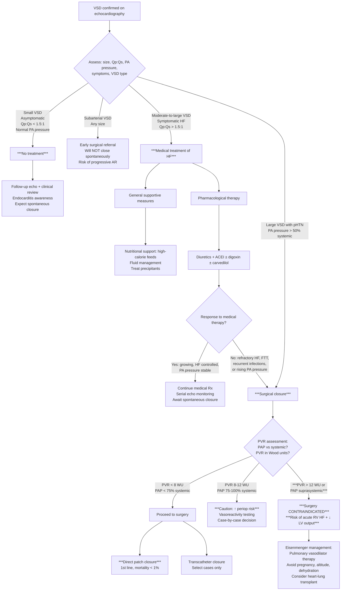

## Management of Ventricular Septal Defect in Paediatrics

### Overview — Management Philosophy

The management of VSD is guided by a fundamental principle: **most VSDs close spontaneously, so the strategy is to support the child through the symptomatic period while nature takes its course, reserving surgical intervention for those who fail medical therapy or are at risk of irreversible complications** [2][3].

***Management depends on size, symptoms, shunt ratio (pulmonary:systemic flow; Qp:Qs) and pulmonary pressure*** [2][3].

The three broad management arms are:

1. ***No treatment in small, asymptomatic VSD*** [2][3]
2. ***Medical treatment of HF in symptomatic VSD (due to chance of spontaneous closure — 60–80%)*** [2][3]
3. ***Surgical closure*** if specific indications are met [2][3]

---

### Management Algorithm

---

### 1. Conservative Management (Small, Asymptomatic VSD)

***No treatment in small, asymptomatic VSD*** [2][3].

**Rationale**: ***Small VSDs ( < 4mm): 75% spontaneously close in < 2 years, others usually benign*** [2][3]. The risk of surgical intervention far outweighs the minimal haemodynamic consequence.

**What "conservative management" actually involves:**

| Component | Detail | Rationale |
|---|---|---|
| **Regular follow-up** | Clinical review + echocardiography at intervals (e.g., 6–12 monthly initially, then annually) | Monitor for: spontaneous closure, progressive shunting, development of AR (especially subarterial type), infective endocarditis signs |
| **Endocarditis awareness** | Educate parents about maintaining good dental hygiene; prompt treatment of febrile illness | ***Infective endocarditis can occur regardless of VSD size*** [2][3]. However, current guidelines (AHA/ESC 2021–2023 and Hong Kong practice) do **NOT** recommend routine antibiotic prophylaxis for isolated unrepaired VSD unless there is a prior history of IE or the VSD is adjacent to prosthetic material. This represents a change from older practice. |
| **Growth monitoring** | Plot on growth chart at each visit | Early detection of failure to thrive (weight plateau → length → HC) that might indicate haemodynamic deterioration |
| **Activity** | No restriction for small VSD | Child can participate fully in sports and physical activity |
| **Immunisations** | Standard childhood immunisation schedule + annual influenza vaccine + RSV prophylaxis (palivizumab) if indicated | Children with haemodynamically significant CHD are at risk of severe RSV bronchiolitis — but for small VSD, standard immunisations suffice |

<Callout title="Antibiotic Prophylaxis — Updated Guidance" type="idea">
Current AHA (2021) and ESC (2023) guidelines have significantly narrowed the indications for infective endocarditis prophylaxis. For an **isolated, unrepaired VSD without prior IE**, routine antibiotic prophylaxis before dental procedures is generally **not recommended**. Prophylaxis IS recommended for: (1) prosthetic valve or prosthetic material used for VSD repair, (2) previous IE, (3) unrepaired cyanotic CHD, (4) repaired CHD with residual defects at or adjacent to the site of prosthetic patch/device. Always check local HK practice guidelines.
</Callout>

---

### 2. Medical Management of Heart Failure

***Medical treatment of HF in symptomatic VSD (due to chance of spontaneous closure)*** [2][3].

The goal is to **control symptoms** (reduce pulmonary congestion, improve growth, reduce cardiac work) while **buying time** for either spontaneous closure or planned surgical repair.

***Management of Paediatric Heart Failure*** [1]:
1. ***Identification of the cause and precipitating factors***
2. ***Tackling of precipitating factors***
3. ***General supportive management***
4. ***Medical therapy of heart failure (diuretics, digoxin, ACEI, carvedilol)***
5. ***Treatment of underlying cause, if possible, by surgical or catheter intervention***
6. ***Mechanical circulatory support and heart transplantation***

#### A. Identification and Tackling of Precipitating Factors

Before escalating therapy, always ask: **what has made this child worse right now?**

| Precipitant | Action |
|---|---|
| **Infection** (respiratory tract infection, pneumonia) | Treat with appropriate antibiotics/antivirals; respiratory support |
| **Anaemia** | Transfuse if symptomatic; investigate cause |
| **Arrhythmia** | Treat according to type (e.g., SVT → vagal manoeuvres → adenosine) |
| **Electrolyte disturbance** | Correct; common with diuretic use (hypokalaemia, hyponatraemia) |
| **Non-adherence** to medications | Parental education; simplify regimen |

#### B. General Supportive Measures

***General supportive management*** [1][2]:

| Measure | Detail | Mechanism / Rationale |
|---|---|---|
| ***Nutritional support: high caloric diet*** | Calorie-dense formula (up to 1 kcal/mL or 30 kcal/oz); medium-chain triglyceride (MCT) supplementation; nasogastric (NG) tube feeds if oral intake insufficient | ***↑ metabolic demand*** in HF means the infant needs more calories but takes in fewer (poor feeding from tachypnoea). Continuous NG feeds bypass the problem of fatigue during oral feeding. Aim for 120–150 kcal/kg/day (vs. normal ~100 kcal/kg/day for infants) [2] |
| ***Fluid restriction*** | Restrict fluid intake (typically ~120–150 mL/kg/day rather than the normal ~150–180 mL/kg/day in infants) | Reduce preload → reduce pulmonary congestion. Must balance against adequate caloric intake — hence the need for calorie-dense formula [2] |
| ***Bed rest with elevation of bed head*** | Elevate head of cot/bed to 30° | ***Improve lung function*** — reduces work of breathing by allowing gravitational drainage of pulmonary oedema from apices; reduces diaphragmatic splinting from hepatomegaly [2] |
| ***Oxygen: use with CAUTION in large L-to-R shunts*** | Supplement O₂ only if SpO₂ < 92% or significant respiratory distress | ***Caution in large L-to-R shunt: ↑PAO₂ → pulmonary vasodilation → ↓PVR → ↑shunting*** [2]. Giving oxygen to an infant with a large VSD can paradoxically **worsen** heart failure by increasing the L-to-R shunt. Use judiciously. |
| **RSV prophylaxis** | Palivizumab (anti-RSV monoclonal antibody) during RSV season for infants with haemodynamically significant CHD | Prevents severe RSV bronchiolitis which can be catastrophic in an infant already in HF |

<Callout title="Oxygen Paradox in L-to-R Shunts" type="error">
***Caution in large L-to-R shunt (e.g., VSD): ↑PAO₂ → pulmonary vasodilation → ↓PVR → ↑shunting*** [2]. This is a common exam trap. Supplemental oxygen is a potent pulmonary vasodilator — in a child with a large VSD, it reduces PVR and thereby **increases** the left-to-right shunt, worsening pulmonary overcirculation and heart failure. Only give O₂ if truly hypoxaemic (SpO₂ < 92%), not routinely for tachypnoea alone.
</Callout>

#### C. Pharmacological Therapy

***Medical therapy of heart failure: diuretics, digoxin, ACEI, carvedilol*** [1]

Let's go through each drug class with paediatric-specific dosing and rationale:

##### Diuretics — First-Line for Fluid Overload

| Drug | Class | Mechanism | Paediatric Dose | Key Points |
|---|---|---|---|---|
| **Furosemide (frusemide)** | Loop diuretic | Blocks Na⁺/K⁺/2Cl⁻ co-transporter in the thick ascending limb of Loop of Henle → inhibits NaCl and water reabsorption → ↓ intravascular volume → ↓ preload → ↓ pulmonary congestion | PO: 1–2 mg/kg/dose 1–3× daily; IV: 0.5–1 mg/kg/dose | **First drug started** in symptomatic VSD. Rapid symptom relief (reduces tachypnoea, hepatomegaly). Monitor for **hypokalaemia**, hyponatraemia, metabolic alkalosis, ototoxicity (high doses). |
| **Spironolactone** | Potassium-sparing diuretic (mineralocorticoid receptor antagonist = MRA) | Blocks aldosterone in the distal convoluted tubule and collecting duct → mild diuresis + K⁺ retention. Also anti-fibrotic effects on the myocardium. | PO: 1–3 mg/kg/day in 1–2 divided doses | Often combined with furosemide to counteract K⁺ loss. The aldosterone-blocking effect also reduces cardiac remodelling. Monitor for **hyperkalaemia** (especially with concurrent ACEI). |
| **Hydrochlorothiazide** | Thiazide diuretic | Blocks Na⁺/Cl⁻ co-transporter in the distal convoluted tubule | PO: 1–2 mg/kg/day | Sometimes added for resistant oedema (sequential nephron blockade with furosemide). Watch for hypokalaemia, hyponatraemia. |

> **Why diuretics first?** In VSD with HF, the primary problem is **volume overload** from excessive pulmonary blood flow returning to the left heart. Diuretics reduce intravascular volume, thereby reducing preload to the LA/LV, which reduces pulmonary congestion and symptoms. They do NOT fix the underlying defect — they just buy time.

##### ACE Inhibitors (ACEI) — Afterload Reduction

| Drug | Mechanism | Paediatric Dose | Key Points |
|---|---|---|---|
| **Captopril** | Inhibits angiotensin-converting enzyme → ↓ angiotensin II → ↓ SVR (afterload reduction) + ↓ aldosterone → ↓ fluid retention | Neonates: 0.05–0.1 mg/kg/dose TDS (start LOW); Infants: 0.1–0.5 mg/kg/dose TDS; Children: 0.5–1 mg/kg/dose TDS | Short-acting, allows careful dose titration. **Most commonly used ACEI in neonates/infants** due to flexibility. |
| **Enalapril** | Same as captopril but longer-acting (prodrug converted to enalaprilat) | PO: 0.05–0.1 mg/kg/day initially, ↑ to 0.1–0.5 mg/kg/day in 1–2 doses | Longer-acting, better compliance. Used in older infants/children. |

> **Why ACE inhibitors in VSD?** The key concept: by **reducing SVR**, ACEI increases the proportion of LV output that goes into the aorta (systemic circulation) rather than through the VSD into the RV and lungs. This **favourably redirects flow** away from the pulmonary circulation → reduces pulmonary overcirculation → reduces pulmonary congestion → reduces LV volume overload. Additionally, ACEI blocks neurohormonal activation (RAAS) that is upregulated in HF, reducing harmful cardiac remodelling.

| Side Effects | Monitoring |
|---|---|
| **Hypotension** (especially first dose in neonates — start VERY low) | BP monitoring before and after first dose |
| **Hyperkalaemia** (especially with spironolactone) | Serum K⁺ regularly |
| **Renal impairment** (↓ renal perfusion if pre-renal state) | RFT (creatinine, urea) |
| **Cough** (due to ↑ bradykinin) | Clinical monitoring |
| **Teratogenic** | Not relevant in paediatric age, but important for adolescent females |

##### Digoxin — Positive Inotrope

| Drug | Mechanism | Paediatric Dose | Key Points |
|---|---|---|---|
| **Digoxin** | Inhibits Na⁺/K⁺-ATPase on cardiac myocytes → ↑ intracellular Na⁺ → ↑ intracellular Ca²⁺ via Na⁺/Ca²⁺ exchanger → ↑ contractility (positive inotrope). Also ↑ vagal tone → ↓ HR (negative chronotrope). | Loading: 10–15 µg/kg PO in divided doses (neonates/infants); Maintenance: 5–10 µg/kg/day PO in 2 divided doses | ***Digoxin: seldom used due to narrow therapeutic index*** [2]. Risk of toxicity (nausea, vomiting, arrhythmias, visual disturbance). Requires **drug level monitoring** (therapeutic range 0.8–2.0 ng/mL). Toxicity enhanced by hypokalaemia (from diuretics) — must monitor K⁺. Still used in some centres as adjunctive therapy. |

<Callout title="Digoxin in Paediatric HF — Proceed with Caution" type="error">
***Digoxin is seldom used due to its narrow therapeutic index*** [2]. In the paediatric setting, the margin between therapeutic and toxic doses is very small. Toxicity is potentiated by **hypokalaemia** (common from furosemide use), **hypomagnesaemia**, **hypothyroidism**, and **renal impairment**. Signs of toxicity in infants: poor feeding, vomiting, bradycardia, new arrhythmias. Always check the serum potassium before giving digoxin and monitor drug levels.
</Callout>

##### Beta-Blockers — Neurohormonal Modulation

| Drug | Mechanism | Paediatric Dose | Key Points |
|---|---|---|---|
| **Carvedilol** | Non-selective β-blocker + α1-blocker → ↓ HR (↓ myocardial O₂ demand) + vasodilation (↓ afterload) + anti-remodelling effects | Start: 0.05 mg/kg/dose BD; Titrate slowly to 0.2–0.4 mg/kg/dose BD | Used in chronic HF management. Must be started at **very low dose** and titrated slowly — acute β-blockade can worsen HF by ↓ contractility. Contraindicated in acute decompensated HF. |

##### Other Agents (Advanced HF — Stage D)

***Stage D: above + IV inotropes (e.g., dobutamine), diuretics, non-drug Tx*** [2]

| Agent | Mechanism | Use in VSD |
|---|---|---|
| ***IV Dobutamine*** | β1-agonist → ↑ contractility + mild vasodilation | Acute decompensated HF; bridge to surgery |
| ***Milrinone*** | Phosphodiesterase-3 inhibitor ("inodilator" = inotrope + vasodilator) → ↑ contractility + ↓ SVR + ↓ PVR | Excellent in paediatric HF — provides inotropy AND afterload reduction. Particularly useful post-operatively. |
| ***IV Nitroprusside*** | Direct NO donor → arterial + venous dilation → ↓ preload + ↓ afterload | Acute HF with hypertension; requires continuous BP monitoring. Risk of cyanide toxicity with prolonged use. |
| ***IV Furosemide*** | As above but IV for rapid effect | Acute pulmonary oedema |

##### Paediatric HF Staging and Drug Selection

***Paediatric HF staging*** [2]:

| Stage | Description | Medical Therapy |
|---|---|---|
| **A** | At risk of HF but no structural/functional abnormality | ***No specific treatment*** [2] |
| **B** | Structural/functional abnormality, no symptoms | ***ACEI/ARB + BB (e.g., carvedilol)*** [2] |
| **C** | Structural disease with current or previous HF symptoms | ***ACEI/ARB + BB + MRA ± diuretics for fluid overload*** [2] |
| **D** | Refractory HF requiring specialised interventions | ***Above + IV inotropes, mechanical circulatory support, transplant*** [2] |

---

### 3. Surgical Management

#### Indications for Surgical Closure

***Surgical closure if:*** [2][3]

| Indication | Definition / Criteria | Rationale |
|---|---|---|
| ***Refractory to maximal medical treatment*** | ***Refractory HF, failure to thrive, recurrent chest infections*** despite optimal medical therapy | If medical therapy cannot control symptoms, the child is not growing, and the natural history is not heading towards spontaneous closure → surgery is needed to prevent irreversible complications [2][3] |
| ***Moderate/severe VSD with pHTN*** | ***Defined as pulmonary arterial pressure > 50% systemic*** | Persistent elevated PA pressure indicates significant haemodynamic burden and risk of progressive pulmonary vascular disease → early closure prevents Eisenmenger [2][3] |
| ***Persistent L-to-R shunt with LV dilatation*** | ***Defined as Qp:Qs > 2:1*** | Significant volume overload is present; the LV is dilating; waiting further is unlikely to result in spontaneous closure and risks LV dysfunction [2][3] |
| ***Unlikely to close spontaneously*** | ***e.g., subarterial defect, associated with RVOT infundibular stenosis*** | Subarterial VSDs do NOT close spontaneously and carry risk of progressive aortic valve prolapse/AR. RVOT infundibular stenosis complicates the haemodynamics further. [2][3] |
| ***History of infective endocarditis*** | Previous episode of IE | Ongoing VSD provides a nidus for recurrent IE [2][3] |

#### Contraindications to Surgical Closure

***Contraindication: PAP suprasystemic or PVR > 12 Wood units (WU) → risk of precipitating acute RV HF + ↓ LV output*** [2][3]

This is the Eisenmenger situation. Let's understand why surgery is contraindicated from first principles:

- In Eisenmenger syndrome, PVR is **fixed** at suprasystemic levels
- The RV is now pumping against a massively elevated afterload (fixed high PVR)
- The VSD acts as a "pop-off valve" — the RV can decompress by shunting blood R-to-L through the VSD into the LV and aorta
- If you **close the VSD surgically**, the RV loses its escape route → it faces the full brunt of the suprasystemic PVR → **acute RV failure** (cannot generate enough output against fixed high PVR)
- Simultaneously, the LV loses the contribution of R-to-L shunt blood to its output → **↓ LV output** → cardiogenic shock → death

***Caution: PAP 75–100% systemic, PVR 8–12 WU → associated with ↑ risk of perioperative complications*** [2][3] — these are the "borderline" cases where vasoreactivity testing at cardiac catheterisation helps determine operability.

| PVR / PAP | Management |
|---|---|
| PVR < 8 WU, PAP < 75% systemic | Safe to proceed with surgery |
| ***PVR 8–12 WU, PAP 75–100% systemic*** | ***↑ Risk — vasoreactivity testing, case-by-case*** [2][3] |
| ***PVR > 12 WU or PAP suprasystemic*** | ***Surgery CONTRAINDICATED*** [2][3] |

#### Surgical Procedures

##### ***Direct Patch Closure (1st Line)*** [2][3]

| Parameter | Detail |
|---|---|
| **Procedure** | Open-heart surgery via median sternotomy with cardiopulmonary bypass (CPB). The VSD is closed with a synthetic patch (e.g., Dacron or Gore-Tex) or autologous pericardial patch, sutured to the margins of the defect. |
| **Mortality** | ***Low mortality ( < 1%)*** [2][3] |
| **Re-operation rate** | Low |
| **Advantages** | Definitive; applicable to all VSD types and sizes; well-established technique with excellent long-term outcomes |
| **Risks** | Complete heart block (damage to AV node/His bundle — especially perimembranous VSD; risk ~1–3%), residual VSD (patch leak), tricuspid regurgitation, aortic regurgitation (if subarterial with prior cusp prolapse), post-CPB complications |

**Surgical approach varies by VSD type:**

| VSD Type | Surgical Approach |
|---|---|
| **Perimembranous** | Right atrial approach (through RA → tricuspid valve → access the VSD from the RV side). Careful suture placement to avoid the conduction system (His bundle runs along the posteroinferior margin). |
| **Muscular** | Can be approached via RA, or via right or left ventriculotomy for apical defects. Multiple muscular ("Swiss cheese") VSDs are technically challenging — may require combined surgical + device approach. |
| **Subarterial** | Approached via pulmonary arteriotomy or right atrial approach. Aortic valve must be inspected; if the coronary cusp has prolapsed, concurrent aortic valve repair (valvuloplasty) or replacement may be needed. |
| **Inlet** | Via RA approach, similar to AVSD repair. |

##### Transcatheter Device Closure

| Parameter | Detail |
|---|---|
| **Procedure** | Percutaneous approach (via femoral vein/artery); a septal occluder device (e.g., Amplatzer™ muscular VSD occluder) is deployed across the defect under fluoroscopic and echocardiographic guidance |
| **Indications** | ***Technically challenging, only in selected patients*** [2][3] — primarily for **muscular VSDs** (especially mid-muscular or apical, which are surgically difficult to access); also for **residual post-operative VSDs** |
| **Limitations** | ***Long-term outcome uncertain*** [2][3]. Perimembranous VSD device closure carries risk of complete heart block (proximity to conduction system) and device embolisation. Subarterial VSD generally not amenable to device closure. |
| **Contraindications** | Perimembranous VSD in many centres (too close to aortic and tricuspid valves; risk of conduction block and valvular damage); Eisenmenger syndrome; very young infants (vessel size too small for delivery sheath) |

##### ***Timing: usually at < 6 months*** [2][3]

The rationale for early surgery (before 6 months):

1. **Prevents irreversible pulmonary vascular disease** — if you wait beyond 1–2 years with a large non-restrictive VSD, the pulmonary vasculature may already have undergone irreversible changes
2. **Allows catch-up growth** — earlier repair → earlier normalisation of haemodynamics → better growth trajectory
3. **Reduces risk of recurrent LRTI** — pulmonary overcirculation predisposes to repeated infections

##### Pulmonary Artery Banding (PAB) — Palliative

| Parameter | Detail |
|---|---|
| **Procedure** | A band is placed around the main pulmonary artery to create an artificial stenosis → ↑ resistance to pulmonary flow → ↓ L-to-R shunt → "protects" the pulmonary vasculature from high-pressure high-flow damage |
| **Indication** | Now **rarely used** for isolated VSD (primary repair is preferred). May still be used in: (1) Swiss-cheese multiple muscular VSDs (too many to close surgically in infancy), (2) complex associated anomalies where definitive repair must be delayed, (3) very low birth weight neonates where CPB carries excessive risk |
| **Disadvantages** | Does not fix the VSD; creates RV pressure overload and RV hypertrophy; band migration; requires a second operation for debanding + VSD closure |

---

### 4. Management of Specific Scenarios

#### Subarterial VSD (Hong Kong / East Asian Population)

- ***Subarterial VSD does NOT spontaneously close*** [2][3]
- ***Associated with coronary cusp prolapse and AR*** [2][3]
- **Management**: Early surgical referral regardless of size. Even a small subarterial VSD with early signs of aortic cusp prolapse should be closed to **prevent progressive AR**. If AR is already moderate-to-severe, concurrent aortic valve repair may be needed.
- Particularly relevant in **Hong Kong** given the higher prevalence of subarterial VSD in Chinese/Asian populations (~15–30% vs. ~5% in Western populations) [2]

#### Eisenmenger Syndrome (Inoperable VSD)

***Surgery is CONTRAINDICATED*** [2][3]. Management is palliative and supportive:

| Measure | Detail |
|---|---|
| **Pulmonary vasodilator therapy** | Bosentan (endothelin receptor antagonist — "bos-" = blocks endothelin, a potent vasoconstrictor); Sildenafil (PDE-5 inhibitor — ↑ cGMP → pulmonary vasodilation); IV epoprostenol or inhaled iloprost (prostacyclin analogues) |
| **Avoid precipitants of decompensation** | Dehydration (↓ preload → ↓ RV output → worsening R-to-L shunt); High altitude/hypoxia (↑ PVR → ↑ R-to-L shunt); Anaesthesia (vasodilation → cardiovascular collapse); Pregnancy (CONTRAINDICATED — maternal mortality ~30–50%) |
| **Phlebotomy** | If symptomatic hyperviscosity from severe secondary polycythaemia (Hct > 65%); cautious, with volume replacement |
| **Heart-lung transplantation** | Last resort for refractory Eisenmenger; limited by donor availability |
| **Iron supplementation** | Relative iron deficiency is common due to chronic erythropoiesis; iron-deficient erythrocytes are less deformable → worsen hyperviscosity symptoms even at lower Hct |

#### Infective Endocarditis

- ***Infective endocarditis (regardless of size)*** [2][3]
- If IE occurs → treat according to standard IE guidelines (prolonged IV antibiotics based on blood culture sensitivities; surgical intervention for vegetations causing obstruction, abscess, or refractory infection)
- ***History of IE is an indication for surgical VSD closure*** [2][3]

---

### 5. Long-Term Follow-Up After Surgical Closure

| Aspect | Detail |
|---|---|
| **Residual defect** | Small residual VSDs may be present around the patch margins; usually haemodynamically insignificant; serial echo monitoring |
| **Conduction abnormalities** | Risk of complete heart block (especially perimembranous VSD) — may require permanent pacemaker (~1–3% risk) |
| **Valvular regurgitation** | TR (from surgery near tricuspid valve), AR (if subarterial with cusp prolapse) — monitor on echo |
| **Endocarditis prophylaxis post-repair** | Recommended for **6 months** after surgical closure (while prosthetic material endothelialises). After 6 months, if no residual defect → discontinue prophylaxis. If residual defect near prosthetic material → continue prophylaxis indefinitely. |
| **Exercise** | After successful closure with no residual haemodynamic issues → no exercise restriction. If residual pHTN or ventricular dysfunction → graded activity guidance. |
| **Growth** | Rapid catch-up growth typically occurs after successful repair; document on growth charts |

---

### 6. Family-Centred Care and Communication

| Aspect | Detail |
|---|---|
| **Parental education** | Explain the natural history (most close spontaneously); explain why surgery is needed if it is; explain the risks and benefits in age-appropriate language |
| **Feeding support** | Lactation consultant involvement; teach parents about nasogastric feeding if needed; reassure that feeding difficulties improve after repair |
| **Psychological support** | Cardiac diagnosis in a newborn/infant causes significant parental anxiety; offer support groups, social worker involvement |
| **Developmental surveillance** | Children with CHD are at risk of neurodevelopmental delay (from chronic hypoxia, prolonged hospitalisation, CPB); ensure developmental assessments at key milestones |
| **Genetic counselling** | If syndromic features or family history of CHD; recurrence risk discussion for future pregnancies |
| **Transition care** | Adolescents with repaired VSD need transition to adult congenital heart disease services; discuss contraception (especially if residual pHTN), career, and activity guidance |

---

<Callout title="High Yield Summary">

**Management of VSD is stratified by size, symptoms, and haemodynamics:**

1. ***Small, asymptomatic VSD → No treatment; follow-up; endocarditis awareness*** [2][3]
2. ***Symptomatic VSD → Medical therapy of HF (diuretics, ACEI, ± digoxin, ± carvedilol)*** to buy time for spontaneous closure [1][2][3]
3. ***Surgical closure (usually < 6 months)*** if: ***refractory HF/FTT/recurrent LRTI; PA pressure > 50% systemic; Qp:Qs > 2:1; unlikely to close (subarterial); prior IE*** [2][3]
4. ***1st line surgical procedure: direct patch closure (mortality < 1%)***; transcatheter closure in selected muscular VSDs only [2][3]
5. ***Surgery CONTRAINDICATED if PAP suprasystemic or PVR > 12 WU*** → Eisenmenger → pulmonary vasodilator therapy [2][3]
6. ***Caution with O₂ in large L-to-R shunts — ↓PVR → ↑shunting*** [2]
7. ***Digoxin seldom used due to narrow therapeutic index*** [2]
8. **Subarterial VSD**: early surgical referral regardless of size (no spontaneous closure + progressive AR risk) — especially important in Hong Kong/East Asian populations

</Callout>

---

<ActiveRecallQuiz
  title="Active Recall - Management of VSD"
  items={[
    {
      question: "List the 5 indications for surgical closure of VSD.",
      markscheme: "(1) Refractory HF, FTT, or recurrent chest infections despite maximal medical therapy; (2) Moderate/severe VSD with pHTN (PA pressure > 50% systemic); (3) Persistent L-to-R shunt with LV dilatation (Qp:Qs > 2:1); (4) VSD unlikely to close spontaneously (subarterial, associated RVOT infundibular stenosis); (5) History of infective endocarditis.",
    },
    {
      question: "Why is surgical VSD closure contraindicated in Eisenmenger syndrome? Explain the haemodynamic consequence.",
      markscheme: "In Eisenmenger, PVR is fixed at suprasystemic levels. The VSD acts as a pop-off valve allowing the RV to decompress via R-to-L shunting. If the VSD is closed, the RV faces the full suprasystemic PVR without an escape route, leading to acute RV failure. Simultaneously, LV output decreases as it loses R-to-L shunt contribution. This combination causes cardiogenic shock and death.",
    },
    {
      question: "Why must supplemental oxygen be used with caution in infants with large L-to-R shunt VSD?",
      markscheme: "Oxygen is a potent pulmonary vasodilator. In large VSD, supplemental O2 increases alveolar PO2, which causes pulmonary vasodilation and decreases PVR. The decreased PVR increases the pressure gradient favouring L-to-R shunting, worsening pulmonary overcirculation, pulmonary congestion, and heart failure symptoms.",
    },
    {
      question: "Explain the mechanism by which ACE inhibitors improve haemodynamics in VSD with heart failure.",
      markscheme: "ACE inhibitors reduce SVR (afterload reduction) by blocking angiotensin II production. In VSD, blood can exit the LV either into the aorta (systemic) or through the VSD (pulmonary). By reducing SVR, ACEI makes the systemic route relatively more favourable, redirecting flow from pulmonary to systemic circulation. This reduces pulmonary overcirculation and LV volume overload. Additionally, ACEI blocks RAAS neurohormonal activation, reducing cardiac remodelling.",
    },
    {
      question: "What are the PVR thresholds that determine surgical operability vs contraindication in VSD? What should be done in the borderline zone?",
      markscheme: "PVR < 8 WU with PAP < 75% systemic: safe for surgery. PVR 8-12 WU with PAP 75-100% systemic: borderline zone with increased perioperative risk; requires vasoreactivity testing at cardiac catheterisation. PVR > 12 WU or PAP suprasystemic: surgery is contraindicated (Eisenmenger).",
    },
    {
      question: "Why is the usual timing for surgical VSD repair before 6 months of age? Name 3 reasons.",
      markscheme: "(1) Prevents irreversible pulmonary vascular disease (prolonged exposure to high-pressure high-flow state causes intimal fibrosis and plexiform lesions); (2) Allows catch-up growth by normalising haemodynamics early; (3) Reduces risk of recurrent lower respiratory tract infections from ongoing pulmonary congestion.",
    },
  ]}
/>

---

## References

[1] Lecture slides: GC 147. Heart failure and cyanosis in children acyanotic and cyanotic congenital heart disease - Part 1.pdf (p26–27, p36–38)
[2] Senior notes: Adrian Lui Pediatrics.pdf (p200, p201, p202, p205)
[3] Senior notes: Ryan Ho Cardiology.pdf (p193, p194)
