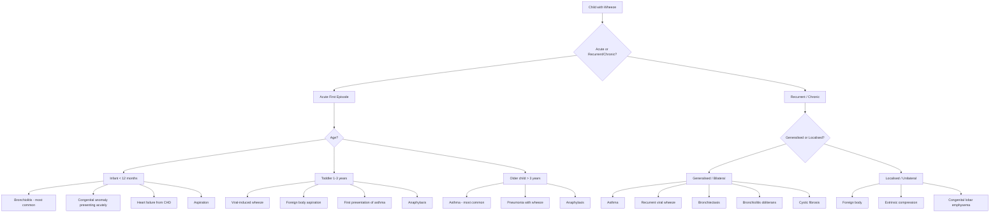

## Differential Diagnosis of Wheeze in Children

The differential diagnosis of wheeze in children is considerably broader than in adults. The key principle is that **wheeze is a sign, not a diagnosis** — your job is to work backwards from the physical sign to the underlying pathology. The approach differs fundamentally by **age**, **acuity** (acute vs chronic/recurrent), and **distribution** (generalised vs localised).

Let me walk you through this systematically.

---

### Organising Framework

The best way to think about the differential is to combine **anatomical location of narrowing** with **mechanism of narrowing** and then overlay **age**. Here is a clinical decision framework:

---

### Major Differential Diagnoses — Organised by Age Group

#### A. Infants (0–12 months)

| Diagnosis | Key Differentiating Features | Why It Causes Wheeze |
|---|---|---|
| ***Acute viral bronchiolitis*** (most common) | Age < 12 months (peak 2–6 months); winter season in HK; coryzal prodrome 1–3 days → cough → wheeze → ↑work of breathing; caused by RSV in ~60–80% | RSV infects bronchiolar epithelial cells → cell necrosis, sloughing into lumen → mucosal oedema + mucus plugging + inflammatory debris → obstruction of small airways. Infants' airways are tiny — even minor oedema causes disproportionate narrowing (Poiseuille's law: R ∝ 1/r⁴) |
| **Congenital heart disease with LV failure** | Tachypnoea, poor feeding, failure to thrive, hepatomegaly, cardiac murmur; ***CXR: crackles ± expiratory wheeze*** [7] | Left-to-right shunt (VSD, PDA, AVSD) → pulmonary overcirculation → pulmonary venous congestion → ***peribronchial cuffing*** (fluid-thickened bronchial wall compresses airway lumen) [7] → airway narrowing → wheeze. Also interstitial oedema reduces airway calibre |
| **Tracheo/bronchomalacia** | Persistent wheeze from birth; characteristically worse with crying, feeding, URTI; improves in prone position; may have biphasic or expiratory wheeze | Deficient cartilage rings → airway wall lacks structural support → dynamic collapse during expiration when intrathoracic pressure exceeds intraluminal pressure |
| **Vascular ring/sling** | Fixed wheeze ± stridor from birth; ***stridor*** component often biphasic; dysphagia (oesophageal compression); not responsive to bronchodilators | Anomalous great vessels (e.g., double aortic arch, pulmonary artery sling) encircle or compress trachea/bronchi from outside → fixed narrowing |
| ***Aspiration lung disease*** | ***Feeding difficulties*** [1]; cough/wheeze during or after feeds; vomiting, posseting; ***neurodevelopmental abnormality*** [1] | Microaspiration of feeds or gastric contents → chemical pneumonitis → airway mucosal inflammation → bronchospasm and oedema. Recurrent aspiration causes chronic airway inflammation |
| **Cystic fibrosis** | ***Failure to thrive*** [1], ***daily moist/productive cough*** [1], recurrent chest infections, steatorrhoea; ***digital clubbing*** [1] if chronic | CFTR dysfunction → thick, dehydrated airway secretions → impaired mucociliary clearance → chronic infection → bronchial wall inflammation and oedema → airway obstruction |
| **Congenital lobar emphysema / CPAM** | Progressive respiratory distress; unilateral hyperinflated hemithorax on CXR | Congenitally abnormal lobe traps air → progressive overexpansion → compression of adjacent normal lung |
| **Bronchopulmonary dysplasia** | History of prematurity and prolonged ventilation/oxygen; chronic respiratory symptoms from neonatal period | Arrested alveolar development + airway injury from barotrauma/volutrauma and oxygen toxicity → airway inflammation, smooth muscle hypertrophy, and fibrosis |

<Callout title="Cardiac Wheeze in Infants" type="idea">
A baby with wheeze who is NOT responding to bronchodilators, has poor weight gain, and has a cardiac murmur or hepatomegaly may have **congenital heart disease with left heart failure**. The wheeze is caused by peribronchial oedema from pulmonary venous congestion, NOT bronchospasm — hence why salbutamol doesn't help. Always examine the liver and feel the precordium in any wheezy infant.
</Callout>

#### B. Toddlers and Preschool Children (1–5 years)

| Diagnosis | Key Differentiating Features | Why It Causes Wheeze |
|---|---|---|
| **Episodic viral wheeze** (most common in this age group) | Wheeze ONLY during viral URTI; completely asymptomatic between episodes; no atopic features; typically outgrown by age 5–6 | Viral infection (rhinovirus, RSV) → airway inflammation, mucosal oedema, mucus hypersecretion → obstruction of small, compliant toddler airways. No underlying chronic inflammation (unlike asthma) |
| ***Foreign body aspiration*** | ***Sudden onset*** in previously well child; history of choking episode (may be absent in ~40%); ***localised/unilateral wheeze*** [3][4]; peak age 1–3 years (oral exploration phase) | FB lodges in bronchus (right more common — wider, more vertical) → partial obstruction → ball-valve effect (air enters on inspiration but cannot escape on expiration) → distal air trapping → localised wheeze. Complete obstruction → atelectasis |
| **Multi-trigger wheeze / Early asthma** | Wheeze with viruses AND other triggers (exercise, allergens, cold air); interval symptoms between episodes; atopic comorbidities (eczema, allergic rhinitis) | Chronic Th2-driven eosinophilic airway inflammation → bronchial hyperreactivity → bronchospasm + mucosal oedema + mucus plugging in response to multiple triggers |
| ***Croup (viral laryngotracheobronchitis)*** | Age ***6 months to 6 years (peak 2 years)***; ***barking cough, hoarseness, stridor*** [8]; ***worse at night*** [8]; preceded by coryzal symptoms | Parainfluenza virus (most common) → subglottic mucosal inflammation and oedema → narrowing of the subglottic region (narrowest part of paediatric airway). Primarily causes **stridor** (extrathoracic obstruction), but if inflammation extends to bronchi ("laryngo-tracheo-**bronch**-itis"), lower airway wheeze may also be present [8] |
| **Protracted bacterial bronchitis** | Chronic wet cough > 4 weeks; responds to prolonged antibiotics (2–4 weeks amoxicillin-clavulanate); no features of alternative diagnosis | Bacterial infection of bronchial mucosa (non-typeable H. influenzae, M. catarrhalis, S. pneumoniae) → chronic neutrophilic airway inflammation → mucosal oedema and excess mucus → airway narrowing |
| ***Anaphylaxis*** | Acute onset after allergen exposure (food, insect sting, drug); ***wheeze/bronchospasm + urticaria + angioedema ± hypotension*** [9]; ***respiratory compromise: dyspnoea, wheezes, bronchospasm, stridor*** [9] | IgE-mediated mast cell degranulation → massive histamine/leukotriene release → bronchospasm + mucosal oedema + ↑vascular permeability → upper and lower airway obstruction |

#### C. School-age Children and Adolescents (5–18 years)

| Diagnosis | Key Differentiating Features | Why It Causes Wheeze |
|---|---|---|
| ***Asthma*** (most common by far) | ***Recurrent episodic attacks of wheezing, chest tightness, breathlessness, cough*** [3][4]; ***triggers: exercise (esp cold air), allergens, pollutants, viral URTI, medications (NSAIDs, β-blockers)*** [3][4]; ***diurnal variation (worse at night/early morning)*** [3][4]; ***±signs of atopy (allergic rhinitis, eczema)*** [3][4]; ***response to bronchodilator*** | Chronic eosinophilic airway inflammation → bronchial hyperreactivity → ***smooth muscle hyperplasia → ↑bronchoconstriction; goblet cell hyperplasia → ↑mucus secretion; fibrosis → airway wall thickening*** [3][4] |
| ***Bronchiectasis*** | ***Chronic dyspnoea, cough and airflow obstruction; prominent cough with mucopurulent sputum production ± haemoptysis; diagnosed by CXR/HRCT demonstrating airway dilatation ('tram-line' appearance)*** [3][4] | Permanently dilated and damaged airways → loss of mucociliary clearance → chronic infection → inflammatory exudate and mucus plug small airways → airway obstruction → wheeze |
| ***Bronchiolitis obliterans*** | History of severe previous infection (adenovirus, Mycoplasma) or post-transplant; persistent wheeze and exercise intolerance; poor response to bronchodilators; mosaic attenuation on HRCT | Fibroproliferative obliteration of small airways → fixed obstruction of bronchioles → air trapping and wheeze |
| ***Central airway obstruction*** | ***Exertional dyspnoea ± monophonic wheeze; flow-volume loop characteristic for upper airway obstruction (expiratory plateau)*** [3][4]; may be due to ***luminal or extraluminal masses*** [3] | Tumour, lymphadenopathy, or other mass compresses central airway → fixed narrowing → monophonic wheeze (single note because only one airway is narrowed) |
| **Vocal cord dysfunction / Inducible laryngeal obstruction** | "Wheeze" actually loudest over larynx/neck (not lung fields); inspiratory > expiratory; exercise-triggered; normal spirometry between episodes; flattened inspiratory loop on flow-volume curve; does NOT respond to bronchodilators; often anxious adolescent | Paradoxical adduction (closure) of vocal cords during inspiration → upper airway obstruction. This is technically **stridor**, not true wheeze, but is frequently misdiagnosed as "refractory asthma" |
| **Allergic bronchopulmonary aspergillosis** | In CF or poorly controlled asthma; central bronchiectasis; ↑total IgE; blood/sputum eosinophilia; positive Aspergillus IgE/precipitins | Type I + III hypersensitivity to Aspergillus → intense eosinophilic inflammation → mucus plugging of central airways → wheezing |
| **Psychogenic dyspnoea / Hyperventilation** | Chest tightness, air hunger; no objective wheeze on auscultation; often adolescent with anxiety; normal SpO₂; perioral/digital tingling (hypocapnic alkalosis) | No actual airway pathology; patient reports "wheeze" but it is absent on examination. Important to distinguish from organic causes |

---

### Classification of Differentials by Distribution

This is a high-yield way to narrow the differential at the bedside:

***D/dx of generalised wheeze*** [3][4]:
- ***Asthma***
- ***Bronchiectasis***
- ***Bronchiolitis obliterans***
- ***Viral bronchiolitis (in children)***

***D/dx of localised wheeze*** [3][4]:
- ***Tumour***
- ***Foreign body***

> The logic is straightforward: **generalised (bilateral, polyphonic) wheeze** = **diffuse** airway process (many airways narrowed to different degrees producing many notes simultaneously). **Localised (unilateral, monophonic) wheeze** = **focal** obstruction at a single point (one note). If you hear a fixed monophonic wheeze that does not change with coughing or position, you MUST exclude foreign body (in toddlers) or tumour/mass (in older children/adolescents) [3][4][10].

---

### The Lecture Slide Approach to Acute Cough with Wheeze

***The lecture slides [1] provide a systematic approach to identifying the cause of cough in children. When wheeze is the dominant associated sign:***

| ***Question*** | ***Features*** | ***Likely Diagnosis*** |
|---|---|---|
| ***Is this a lower respiratory tract illness?*** | ***Tachypnoea (> 60 for < 2 months, > 50 for 2–12 months, > 40 for > 1 year), respiratory distress with increased work of breathing, chest signs (crepitations or wheeze/rhonchi), fever*** | ***Acute bronchiolitis, Pneumonia (viral, bacterial), Asthma*** [1] |
| ***Is this an allergic/atopic illness?*** | ***Seasonal and diurnal variation, association with rhinitis, posture, 'clearing of throat', triggers (dust, pollutant, pollen etc.)*** | ***Post-nasal drip from allergic rhinitis, Reactive airway/asthma*** [1] |
| ***Is this an acute exacerbation of a chronic respiratory disorder?*** | ***Failure to thrive, finger clubbing, chest deformity, features of atopy*** | ***CF, bronchiectasis, chronic lung disease*** [1] |

***Specific cough associations with wheeze*** [1]:
- ***Wheeze → Intrathoracic airway lesion (e.g., asthma, foreign body)***
- ***Crepitations → Parenchymal disease***
- ***Digital clubbing → Chronic suppurative lung disease***
- ***Failure to thrive → Serious systemic including pulmonary illness***
- ***Feeding difficulties → Aspiration lung disease, serious systemic illness***
- ***Recurrent pneumonia → Immunodeficiency, congenital lung abnormalities, tracheo-oesophageal H fistula***

---

### Critical Distinctions: Wheeze vs Stridor

This is a point where students frequently get confused [8][10]:

| Feature | Wheeze | Stridor |
|---|---|---|
| **Origin** | ***Intrathoracic*** (lower) airway | ***Extrathoracic*** (upper) airway |
| **Phase** | Predominantly ***expiratory*** (inspiratory = severe) | Predominantly ***inspiratory*** (expiratory = severe) |
| **Mechanism** | During ***expiration***, +ve intrathoracic pressure narrows intrathoracic airways that are already diseased → turbulent flow [8] | During ***inspiration***, −ve intrathoracic pressure collapses extrathoracic airways that are already narrowed → turbulent flow [8] |
| **Typical causes** | Asthma, bronchiolitis, FB in bronchus | Croup, laryngomalacia, FB at larynx, epiglottitis |
| **Loudest** | Over lung fields | Over trachea/neck |

> ***Pathophysiology [8]***: During inspiration, negative intrapleural pressure dilates intrathoracic airways but collapses extrathoracic airways → extrathoracic obstruction presents as ***stridor***. During expiration, positive intrapleural pressure collapses intrathoracic airways but dilates extrathoracic airways → intrathoracic obstruction presents as ***wheeze*** [8].

---

### Less Common but Must-Know Differentials

| Diagnosis | Why You Must Know It | Key Clue |
|---|---|---|
| **Primary ciliary dyskinesia (PCD)** | Chronic wet cough from birth, recurrent otitis media, situs inversus (50% — Kartagener syndrome), neonatal respiratory distress | Immotile cilia → impaired mucociliary clearance → chronic airway secretions → wheeze; think of it when there is situs inversus + chronic respiratory symptoms |
| **Immunodeficiency** | ***Recurrent pneumonia*** [1]; failure to thrive; unusual or opportunistic infections | Inability to clear respiratory pathogens → chronic/recurrent lower airway infection → airway inflammation → wheeze |
| **Tracheo-oesophageal fistula (H-type)** | ***Recurrent pneumonia*** [1]; cough and wheeze with feeds; recurrent aspiration | Abnormal connection between trachea and oesophagus → aspiration of feeds into airway → chemical pneumonitis and chronic airway inflammation |
| ***Carcinoid syndrome*** | ***Bronchospasm (10–20%): wheezing and dyspnoea often during flushing episodes*** [11] | Rare in children; when present: episodic flushing + diarrhoea + wheeze due to histamine/serotonin release |
| **Eosinophilic oesophagitis / GORD** | Chronic cough and wheeze in atopic child; symptoms worse after feeds or supine | Refluxate → microaspiration and/or vagal reflex bronchospasm |
| **Mediastinal mass** | Progressive wheeze + dyspnoea; orthopnoea (worse lying flat); SVC syndrome (facial swelling) | Lymphoma/thymoma compresses trachea or bronchi → fixed monophonic wheeze |

---

### Approach to Narrowing the Differential

When you see a wheezy child, ask yourself these **five key questions** in sequence:

1. **How old is the child?** (Infant → bronchiolitis/congenital; toddler → FB/viral wheeze; school-age → asthma)
2. **Is this acute or chronic/recurrent?** (First episode → bronchiolitis, FB, anaphylaxis; recurrent → asthma, CF)
3. **Is the wheeze generalised or localised?** (Generalised → diffuse disease; localised → FB, mass)
4. **Are there red flags?** (FTT, clubbing, neonatal onset, persistent wet cough, no bronchodilator response, focal signs → alternative to asthma)
5. **Does it respond to bronchodilator?** (Yes → likely reversible airway obstruction/asthma; No → structural, cardiac, or fixed obstruction)

<Callout title="The 'Not Everything Is Asthma' Checklist" type="error">
If any of the following are present, you must actively exclude alternatives before labelling a child as asthmatic:
- Neonatal onset
- Symptoms exclusively with feeds (aspiration)
- Failure to thrive or poor growth
- Digital clubbing
- Persistent focal/localised wheeze
- Persistent daily wet/productive cough with purulent sputum
- No response to adequate trial of bronchodilator/ICS
- Cardiac murmur or hepatomegaly
- Stridor component
- Recurrent pneumonia with unusual organisms
</Callout>

---

### Summary Table: Key Differentiating Features

| Feature | Asthma | Bronchiolitis | Foreign Body | CHD/HF | CF | VCD |
|---|---|---|---|---|---|---|
| **Age** | Usually > 3y | < 12m | 1–3y (peak) | Any | Any | Adolescent |
| **Onset** | Episodic, recurrent | Acute, single | Sudden | Gradual | Chronic | Exercise-triggered |
| **Wheeze pattern** | Generalised, polyphonic | Generalised | ***Localised, monophonic*** | Generalised | Generalised | Inspiratory "wheeze" |
| **Cough** | Dry, nocturnal | Wet | Paroxysmal | Wet if pulm oedema | Chronic productive | Absent or minimal |
| **Atopy** | +++  | − | − | − | − | − |
| **Growth** | Normal | Normal | Normal | ***FTT*** | ***FTT*** | Normal |
| **Clubbing** | ***Never*** | No | No | Cyanotic CHD | ***Yes (late)*** | No |
| **Bronchodilator response** | ***Yes*** | Minimal/None | No | No | Variable | No |
| **CXR** | Normal/hyperinflated | Hyperinflated | Unilateral hyperinflation or normal | Cardiomegaly, pulm oedema | Hyperinflation, bronchiectasis | Normal |

<Callout title="High Yield Exam Point">

***The differential of generalised wheeze in children = asthma, bronchiectasis, bronchiolitis obliterans, viral bronchiolitis.
The differential of localised wheeze in children = foreign body, tumour.*** [3][4]

In a preschool child with recurrent wheeze, distinguish **episodic viral wheeze** (wheeze only with URTI, asymptomatic between) from **multi-trigger wheeze** (wheeze with viruses AND exercise/allergens/cold air) — the latter is more likely true asthma and more likely to persist.

Always remember: ***wheeze → intrathoracic airway lesion (e.g., asthma, foreign body)*** [1]. But the absence of wheeze in a dyspnoeic child ("silent chest") is a **pre-arrest sign** [3].
</Callout>

---

<ActiveRecallQuiz
  title="Active Recall - Differential Diagnosis of Wheeze"
  items={[
    {
      question: "Name 4 causes of generalised wheeze and 2 causes of localised wheeze in children.",
      markscheme: "Generalised: asthma, viral bronchiolitis, bronchiectasis, bronchiolitis obliterans. Localised: foreign body, tumour. (Accept: COPD in adults context but prioritise paediatric causes.)"
    },
    {
      question: "A 9-month-old presents in winter with coryzal prodrome followed by cough, wheeze, and increased work of breathing. What is the most likely diagnosis and the most common causative organism?",
      markscheme: "Acute viral bronchiolitis. Most common cause: Respiratory Syncytial Virus (RSV). Age under 12 months with winter seasonality and coryzal prodrome are classic."
    },
    {
      question: "Explain why congenital heart disease with left-to-right shunt can cause wheeze in an infant, and why this wheeze does NOT respond to salbutamol.",
      markscheme: "L-to-R shunt (VSD, PDA) causes pulmonary overcirculation and pulmonary venous congestion. This leads to peribronchial cuffing (interstitial fluid around bronchial walls) which physically compresses airway lumen, narrowing it. This is a mechanical compression, not bronchospasm, so beta-2 agonists like salbutamol (which relax smooth muscle) have no effect."
    },
    {
      question: "A previously well 18-month-old suddenly develops unilateral wheeze while playing. What is the most important diagnosis to consider, and what is the key investigation?",
      markscheme: "Foreign body aspiration. Key investigation: rigid bronchoscopy (both diagnostic and therapeutic). CXR may show unilateral hyperinflation, mediastinal shift, or may be normal - a normal CXR does NOT exclude FB."
    },
    {
      question: "Explain the physiology behind why extrathoracic obstruction causes stridor (inspiratory) while intrathoracic obstruction causes wheeze (expiratory).",
      markscheme: "During inspiration, negative intrapleural pressure is transmitted to intrathoracic airways (dilating them) but creates a pressure gradient that collapses the extrathoracic airway at the point of obstruction - hence inspiratory stridor. During expiration, positive intrapleural pressure compresses intrathoracic airways (narrowing them further at any point of obstruction) while the extrathoracic airway is pushed open - hence expiratory wheeze."
    },
    {
      question: "An adolescent athlete has recurrent episodes of wheeze and dyspnoea during exercise that do NOT respond to inhaled salbutamol. Spirometry between episodes is normal. The wheeze seems loudest over the neck. What diagnosis should you consider?",
      markscheme: "Vocal cord dysfunction (VCD) / Inducible laryngeal obstruction. Key clues: exercise-triggered, no response to bronchodilator, loudest over neck (not lung fields), normal interval spirometry. Diagnosed by direct laryngoscopy during symptoms showing paradoxical vocal cord adduction during inspiration. Flow-volume loop may show flattened inspiratory limb."
    }
  ]}
/>

---

## References

[1] Lecture slides: GC 141. A child with cough acute and chronic cough in children.pdf, p15, p20
[3] Senior notes: Adrian Lui Pediatrics.pdf, p170–172 (Asthma — Clinical Features and D/dx)
[4] Senior notes: Ryan Ho Respiratory.pdf, p97–98 (Asthma — Clinical Features and D/dx)
[7] Senior notes: Ryan Ho Cardiology.pdf, p73 (Acute Decompensated HF)
[8] Senior notes: Adrian Lui Pediatrics.pdf, p155, p161 (Stridor vs Wheeze, Croup)
[9] Senior notes: Ryan Ho Critical Care.pdf, p24 (Anaphylactic Shock)
[10] Senior notes: Ryan Ho Fundamentals.pdf, p55 (Adventitious Sounds — Wheezes)
[11] Senior notes: Ryan Ho Endocrine.pdf, p66 (Carcinoid Syndrome — D/dx of episodic flushing)
