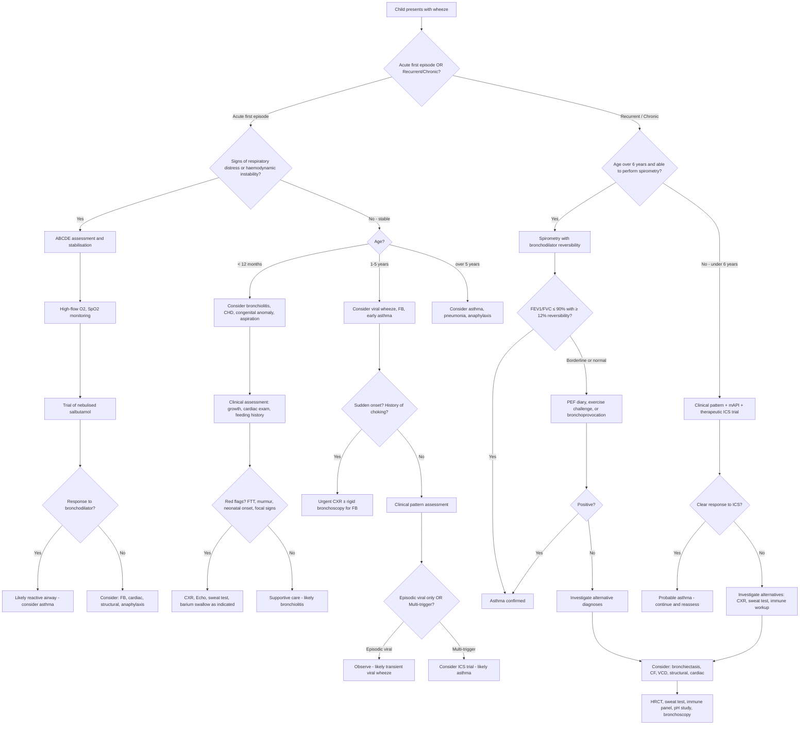

## Diagnosis of Wheeze in Children — Criteria, Algorithm, and Investigations

### Guiding Principle: Wheeze Diagnosis Is Age-Dependent

Here is the fundamental challenge in paediatric wheeze diagnosis: **there is no single diagnostic test**. Unlike, say, troponin for MI, the diagnosis of the cause of wheeze in a child relies on a **pattern of clinical features, age-appropriate investigations, and response to treatment**. The approach differs dramatically between:

- **Infants < 12 months**: diagnosis is almost entirely clinical (spirometry impossible); focus on excluding serious structural/cardiac causes
- **Preschool children (1–5 years)**: clinical pattern recognition ± therapeutic trial; spirometry unreliable in most under 5–6 years
- **School-age children (≥ 6 years)**: spirometry becomes feasible and is the cornerstone for confirming asthma

Let's work through this systematically.

---

### Diagnostic Criteria for the Most Common Causes of Wheeze

#### A. Asthma (The Most Common Cause of Recurrent Wheeze in Children > 5 years)

> ***Diagnosis is predominantly clinical based on compatible Hx ± PE*** [3][4]

##### Clinical Diagnostic Criteria (GINA 2023/2024 for Children ≥ 6 years)

Both of the following must be present:

1. **History of characteristic symptom pattern**: ***Variable symptoms of wheezes, cough, chest tightness, SOB*** [3][4]
   - More than one type of symptom (wheeze, cough, dyspnoea, chest tightness)
   - Symptoms ***worse at night or early morning*** [3][4]
   - Symptoms vary over time and in intensity
   - ***Triggered by exercise, allergens, cold air, viral URTI, laughter*** [4]
   - ***±Signs of atopy (allergic rhinitis, eczema)*** [4]

2. **Confirmed variable expiratory airflow limitation**: at least once during the diagnostic process

| Test | Criterion for Children | Explanation |
|---|---|---|
| ***FEV₁/FVC ratio*** | ***≤ 85% in children*** (cf. ***≤ 75% in adults***) [3]; GINA 2024 uses ***≤ 90% in children*** [4] as a more sensitive cut-off | Normal ratio is higher in children than adults because paediatric airways are proportionally more patent relative to lung volume. A ratio of 0.85 in a child is already abnormal, whereas in an adult it might be borderline |
| ***Bronchodilator reversibility*** | ***≥ 12% increase in FEV₁*** after 200–400 µg salbutamol (10–15 min post-inhalation) [3][4] | Note: the ***200 mL absolute increase*** required in adults is NOT mandated in children (their lungs are smaller, so a 12% relative change may be < 200 mL) |
| ***PEF diurnal variability*** | ***> 10% variability*** in twice-daily PEF over 1–2 weeks [3][4] (calculated as ***daily amplitude percent mean = [daily max − daily min] / mean of daily max and min***) [3] | Reflects the hallmark of asthma: variable airflow obstruction. Morning dip is characteristic |
| ***Exercise challenge*** | ***> 10% decrease in FEV₁*** (***and > 200 mL in adults***) ***after 6 min exercise*** [3][4] | Exercise → airway drying/cooling → mast cell degranulation → bronchospasm |
| ***Bronchoprovocation test*** | ***≥ 20% decrease in FEV₁ post-methacholine/histamine at standard dose*** [3][4] OR ***≥ 15% decrease post-hyperventilation, hypertonic saline or mannitol*** [3][4] | ***Not routinely done — only when lung function at rest is normal*** [3][4]. Tests bronchial hyperreactivity directly. High sensitivity but lower specificity (positive in some non-asthmatics) |
| **ICS therapeutic trial** | Significant improvement in FEV₁ or symptoms after ***4 weeks of inhaled corticosteroid treatment*** [3][4] | If the child improves, this supports the diagnosis retrospectively |

<Callout title="FEV₁/FVC in Children vs Adults" type="error">
A common mistake: applying the adult cut-off (FEV₁/FVC < 0.70 or < 75%) to children. Children normally have FEV₁/FVC ratios of 0.85–0.90+. Using the adult threshold will **miss genuine obstruction** in children. ***GINA specifies ≤ 90% for children*** [4] as the threshold, though some paediatric guidelines use ≤ 85% [3]. The principle is the same — use age-appropriate normal values.
</Callout>

##### Asthma in Preschool Children (< 6 years): Probability-Based Approach

Spirometry is generally not reliable in children under 5–6 years (they cannot perform forced expiratory manoeuvres reproducibly). Diagnosis is therefore based on:

- **Clinical pattern recognition**: episodic wheeze with multiple triggers, interval symptoms, atopic comorbidities, family history
- **Modified Asthma Predictive Index (mAPI)**: used to estimate the probability that a wheezing preschooler will develop persistent asthma

| **mAPI Criteria** | |
|---|---|
| **Major criteria (any 1)** | Parent with asthma; physician-diagnosed eczema; sensitisation to ≥ 1 aeroallergen |
| **Minor criteria (any 2)** | Sensitisation to milk, egg, or peanut; wheezing unrelated to colds; blood eosinophils ≥ 4% |
| **Positive mAPI** | ≥ 4 wheezing episodes/year + 1 major OR 2 minor criteria → ~77% chance of active asthma at age 6–13 |
| **Negative mAPI** | ~95% chance of NOT having asthma at school age |

- **Therapeutic trial**: a trial of low-dose ICS for 2–3 months with assessment of response is often the most pragmatic diagnostic tool in this age group. Clear improvement supports asthma; no improvement should prompt consideration of alternative diagnoses.

#### B. Acute Viral Bronchiolitis (Infants < 12 months)

Diagnosis is **entirely clinical** — no specific test is required:

- Age < 12 months (classically 2–6 months)
- Seasonal: winter in Hong Kong (RSV peak)
- Coryzal prodrome 1–3 days → progressive cough, wheeze, tachypnoea, increased work of breathing
- Auscultation: widespread wheeze ± fine crepitations
- **Investigations are NOT routinely needed** in straightforward cases
  - NPA for viral identification (RSV, rhinovirus) useful for cohorting in hospital but does not change management
  - ***CXR should be considered in the presence of lower respiratory tract signs*** [12] but is NOT routinely indicated — it often shows hyperinflation ± patchy atelectasis and rarely changes management

#### C. Foreign Body Aspiration

- **Clinical diagnosis of suspicion**: sudden-onset wheeze/cough in a previously well child aged 1–3 years ± choking episode
- **CXR**: may show unilateral hyperinflation (air trapping — ball-valve effect), mediastinal shift away from affected side, or may be **completely normal**
- **Inspiratory/expiratory CXR or lateral decubitus films**: air trapping on the affected side is more evident on expiration (the obstructed side remains hyperinflated while the normal side deflates)
- **Definitive diagnosis**: ***rigid bronchoscopy*** — both diagnostic and therapeutic (allows FB visualisation and removal)

---

### Diagnostic Algorithm for the Wheezy Child

---

### Investigation Modalities — Detailed Interpretation

#### 1. Bedside / First-Line Investigations

##### a. Pulse Oximetry (SpO₂)

- **What it tells you**: peripheral oxygen saturation — a surrogate for PaO₂
- **Why it matters in wheeze**: V/Q mismatch from airway obstruction → hypoxaemia; SpO₂ < 92% in an acute wheeze episode indicates significant disease requiring escalation
- **Paediatric normal values**: SpO₂ ≥ 95% at sea level (in neonates, pre-ductal SpO₂ ≥ 95% expected by 10 minutes of life)
- **Limitations**: SpO₂ lags behind acute desaturation; unreliable if poor perfusion, movement artefact, CO poisoning, methaemoglobinaemia

##### b. Peak Expiratory Flow (PEF) — School-Age Children

- **What it measures**: maximum flow rate during a forced expiration from full inspiration
- **Effort-dependent**: requires understanding and cooperation → generally reliable from age ≥ 6 years
- ***PEF diurnal variability > 10% over 1–2 weeks supports asthma diagnosis*** [3][4]
- **Acute use**: PEF compared to personal best or predicted → used to grade asthma exacerbation severity
  - > 75% predicted → mild
  - 50–75% → moderate
  - ***33–50% → severe*** [9]
  - < 33% → life-threatening
- **Limitation**: effort-dependent, only measures large airway function (misses small airway disease), and has high intra-individual variability

***Physical examination findings to assess in any wheezy child*** [12][13]:
- ***Temperature (fever)***
- ***Vital signs***
- ***Respiratory distress: respiratory rate, retraction/insucking/use of accessory muscles, cyanosis, oxygen saturation, dyspnoea***
- ***Chest exam: deformity, percussion, auscultation (wheeze, crepitations, rhonchi)***
- ***Associated findings: skin rash, eczema, tonsils, lymph nodes, rhinorrhoea***

#### 2. Spirometry (School-Age Children ≥ 6 years)

***Spirometry involves a maximal inhalation followed by a rapid and forceful complete exhalation into a spirometer*** [3].

##### Key Parameters and Interpretation

| Parameter | What It Measures | Normal in Children | Asthma Pattern | Why |
|---|---|---|---|---|
| **FEV₁** | Volume exhaled in first second of forced expiration | ≥ 80% predicted (age/height/sex matched) | ↓ during exacerbation; may be normal between attacks | Narrowed airways → slower emptying → less volume in 1 second |
| **FVC** | Total volume exhaled during forced expiration | ≥ 80% predicted | Normal or mildly ↓ (air trapping) | FVC relatively preserved as total lung capacity is normal; may ↓ if severe air trapping prevents complete exhalation |
| ***FEV₁/FVC*** | Ratio indicating obstruction | ***≥ 85–90% in children*** [3][4] | ***↓ (≤ 85–90%)*** | The hallmark of obstructive disease: FEV₁ falls more than FVC because narrowed airways limit early flow more than total volume |
| **FEF₂₅₋₇₅** | Mid-expiratory flow rate (small airway function) | ≥ 65% predicted | ↓ (often the earliest abnormality) | Small airways contribute to resistance late in expiration; early small airway disease shows here first |

##### Bronchodilator Reversibility Test

- Perform baseline spirometry → administer ***200–400 µg salbutamol*** via spacer → repeat spirometry ***10–15 minutes later*** [3][4]
- ***Positive result: ≥ 12% increase in FEV₁*** [3][4] (in adults, also > 200 mL absolute increase, but this criterion is not required in children with smaller lung volumes)
- **Why this works**: salbutamol is a β₂-agonist → relaxes airway smooth muscle → reverses bronchospasm → if FEV₁ improves, this proves the obstruction was reversible (= asthma). If no improvement, the obstruction is fixed (= structural, fibrotic, or non-bronchospastic)
- **Pre-test preparation**: ***withhold SABA ≥ 4 hours, BD LABA ≥ 24 hours, daily LABA ≥ 36 hours*** [4] prior to test for accurate results

##### Flow-Volume Loop Patterns

| Pattern | Appearance | Implies |
|---|---|---|
| **Normal** | Triangular expiratory limb with rapid peak flow then smooth descent | No obstruction |
| ***Intrathoracic obstruction (asthma/COPD)*** | ***'Scooped out' concave expiratory limb*** [3][4] | Diffuse small airway narrowing → flow limitation particularly at low lung volumes → concavity |
| ***Fixed upper airway obstruction*** | ***Flattened inspiratory AND expiratory limbs (plateau)*** [3] | Obstruction does not change with respiratory phase → equally limits both flow directions |
| **Variable extrathoracic obstruction** | Flattened inspiratory limb, normal expiratory | Extrathoracic lesion collapses during inspiration (negative pressure) but opens during expiration |
| **Variable intrathoracic obstruction** | Flattened expiratory limb, normal inspiratory | Intrathoracic lesion collapses during expiration (positive pressure) but opens during inspiration |

<Callout title="Flow-Volume Loop Logic" type="idea">
The shape of the flow-volume loop tells you WHERE the obstruction is and WHETHER it is fixed or variable. A ***'scooped out' concave expiratory limb*** [4] is classic for diffuse intrathoracic obstruction (asthma, COPD) because as lung volume decreases during forced expiration, the already-narrowed small airways compress further, progressively limiting flow. The result is a curve that dips below the normal triangular shape — like someone scooped out the middle.
</Callout>

#### 3. Chest X-Ray (CXR)

***CXR: normal or hyperinflated ± lobar collapse (secondary to mucus obstruction) → mainly to exclude alternative d/dx*** [3][4]

##### When to Order a CXR in a Wheezy Child

***A CXR should be considered in the presence of*** [12]:
- ***Lower respiratory tract signs (±)***
- ***Relentlessly progressive cough (e.g., past the 2-week point)***
- ***Haemoptysis***
- ***An undiagnosed chronic respiratory disorder***

***Most children with cough due to a simple URI do NOT need any investigations*** [12].

A CXR is NOT routinely needed for:
- Typical acute bronchiolitis
- Known asthmatic with typical exacerbation
- Clear viral-induced wheeze without red flags

##### CXR Findings and Their Significance

| CXR Finding | Possible Diagnosis | Why It Appears |
|---|---|---|
| **Hyperinflation** (flattened diaphragms, > 6 anterior ribs visible, increased AP diameter) | Asthma (acute exacerbation), bronchiolitis | Air trapping → ↑FRC → lungs cannot deflate fully |
| ***Lobar collapse*** | ***Asthma (mucus plugging)*** [3][4], FB (complete obstruction) | Mucus plug or FB completely blocks a bronchus → distal air reabsorbed → lobe collapses |
| **Unilateral hyperinflation** | Foreign body (ball-valve obstruction) | FB allows air in during inspiration but traps it during expiration → one lung stays inflated |
| **Cardiomegaly ± upper lobe venous diversion ± Kerley B lines** | Congenital heart disease with heart failure | Pulmonary venous congestion from left heart failure → interstitial then alveolar oedema [7] |
| **Peribronchial thickening / cuffing** | Bronchiolitis, asthma, heart failure | Fluid or inflammatory cells in peribronchial interstitium → thickened bronchial walls visible on CXR as ring shadows ("doughnuts") end-on or "tram-lines" in long-section |
| **Bilateral perihilar infiltrates** | Acute pulmonary oedema | Alveolar flooding from pulmonary venous hypertension |
| **Bilateral bronchiectatic changes** | CF, PCD, immunodeficiency | Chronic airway infection → permanent structural airway dilatation |
| **Right-sided aortic arch** | Vascular ring | May explain fixed wheeze/stridor from birth |

#### 4. Allergy Testing

***Allergic status: skin prick test, total/allergen-specific IgE, serum eosinophil count*** [3][4]

| Test | What It Does | Interpretation | Clinical Utility |
|---|---|---|---|
| **Skin prick test (SPT)** | Introduces allergen into epidermis; measures wheal-and-flare response | Positive: wheal ≥ 3 mm above negative control at 15 min → sensitisation to that allergen | Identifies specific triggers for avoidance; supports atopic phenotype; available from age ~6 months |
| **Total serum IgE** | Measures overall IgE level | Elevated in atopic conditions, ABPA, parasitic infections | Non-specific; supports atopic tendency but does not identify specific allergens |
| **Allergen-specific IgE (RAST)** | Measures IgE directed against specific allergens | Positive = sensitisation (not necessarily clinical allergy) | Useful when SPT not possible (severe eczema, antihistamine use, dermatographism) |
| **Blood eosinophil count** | Measures circulating eosinophils | > 0.3 × 10⁹/L or > 4% suggests eosinophilic inflammation | Supports atopic/eosinophilic asthma phenotype; helps guide biologic therapy selection |

#### 5. Airway Inflammation Markers

***Airway inflammation tests*** [3][4]:

| Test | Cut-Off | What It Means | Limitations |
|---|---|---|---|
| ***Sputum eosinophil count*** | ***> 2%*** [3][4] | Active eosinophilic airway inflammation | Requires induced sputum (difficult in young children); time-consuming |
| ***Exhaled breath nitric oxide (FeNO)*** | ***> 50 ppb → associated with good short-term response to ICS*** [4]; > 35 ppb suggestive of eosinophilic inflammation in children | NO is produced by inducible NO synthase (iNOS) upregulated in eosinophilic airway inflammation; higher FeNO = more inflammation | Affected by viral infection, atopy (can be elevated without asthma), smoking (↓), age, height; available from ~5–6 years with proper technique |

<Callout title="FeNO in Clinical Practice">
FeNO is NOT diagnostic of asthma alone — it reflects **eosinophilic airway inflammation**. A child with allergic rhinitis but no asthma may have elevated FeNO. Its real value is in:
1. **Supporting diagnosis** when spirometry is inconclusive
2. **Predicting ICS response** (high FeNO → likely to respond well to ICS)
3. **Monitoring adherence** (falling FeNO on ICS treatment suggests good adherence and response)
</Callout>

#### 6. Bronchoprovocation (Challenge) Tests

***Not routinely done — only when lung function at rest is normal*** [3][4]

These tests directly provoke bronchial hyperreactivity:

| Test | Method | Positive Result | When to Use |
|---|---|---|---|
| ***Methacholine challenge*** | Inhale increasing doses of methacholine (muscarinic agonist → direct smooth muscle contraction) | ***≥ 20% fall in FEV₁ at standard dose*** [3][4] | Normal spirometry but clinical suspicion of asthma |
| ***Mannitol / hypertonic saline challenge*** | Inhale osmolar stimulus → draws water from airway → ↑osmolarity triggers mast cell degranulation | ***≥ 15% fall in FEV₁*** [3][4] | More specific for asthma than methacholine; useful for exercise-induced bronchoconstriction |
| **Exercise challenge** | Standardised treadmill or free-running for 6–8 min at 80–90% max HR | ***> 10% fall in FEV₁*** [3][4] | To confirm exercise-induced bronchoconstriction |

**Why methacholine is more sensitive but less specific**: methacholine directly contracts smooth muscle regardless of cause — anyone with hyperreactive airways (including post-viral, allergic rhinitis) may test positive. Mannitol/hypertonic saline/exercise work via the **indirect pathway** (mast cell degranulation), which is more specific to asthmatic inflammation.

#### 7. Investigations for Alternative Diagnoses

***The lecture slides outline a comprehensive list of investigations to be ordered according to history and PE, and developmental appropriateness*** [14]:

| Investigation | When to Order | What You Are Looking For |
|---|---|---|
| ***CXR*** [14] | First-line for any atypical wheeze; progressive symptoms; red flags | See above |
| ***Peak flow ± lung function study*** [14] | Recurrent wheeze in children ≥ 6 years | Confirm variable airflow obstruction (asthma) |
| ***CBC with differentials*** [14] | Recurrent infections; suspected immunodeficiency; eosinophilia | Eosinophilia (asthma/ABPA); lymphopenia (immunodeficiency); neutrophilia (bacterial infection) |
| ***Mantoux test / PPD / Interferon-based test for TB*** [14] | Endemic area; contact with TB; chronic cough with FTT; immigrant | Active or latent TB (rare cause of wheeze but important in HK) |
| ***Sputum or gastric aspirate for TB*** [14] | Suspected pulmonary TB | AFB smear and culture; young children cannot expectorate → gastric aspirate (swallowed sputum) |
| ***HRCT*** [14] | Suspected bronchiectasis, CF, interstitial lung disease, bronchiolitis obliterans | Airway dilatation ("tram-lines" = bronchiectasis); mosaic attenuation (BO); ground-glass opacities (ILD) |
| ***Nasal NO / Cilia study*** [14] | Suspected primary ciliary dyskinesia (chronic wet cough from birth, situs inversus, neonatal distress) | Low nasal NO (< 77 nL/min); abnormal ciliary beat pattern/frequency on high-speed video microscopy; electron microscopy of ciliary ultrastructure |
| ***Sweat test*** [14] | Suspected CF: chronic productive cough, FTT, steatorrhoea, recurrent infections, digital clubbing | Sweat chloride ≥ 60 mmol/L = diagnostic of CF; 30–59 mmol/L = intermediate (needs CFTR genetic testing) |
| ***Immunoglobulin pattern*** [14] | Recurrent sinopulmonary infections; failure to thrive; unusual organisms | Low IgG, IgA, IgM → primary antibody deficiency; low IgG subclasses |
| ***pH probe / impedance study*** [14] | Wheeze associated with feeds, vomiting; aspiration suspected | Quantifies gastro-oesophageal reflux episodes; correlates with respiratory symptoms |
| ***Video fluoroscopy*** [14] | Suspected aspiration during swallowing; neurodevelopmental abnormality; recurrent aspiration pneumonia | Demonstrates penetration/aspiration of contrast during swallowing |
| ***Bronchoscopy with BAL*** [14] | Persistent/unexplained wheeze; suspected FB; suspected chronic infection; structural anomaly | Direct visualisation (FB removal, tracheomalacia); BAL cell differential (eosinophilic vs neutrophilic); microbiology (lipid-laden macrophages suggest aspiration) |
| **Echocardiography** | Cardiac murmur, hepatomegaly, failure to thrive, cardiomegaly on CXR | Structural heart disease; LV function; pulmonary hypertension |
| **Flexible nasopharyngoscopy / laryngoscopy** | Suspected VCD; stridor component; recurrent croup | Paradoxical vocal cord adduction (VCD); laryngomalacia; subglottic stenosis |

---

### Severity Assessment in Acute Wheezing Episodes (Asthma)

This is critical for guiding immediate management. The assessment combines clinical features with objective measures:

| Feature | Mild | Moderate | ***Severe*** | ***Life-Threatening*** |
|---|---|---|---|---|
| **Can speak** | Full sentences | Phrases | ***Unable to complete sentences in one breath*** [9] | Unable to speak |
| **SpO₂** | ≥ 95% | 92–95% | < 92% | < 92% |
| **Respiratory rate** | Normal for age | Increased | ***RR ≥ 25*** (older child) [9] | Shallow/irregular |
| **Heart rate** | Normal for age | Mildly ↑ | ***HR ≥ 110*** [9] | Bradycardia (pre-arrest) |
| **PEF** | > 75% best/predicted | 50–75% | ***33–50% of best or predicted*** [9] | < 33% |
| **Accessory muscles** | None | Some | Marked use | Exhaustion / poor effort |
| **Wheeze** | End-expiratory | Throughout expiration | Loud, inspiratory + expiratory | ***Silent chest*** (ominous — airflow too reduced to generate wheeze) |
| **Consciousness** | Normal | Normal | Normal/agitated | Drowsy / confused (CO₂ narcosis) |
| **Other** | — | — | — | Cyanosis, bradycardia, hypotension, inability to breathe |

<Callout title="The Silent Chest" type="error">
***It is not uncommon for wheezes to be absent during severe asthma exacerbation due to severely reduced airflow ('silent chest')*** [3]. This is paradoxical: the most severe obstruction produces the **least audible wheeze** because airflow is so reduced that insufficient turbulence is generated. If a previously wheezy child suddenly becomes "quiet" but remains distressed, this is a **pre-arrest sign** — escalate immediately.
</Callout>

### Blood Gas Interpretation in Acute Wheeze

| Phase | PaO₂ | PaCO₂ | pH | Interpretation |
|---|---|---|---|---|
| **Early/Mild** | ↓ or Normal | ↓ (respiratory alkalosis) | ↑ | Hyperventilation (tachypnoea) blows off CO₂. Hypoxia from V/Q mismatch stimulates ventilation |
| **Moderate** | ↓ | Normal | Normal | "Normalisation" — this is actually an **ominous sign**: the child is tiring and can no longer hyperventilate to compensate |
| **Severe/Late** | ↓↓ | ↑ (respiratory acidosis) | ↓ | Respiratory muscle fatigue → hypoventilation → CO₂ retention. This child is heading for respiratory arrest |

> **Teaching point**: a "normal" PaCO₂ in a tachypnoeic wheezing child should alarm you. A child breathing at 50/min SHOULD be blowing off CO₂ and having a low PaCO₂. If PaCO₂ is "normal" (5.3 kPa / 40 mmHg), it means the child is failing to compensate — they are getting worse, not better. This is a pre-intubation ABG.

---

### Special Investigations: Decision Matrix by Clinical Scenario

| Clinical Scenario | Key Investigation | Why |
|---|---|---|
| Recurrent wheeze, atopic child > 6 years | **Spirometry + BDR** | Confirm variable airflow obstruction → asthma |
| Recurrent wheeze, child 1–5 years, multi-trigger | **Clinical assessment + therapeutic ICS trial** | Cannot do reliable spirometry; response to ICS supports asthma |
| First episode wheeze, infant < 12 months, winter | **Clinical diagnosis** (± NPA for RSV) | Bronchiolitis; investigations rarely change management |
| Sudden-onset unilateral wheeze, toddler | **CXR (inspiratory/expiratory) → rigid bronchoscopy** | Foreign body — CXR may be normal; bronchoscopy is definitive |
| Wheeze + failure to thrive + chronic productive cough | ***Sweat test*** [14] | CF — must exclude in any child with chronic respiratory symptoms + FTT |
| Wheeze + situs inversus + chronic wet cough | ***Nasal NO + cilia study*** [14] | PCD — immotile cilia → chronic airway secretion retention |
| Wheeze + cardiomegaly/murmur/hepatomegaly | **Echocardiography** | Congenital heart disease with heart failure |
| Wheeze + recurrent pneumonia in unusual locations | ***Immunoglobulin pattern*** [14]; ***barium swallow / video fluoroscopy*** [14] | Immunodeficiency or structural anomaly (H-type TOF) |
| Wheeze unresponsive to treatment + inspiratory component | **Direct laryngoscopy** | Vocal cord dysfunction; structural upper airway lesion |

---

<Callout title="High Yield Summary — Diagnosis of Wheeze in Children">

1. ***Asthma diagnosis is predominantly clinical*** — variable symptoms of wheeze/cough/dyspnoea/chest tightness + confirmed variable expiratory airflow limitation [3][4].

2. ***Spirometry in children***: FEV₁/FVC ***≤ 85–90%*** indicates obstruction (NOT the adult < 70% cut-off) [3][4]. ***Bronchodilator reversibility: ≥ 12% increase in FEV₁*** [3][4].

3. ***Preschool children (< 6 years)***: spirometry unreliable → use clinical pattern, mAPI, and therapeutic ICS trial.

4. ***PEF variability > 10%*** over 1–2 weeks supports asthma [3][4]. ***Exercise challenge: > 10% fall in FEV₁*** [3][4].

5. ***Bronchoprovocation (methacholine): ≥ 20% fall in FEV₁*** — only when lung function at rest is normal [3][4].

6. ***CXR is mainly to exclude alternative diagnoses*** — normal or hyperinflated ± lobar collapse in asthma [3][4]. ***NOT routinely needed for simple bronchiolitis or typical asthma exacerbation.***

7. ***FeNO > 50 ppb*** predicts good ICS response [4]. Sputum eosinophils > 2% confirms eosinophilic inflammation [3][4].

8. ***A "normal" PaCO₂ in a tachypnoeic wheezing child is an ominous sign*** — indicates impending respiratory failure.

9. ***Silent chest = pre-arrest sign*** [3] — wheeze disappears when airflow is critically reduced.

10. ***Investigations for alternative diagnoses*** [14]: sweat test (CF), nasal NO/cilia study (PCD), immunoglobulins (immunodeficiency), pH probe/video fluoroscopy (aspiration), HRCT (bronchiectasis/BO), bronchoscopy (FB/structural).

</Callout>

---

<ActiveRecallQuiz
  title="Active Recall - Diagnosis of Wheeze in Children"
  items={[
    {
      question: "What FEV1/FVC ratio threshold indicates obstruction in children, and why is this different from adults?",
      markscheme: "FEV1/FVC ratio of 85-90% or below indicates obstruction in children (GINA uses 90% or below). This is higher than the adult cut-off of less than 70-75% because children normally have proportionally more patent airways relative to lung volume, so their baseline FEV1/FVC ratio is higher (typically 0.85-0.95). Using the adult threshold would miss genuine obstruction in children."
    },
    {
      question: "A wheezing 4-year-old cannot perform spirometry reliably. How do you approach the diagnosis of asthma in this child?",
      markscheme: "Use: 1) Clinical pattern recognition - episodic wheeze with multiple triggers, interval symptoms, atopic comorbidities, family history. 2) Modified Asthma Predictive Index (mAPI) - positive if 4 or more wheezing episodes/year plus 1 major criterion (parental asthma, eczema, aeroallergen sensitisation) or 2 minor criteria (food allergen sensitisation, eosinophils 4% or above, wheeze unrelated to colds). 3) Therapeutic trial of low-dose ICS for 2-3 months - clear improvement supports asthma diagnosis."
    },
    {
      question: "Why should a normal PaCO2 in a tachypnoeic wheezing child alarm you?",
      markscheme: "A tachypnoeic child is hyperventilating and should be blowing off CO2, resulting in a low PaCO2 (respiratory alkalosis). A 'normal' PaCO2 (around 5.3 kPa or 40 mmHg) in this context means the child can no longer compensate through increased ventilation - either due to respiratory muscle fatigue or severe airway obstruction. This indicates impending respiratory failure and the child is deteriorating, not improving."
    },
    {
      question: "Name 5 investigations from the lecture slides that should be considered when investigating chronic or atypical wheeze in a child, and state what each one tests for.",
      markscheme: "1) Sweat test - cystic fibrosis (sweat chloride 60 mmol/L or above is diagnostic). 2) HRCT - bronchiectasis, bronchiolitis obliterans, interstitial lung disease. 3) Nasal NO or cilia study - primary ciliary dyskinesia. 4) Immunoglobulin pattern - primary immunodeficiency. 5) pH probe or video fluoroscopy - gastro-oesophageal reflux and aspiration. Also acceptable: Mantoux/PPD for TB, bronchoscopy with BAL, CBC with differentials."
    },
    {
      question: "Describe the flow-volume loop appearance in asthma and explain the physiological basis for this pattern.",
      markscheme: "Asthma produces a 'scooped out' concave expiratory limb on the flow-volume loop. This occurs because diffuse small airway narrowing causes progressive flow limitation during forced expiration. As lung volume decreases, airway calibre decreases further (loss of radial traction) and positive intrathoracic pressure increasingly compresses the already-narrowed airways, progressively limiting flow at lower lung volumes. The result is a curve that dips below the normal triangular shape."
    },
    {
      question: "What are the criteria for a positive bronchodilator reversibility test in a child, and what should be withheld before the test?",
      markscheme: "Positive BDR: 12% or greater increase in FEV1 after 200-400 mcg salbutamol via spacer, measured 10-15 minutes post-inhalation. Note: unlike adults, the 200 mL absolute increase is not required in children (smaller lungs). Pre-test withholding: SABA at least 4 hours, twice-daily LABA at least 24 hours, once-daily LABA at least 36 hours prior to testing."
    }
  ]}
/>

---

## References

[3] Senior notes: Adrian Lui Pediatrics.pdf, p171–172 (Asthma — Diagnosis)
[4] Senior notes: Ryan Ho Respiratory.pdf, p98 (Asthma — Diagnosis)
[7] Senior notes: Ryan Ho Cardiology.pdf, p73 (ADHF — CXR findings)
[9] Senior notes: Ryan Ho Critical Care.pdf, p13–14 (Acute Severe Asthma; Lower Airway Emergencies)
[12] Lecture slides: GC 141. A child with cough acute and chronic cough in children.pdf, p14 (Acute cough investigations)
[13] Lecture slides: GC 141. A child with cough acute and chronic cough in children.pdf, p13 (Physical examination)
[14] Lecture slides: GC 141. A child with cough acute and chronic cough in children.pdf, p26 (Investigations)
