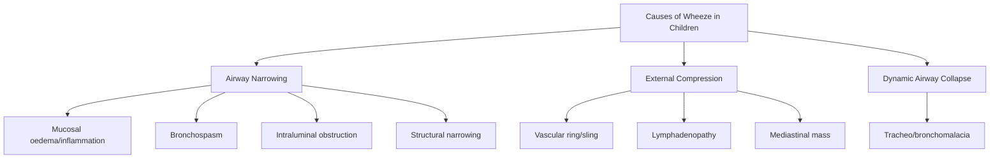
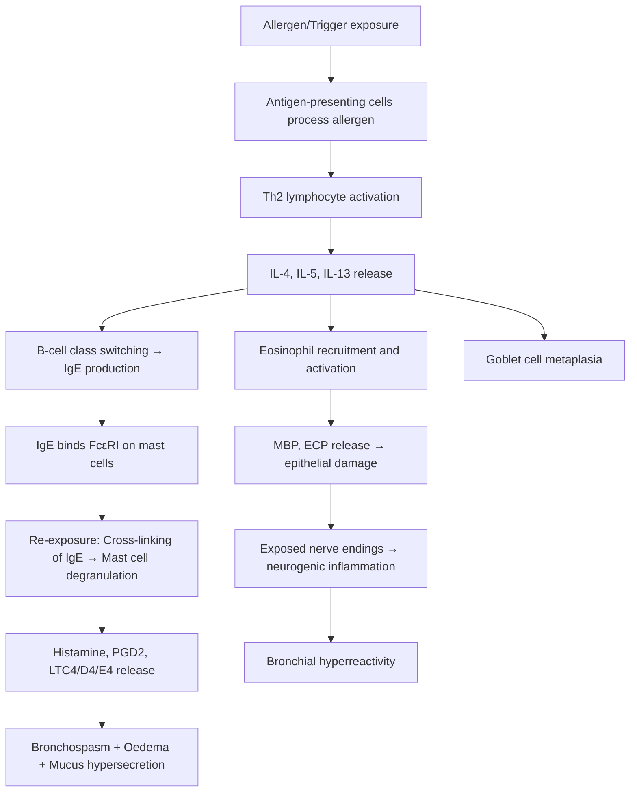

# Wheeze in Children

## Definition

Wheeze is a **continuous, high-pitched, musical sound** produced by turbulent airflow through narrowed intrathoracic airways during expiration (and sometimes inspiration in severe cases). The word comes from Old English *hwēsan* ("to hiss/puff"), and that onomatopoeia captures the physics: air forced through a tightened tube vibrates the airway wall, producing an audible note — much like squeezing the neck of a balloon.

**Key physics**: the pitch and loudness of wheeze depend on the degree of airway narrowing and the velocity of airflow. By Bernoulli's principle, as airway calibre decreases, flow velocity increases at the stenosis, and the pressure drop across that narrowing creates oscillation of the airway wall. Wheeze is therefore a sign of **dynamic intrathoracic airway narrowing** — anything that reduces airway lumen can produce it [1][2].

<Callout title="Wheeze ≠ Asthma" type="error">
A very common mistake: students equate "wheeze" with "asthma." Wheeze is a **physical sign**, not a diagnosis. The differential is broad — particularly in children under 5 years — and includes bronchiolitis, foreign body aspiration, congenital airway anomalies, cardiac causes, and more. Always think beyond asthma.
</Callout>

> ***"All that wheezes is not asthma"*** — this classic clinical aphorism is especially true in paediatrics where the immature airway is vulnerable to many causes of obstruction [1].

---

## Epidemiology

### Prevalence
- Wheeze is **extremely common** in early childhood: up to **one-third of all children** will have at least one wheezing episode before their third birthday, and approximately **50% of children** will have wheezed by age 6 [3].
- ***Asthma*** is the **most common chronic respiratory disease** in childhood, with a prevalence of approximately ***8.6% in Hong Kong*** (with a decreasing trend in recent years) [1][4].
- ***Bronchiolitis*** (the most common cause of wheeze in infants < 12 months) accounts for the largest proportion of acute wheezing presentations in infancy — peak incidence at **2–6 months of age**, with RSV responsible for ~60–80% of cases.

### Demographics
- **Age matters enormously**: the cause of wheeze differs dramatically between a 3-month-old and a 10-year-old. In infants, viral bronchiolitis and congenital anomalies dominate; in school-age children, asthma is the leading cause.
- **Sex**: In childhood, asthma is ***M > F ≈ 2:1***; this ratio equalises at puberty and reverses in adulthood (***F > M after ~40 years***) [1][4]. The childhood male predominance is partly due to smaller relative airway calibre in boys.
- **Ethnicity/Geography**: In Hong Kong, **house dust mite** is the dominant aeroallergen for atopic asthma; pollen allergy is ***uncommon in HK*** [1][4].

### Temporal Patterns (Wheezing Phenotypes in Children)

Understanding the natural history of early wheeze is critical — not all infant wheezers become asthmatic:

| Phenotype | Description | Prognosis |
|---|---|---|
| **Transient early wheezers** | Wheeze only in first 3 years; triggered by viral infections; never atopic | Resolve by age 6; related to small airway calibre at birth |
| **Persistent wheezers** | Wheeze begins < 3 years and persists beyond age 6 | Often develop asthma; frequently atopic |
| **Late-onset wheezers** | No wheeze in first 3 years; begin wheezing after age 3–6 | Usually atopic asthma |

> The modified Asthma Predictive Index (mAPI) helps predict which wheezing toddlers will develop persistent asthma (see Diagnosis section later).

---

## Risk Factors

### Host Factors

| Risk Factor | Mechanism / Explanation |
|---|---|
| ***Genetics*** | Multiple genes implicated (e.g., ***IL-3, IL-4, TNF-α***, ADAM33, ORMDL3/GSDMB on chromosome 17q21). Family history of asthma/atopy is the single strongest risk factor [1][4] |
| ***Atopy*** | Predisposition to mount IgE responses to common allergens; ***↑serum IgE correlates with ↑asthma prevalence*** [1][4]. Often manifests as the "atopic march" (eczema → food allergy → allergic rhinitis → asthma) |
| ***Gender*** | ***M > F in children*** (boys have relatively smaller airways for lung size); ***F > M in adults*** [1][4] |
| **Prematurity / Low birth weight** | Disrupted alveolar and airway development; bronchopulmonary dysplasia (BPD) predisposes to chronic wheeze |
| ***Obesity*** | ***More common and difficult to control if BMI > 30 kg/m²***; proposed mechanisms include altered lung mechanics (reduced FRC), systemic inflammation from adipocyte cytokines (leptin, adiponectin), and comorbidities [1][4] |
| **Small airway calibre** | Infants inherently have narrow airways (resistance ∝ 1/r⁴ by Poiseuille's law) — a small amount of mucosal oedema or mucus causes proportionally greater obstruction than in adults |

### Environmental Factors

| Factor | Notes |
|---|---|
| ***Indoor allergens*** | ***Fecal pellets of house dust mites*** (dominant in HK), ***pets, cockroaches*** [1][4] |
| ***Outdoor allergens*** | ***Alternaria*** (Ascomycete fungus); pollen ***uncommon in HK*** [1][4] |
| ***Environmental tobacco smoke (ETS)*** | Both prenatal (maternal smoking) and postnatal; increases airway hyperreactivity and impairs lung growth [1][4] |
| ***Outdoor air pollution*** | ***Mainly acts as a trigger*** rather than a cause [1][4] |
| ***Infections*** | ***Mainly as trigger***; RSV bronchiolitis in infancy is associated with subsequent recurrent wheeze (whether causal or a marker of predisposition is debated) [1][4] |
| ***Exercise, cold air*** | ***Triggers*** — exercise-induced bronchoconstriction occurs 5–15 min after exertion and may take 30–60 min to resolve (distinct from simple exertional dyspnoea which stops within 5 min of rest) [1][4] |
| ***Medications*** | ***NSAIDs (classical), OC pills, cholinergic agents, β-blockers, prostaglandins*** [4] |
| ***Occupational exposure*** | 5–15% of adult-onset asthma; relevant for adolescent exposures in certain settings [4] |

---

## Anatomy and Function of the Paediatric Airway

Understanding **why children wheeze so readily** requires appreciating how the paediatric airway differs from the adult airway:

### Key Differences

| Feature | Infant/Young Child | Clinical Implication |
|---|---|---|
| **Airway calibre** | Smaller absolute diameter (neonatal trachea ~4 mm vs adult ~20 mm) | By Poiseuille's law, resistance ∝ 1/r⁴ — halving the radius increases resistance 16-fold. Even 1 mm of mucosal oedema in an infant airway causes dramatic obstruction |
| **Cartilage support** | Less developed, more compliant | Airways prone to dynamic collapse during forced expiration |
| **Mucous glands** | Proportionally more goblet cells | Greater mucus production relative to airway size |
| **Collateral ventilation** | Pores of Kohn and channels of Lambert poorly developed until ~6 years | Atelectasis develops more easily distal to obstruction |
| **Chest wall compliance** | Very compliant (cartilaginous ribs) | Generates less negative pleural pressure to keep small airways patent; intercostal/subcostal recession appears early |
| **Diaphragm** | Fewer type I (fatigue-resistant) fibres until ~2 years | Respiratory muscle fatigue occurs earlier |
| **Alveolar number** | ~50 million at birth → 300 million by age 8 | Reduced gas exchange reserve in young infants |

### Functional Consequences
- **Obligate nose breathers** (neonates): nasal congestion alone can cause significant respiratory distress.
- **Higher closing volume**: small airways in the dependent lung zones close during normal tidal breathing in infants, predisposing to V/Q mismatch and hypoxaemia even with mild disease.
- **Greater airway reactivity**: smooth muscle in infant airways is hyper-responsive to irritants and mediators.

---

## Aetiology (with Hong Kong Focus)

The causes of wheeze in children span a wide range — the key is to think **anatomically** and **by age**:

### Classification by Mechanism

### Aetiology by Age Group

#### Neonates and Infants (0–12 months)

| Cause | Key Features | Pathophysiology |
|---|---|---|
| **Bronchiolitis** (most common) | RSV peak season (winter in HK); coryzal prodrome → cough → wheeze → ↑WOB; age < 12 months | RSV infects bronchiolar epithelium → necrosis, oedema, mucus plugging → small airway obstruction. Infants affected most because their small airways are most vulnerable |
| **Tracheo/bronchomalacia** | Persistent wheeze from birth; worse with crying/feeding/URTI; improves with prone positioning | Deficient cartilage rings → dynamic airway collapse during expiration; may be primary or secondary to vascular compression |
| **Congenital heart disease (CHD)** with LV failure | Tachypnoea, poor feeding, failure to thrive, hepatomegaly | L→R shunts (VSD, PDA) → pulmonary overcirculation → interstitial oedema → peribronchial cuffing → airway compression and wheeze |
| **Vascular ring/sling** | Fixed wheeze (biphasic or expiratory); stridor; dysphagia | Anomalous great vessels encircle or compress the trachea/main bronchi (e.g., double aortic arch, aberrant right subclavian + ligamentum arteriosum) |
| **Congenital lobar emphysema / CPAM** | Progressive respiratory distress; hyperinflated hemithorax | Air trapping in congenitally abnormal lobe → compression of adjacent lung |
| **Gastro-oesophageal reflux (GOR) with aspiration** | Recurrent wheeze, cough; worse after feeds; vomiting/posseting | Microaspiration of gastric contents → chemical pneumonitis → airway inflammation; also reflex vagal bronchospasm |
| **Cystic fibrosis** | Recurrent chest infections, failure to thrive, steatorrhoea, ***classical triad: ↑sweat Cl⁻ + recurrent lung infections + pancreatic insufficiency*** | ***CFTR mutation (AR, chr 7)*** → defective Cl⁻ channel → thick, dehydrated airway secretions → impaired mucociliary clearance → chronic infection/inflammation [5] |

#### Toddlers and Preschool Children (1–5 years)

| Cause | Key Features | Pathophysiology |
|---|---|---|
| **Viral-induced wheeze** (most common in this age group) | Triggered exclusively by viral URTI (no interval symptoms); rhinovirus, RSV | Viral infection → airway inflammation, oedema, mucus hypersecretion → obstruction of small, compliant airways |
| ***Foreign body (FB) aspiration*** | ***Sudden onset*** wheeze/cough in previously well child; often unwitnessed; ***unilateral/localised wheeze***; history of choking episode | FB lodges in bronchus (right main bronchus more common due to wider, more vertical angle) → partial or complete obstruction → air trapping (ball-valve effect) or atelectasis |
| **Asthma** (beginning to manifest) | Recurrent wheeze with interval symptoms; triggers include exercise, allergens; atopic comorbidities | Chronic eosinophilic airway inflammation → bronchial hyperreactivity → episodic bronchospasm, mucosal oedema, mucus plugging |
| **Post-infectious bronchiolitis obliterans** | Persistent wheeze following severe infection (e.g., adenovirus) | Fibroproliferative obliteration of small airways |

#### School-age Children and Adolescents (5–18 years)

| Cause | Key Features | Pathophysiology |
|---|---|---|
| ***Asthma*** (most common by far) | ***Recurrent episodic attacks of wheezing, chest tightness, breathlessness, cough*** [1][4]; triggers, diurnal variation (***worse at night/early morning***) [4]; ***±signs of atopy*** [4] | See detailed asthma pathophysiology below |
| **Exercise-induced bronchoconstriction** | Wheeze/cough 5–15 min into or after vigorous exercise (especially in ***cold, dry air***) | Water and heat loss from airway surface during hyperventilation → airway cooling → rebound hyperaemia and oedema; osmolar changes trigger mast cell degranulation |
| **Allergic bronchopulmonary aspergillosis (ABPA)** | In CF or severe asthma patients; central bronchiectasis; ↑IgE; eosinophilia | Hypersensitivity (type I and III) to Aspergillus fumigatus colonising airways → intense eosinophilic inflammation → mucus plugging, bronchiectasis |
| **Vocal cord dysfunction (VCD) / Inducible laryngeal obstruction** | "Wheeze" is actually inspiratory stridor; exercise-triggered; normal spirometry between episodes; not responsive to bronchodilators | Paradoxical adduction of vocal cords during inspiration → upper airway obstruction mimicking asthma |
| **Psychogenic dyspnoea** | Hyperventilation, chest tightness; no objective wheeze; often anxious adolescent | Functional; no airway pathology |

<Callout title="Foreign Body — The Great Mimic" type="error">
***Foreign body aspiration*** must be suspected in ***any child with sudden-onset unilateral wheeze***, especially aged 1–3 years (peak oral exploration). The classic history of a choking episode may be absent in up to 40% of cases. A normal CXR does NOT exclude FB. If clinical suspicion exists, proceed to ***rigid bronchoscopy*** [1].
</Callout>

---

## Pathophysiology of Wheeze — General Principles

All causes of wheeze share a final common pathway: **narrowing of the intrathoracic airway lumen** during expiration. The mechanisms differ:

### 1. Bronchospasm (Smooth Muscle Contraction)
- Airway smooth muscle contracts in response to mediators (histamine, leukotrienes, acetylcholine, neuropeptides)
- **Why worse on expiration?** During expiration, positive intrathoracic pressure compresses airways from outside; if airways are already narrowed by bronchospasm, this further reduces calibre → turbulent flow → wheeze
- Reversible with bronchodilators (β₂-agonists relax smooth muscle via ↑cAMP)

### 2. Mucosal Oedema
- Inflammatory mediators increase vascular permeability → plasma leaks into submucosa → airway wall thickens → lumen narrows
- Particularly significant in infants (small baseline calibre)

### 3. Mucus Hypersecretion and Plugging
- ***Goblet cell hyperplasia → ↑mucus secretion*** [4]
- Mucus plugs physically occlude small airways → distal air trapping or atelectasis

### 4. Structural Remodelling (Chronic)
- ***Smooth muscle hyperplasia → ↑bronchoconstriction*** [4]
- ***Fibrosis → airway wall thickening*** [4]
- Sub-epithelial collagen deposition, angiogenesis
- This is why longstanding asthma can develop a component of fixed airflow obstruction

### 5. External Compression
- Vascular rings, enlarged lymph nodes, tumours compress airway from outside

### 6. Dynamic Collapse
- In tracheo/bronchomalacia, deficient cartilage support → airway collapses during expiration when intrathoracic pressure exceeds intraluminal pressure

---

## Pathophysiology of Asthma (The Most Common Cause of Recurrent Wheeze in Children)

This deserves special attention given its importance:

### The Inflammatory Cascade

### Early-Phase Response (Minutes)
- IgE cross-linking on mast cells → degranulation → release of **pre-formed mediators** (histamine, tryptase) and **newly synthesised mediators** (prostaglandin D₂, leukotrienes C₄/D₄/E₄)
- Effects: bronchospasm (within minutes), vascular leak (oedema), mucus secretion
- Leukotrienes are 100–1000× more potent bronchoconstrictors than histamine — this is why leukotriene receptor antagonists (e.g., montelukast, "monte-luka-st" = leukotriene antagonist) are effective add-on therapy

### Late-Phase Response (6–12 hours)
- Recruitment of eosinophils, Th2 cells, basophils to the airway
- Eosinophil products (major basic protein [MBP], eosinophil cationic protein [ECP]) damage airway epithelium
- Exposed sensory nerve endings → heightened vagal reflex → bronchial hyperreactivity
- This is why allergen exposure causes a **biphasic** drop in lung function

### Chronic Inflammation and Remodelling
- Persistent eosinophilic inflammation → structural changes:
  - ***Smooth muscle hyperplasia*** [4]
  - ***Goblet cell hyperplasia*** [4]
  - Sub-basement membrane ***fibrosis → airway wall thickening*** [4]
  - Angiogenesis in airway wall
- Clinical consequence: **fixed airflow obstruction** over years if inflammation is not controlled (hence the importance of regular inhaled corticosteroids as controllers)

### Why Symptoms Are Worse at Night/Early Morning
- ***Classically with diurnal variation → worse at night or early morning*** [4]
- Cortisol levels nadir at midnight → loss of anti-inflammatory effect
- Vagal (parasympathetic) tone peaks at night → ↑bronchospasm
- Supine position → ↑airway oedema (gravity-dependent fluid redistribution), ↓FRC
- Circadian variation in circulating adrenaline (lowest at 4 AM) → reduced endogenous bronchodilation

---

## Classification

### A. By Temporal Pattern (Important for Paediatric Practice)

| Pattern | Definition | Typical Causes |
|---|---|---|
| **Acute wheeze** | Single episode or first presentation | Bronchiolitis, FB, anaphylaxis, acute asthma exacerbation |
| **Episodic (viral) wheeze** | Wheeze only during viral URTI; asymptomatic between episodes | Common in preschool children; typically outgrown |
| **Multi-trigger wheeze** | Wheeze with viral infections AND other triggers (exercise, allergens, emotions) | More likely to be asthma; more likely to persist |
| **Chronic/persistent wheeze** | Wheeze present most days | Asthma, structural lesion, CF, BPD, post-infectious bronchiolitis obliterans |

### B. By Localisation

| Type | Sound Character | Implies |
|---|---|---|
| ***Generalised (bilateral) wheeze*** | Polyphonic (multiple pitches), bilateral | Diffuse small airway disease: asthma, bronchiolitis, COPD (adults) [4] |
| ***Localised (unilateral/fixed) wheeze*** | Monophonic (single pitch), localised | ***Focal obstruction: foreign body, tumour*** [4] |

<Callout title="Monophonic vs Polyphonic" type="idea">
- **Polyphonic wheeze** = many airways narrowed to different degrees → multiple notes simultaneously → think **diffuse** disease (asthma, bronchiolitis)
- **Monophonic wheeze** = single airway obstruction producing a single note → think **focal** lesion (foreign body, endobronchial tumour, structural anomaly)
This distinction is high yield and clinically very useful.
</Callout>

### C. By Severity (for Asthma — GINA Classification)

Asthma severity is ***assessed retrospectively from the level of treatment required to control symptoms and exacerbations*** [4]:

| Severity | Treatment Step | Example |
|---|---|---|
| ***Mild*** | ***Well-controlled with Steps 1 or 2*** | SABA PRN or low-dose ICS |
| ***Moderate*** | ***Well-controlled with Step 3*** | Low-dose ICS/LABA |
| ***Severe*** | ***Well- or poorly controlled with Steps 4 or 5*** | Medium/high-dose ICS/LABA ± add-on |

---

## Clinical Features

### A. Symptoms (with Pathophysiological Basis)

| Symptom | Mechanism / Pathophysiology |
|---|---|
| ***Wheeze*** (expiratory, high-pitched, musical) | Turbulent airflow through narrowed intrathoracic airways; worse on expiration because positive intrathoracic pressure further compresses already narrowed airways |
| ***Cough*** | Irritation of cough receptors in inflamed/oedematous airway mucosa; vagal afferent stimulation; mucus stimulating cough reflex. ***May be the only symptom in "cough-variant asthma"*** [4] |
| ***Breathlessness / dyspnoea*** | ↑airway resistance → ↑work of breathing; air trapping → hyperinflation → diaphragm flattened and working at mechanical disadvantage; V/Q mismatch → hypoxaemia |
| ***Chest tightness*** | Perception of ↑work of breathing; hyperinflation stretching the chest wall; may also reflect smooth muscle contraction perceived via vagal afferents |
| **Feeding difficulty** (infants) | Respiratory distress makes coordinating suck-swallow-breathe impossible; obligate nose breathers (neonates) are especially affected by nasal congestion |
| **Sleep disturbance / nocturnal symptoms** | Diurnal variation in cortisol, vagal tone, adrenaline levels → worsening bronchoconstriction at night (see above) |
| ***Diurnal variation*** | ***Characteristically worse at night or early morning*** for asthma [4] |
| **Exercise intolerance** | Exercise → ↑minute ventilation → airway cooling/drying → osmolar shift triggers mast cell degranulation → bronchospasm. ***Attacks occur 5–15 min after brief exertion; resolve 30–60 min after stopping*** [4] |

#### Important History Points in Paediatric Wheeze

- **Age of onset**: neonatal onset → congenital anomaly; < 12 months → bronchiolitis; > 3 years → asthma more likely
- **Pattern**: episodic vs persistent; viral-only vs multi-trigger
- ***Triggers***: ***exercise (esp cold air), allergens (dust mites, molds, furry animals, cockroaches; pollen uncommon in HK), pollutants/irritants (cigarette smoke, strong fumes), viral URTI, medications (NSAIDs, β-blockers)*** [4]
- **Interval symptoms**: does the child wheeze between episodes? (suggests multi-trigger/asthma)
- ***Personal history of atopy: eczema, allergic rhinitis*** [4] — atopic march
- **Family history**: asthma, atopy, CF
- **Birth history**: prematurity, ventilation, BPD
- **Growth**: failure to thrive → consider CF, immunodeficiency, cardiac disease
- **Choking episode**: sudden onset → foreign body
- **Response to bronchodilator**: improvement strongly suggests reversible airway obstruction (asthma); no response → consider other diagnoses
- **Red flags**: neonatal onset, failure to thrive, focal/persistent signs, persistent moist cough with purulent sputum, no response to standard therapy

### B. Signs (with Pathophysiological Basis)

| Sign | Mechanism / Pathophysiology |
|---|---|
| **Expiratory wheeze on auscultation** | Air forced through narrowed airways → turbulent flow → vibration of airway wall; expiratory because intrathoracic pressure rises during expiration, further narrowing airways |
| **Prolonged expiratory phase** | Air trapping — it takes longer to exhale through narrowed airways |
| **Tachypnoea** | Compensatory ↑respiratory rate to maintain minute ventilation despite ↑airway resistance and ↓tidal volume |
| **Tachycardia** | Sympathetic activation from hypoxia, distress, and ↑work of breathing; also a side effect of β₂-agonist therapy |
| **Intercostal/subcostal/sternal recession** | ↑negative intrapleural pressure generated to overcome airway resistance → soft tissue sucked inward. More prominent in infants/young children due to highly compliant chest wall |
| **Use of accessory muscles** (sternocleidomastoid, scalenes) | Additional inspiratory muscles recruited when diaphragm and intercostals cannot generate sufficient force alone |
| **Nasal flaring** (infants) | Alar muscles contract to reduce nasal resistance and increase airflow — a sign of significant respiratory distress in infants |
| **Head bobbing** (infants) | Sternocleidomastoid contraction during accessory muscle use causes rhythmic head extension with each breath |
| **Hyperinflated / barrel-shaped chest** | Chronic air trapping → ↑residual volume → AP diameter increases; ribs become more horizontal. Indicates chronic/severe obstruction |
| ***Chest hyperinflation on CXR*** | ***Normal or hyperinflated ± lobar collapse (secondary to mucus obstruction)*** [4] |
| **Hyperresonance on percussion** | Hyperinflated lungs contain more air → more resonant to percussion |
| **Reduced air entry** (ominous if wheeze disappears) | Severe obstruction → airflow so reduced that insufficient to generate wheeze = ***"silent chest"*** — this is a **pre-arrest sign** |
| ***Pulsus paradoxus*** (> 15 mmHg in children) | Exaggerated drop in systolic BP during inspiration; large negative intrathoracic pressure swings during obstructed breathing → ↑venous return to RV → interventricular septum bows into LV → ↓LV filling and stroke volume |
| **Cyanosis** | Severe V/Q mismatch and/or hypoventilation → hypoxaemia → deoxyhemoglobin > 5 g/dL → visible blue discolouration |
| ***Signs of atopy: eczema, allergic rhinitis*** | ***±signs of atopy: allergic rhinitis, eczema*** [4] — suggests atopic asthma phenotype |
| ***Digital clubbing*** | ***Chronic suppurative lung disease*** [1] — if present with wheeze, think CF, bronchiectasis, NOT simple asthma. Clubbing is NOT a feature of asthma |
| **Harrison's sulcus** | Chronic chest hyperinflation → diaphragmatic traction on lower ribs → permanent horizontal groove at diaphragmatic insertion |

<Callout title="Silent Chest = Emergency">
When wheeze **disappears** in a dyspnoeic child, do NOT be reassured. A "silent chest" means airflow is so severely reduced that no turbulence (and therefore no wheeze) is generated. This indicates **critical airway obstruction** and is a **pre-arrest sign** requiring immediate escalation.
</Callout>

### C. Specific Signs That Point to Aetiology

| Sign | Possible Aetiology |
|---|---|
| ***Wheeze alone (no other abnormalities)*** | ***Intrathoracic airway lesion: asthma, foreign body*** [1] |
| ***Crepitations with wheeze*** | ***Parenchymal disease*** (pneumonia, bronchiolitis) [1] |
| ***Failure to thrive + wheeze*** | ***Serious systemic illness including pulmonary*** (CF, immunodeficiency, cardiac disease) [1] |
| ***Feeding difficulties + wheeze*** | ***Aspiration lung disease, serious systemic illness*** [1] |
| ***Daily moist/productive cough + wheeze*** | ***Suppurative lung disease*** (CF, bronchiectasis, PCD) [1] |
| ***Digital clubbing + wheeze*** | ***Chronic suppurative lung disease*** [1] |
| ***Hypoxia/cyanosis + wheeze*** | ***Airway or parenchymal disease, cardiac disease*** [1] |
| ***Neurodevelopmental abnormality + wheeze*** | ***Aspiration lung disease*** [1] |
| ***Recurrent pneumonia + wheeze*** | ***Immunodeficiency, congenital lung abnormalities, tracheo-oesophageal H fistula*** [1] |
| ***Chest wall deformity + wheeze*** | ***Chronic airway or parenchymal disease*** [1] |

---

## Red Flags — When Wheeze Is NOT Simple Asthma

> **Think beyond asthma if any of the following are present:**
> - Neonatal onset of wheeze
> - Failure to thrive / poor growth
> - Persistent focal/localised wheeze (foreign body, structural lesion)
> - ***Digital clubbing*** (think CF, bronchiectasis — NOT asthma)
> - Persistent wet/productive cough with purulent sputum
> - No response to adequate bronchodilator therapy
> - Wheeze associated with feeds/vomiting (GOR/aspiration)
> - Stridor (think upper airway, not lower airway)
> - Associated cardiac murmur or hepatomegaly (think CHD with LV failure)

---

## Important Associations and Special Entities

### Samter's Triad (Aspirin-Exacerbated Respiratory Disease)
- ***Chronic rhinosinusitis + nasal polyposis + aspirin-exacerbated respiratory symptoms*** [4]
- Mechanism: COX-1 inhibition by aspirin → shunting of arachidonic acid to leukotriene pathway → massive leukotriene production → bronchospasm
- Relevant in older adolescents; rare in young children

### The "Atopic March"
- Temporal sequence: **eczema** (infancy) → **food allergy** → **allergic rhinitis** → **asthma** (school age)
- Reflects progressive systemic Th2 immune dysregulation
- A child with eczema and egg allergy in infancy has a significantly higher risk of developing asthma later

### Bronchiolitis → Recurrent Wheeze
- ~30–40% of infants with severe RSV bronchiolitis go on to have recurrent wheeze in early childhood
- Debate: does RSV cause airway remodelling, or does it unmask pre-existing airway vulnerability? (likely both)

### CF-related Wheeze
- ***15% of CF patients have asthma-type symptoms***, often due to ***allergic sensitisation to Aspergillus fumigatus*** (ABPA) [5]
- Presentation: ***chest tightness, SOB, ↓lung function*** [5]
- Clue: wheeze + failure to thrive + recurrent infections + steatorrhoea → always perform **sweat test**

### Carcinoid Syndrome (Rare but Testable)
- ***Bronchospasm (10–20%): wheezing and dyspnoea often during flushing episodes*** [6]
- Mechanism: release of histamine, serotonin, and prostaglandins from neuroendocrine tumour

---

<Callout title="High Yield Summary">

1. **Wheeze = continuous, high-pitched, musical sound from turbulent flow through narrowed intrathoracic airways** — it is a SIGN, not a diagnosis.

2. **All that wheezes is not asthma** — in infants think bronchiolitis, congenital anomalies, FB, cardiac causes; in older children asthma dominates but always consider alternatives.

3. **Infant airways are especially vulnerable** to obstruction: small calibre (resistance ∝ 1/r⁴), compliant walls, more mucous glands, less cartilage support.

4. ***Asthma = chronic inflammatory disorder → widespread, variable, reversible airflow obstruction + bronchial hyperreactivity*** [4].

5. ***Asthma prevalence ~8.6% in HK; M > F in children; 75% diagnosed < 7 years*** [4].

6. ***Asthma pathophysiology***: Th2-driven eosinophilic inflammation → early phase (mast cell degranulation → bronchospasm/oedema/mucus) + late phase (eosinophil recruitment → epithelial damage → hyperreactivity) + chronic remodelling (***smooth muscle hyperplasia, goblet cell hyperplasia, fibrosis***) [4].

7. ***Triggers in HK***: dust mites (dominant indoor allergen), ETS, exercise (cold air), viral URTI; pollen uncommon [4].

8. ***Classic asthma features***: episodic wheeze + cough + chest tightness + dyspnoea; ***diurnal variation (worse at night/early morning)***; ±atopy; ***resolves with trigger avoidance or treatment*** [4].

9. ***Red flags against simple asthma***: neonatal onset, FTT, clubbing, focal wheeze, persistent wet cough, no bronchodilator response, associated cardiac signs.

10. ***Foreign body***: sudden-onset, unilateral/localised wheeze in a toddler — normal CXR does NOT exclude it → rigid bronchoscopy if clinical suspicion.

11. ***Wheeze + crepitations → parenchymal disease; wheeze + FTT → CF/immunodeficiency/cardiac; wheeze + clubbing → chronic suppurative lung disease (NOT asthma)*** [1].

12. ***Silent chest*** (absence of wheeze in a dyspnoeic child) = **pre-arrest sign** requiring immediate escalation.

</Callout>

---

<ActiveRecallQuiz
  title="Active Recall - Wheeze in Children"
  items={[
    {
      question: "A 2-year-old presents with sudden-onset unilateral wheeze. What is the most important diagnosis to exclude and what is the investigation of choice?",
      markscheme: "Foreign body aspiration. Investigation: rigid bronchoscopy (both diagnostic and therapeutic). CXR may show unilateral hyperinflation or may be normal - a normal CXR does NOT exclude FB."
    },
    {
      question: "Explain why 1 mm of mucosal oedema causes proportionally greater airway obstruction in an infant than an adult.",
      markscheme: "Poiseuille's law: resistance is inversely proportional to the 4th power of the radius (R ∝ 1/r4). Infant trachea ~4 mm diameter; 1 mm oedema reduces radius from 2 mm to 1 mm = 16-fold increase in resistance. Adult trachea ~20 mm; 1 mm oedema reduces radius from 10 to 9 mm = only ~1.5-fold increase."
    },
    {
      question: "Why are asthma symptoms classically worse at night and early morning? Give at least 3 mechanisms.",
      markscheme: "1) Cortisol nadir at midnight - loss of anti-inflammatory effect. 2) Peak vagal/parasympathetic tone at night - increased bronchospasm via muscarinic receptors. 3) Circadian nadir of circulating adrenaline at ~4 AM - reduced endogenous bronchodilation. 4) Supine position - gravity-dependent airway oedema and reduced FRC."
    },
    {
      question: "What is the significance of a 'silent chest' in a wheezing child?",
      markscheme: "A silent chest means airflow is so severely reduced that insufficient turbulence is generated to produce audible wheeze. This is a pre-arrest sign indicating critical airway obstruction, and requires immediate escalation with consideration of intubation/ventilation."
    },
    {
      question: "Name 3 structural features of the paediatric airway that predispose infants to wheeze more easily than adults.",
      markscheme: "1) Smaller absolute airway calibre (resistance ∝ 1/r4). 2) Less developed cartilage support - airways more collapsible. 3) Proportionally more goblet cells - greater mucus production relative to airway size. Also acceptable: highly compliant chest wall, fewer type I diaphragm fibres, poorly developed collateral ventilation."
    },
    {
      question: "Differentiate episodic viral wheeze from multi-trigger wheeze in preschool children. Why does this distinction matter?",
      markscheme: "Episodic viral wheeze: wheeze ONLY during viral URTI with no interval symptoms between episodes. Multi-trigger wheeze: wheeze with viral infections AND other triggers (exercise, allergens, emotions, cold air) with symptoms between episodes. Distinction matters because multi-trigger wheeze is more likely to represent true asthma, more likely to persist, and more likely to benefit from regular inhaled corticosteroid therapy."
    }
  ]}
/>

---

## References

[1] Lecture slides: GC 141. A child with cough acute and chronic cough in children.pdf, p20
[2] Senior notes: Ryan Ho Critical Care.pdf, p6 (Approach to Acute SOB)
[3] Senior notes: Adrian Lui Pediatrics.pdf, p168 (Obstructive Lung Diseases - Asthma)
[4] Senior notes: Ryan Ho Respiratory.pdf, p95–97 (Asthma — Pathophysiology and Clinical Features)
[5] Senior notes: Adrian Lui Pediatrics.pdf, p181 (Cystic Fibrosis)
[6] Senior notes: Ryan Ho Endocrine.pdf, p103 (Carcinoid Syndrome)
