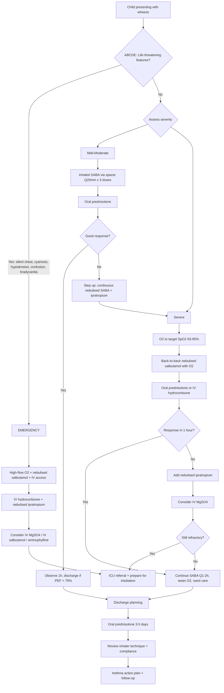

## Management of Wheeze in Children

### Core Principle

***"Cough is a symptom telling you something is wrong. Find the cause. Treat the underlying cause if indicated."*** [15] This applies equally to wheeze — it is a sign, not a disease. Management is therefore **cause-specific**. However, because asthma is by far the most common cause of recurrent wheeze in children, it dominates the management discussion. We will cover:

1. **Acute management** — the wheezing child in front of you right now
2. **Chronic/long-term management** — preventing recurrence and controlling disease
3. **Specific management by aetiology** — bronchiolitis, foreign body, cardiac wheeze, etc.

---

### Management Algorithm Overview

---

## Part 1: Acute Management of Wheeze

### A. Acute Asthma Exacerbation in Children

This is the **most common acute wheezing emergency** in paediatrics. The management follows a stepwise escalation approach.

#### Step 1: Initial Assessment (First 5 Minutes)

***Always assess inhaler technique and adherence before stepping up!*** [3]

- **ABCDE approach** — is the child in immediate danger?
- Assess severity (see Diagnosis section) — mild/moderate vs severe vs life-threatening
- Key features to identify immediately:

| ***Life-threatening features*** [4][9] | Action |
|---|---|
| ***Silent chest*** | Immediate escalation |
| ***Hypotension*** | IV access, fluid bolus, ICU |
| ***PEF < 33% of best/predicted*** | ICU referral |
| ***Cyanosis*** | High-flow O₂ |
| ***Confusion / altered consciousness*** | Prepare for intubation |
| ***Bradycardia*** | Pre-arrest — call for help |
| ***Exhaustion / poor respiratory effort*** | Impending arrest |

> ***Features warranting ICU care*** [3][4]: ***Life-threatening features present; deterioration in PEF/FEV₁; worsening or persistent hypoxia or hypercapnia; respiratory failure requiring IPPV; respiratory or cardiorespiratory arrest***

#### Step 2: Immediate Treatment

##### Oxygen
- ***Controlled O₂ therapy aiming SpO₂ 93–95%*** [4] by nasal cannulae or face mask
- ***High-flow O₂ to keep SpO₂ 94–98%*** in acute severe/life-threatening episodes [9]
- **Why 93–95% target?** Over-oxygenation can worsen V/Q mismatch (by releasing hypoxic pulmonary vasoconstriction in poorly ventilated areas) and suppress respiratory drive (less relevant in children than adults, but still applies in severe asthma with CO₂ retention)

##### Inhaled Short-Acting β₂-Agonist (SABA)

- **Drug**: Salbutamol ("sal-BUTA-mol" — selective β₂-adrenoceptor agonist)
- **Mechanism**: binds β₂ receptors on airway smooth muscle → activates adenylyl cyclase → ↑cAMP → phosphorylation and inhibition of myosin light chain kinase (MLCK) → smooth muscle relaxation → bronchodilation [4]
- **Onset**: 1–5 minutes (rapid); Duration: 4–6 hours

**Paediatric dosing** (age-appropriate formulations):

| Severity | Route | Dose | Frequency |
|---|---|---|---|
| Mild-moderate | ***MDI + spacer*** [4] | 4–10 puffs (100 µg/puff) | ***Every 20 min for first hour*** [4], then Q1–4H as needed |
| Severe | Nebuliser with O₂ | 2.5 mg (< 5 years) or ***5 mg*** (≥ 5 years) [9] | ***Repeated / back-to-back*** nebulisation [9], then Q1–2H |
| Life-threatening / refractory | IV (if available) | 15 µg/kg bolus then 1–5 µg/kg/min infusion | Continuous; requires cardiac monitoring |

<Callout title="MDI + Spacer = Nebuliser" type="idea">
***Use of MDI + spacer or DPI is associated with similar improvement in lung function compared to nebuliser*** [4]. In fact, MDI + spacer is **preferred** in mild-moderate exacerbations because:
1. Faster to administer
2. Less staff-dependent
3. Lower risk of cardiac side effects (more controlled dosing)
4. Teaches the child the technique they will use at home

Reserve nebulisers for **severe** or **life-threatening** exacerbations where the child cannot coordinate with a spacer or needs continuous delivery.
</Callout>

**Side effects of salbutamol** (all dose-related):
- **Tremor**: β₂ receptors on skeletal muscle → direct stimulation
- **Tachycardia/palpitations**: β₂-mediated peripheral vasodilation → reflex tachycardia; at high doses, some β₁ cross-reactivity
- **Hypokalaemia**: β₂ stimulation drives K⁺ into cells via Na⁺/K⁺-ATPase activation — monitor K⁺ with frequent/continuous nebulisation
- **Lactic acidosis**: β₂-mediated glycogenolysis → ↑lactate

##### Systemic Corticosteroids

- **Drug**: ***Oral prednisolone*** (preferred if child can swallow) or ***IV hydrocortisone*** (if vomiting/unable to take PO/severe) [3][4][9]
- **Mechanism**: corticosteroids suppress the inflammatory cascade at multiple levels — ↓transcription of pro-inflammatory cytokines (IL-4, IL-5, IL-13), ↓eosinophil survival, ↓mast cell mediator release, ↓vascular permeability (reducing mucosal oedema), upregulate β₂-receptor expression (restoring bronchodilator responsiveness)
- **Onset**: takes 3–4 hours to show clinical effect (genomic mechanism requires protein synthesis) — hence give **early**
- ***Oral is as effective as IV*** [4] — there is no benefit to IV over oral if the child can tolerate oral medication

**Paediatric dosing**:

| Route | Drug | Dose | Duration |
|---|---|---|---|
| ***Oral*** | ***Prednisolone*** | 1–2 mg/kg/day (max 40 mg < 12y; max 50 mg ≥ 12y) | ***3–5 days*** [3][4] (no taper needed for short courses) |
| ***IV*** | ***Hydrocortisone*** | ***50–100 mg Q6–8H*** [4] (adjust by weight: 4 mg/kg Q6H in young children) | Until able to take oral |

> ***Prednisolone tablets for 3–5 days is adequate for most patients*** [3]. Short courses (≤5 days) do NOT require tapering as the hypothalamic-pituitary-adrenal axis has not yet been suppressed.

##### Inhaled Short-Acting Muscarinic Antagonist (SAMA) — Ipratropium Bromide

- **Drug**: Ipratropium bromide ("ipra-TROP-ium" — anti-muscarinic/anti-cholinergic)
- **Mechanism**: blocks muscarinic M₃ receptors on airway smooth muscle → prevents acetylcholine-mediated bronchoconstriction; also ↓mucus secretion from submucosal glands
- **Why add to SABA?** Complementary mechanism — SABA works via β₂ (sympathetic) pathway while SAMA blocks the parasympathetic pathway. Together = synergistic bronchodilation
- ***Associated with ↓hospitalisation and ↑PEF/FEV₁ improvement compared to SABA alone in moderate-severe attacks*** [4]

**Paediatric dosing**:

| Route | Dose | Frequency |
|---|---|---|
| Nebuliser | 250 µg (< 5y) or ***500 µg*** (≥ 5y) [9] | Q4–6H; can give Q20 min in first hour for severe attacks |
| MDI + spacer | 4–8 puffs (20 µg/puff) | Q4–6H |

**Side effects**: dry mouth, urinary retention (rare in children), paradoxical bronchospasm (rare — due to hypertonic nebuliser solution, not the drug itself)

##### IV Magnesium Sulphate (MgSO₄) — For Severe/Refractory Cases

- ***Consider IV MgSO₄ if refractory or severe*** [3][9]
- ***MoA: thought to ↓Ca²⁺ influx in airway smooth muscles*** [4] → smooth muscle relaxation → bronchodilation. Also inhibits mast cell degranulation and acetylcholine release from nerve endings
- ***Dosing: 1.2–2 g IV (adults) / 40–50 mg/kg IV (max 2 g) over 20 minutes*** [4][9]
- ***Caution: hypotension, CKD (↑risk of hyperMg → paralysis)*** [4]
- **Paediatric note**: particularly useful in children as an escalation step before considering IV salbutamol or aminophylline; relatively safe and well-tolerated

##### IV Aminophylline — Last Resort

- ***Consider IV aminophylline if refractory or severe*** [3]
- **Mechanism**: phosphodiesterase inhibitor → ↑cAMP → bronchodilation; also adenosine receptor antagonist → reduces mast cell mediator release
- ***Narrow therapeutic profile with poor efficacy*** [4] — risk of toxicity (seizures, arrhythmias) is significant
- **Paediatric dosing**: Loading dose 5 mg/kg IV over 20 min (omit if already on theophylline), then maintenance infusion 0.5–1 mg/kg/hr; requires **serum level monitoring** (target 10–20 mg/L)
- Generally ***avoided*** in modern paediatric practice unless in PICU setting with failure of all other therapies

#### Step 3: Reassessment

***Reassessment in ALL patients 1 hour after initial treatment*** [3]:
- ***Assess: clinical status, response to treatment, lung function measurement (PEF, FEV₁)*** [3]

| Response | Action |
|---|---|
| ***Satisfactory response*** | ***Controlled O₂ to aim 93–95%, gradual weaning; continue steroids 3–5 days; continue SABA Q1–2H*** [3] |
| ***Unsatisfactory response*** | ***↑dose of SABA; add inhaled ipratropium bromide*** [3]; consider IV MgSO₄ |
| ***Life-threatening / deteriorating*** | ***ICU admission*** [3][4]; IV salbutamol or aminophylline; prepare for intubation and IPPV |

#### Step 4: Discharge Planning

***Home when symptoms cleared, PEF/FEV₁ > 75% predicted/best*** [3]

***Hospital admission is a window of opportunity to review*** [3]:
- ***Inhaler technique***
- ***Compliance***
- ***Environment***

***Upon discharge*** [3]:
- ***Identify + avoid risk factors for current attack***
- ***Oral corticosteroids: prednisolone tablets × 3–5 days***
- ***Early outpatient or ward follow-up + review long-term treatment plan + review inhaler technique***
  - ***Mild/moderate: follow-up general or asthma clinic in 3–4 months***
  - ***Severe: ward follow-up in 1 week, then asthma clinic in 1 month***

<Callout title="What NOT to Give in Acute Asthma" type="error">
***Avoid*** [4]:
- ***Antibiotics*** (unless strong evidence of bacterial infection — most exacerbations are viral)
- ***Aminophylline/theophylline*** (narrow therapeutic window, poor efficacy relative to risk)
- ***Sedatives/cough suppressants*** (suppress respiratory drive → dangerous)
- ***Mucolytics*** (no evidence of benefit; may worsen cough)
</Callout>

---

## Part 2: Long-Term / Chronic Management of Asthma in Children

### Assessment Before Starting Treatment

***Identification of triggering factors through clinical history*** [3][4]

***Assessment of asthma control by two domains*** [3][4]:

| Domain | Well Controlled | Partly Controlled | Uncontrolled |
|---|---|---|---|
| ***Daytime symptoms*** | ***≤ 2×/week*** | > 2×/week | |
| ***SABA reliever use*** | ***≤ 2×/week*** | > 2×/week | ≥ 3 features of |
| ***Night waking*** | ***None*** | Any | partly controlled |
| ***Activity limitation*** | ***None*** | Any | |

***Severity of asthma: assessed retrospectively from level of treatment required to control symptoms and exacerbation*** [3][4]:
- ***Mild asthma: well-controlled with Steps 1 or 2*** [3][4]
- ***Moderate asthma: well-controlled with Step 3*** [3] (or ***Step 3 or 4*** [4])
- ***Severe asthma: well- or poorly controlled with Steps 4 or 5*** [3] (or ***Step 5*** [4])

### Treatment Goals

***Complete control*** [3][4]:
- ***No attacks, A&E visits, hospitalisation***
- ***No or minimal symptoms***
- ***No limitation of activity***
- ***Normal or near normal lung function***
- ***With least medications and least side effects***

### Principle: Stepwise, Control-Based Management

***Principle: control-based asthma management, i.e. continuous adjustment of treatment based on review of clinical response and ongoing assessment*** [3][4]

The GINA guidelines provide a **track-based** approach. In paediatrics, we separate:
- **Children 6–11 years**: modified steps with different ICS dose thresholds
- **Adolescents ≥ 12 years**: follows adult GINA steps with minor modifications

### Pharmacotherapy Overview

***Pharmacotherapy generally involves*** [3][4]:
- ***Reliever***: ***short-acting bronchodilators → for breakthrough symptoms and preventing exercise-related symptoms*** [3]
- ***Controller (preventer)***: ***should be initiated ASAP after diagnosis for an improvement in outcome*** [3][4]
  - ***Anti-inflammatory drugs to ↓airway inflammation*** [3][4]
  - ***Long-acting bronchodilators to ↓bronchoconstriction*** [3][4]
- ***Add-on therapy***: ***for patients with severe asthma*** [3]

### GINA 2023/2024 Stepwise Approach

***The GINA guidelines offer two tracks*** [4]:

#### Track 1 (Preferred): ICS-Formoterol as Reliever

This is the **preferred approach for children ≥ 12 years and adults** because it ensures that every time the child uses their reliever, they also get an anti-inflammatory (ICS) dose — reducing the risk of undertreated inflammation.

| Step | Controller | Reliever | When to Use |
|---|---|---|---|
| **Step 1** | None (or as-needed low-dose ICS-formoterol) | ***As-needed low-dose ICS-formoterol*** | Symptoms < 2×/month |
| **Step 2** | Low-dose ICS-formoterol daily | As-needed low-dose ICS-formoterol | Symptoms ≥ 2×/month but not daily |
| **Step 3** | Medium-dose ICS-formoterol daily | As-needed low-dose ICS-formoterol | Symptoms most days or waking ≥ 1×/week |
| **Step 4** | Medium/high-dose ICS-formoterol + add-on (LAMA or LTRA) | As-needed low-dose ICS-formoterol | Persistent despite Step 3 |
| **Step 5** | High-dose ICS-formoterol + LAMA ± biologic | As-needed low-dose ICS-formoterol | Refer to specialist / severe asthma phenotyping |

> ***SMART = Single Maintenance and Reliever Therapy*** [3]: uses the same ICS-formoterol device for both daily maintenance and acute relief. ***Recommended for children ≥ 12 years as Steps 3–5*** [3]. ***In QMH, SMART can be considered (using Symbicort) when there are concerns about adherence to controller and SABA overuse*** [3].

#### Track 2 (Alternative): SABA as Reliever

This is more commonly used in **younger children (6–11 years)** where ICS-formoterol combination data is still evolving:

| Step | Controller | Reliever | When to Use |
|---|---|---|---|
| **Step 1** | ***ICS whenever SABA taken*** [4] (or low-dose ICS taken with each SABA dose) | As-needed SABA | Infrequent symptoms |
| **Step 2** | ***Low-dose ICS daily*** [4] (alternatives: ***daily LTRA, or add HDM SLIT***) | As-needed SABA | Symptoms ≥ 2×/month |
| **Step 3** | ***Medium-dose ICS, or low-dose ICS + LABA, or add LTRA, or add HDM SLIT*** [4] | As-needed SABA | Symptoms most days |
| **Step 4** | ***Medium/high-dose ICS + LABA ± LAMA or LTRA or HDM SLIT*** [4] | As-needed SABA | Persistent despite Step 3 |
| **Step 5** | High-dose ICS + LABA + ***add LAMA*** + phenotype-guided biologics | As-needed SABA | Specialist management |

#### Children 6–11 Years: Key Differences from ≥ 12 Years

| Feature | Difference |
|---|---|
| **ICS dose definitions** | "Low dose" in 6–11y is lower than in ≥ 12y (e.g., budesonide low = 100–200 µg vs 200–400 µg) |
| **LABA** | Can be added from Step 3; salmeterol or formoterol approved ≥ 4–6 years |
| **SMART** | Less evidence in 6–11y; more commonly used in ≥ 12y |
| **Biologics** | Omalizumab approved ≥ 6y; mepolizumab ≥ 6y; dupilumab ≥ 6y |

#### Preschool Children (< 6 Years)

- **Step 1**: As-needed SABA + ICS whenever SABA is used (take ICS via spacer + face mask each time SABA is given)
- **Step 2**: Daily low-dose ICS (first-line controller)
- **Step 3**: Double ICS dose (medium-dose ICS) OR add LTRA
- **Step 4**: Refer to specialist; continue medium-dose ICS + LTRA; consider high-dose ICS for short periods
- **Inhaler device**: MDI + spacer with face mask (< 3y) or mouthpiece (3–5y) is the preferred delivery method — nebulisers are reserved for acute settings

### Drug Details

#### Bronchodilators

##### 1. Short-Acting β₂-Agonist (SABA)

| Feature | Detail |
|---|---|
| **Example** | ***Salbutamol (Ventolin)*** [4] |
| **Mechanism** | β₂-agonist → ↑cAMP → smooth muscle relaxation (see above) |
| **Onset / Duration** | 1–5 min / 4–6 hours |
| **Route** | MDI + spacer (preferred), nebuliser, IV (severe) |
| **Paediatric dose (MDI)** | 100 µg/puff; 2–4 puffs PRN (up to 10 puffs in acute exacerbation) |
| **Indication** | Reliever for breakthrough symptoms; pre-exercise prophylaxis |
| **Side effects** | Tremor, tachycardia, hypokalaemia, lactic acidosis (high dose) |
| ***Contraindication*** | No absolute contraindications in acute wheeze |
| **Important note** | Over-reliance on SABA without controller → undertreated inflammation → ↑risk of severe exacerbation and death |

##### 2. Long-Acting β₂-Agonist (LABA)

| Feature | Detail |
|---|---|
| **Examples** | Salmeterol, formoterol |
| **Mechanism** | Same as SABA but with longer lipophilic side chain → binds to receptor for 12+ hours |
| **Key difference** | Formoterol has rapid onset (1–3 min) → can function as reliever (basis of SMART); Salmeterol has slow onset (15–30 min) → controller only |
| **Route** | MDI + spacer or DPI |
| **Indication** | Step 3+ as add-on controller with ICS; ***NEVER as monotherapy*** (increases risk of asthma death if used without ICS — black box warning) |
| **Contraindication** | Monotherapy without ICS |

##### 3. Short-Acting Muscarinic Antagonist (SAMA)

| Feature | Detail |
|---|---|
| **Example** | Ipratropium bromide |
| **Mechanism** | Blocks M₃ muscarinic receptors → ↓parasympathetic bronchoconstriction |
| **Indication** | Add-on in acute severe exacerbation; ***associated with ↓hospitalisation vs SABA alone in moderate-severe attacks*** [4] |
| **Side effects** | Dry mouth, urinary retention (rare), paradoxical bronchospasm (rare) |

##### 4. Long-Acting Muscarinic Antagonist (LAMA)

| Feature | Detail |
|---|---|
| **Example** | Tiotropium (Spiriva Respimat) |
| **Mechanism** | Selective M₃ blockade → 24-hour bronchodilation |
| **Paediatric approval** | ≥ 6 years as add-on at Step 4–5 |
| **Indication** | Persistent symptoms despite medium/high-dose ICS + LABA |

#### Anti-Inflammatory Agents

##### 1. Inhaled Corticosteroids (ICS) — The MAINSTAY

***ICS: MAINSTAY of asthma treatment, regular use as controller*** [4]

| Feature | Detail |
|---|---|
| ***Examples*** | ***Beclomethasone (Becloforte 250 µg, Beclotide 50 µg), budesonide (Pulmicort), fluticasone (Flixotide)*** [4] |
| **Mechanism** | Binds intracellular glucocorticoid receptor → translocates to nucleus → suppresses transcription of pro-inflammatory genes (IL-4, IL-5, IL-13, TNF-α, COX-2) + upregulates anti-inflammatory genes (lipocortin-1, β₂-receptor) |
| ***Effect*** | ***↑symptom control, ↓exacerbation, ↓mortality, ↓lung function decline*** [4] |
| ***Onset*** | ***Takes 2–4 weeks to reach full effect*** [4] — educate families to be patient and continue daily use |
| ***Side effects*** | ***Minimal systemic effect, but risk of oral candidiasis (5–10%)*** [4] |
| ***Prevention of oral candidiasis*** | ***Post-administration mouthwash or spacer use*** [4] |
| ***Treatment of oral candidiasis*** | ***Nystatin suspension for gargle or lozenge*** [4] |
| **Growth effect** | ICS may cause 0.5–1 cm reduction in growth velocity in the first 1–2 years; this effect is small and non-progressive; final adult height is minimally affected (0.7 cm on average). Benefits greatly outweigh risks |
| **Contraindication** | Hypersensitivity to components (very rare) |

**ICS Dose Equivalents (Children 6–11 years)**:

| ICS | Low Dose | Medium Dose | High Dose |
|---|---|---|---|
| Beclomethasone dipropionate | 100–200 µg/day | 200–400 µg/day | > 400 µg/day |
| Budesonide | 100–200 µg/day | 200–400 µg/day | > 400 µg/day |
| Fluticasone propionate | 50–100 µg/day | 100–200 µg/day | > 200 µg/day |

##### 2. Leukotriene Receptor Antagonist (LTRA)

***Montelukast*** ("monte-luka-st" — antagonist of the leukotriene receptor)

| Feature | Detail |
|---|---|
| ***Examples*** | ***Montelukast (Singulair), zafirlukast*** [4] |
| ***Mechanism*** | ***Block action of leukotriene (arachidonic acid derivative) → ↓bronchoconstriction*** [4]. Leukotrienes (LTC₄, LTD₄, LTE₄) are 100–1000× more potent bronchoconstrictors than histamine and also ↑mucus secretion and vascular permeability |
| **Route** | ***Oral daily drug*** [4] |
| ***Indication*** | ***Steroid-sparing therapy in mild/moderate asthma; especially effective in exercise- and aspirin-induced asthma*** [4] |
| **Paediatric dose** | 4 mg (2–5y), 5 mg (6–14y), 10 mg (≥ 15y) — once daily at bedtime |
| ***Side effect note*** | ***Can unmask previously undiagnosed Churg-Strauss syndrome*** [4]; FDA black box warning (2020) for neuropsychiatric events (agitation, sleep disturbance, depression) — discuss with families |
| **Contraindication** | Hypersensitivity; use with caution in patients with neuropsychiatric history |

##### 3. Biologic Therapies (Step 5 — Specialist Use)

***Anti-IgE Antibody*** [4]:

| Feature | Detail |
|---|---|
| ***Example*** | ***Omalizumab*** [4] |
| ***Mechanism*** | ***Binds IgE → ↓activation of mast cells and basophils*** [4] |
| ***Route*** | ***SC injection Q2–4 weeks*** [4] |
| ***Indication*** | ***Atopic asthma (documented ↑IgE, +ve skin prick test) with suboptimal control despite max treatment, or steroid-sparing in steroid-dependent asthma*** [4]. Approved ≥ 6 years |
| ***Side effect*** | ***Anaphylaxis*** [4] (0.1–0.2%) — observe 2h post-injection |

***Anti-IL-5 Therapy*** [4]:

| Feature | Detail |
|---|---|
| ***Examples*** | ***Mepolizumab, reslizumab (anti-IL5), benralizumab (anti-IL5 receptor)*** [4] |
| ***Mechanism*** | ***Block action of IL-5 → ↓eosinophilic airway inflammation*** [4] |
| ***Indication*** | ***Eosinophilic asthma with ↑serum eosinophil count*** [4]. Mepolizumab approved ≥ 6 years |

**Anti-IL-4/13 Therapy**:

| Feature | Detail |
|---|---|
| **Example** | Dupilumab |
| **Mechanism** | Blocks IL-4 and IL-13 signalling via IL-4Rα → ↓Th2 inflammation, ↓IgE class switching, ↓mucus production, ↓eosinophil recruitment |
| **Indication** | Moderate-severe eosinophilic or OCS-dependent asthma; approved ≥ 6 years |

#### Methylxanthines

| Feature | Detail |
|---|---|
| **Example** | Theophylline (oral), aminophylline (IV) |
| **Mechanism** | Non-selective phosphodiesterase inhibitor → ↑cAMP → bronchodilation; also adenosine receptor antagonist |
| ***Therapeutic profile*** | ***Narrow therapeutic index*** [4]; target level 10–20 mg/L |
| ***Side effects at toxicity*** | ***Arrhythmias (SVT/VT), hypotension, seizures*** [4] |
| **Role in paediatrics** | Largely superseded by LABAs and biologics; reserved for PICU refractory cases |

---

## Part 3: Specific Management by Aetiology

### A. Acute Viral Bronchiolitis (Infants < 12 months)

Management is **supportive** — there is no specific antiviral or anti-inflammatory therapy with proven benefit:

| Intervention | Detail | Evidence |
|---|---|---|
| **Supplemental O₂** | If SpO₂ < 92% persistently; nasal cannulae or high-flow nasal cannula (HFNC) | HFNC provides humidified, heated O₂ with some CPAP effect — increasingly used |
| **Feeding support** | Small frequent feeds; NG tube feeds if unable to maintain oral intake; IV fluids if NG not tolerated | Respiratory distress impairs suck-swallow-breathe coordination |
| **Nasal suctioning** | Gentle bulb syringe or suction catheter before feeds and PRN | Infants are obligate nasal breathers; clearing nasal secretions improves feeding and breathing |
| **Salbutamol** | NOT routinely recommended | Multiple RCTs show no benefit in bronchiolitis — the obstruction is from mucosal oedema/debris, not bronchospasm |
| **Corticosteroids** | NOT recommended | No benefit shown; Cochrane reviews consistently negative |
| **Antibiotics** | NOT indicated unless secondary bacterial infection suspected | Bronchiolitis is viral |
| **Hypertonic saline** | 3% nebulised NaCl may reduce hospital stay if admitted | Draws water into airway lumen → loosens secretions; evidence is modest |
| **Palivizumab** | Monoclonal anti-RSV antibody for **prophylaxis** (not treatment) in high-risk infants (ex-premature, BPD, haemodynamically significant CHD) | Given monthly IM during RSV season |

### B. Foreign Body Aspiration

| Step | Action |
|---|---|
| **If choking and conscious** | Back blows (infant) or abdominal thrusts / Heimlich manoeuvre (child > 1 year) |
| **If choking and unconscious** | CPR + call for help; look in mouth before each ventilation |
| **If partial obstruction** | Keep child calm; do NOT attempt blind finger sweep; urgent transfer to hospital |
| **Definitive management** | ***Rigid bronchoscopy*** — diagnostic and therapeutic (visualise and remove FB under GA) |
| **Post-removal** | Repeat bronchoscopy if clinical concern for retained fragments; follow-up CXR |

### C. Cardiac Wheeze (CHD with LV Failure)

- Treat the **underlying cardiac lesion** (surgical repair of VSD, PDA ligation, etc.)
- **Diuretics** (furosemide) to reduce pulmonary congestion and peribronchial oedema
- **ACE inhibitors** (captopril, enalapril) to reduce afterload
- Salbutamol is **ineffective** — the narrowing is from peribronchial oedema, not bronchospasm

### D. Anaphylaxis with Wheeze

***Management: clinical diagnosis (no absolute C/I to epinephrine in anaphylaxis)*** [9]

| Step | Action | Paediatric Dose |
|---|---|---|
| ***1st and most important*** | ***IM epinephrine 1:1000*** [9] | ***0.01 mg/kg*** (max 0.3 mg < 6y; max 0.5 mg ≥ 12y) — mid-outer thigh [9] |
| **Repeat** | ***Every 5–15 min as needed*** [9] | Same dose |
| **Airway** | Secure; intubate if angioedema threatens airway [9] | — |
| **Breathing** | ***100% O₂*** [9] | — |
| **Circulation** | ***IV NS bolus 20 mL/kg*** [9] | Repeat as needed |
| **Adjuncts** | ***Antihistamines (chlorphenamine); steroids (hydrocortisone); bronchodilators (nebulised salbutamol)*** [9] | Age-adjusted doses |

### E. Croup with Wheeze Component

- ***PO/IM dexamethasone 0.6 mg/kg*** (single dose) [3]
- ***± Nebulised adrenaline 1:1000, 0.5 mL/kg (max 5 mL)*** for moderate-severe [3]
- Monitor for rebound stridor after adrenaline (effect wears off in ~2 hours)

---

## Inhaler Technique — Essential for Effective Therapy

***Always assess inhaler technique and adherence before stepping up!*** [3]

| Age | Recommended Device | Technique |
|---|---|---|
| **0–3 years** | MDI + spacer + **face mask** | Parent holds mask firmly over child's nose and mouth; actuate MDI into spacer; child breathes tidally through mask for 5–10 breaths |
| **3–5 years** | MDI + spacer + **mouthpiece** | Child forms seal around mouthpiece; single slow deep breath after actuation + 10-second breath-hold (if able) or 5–10 tidal breaths |
| **≥ 6 years** | MDI + spacer or DPI | Slow deep inhalation (MDI + spacer) or fast deep inhalation (DPI); 10-second breath-hold |

<Callout title="Why Spacers Matter" type="idea">
Without a spacer, ~80% of the MDI dose impacts on the oropharynx (causing local side effects and swallowed systemic absorption) and only ~10–20% reaches the lungs. A spacer:
1. Slows particle velocity → ↓oropharyngeal impaction
2. Allows large particles to sediment out → only fine particles (< 5 µm) inhaled
3. Eliminates need to coordinate actuation with inhalation (critical for young children)
4. Increases lung deposition to ~20–40%
</Callout>

---

<Callout title="High Yield Summary — Management of Wheeze in Children">

**Acute Management:**
1. ***ABCDE first. Life-threatening features (silent chest, hypotension, cyanosis, confusion) → ICU*** [3][4].
2. ***O₂ to target SpO₂ 93–95%*** [4]; high-flow O₂ for severe/life-threatening.
3. ***Inhaled SABA (salbutamol) is first-line bronchodilator*** — MDI + spacer is as effective as nebuliser [4].
4. ***Systemic corticosteroids early*** — oral prednisolone is as effective as IV [4]; ***3–5 days, no taper needed*** [3].
5. ***Add ipratropium for severe attacks*** — synergistic with SABA, ↓hospitalisation [4].
6. ***IV MgSO₄ for refractory severe*** — works by ↓Ca²⁺ influx in smooth muscle [4].
7. ***Aminophylline is last resort*** — narrow therapeutic index [4].
8. ***Reassess ALL patients at 1 hour*** [3]; ***discharge when PEF > 75%*** [3].

**Long-Term Management:**
9. ***Control-based stepwise approach*** — adjust treatment based on control assessment [3][4].
10. ***ICS is the MAINSTAY controller*** — takes 2–4 weeks for full effect [4]; prevent oral candidiasis with spacer + mouth rinse [4].
11. ***GINA Track 1 (preferred ≥ 12y): ICS-formoterol as both controller and reliever (SMART)*** [3][4].
12. ***LABA must NEVER be used as monotherapy*** — always with ICS.
13. ***Biologics (omalizumab, mepolizumab, dupilumab) for severe asthma ≥ 6 years*** — phenotype-guided [4].
14. ***Always check inhaler technique and adherence before stepping up!*** [3]

**Cause-Specific:**
15. ***Bronchiolitis: supportive only*** — salbutamol and corticosteroids NOT recommended.
16. ***Foreign body: rigid bronchoscopy*** is definitive.
17. ***Cardiac wheeze: treat underlying CHD + diuretics*** — salbutamol ineffective.
18. ***Anaphylaxis: IM epinephrine first and most important*** [9].

</Callout>

---

<ActiveRecallQuiz
  title="Active Recall - Management of Wheeze in Children"
  items={[
    {
      question: "A 7-year-old with known asthma presents with severe wheeze, SpO2 91%, and PEF 40% predicted. Outline the first-hour management in stepwise order.",
      markscheme: "1) O2 to target SpO2 93-95%. 2) Nebulised salbutamol 5mg with O2 - can give back-to-back or every 20 min x3 doses. 3) Oral prednisolone 1-2 mg/kg (max 40mg) - give early as takes 3-4 hours for effect. 4) If poor response after first hour: add nebulised ipratropium 250-500mcg. 5) If still refractory: IV MgSO4 40-50 mg/kg (max 2g) over 20 min. 6) Reassess at 1 hour. If life-threatening features develop: ICU referral and prepare for intubation."
    },
    {
      question: "Why is MDI plus spacer preferred over nebuliser for mild-moderate asthma exacerbations in children?",
      markscheme: "MDI plus spacer produces similar improvement in lung function as nebuliser. Advantages: 1) Faster to administer. 2) More controlled and precise dosing (lower risk of cardiac side effects). 3) Less staff-dependent. 4) Reinforces the technique the child will use at home. Reserve nebulisers for severe/life-threatening cases where the child cannot coordinate with a spacer."
    },
    {
      question: "Explain why LABA must never be used as monotherapy in asthma and what SMART therapy is.",
      markscheme: "LABA monotherapy (without ICS) increases the risk of severe asthma exacerbation and asthma-related death - it provides bronchodilation (symptom relief) without addressing underlying inflammation, masking worsening disease. SMART = Single Maintenance and Reliever Therapy. Uses ICS-formoterol (e.g., Symbicort) as both daily controller and PRN reliever. When symptoms worsen, increased reliever use automatically increases the anti-inflammatory ICS dose. Recommended for children 12 years and above, Steps 3-5."
    },
    {
      question: "What is the mechanism of action of IV magnesium sulphate in acute asthma, and what are the key cautions?",
      markscheme: "MoA: MgSO4 decreases calcium influx into airway smooth muscle cells (calcium is required for actin-myosin cross-bridge cycling in smooth muscle contraction), resulting in smooth muscle relaxation and bronchodilation. Also inhibits mast cell degranulation and acetylcholine release from nerve endings. Cautions: hypotension (vasodilation), avoid or dose-reduce in CKD (risk of hypermagnesaemia causing neuromuscular paralysis, respiratory depression, cardiac arrest)."
    },
    {
      question: "Why are salbutamol and corticosteroids NOT recommended for acute bronchiolitis in infants?",
      markscheme: "In bronchiolitis, airway obstruction is caused by epithelial cell necrosis, sloughing of debris into the lumen, mucosal oedema, and mucus plugging - NOT primarily by bronchospasm. Salbutamol (beta-2 agonist) relaxes smooth muscle but this is not the main mechanism of obstruction, so it has no benefit. Corticosteroids suppress inflammation but multiple RCTs and Cochrane reviews show no clinical benefit in bronchiolitis - the inflammation is neutrophilic/viral rather than the eosinophilic pattern responsive to steroids."
    },
    {
      question: "A child on Step 2 asthma therapy (low-dose ICS daily) has uncontrolled symptoms. What should you check BEFORE stepping up treatment, and what are the Step 3 options?",
      markscheme: "Before stepping up, check: 1) Inhaler technique (most common reason for poor control). 2) Adherence/compliance with daily ICS. 3) Trigger avoidance (environmental control). 4) Correct diagnosis (is it really asthma?). Step 3 options for 6-11 years: medium-dose ICS, OR low-dose ICS plus LABA, OR low-dose ICS plus LTRA. For 12 years and above (Track 1): low-dose ICS-formoterol maintenance with as-needed ICS-formoterol reliever."
    }
  ]}
/>

---

## References

[3] Senior notes: Adrian Lui Pediatrics.pdf, p172–173, p179 (Asthma — Assessment, Management, Acute Exacerbation)
[4] Senior notes: Ryan Ho Respiratory.pdf, p99–107 (Asthma — Management, Acute Exacerbations, Drug Details)
[9] Senior notes: Ryan Ho Critical Care.pdf, p13, p24 (Acute Severe Asthma Management; Anaphylaxis Management)
[15] Lecture slides: GC 141. A child with cough acute and chronic cough in children.pdf, p28 (Treatment)
