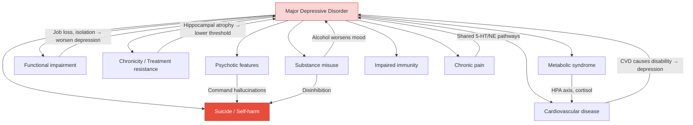

## Complications of Major Depressive Disorder

### Why Think About Complications?

MDD is not a "benign" mood problem. It is a systemic illness with consequences that extend far beyond sadness. The lecture slides conclude with a clear message: ***Depression is associated with significant morbidity and mortality*** [3]. Understanding complications is essential because it drives urgency of treatment, informs the consent discussion with patients ("if we don't treat this, here is what can happen"), and frames depression as a medical emergency in its most severe forms.

Complications can be organised into:
1. **Psychiatric complications** (direct consequences of the depressive illness itself)
2. **Medical/physical complications** (depression's impact on the body)
3. **Functional and psychosocial complications** (impact on life, work, relationships)
4. **Treatment-related complications** (iatrogenic)

---

### 1. Psychiatric Complications

#### A. Suicide — The Most Devastating Complication

This is the complication that kills. Everything you do in managing depression — every assessment, every follow-up, every medication choice — is ultimately aimed at preventing this outcome.

***Depression raises suicidal risk*** [3]:

- ***Increase in suicide risk attributable to depression was 20-fold*** [3]
- ***Suicide was the cause of death in 6% of patients with an affective disorder, and the risk would be even higher in those with psychiatric co-morbidities*** [3]
- ***In a longitudinal study in Sweden spanning over half a century, the long-term suicide risk in subjects with depression was 6.0% after 54–64 years of follow-up*** [3]
- Senior notes cite even higher figures for severe admitted cases: ***> 20× risk of suicide, can approach 15% in those with severe admitted cases*** [2]

**Why does depression cause suicide?** The pathophysiology converges from multiple directions:
- **Hopelessness** (Beck's cognitive triad: "nothing will ever get better") — the single strongest cognitive predictor of suicide
- **Impaired serotonergic function** — 5-HT deficiency reduces impulse control, making it harder to resist self-destructive urges
- **Psychomotor retardation paradox** — the most severely retarded patients may be too immobilised to act on suicidal thoughts; the danger period is when they start to improve (enough energy to act, but still deeply hopeless). This is why the early weeks of antidepressant treatment are a high-risk period
- **Psychotic features** — command hallucinations ("kill yourself"), delusions of guilt ("you deserve to die"), nihilistic delusions (Cotard's syndrome)
- **Comorbid substance abuse** — disinhibition + depression is a lethal combination

#### Hong Kong-Specific Data on Depression and Suicide

***Depression accounts for a significant proportion of suicides in adults in Hong Kong*** [3]:
- ***Using a case-control psychological autopsy method, 150 local suicide decedents aged 15–59 were compared with 150 randomly selected age- and gender-matched control participants living in the community*** [3]
- ***In the presence of non-disease-related social risk factors (unemployment and unmanageable debt), current major depressive disorder independently accounted for 27% of the population-attributable risk of suicide*** [3]

***Depression accounts for a significant proportion of suicides in older adults in Hong Kong*** [3]:
- ***Using a case-control psychological autopsy method, 70 decedents aged 60 or above who had committed suicide were compared with 100 elderly controls*** [3]
- ***86% of suicide subjects suffered from a psychiatric problem before committing suicide, compared with 9% of control subjects*** [3]
- ***Among the psychiatric problems, major depression was the commonest diagnosis*** [3]

***In some tragic cases, symptoms may be masked to others until the person is found dead by suicide*** [3]

<Callout title="Depression = Leading Cause of Suicide in HK" type="error">
In Hong Kong, MDD is the single most important psychiatric risk factor for suicide in both younger adults and the elderly. This is a high-yield exam point. Over 700,000 people commit suicide worldwide every year, and ***one of the major causes of suicide is depression*** [3]. Every depressed patient requires systematic suicide risk assessment.
</Callout>

#### B. Self-Harm (Non-Suicidal Self-Injury)

- Cutting, burning, hitting — used as maladaptive coping to regulate overwhelming emotions
- Pathophysiology: self-injury triggers endorphin release → transient relief from emotional pain. Also, physical pain can "replace" the intolerable psychological pain
- ***In some younger people, the first obvious sign may be self-injury*** [3]
- Self-harm is a risk factor for completed suicide even when intent is not to die

#### C. Substance Misuse

- Depression and substance abuse have a **bidirectional relationship**: depression drives self-medication with alcohol, cannabis, and other substances; substance use worsens depression (especially alcohol as a CNS depressant)
- ***In some younger people, the first obvious sign may be drug use in a previously stable adolescent*** [3]
- ***↑ comorbidity with other disorders, especially anxiety and substance abuse*** [2]
- Common comorbidities in youth depression: ***70% has anxiety disorder, conduct disorder, substance abuse, dysthymia*** [2]
- Pathophysiology: dopaminergic reward pathway dysfunction in depression → patient seeks exogenous sources of dopamine (alcohol initially increases dopamine release in nucleus accumbens; stimulants directly increase dopamine). This creates a vicious cycle: substance → transient relief → withdrawal → worse depression → more substance

#### D. Psychotic Complications

- Psychotic features develop in ~15–20% of severe depressive episodes [2]
- ***Psychotic symptoms occur in severe depression, invariably associated with loss of insight and may predict development into bipolar disorder*** [2]
- Specific psychotic complications:
  - **Cotard's syndrome** (nihilistic delusions): patient believes their organs are rotting, they are dead, the world does not exist — named after Jules Cotard (1880). This is a psychiatric emergency
  - **Depressive stupor**: ***severe psychomotor retardation progressing to point of unresponsiveness, lack of voluntary movement and near or total mutism*** [2]. This is life-threatening because the patient cannot eat, drink, or care for themselves → dehydration, malnutrition, DVT/PE from immobility
- Psychotic depression also carries higher suicide risk than non-psychotic depression (command hallucinations, delusional guilt driving self-punishment)

#### E. Chronicity and Treatment Resistance

- ***~10–20% of cases become chronic unremitting*** [2]
- ***~50% do not have complete symptom remission between episodes*** [2]
- ***Only ~25% of those with recurrent major depression achieve 5-year clinical stability with good social and occupational performance*** [2]
- Each successive episode further sensitises the brain (kindling hypothesis) — the threshold for future episodes lowers, and intervals between episodes shorten progressively [2]
- Chronicity leads to cumulative neurobiological damage: progressive hippocampal atrophy (cortisol-mediated), prefrontal cortex thinning, white matter changes

#### F. Conversion to Bipolar Disorder

- ***~25% of bipolar affective disorder first presents as a juvenile depression in their first episode*** [2]
- Psychotic features in depression may predict future bipolar conversion [2]
- This is why longitudinal follow-up and re-assessment of diagnosis is essential — a patient diagnosed with "recurrent MDD" may actually have unrecognised bipolar disorder

#### G. Comorbid Psychiatric Disorders

Depression rarely exists in isolation:
- **Anxiety disorders**: ~60–70% comorbidity rate; mutual reinforcement (worry → depression → more worry)
- **Eating disorders**: ***in some younger people, the first obvious sign may be bulimia*** [3]; depression drives disordered eating through body image distortion, comfort eating, or appetite loss
- **Personality disorders**: borderline PD and MDD frequently co-exist; borderline features predict poorer treatment response and more frequent recurrence [2]

---

### 2. Medical/Physical Complications

***Depression entails a non-psychiatric impact!*** [2]

#### A. Increased Non-Suicide Mortality

***Depression increases non-suicidal mortality*** [3]:
- ***Reviewed 61 reports; 72% demonstrated positive association for depression and non-suicide mortality*** [3]
- ***RR = 1.2–4.0*** [2][3]

***Possible mediators*** [3]:
1. ***Behavioural risk factors***: ***poor adherence to treatment, inactivity, ↑ alcohol consumption*** — depression impairs motivation and executive function → patients don't take their medications, don't exercise, and may drink more
2. ***Biological risk factors***: ***altered thrombogenesis*** — depression activates the sympathetic nervous system and HPA axis → ↑ platelet activation, ↑ inflammatory cytokines, ↑ endothelial dysfunction → prothrombotic state → ↑ cardiovascular events
3. ***Subclinical disease / prevalent disease***: ***cardiovascular disease*** — depression and CVD share inflammatory pathways; depression may accelerate atherosclerosis progression

#### B. Cardiovascular Disease

Depression is an **independent risk factor** for:
- **Coronary artery disease** (CAD): depressed patients have ~1.5–2× risk of developing CAD
- **Post-MI mortality**: depressed patients post-MI have 3–4× higher mortality
- **Heart failure**: depression worsens prognosis in CHF
- **Stroke**: bidirectional — depression increases stroke risk; post-stroke depression is common (~30%)

Mechanisms:
- HPA axis dysregulation → hypercortisolaemia → visceral obesity, insulin resistance, dyslipidaemia
- Sympathetic hyperactivation → ↑ heart rate, ↓ heart rate variability (HRV), ↑ arrhythmia risk
- Platelet hyperactivation → altered thrombogenesis
- Endothelial dysfunction → accelerated atherosclerosis
- Behavioural factors: smoking, sedentary lifestyle, poor diet, medication non-adherence

#### C. Metabolic Syndrome and Type 2 Diabetes

- Depression increases risk of developing type 2 diabetes by ~37% (meta-analyses)
- Bidirectional: diabetes increases depression risk; depression worsens glycaemic control
- Mechanism: cortisol excess → insulin resistance → central adiposity → metabolic syndrome. Also, anti-depressants (especially mirtazapine, TCAs, paroxetine) can cause weight gain

#### D. Impaired Immunity and Infection

- Depression → ↑ pro-inflammatory cytokines (IL-1, IL-6, TNF-α) + ↓ cell-mediated immunity (↓ NK cell activity, ↓ T-cell proliferation)
- Clinical consequence: ↑ susceptibility to infections, slower wound healing, poorer vaccine responses

#### E. Chronic Pain

- Depression and chronic pain share serotonergic and noradrenergic pathways (descending pain inhibitory system)
- Depression amplifies pain perception (central sensitisation); chronic pain perpetuates depression
- This bidirectional relationship creates one of the most treatment-resistant clinical scenarios

#### F. Other Physical Morbidity

- ***↑ morbidity: associated with ↓ birth weight*** [2] — maternal depression during pregnancy → cortisol crosses placenta → fetal HPA axis programming → low birth weight, preterm delivery
- ***Chronic medical illness, poor self-perceived health, functional and cognitive impairment*** [2]
- Osteoporosis: hypercortisolaemia → ↓ osteoblast activity → bone loss (depression is an under-recognised risk factor for fracture)

---

### 3. Functional and Psychosocial Complications

***When enduring, depression can result in impaired function at work, at school and in the family*** [3]

| Domain | Complication | Mechanism |
|---|---|---|
| **Occupational** | ↓ Productivity, absenteeism, job loss, unemployment | Anergia, poor concentration, psychomotor retardation → cannot perform at work. ***~$85 billion/year loss of productivity*** [2] |
| **Academic** | ***Decline in school performance*** [3], failure, dropout | Concentration impairment, amotivation, anhedonia |
| **Social** | Social withdrawal, isolation, loss of friendships | Anhedonia → loss of interest in social activities; negative cognitive style → misinterprets social cues; fatigue → avoids effort of social engagement |
| **Interpersonal** | Relationship breakdown, divorce, family conflict | Irritability, withdrawal, loss of libido, burden on partners/family. ***↑ in divorced*** (both cause and consequence) [2] |
| **Self-care** | Neglect of hygiene, nutrition, health management | Anergia, apathy, amotivation; especially in elderly → ***deterioration of cognitive functioning and self-care*** [3] |
| **Parenting** | Impaired bonding, inconsistent parenting, neglect | Maternal/paternal depression → insecure attachment in children → intergenerational transmission of vulnerability |
| **Financial** | Debt, poverty, homelessness | Job loss + impaired decision-making + potential comorbid substance abuse |
| **Legal** | In severe cases with psychotic features or comorbid substance abuse | Impaired judgement; antisocial behaviour secondary to substance misuse or irritability |

#### Youth-Specific Complications

***In some younger people, the first obvious sign may be*** [3]:
- ***Loss of interest in friends***
- ***Decline in school performance***
- ***Self-injury or bulimia or drug use in a previously stable adolescent***

In youth depression specifically [2]:
- ***Behavioural problems*** (e.g., "one case tried to steal a bus because of frustration at home, take cannabis to lift mood due to depression") [2]
- Somatic complaints (unexplained abdominal pains, headache, anorexia, enuresis) [2]
- High comorbidity rate: 70% have anxiety disorder, conduct disorder, substance abuse, or dysthymia [2]

---

### 4. Treatment-Related Complications (Iatrogenic)

These are complications of the treatments themselves, which must be balanced against the risks of untreated depression:

| Treatment | Complication | Mechanism | Prevention |
|---|---|---|---|
| **SSRIs** | ↑ Suicidal ideation in < 25 years (first 1–2 weeks) | SSRIs may initially increase energy/activation before mood improves → patient now has the energy to act on pre-existing suicidal thoughts | Close monitoring in first 2–4 weeks; start at low dose; warn patient/family |
| **SSRIs** | Serotonin syndrome (if combined with MAOIs) | Excessive synaptic 5-HT → hyperthermia, rigidity, myoclonus, altered mental status, autonomic instability | Mandatory washout period between SSRIs and MAOIs (≥2 weeks; 5 weeks for fluoxetine) |
| **SSRIs/SNRIs** | Hyponatraemia (SIADH) | Inappropriate ADH secretion → water retention → dilutional hyponatraemia | Monitor Na especially in elderly; educate about symptoms (confusion, nausea, seizures) |
| **SSRIs** | GI bleeding | 5-HT stored in platelets; SSRIs deplete platelet 5-HT → impaired platelet aggregation | Avoid concurrent NSAIDs; consider PPI cover in high-risk patients |
| **SSRIs/SNRIs** | Sexual dysfunction | 5-HT2/3 receptor stimulation in spinal cord → inhibits sexual arousal and orgasm | Consider switching to bupropion (no sexual S/E) or mirtazapine; dose reduction |
| **SSRIs/SNRIs** | Discontinuation syndrome | Abrupt withdrawal → rebound reduction in synaptic 5-HT → dizziness, nausea, "electric shocks," irritability, insomnia | Gradual taper over ≥4 weeks (especially paroxetine, venlafaxine) |
| **TCAs** | Cardiotoxicity in overdose | Sodium channel blockade → QRS prolongation → ventricular arrhythmias → cardiac arrest | Avoid in suicidal patients; prescribe limited supply; prefer SSRIs |
| **MAOIs** | Hypertensive crisis ("cheese reaction") | Tyramine in food normally metabolised by gut MAO-A; when MAO inhibited, tyramine → NE surge → hypertensive emergency | Strict tyramine-free diet; patient education |
| **Lithium (augmentation)** | Toxicity (tremor, ataxia, confusion, seizures, renal failure); hypothyroidism; nephrogenic DI; teratogenicity | Narrow therapeutic index; accumulates in renal impairment; inhibits thyroid hormone synthesis; affects renal aquaporins; neural tube defects (Ebstein's anomaly) | Regular monitoring: plasma Li, RFT, TFT every 6 months; reliable contraception |
| **Antipsychotics (augmentation)** | Metabolic syndrome (weight gain, dyslipidaemia, insulin resistance); extrapyramidal side effects; QTc prolongation | Histamine H1, 5-HT2C, muscarinic receptor blockade → appetite ↑, metabolic dysregulation; D2 blockade → EPS | Monitor weight, glucose, lipids, ECG; use metabolically favourable agents (aripiprazole) |
| **ECT** | Cognitive impairment (acute confusion, amnesia) | Seizure-induced transient neuronal disruption; bilateral > unilateral cognitive effects | Use unilateral electrode placement when possible; inform patient; usually short-lived (days) |

---

### Summary: Interconnection of Complications

The complications of MDD form vicious cycles — each complication feeds back to worsen the depression:

---

<Callout title="High Yield Summary">

**Complications of MDD — Core Points:**

1. **Suicide**: 20× increased risk; 6% lifetime risk of suicide death in affective disorders (15% in severe admitted cases). MDD is the commonest psychiatric cause of suicide in HK (27% population-attributable risk in adults, commonest diagnosis in elderly suicide). 86% of elderly suicide decedents in HK had a psychiatric problem; depression was the commonest.

2. **Non-suicide mortality**: RR 1.2–4.0. Mediated by behavioural factors (non-adherence, inactivity, alcohol), biological factors (altered thrombogenesis, HPA dysregulation), and prevalent CVD.

3. **Cardiovascular disease**: Depression is an independent cardiovascular risk factor. Mechanisms: hypercortisolaemia → insulin resistance; sympathetic activation → ↓ HRV; platelet activation → thrombosis; endothelial dysfunction.

4. **Chronicity**: 10–20% chronic unremitting; 80% recur; only 25% achieve 5-year stability. Each episode lowers threshold for future episodes (kindling).

5. **Psychotic complications**: 15–20% of severe episodes. Cotard's syndrome, depressive stupor (life-threatening), command hallucinations → suicide risk.

6. **Functional impairment**: ~$85B/year productivity loss. Occupational, academic, social, interpersonal, self-care deterioration.

7. **Substance misuse**: Bidirectional relationship; very common comorbidity; worsens prognosis.

8. **Bipolar conversion**: ~25% of BAD first presents as juvenile depression.

9. **Treatment-related**: SSRIs → suicidality in youth (first weeks), serotonin syndrome, hyponatraemia; TCAs → lethal in OD; MAOIs → hypertensive crisis; lithium → toxicity, hypothyroidism.

</Callout>

---

<ActiveRecallQuiz
  title="Active Recall - Complications of MDD"
  items={[
    {
      question: "What is the magnitude of suicide risk in MDD, and what is the Hong Kong-specific evidence linking depression to suicide?",
      markscheme: "Risk: 20-fold increase in suicide risk; 6% lifetime suicide risk in affective disorders; up to 15% in severe admitted cases. HK evidence (adults): psychological autopsy study of 150 suicide decedents aged 15-59; MDD independently accounted for 27% of population-attributable risk of suicide (Chan et al. 2009). HK evidence (elderly): 70 decedents aged 60+; 86% had psychiatric problem before suicide vs 9% of controls; MDD was commonest diagnosis (Chiu et al. 2004).",
    },
    {
      question: "Explain three mechanisms by which depression increases non-suicide cardiovascular mortality.",
      markscheme: "(1) HPA axis dysregulation: hypercortisolaemia causes insulin resistance, visceral obesity, dyslipidaemia, accelerating atherosclerosis. (2) Sympathetic hyperactivation: increased heart rate, decreased heart rate variability, increased arrhythmia risk. (3) Platelet hyperactivation and altered thrombogenesis: depression increases platelet reactivity and inflammatory cytokines causing endothelial dysfunction and prothrombotic state. Also behavioural: poor medication adherence, inactivity, increased alcohol consumption.",
    },
    {
      question: "Why is the early period of antidepressant treatment a high-risk time for suicide, and how should this be managed?",
      markscheme: "The psychomotor retardation paradox: severely depressed patients may be too retarded to act on suicidal thoughts. SSRIs initially restore energy and activation before mood improves (mood improvement lags behind activation by days-weeks). The patient now has the energy to act on pre-existing suicidal ideation while still hopeless. Also, SSRIs may paradoxically increase agitation/anxiety initially. Management: close monitoring in first 2-4 weeks (weekly reviews), start at low dose, educate patient and family about warning signs, consider short-term benzodiazepine for agitation, avoid prescribing large quantities of medication (especially TCAs).",
    },
    {
      question: "What is Cotard's syndrome, why does it occur in severe depression, and why is depressive stupor life-threatening?",
      markscheme: "Cotard's syndrome: nihilistic delusions associated with depression where patient believes organs are rotting, they are dead, or the world does not exist. Occurs in severe depression because extreme hopelessness and guilt reach delusional intensity with mood-congruent psychotic themes. Depressive stupor: severe psychomotor retardation progressing to unresponsiveness, lack of voluntary movement, and near/total mutism. Life-threatening because the patient cannot eat, drink, or care for themselves leading to dehydration, malnutrition, DVT/PE from immobility. Requires urgent ECT.",
    },
    {
      question: "State the prognostic factors for relapse in MDD and the key statistics about the chronic course of the illness.",
      markscheme: "Prognostic factors for relapse: (1) incomplete symptomatic remission, (2) early age of onset, (3) poor social support, (4) poor physical health, (5) comorbid substance abuse, (6) comorbid personality disorder. Course statistics: average episode duration 6 months; approximately 80% will have recurrence; average 4 further episodes over 25 years; progressive shortening of interval between episodes; 50% do not have complete symptom remission between episodes; only 25% achieve 5-year clinical stability; 10-20% become chronic unremitting.",
    },
  ]}
/>

## References

[2] Senior notes: ryanho-psych.md (Psychiatry chapter — sections 7.2 Course and Prognosis, 7.1.1, Youth Depression, pages 140, 155–162, 271)
[3] Lecture slides: GC 164. I am depressed Mood disorders.pdf (pages 2, 4, 5, 6, 15, 25)
