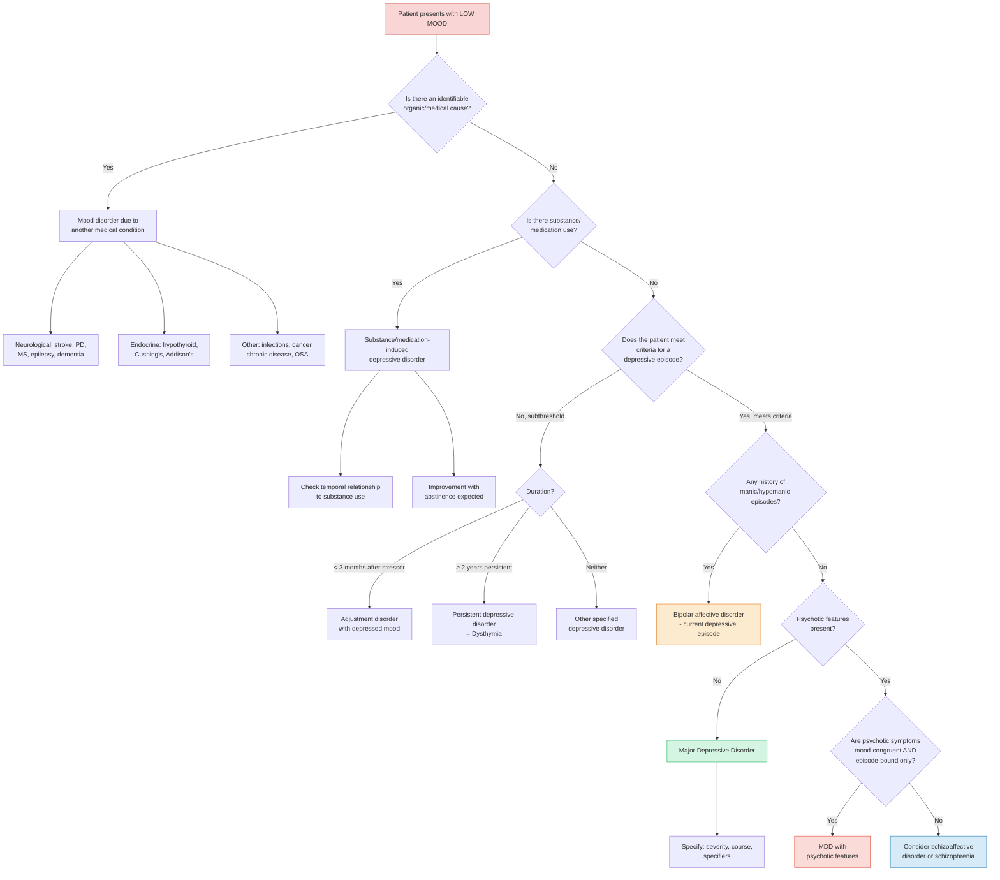

## Differential Diagnosis of Major Depressive Disorder

### The Logic of the DDx

When a patient presents with **low mood**, your job is not simply to confirm MDD — it is to systematically consider and exclude conditions that can mimic, co-exist with, or underlie depressive symptoms. The differential spans three broad domains [2][3]:

1. **Other primary psychiatric disorders** that present with depressed mood
2. **Depression secondary to general medical conditions** (organic mood disorder)
3. **Depression secondary to substances/medications** (substance-induced depressive disorder)

The key principle: **MDD is a clinical diagnosis of inclusion (meets criteria) AND exclusion (not better explained by something else)**. The DSM-5 criteria explicitly state the episode must ***not be attributable to the physiological effects of a substance or to another medical condition*** and ***not better explained by schizoaffective disorder, schizophrenia, schizophreniform disorder, delusional disorder, or other specified and unspecified schizophrenia spectrum and other psychotic disorders*** [3].

---

### Systematic Differential Diagnosis

#### A. Other Primary Psychiatric Disorders

##### 1. Bipolar Affective Disorder (BAD)

This is the **single most important differential** to actively exclude in every patient presenting with depression. Why? Because treatment differs radically — antidepressant monotherapy in BAD can trigger mania or rapid cycling.

- A patient with a current depressive episode + ***≥1 previous manic/hypomanic episode*** has bipolar disorder, not MDD [2]
- ***Hypomanic episodes are often overlooked. Patients with BP II are misdiagnosed as having major depressive disorder*** [5]
- ***Misdiagnosis is especially common — among 600 patients with bipolar disorder, 69% were initially misdiagnosed and most frequently as major depression, followed by anxiety disorders, substance or alcohol use disorder*** [5]
- ***Correct diagnosis and treatment was delayed by 5–7 years on average*** [5]

**How to distinguish:**
- **Always actively ask** about past episodes of elated/irritable mood, decreased need for sleep, grandiosity, pressured speech, reckless behaviour — patients rarely volunteer hypomanic symptoms because they feel good during them
- **Discerning features that favour BAD over MDD** [2]: psychotic features in depression, atypical features (hypersomnia, hyperphagia, leaden paralysis), early onset, many recurrent episodes, family history of BAD, post-partum onset, rapid onset/offset of episodes
- ~25% of BAD first presents as a juvenile depression [2]

<Callout title="Must-Know Exam Point" type="error">
***Hypomanic episode is often overlooked*** [5]. If you diagnose "recurrent MDD" without screening for past hypomania, you may be missing bipolar II disorder. Always ask: "Have you ever had a period of days where you felt unusually high, energetic, or irritable — where you needed less sleep but still felt full of energy?"
</Callout>

##### 2. ***Adjustment Disorder with Depressed Mood*** [3]

- "Adjustment" = from Latin *ad-* (to) + *justare* (to bring near) — the person is failing to adjust to a stressor
- Develops ***≤3 months of an identifiable stressor*** [2]
- **Does not meet full criteria** for a depressive episode — the symptoms are subthreshold [2]
- The emotional/behavioural response is out of proportion to the stressor OR causes significant functional impairment
- Key distinction: ***If meeting depressive episode criteria, should be regarded as having comorbid depression*** rather than adjustment disorder [2]. Adjustment disorder is a "not-otherwise-qualifying" diagnosis
- In terms of precipitating stressor, adjustment disorder is diagnosed when the stressor is **not deemed traumatic** in nature (cf. ASD/PTSD where the stressor is traumatic) [2]

##### 3. ***Persistent Depressive Disorder (Dysthymia)*** [3]

- "Dys-" (Greek: bad/difficult) + "thymia" (Greek: mood/spirit) = persistently bad mood
- Persistent depressive symptoms ***NOT meeting full criteria*** for a major depressive episode, lasting ***≥2 years*** [2]
- Onset usually in early adulthood → may persist throughout life → sometimes called "depressive personality" [2]
- May have superimposed major depressive episodes = ***"double depression"*** [2]
- Key distinction from MDD: chronicity (≥2 years), subthreshold severity, lack of discrete episodes
- Note: under DSM-5-TR, persistent depressive disorder **subsumes** both chronic MDD and dysthymia

##### 4. ***Manic Episode with Irritable Mood or Mixed Episodes*** [3]

- Mania can present with **irritability** rather than elation — this can be mistaken for agitated depression
- ***Mixed features*** specifier: a depressive episode with concurrent manic/hypomanic features (e.g., racing thoughts, increased energy, decreased need for sleep during a depressive episode)
- Key distinction: look for concurrent features of elevated energy, grandiosity, pressured speech, decreased need for sleep — these do NOT occur in pure MDD

##### 5. ***Anxiety Disorders*** [3]

- Anxiety and depression have enormous overlap — ~60–70% of MDD patients have comorbid anxiety
- GAD can mimic MDD: both have insidious onset, chronic course, prominent dysphoria, somatic symptoms [2]
- **How to distinguish** [2]:
  - Content of rumination: depressive patients tend to **brood self-critically on past events**; GAD patients tend to **worry about possible future events**
  - Somatic symptoms of depression: early morning wakening, diurnal variation in mood, suicidal thoughts are uncommon in GAD
  - Both can co-exist — comorbidity is the rule rather than the exception

##### 6. Schizoaffective Disorder

- **Simultaneous** occurrence of a depressive episode and schizophrenic symptoms lasting ≥2 weeks [2]
- Delusions and hallucinations are **less mood-congruent** and **may occur outside mood episodes** (cf. severe depression with psychotic features where psychotic symptoms are mood-congruent and episode-bound) [2]
- Must have **concurrent mood + psychotic symptoms** at some point (cf. schizophrenia where mood symptoms are minimal) [2]

##### 7. ***Substance/Medication-Induced Depressive Disorder*** [3]

- Depression caused directly by the physiological effects of a substance
- Should resolve or significantly improve after substance cessation
- Key substances: alcohol (a CNS depressant), cannabis, opioid withdrawal, stimulant withdrawal (cocaine, amphetamines)
- Distinguished from MDD by temporal relationship to substance use, improvement with abstinence

##### 8. ***Mood Disorder Due to Another Medical Condition*** [3]

- The depressive syndrome is judged to be a direct pathophysiological consequence of a medical condition (not just a psychological reaction to being ill)
- See medical conditions table below

##### 9. Other Psychiatric Disorders Presenting with Low Mood

| Condition | Key Differentiating Features |
|---|---|
| **Schizophrenia** | Negative symptoms (flat affect, avolition, alogia) can mimic depression. However, primary psychotic symptoms (bizarre delusions, thought disorder, prominent hallucinations) dominate. Mood symptoms are secondary and brief relative to psychotic illness |
| **OCD** | Ruminations in OCD are **intrusive, ego-dystonic**, and accompanied by compulsions. In depression, ruminations are **mood-congruent** (guilt, worthlessness) and not experienced as intrusive in the same way [2] |
| **PTSD/ASD** | Can present with depressed mood, anhedonia, and withdrawal. However, require a **traumatic stressor** and have characteristic re-experiencing, avoidance, and hyperarousal symptoms |
| **Personality disorders** (especially borderline) | Chronic affective instability, identity disturbance, interpersonal dysfunction. Mood shifts are rapid (hours to days), often interpersonally triggered, and lack the sustained, pervasive quality of MDD. No classic biological symptoms |
| **Somatic symptom disorder** | Somatisation is common in depression, but in somatic symptom disorder, the somatic concerns persist **outside** depressive episodes [2] |
| **Dementia** ("pseudodementia" vs true dementia) | Depression in elderly can mimic dementia with cognitive decline and self-care deterioration. ***In some older people, symptoms may mimic dementia — deterioration of cognitive functioning and self-care*** [3]. Differentiating features: more well-defined onset, patient complains/worries about memory (vs dementia patients have poor insight), gives less effort on testing ("don't know" answers vs wrong answers in dementia), language/motor skills are slow but not impaired [2] |

---

#### B. Depression Secondary to General Medical Conditions

This is critical because treating the underlying condition may resolve the depression. The lecture slides provide a comprehensive list [3]:

| Category | Examples | Why They Cause Depression |
|---|---|---|
| ***Neurological disorders*** | ***Epilepsy, Parkinson's disease, dementia, multiple sclerosis, Huntington disease, cerebrovascular disease, migraine*** [3] | Direct neuronal damage to mood-regulating circuits (frontal-subcortical pathways); dopamine depletion in Parkinson's; post-stroke depression affects ~30% (especially left frontal lesions) |
| ***Endocrine disorders*** | ***Hypothyroidism, hyperthyroidism, Cushing's syndrome, Addison disease, prolactinomas, hyperparathyroidism*** [3] | Hypothyroidism → ↓ T3/T4 → slowed metabolism and monoamine synthesis; Cushing's → cortisol excess → hippocampal neurotoxicity; Addison's → cortisol deficiency → fatigue, apathy; Hyperparathyroidism → hypercalcaemia → neuropsychiatric symptoms |
| ***Infectious diseases*** | ***Mononucleosis, HIV infection, hepatitis C infection, Lyme disease, syphilis*** [3] | Neuroinflammation, cytokine-mediated serotonin depletion (IDO pathway), direct CNS invasion (HIV, neurosyphilis) |
| ***Neoplasias*** | ***Pancreatic cancer***, ***paraneoplastic syndromes*** [3] | Pancreatic cancer is notorious for depression preceding diagnosis (possibly cytokine-mediated or paraneoplastic); any cancer causes depression via inflammation + psychological burden |
| ***Chronic diseases*** | ***Coronary artery disease, type II diabetes*** [3] | Shared inflammatory pathways; HPA axis dysregulation; behavioural factors (inactivity, poor diet) |
| ***Chronic pain and psychosomatic conditions*** | [3] | Impaired descending pain inhibitory pathways (5-HT/NE) → central sensitisation → amplified pain → depression → more pain (vicious cycle) |
| ***Sleep-related disorders*** | ***Obstructive sleep apnoea*** [3] | Chronic sleep fragmentation → daytime somnolence, fatigue, cognitive impairment mimicking depression; hypoxia may directly impair monoaminergic function |

<Callout title="Pancreatic Cancer & Depression" type="idea">
Pancreatic cancer is one of the few malignancies where depression may be the **presenting symptom** — sometimes months before the cancer is diagnosed. The mechanism is not fully understood but may involve paraneoplastic antibodies, cytokines, or disruption of the gut-brain axis. In an older patient with new-onset depression and unexplained weight loss, think about this.
</Callout>

---

#### C. Drug/Substance-Related Depression

***Drug-related conditions*** that can cause or mimic depression [3]:

| Category | Examples | Mechanism |
|---|---|---|
| ***Antihypertensives*** | ***Reserpine, methyldopa*** [3]; beta-blockers [2] | Reserpine depletes monoamine stores (vesicular monoamine transporter inhibitor) — this is actually the historical observation that led to the monoamine hypothesis! Methyldopa inhibits DOPA decarboxylase → ↓ dopamine/NE. Beta-blockers block noradrenergic signalling |
| ***Smoking-cessation aids*** | Varenicline [3] | Partial nicotinic agonist → may affect dopaminergic reward pathways |
| ***Steroids*** | Corticosteroids [2][3] | Exogenous cortisol → HPA axis suppression, hippocampal neurotoxicity, mood lability |
| ***Sex hormones and medications that affect sex hormones*** | OCP [2], GnRH agonists, anti-androgens [3] | Hormonal fluctuations affect serotonergic and GABAergic neurotransmission |
| ***H2 blockers*** | Ranitidine, cimetidine [3] | May cross blood-brain barrier → affect histaminergic neurotransmission |
| ***Sedatives, muscle relaxants*** | Benzodiazepines [2][3] | CNS depression, GABAergic enhancement → psychomotor slowing, apathy |
| ***Appetite suppressants*** | [2][3] | May affect serotonergic/dopaminergic pathways |
| ***Chemotherapy agents*** | [3] | Cytokine release → neuroinflammation → IDO activation → serotonin depletion |
| ***Neurological drugs*** | ***L-dopa*** [2], anticonvulsants | L-dopa can paradoxically cause depression via dopamine metabolism dysregulation |
| ***Substance abuse*** | ***Alcohol, cocaine, amphetamines, cannabinoids, sedatives, hypnotics, narcotics*** [3] | Alcohol is a CNS depressant; stimulant withdrawal causes rebound anhedonia/fatigue (dopamine depletion); cannabis chronic use → amotivational syndrome |
| ***Others*** | ***Interferon*** [2], indomethacin, opiates [2] | Interferon-α activates IDO enzyme → shunts tryptophan to kynurenine pathway → ↓ serotonin + ↑ neurotoxic metabolites |

---

### Approach Algorithm: Differential Diagnosis of Low Mood

---

### Key Differentiating Principles — Summary Table

| Differential | Key Distinguishing Feature from MDD | Why It Matters |
|---|---|---|
| **Bipolar disorder** | ≥1 past manic/hypomanic episode; actively ask — patients don't volunteer | Antidepressant monotherapy can trigger mania |
| **Adjustment disorder** | Subthreshold symptoms, onset ≤3 months of stressor, non-traumatic stressor | Self-limiting; usually responds to supportive therapy alone |
| **Dysthymia** | Chronic (≥2 years), subthreshold, no discrete episodes | Consider "double depression" if MDD superimposed |
| **GAD** | Future-oriented worry (vs past-oriented rumination in MDD); less biological symptoms | Often comorbid; treatment overlaps but emphasis differs |
| **Schizoaffective disorder** | Psychotic symptoms less mood-congruent, occur outside mood episodes | Requires antipsychotic ± mood stabiliser |
| **Psychotic depression** | Mood-congruent psychotic symptoms occurring ONLY during episode | Requires antidepressant + antipsychotic or ECT |
| **Organic/medical** | Temporal relationship to medical condition, abnormal investigations | Treat underlying condition |
| **Substance-induced** | Temporal relationship to substance use/withdrawal; improves with abstinence | Remove offending agent |
| **Dementia vs pseudodementia** | Depression: acute onset, complains of memory loss, "don't know" answers; Dementia: insidious, poor insight, wrong answers | Treat depression first — cognition may improve |

---

### Investigations to Exclude Secondary Causes

***Physical examination & investigation to rule out medical conditions that may cause depressive symptoms*** [3]:

| Investigation | What You're Looking For |
|---|---|
| ***CBP*** | Anaemia (fatigue mimicking depression), ↑MCV (alcoholism), ↑WBC (infection) |
| ***Renal function tests*** | Uraemia (can cause apathy, cognitive impairment); hypoNa (SIADH or antidepressant side effect) |
| ***Liver function tests*** | GGT ↑ (alcoholism); hepatic encephalopathy |
| ***Thyroid function tests*** | Hypothyroidism (classic organic mimic); hyperthyroidism (can cause agitation/anxiety mimicking agitated depression) |
| ***Blood glucose*** | Hypoglycaemia (episodic fatigue, anxiety); diabetes (chronic disease-associated depression) |
| ***Calcium, phosphate*** | Hyperparathyroidism → hypercalcaemia → "stones, bones, groans, and psychiatric moans" |
| ***Vitamin B12, folate*** | Deficiency causes fatigue, cognitive impairment, depression |
| ***Blood alcohol, urine drug screen*** | Substance-induced depression |
| ***HIV test*** | If indicated — HIV-associated neurocognitive disorder |
| ***Cosyntropin/ACTH stimulation test*** | ***For Addison disease*** [3] — if suspected |
| ***ECG*** | Baseline before starting certain medications (TCAs, lithium prolong QT) |
| ***EEG*** | ***For epilepsy*** [3] — if seizures suspected |
| ***CT or MRI brain*** | ***For organic brain syndrome or hypopituitarism*** [3] — if focal neurology, cognitive deficits, or atypical presentation |

<Callout title="The Minimum Bloods for Every Depressed Patient">
At a bare minimum: **CBP, R/LFT, TFT**. These are non-negotiable. Everything else is guided by clinical suspicion from history and physical examination. You cannot diagnose MDD without first ruling out thyroid disease, anaemia, and metabolic derangement.
</Callout>

---

<Callout title="High Yield Summary">

**Differential Diagnosis of MDD — Core Points:**

1. **Always screen for bipolar disorder** — ask about past mania/hypomania. 69% of BAD patients are initially misdiagnosed, most commonly as MDD. Correct diagnosis delayed 5–7 years on average.

2. **Adjustment disorder** = subthreshold symptoms, ≤3 months of non-traumatic stressor. If full MDD criteria are met, diagnose MDD (not adjustment disorder).

3. **Dysthymia** = chronic (≥2 years), subthreshold. Can have superimposed MDD ("double depression").

4. **Psychotic depression vs schizoaffective**: mood-congruent + episode-bound psychosis = psychotic MDD. Less mood-congruent + psychosis outside mood episodes = schizoaffective.

5. **Medical causes**: always exclude hypothyroidism (TFT), Cushing's/Addison's, anaemia (CBP), and substance use. Minimum bloods: CBP, R/LFT, TFT.

6. **Drug-induced depression**: beta-blockers, reserpine, methyldopa, steroids, OCP, interferon, L-dopa, benzodiazepines. Temporal relationship to drug initiation is the key clue.

7. **Pseudodementia**: depression in elderly mimicking dementia. Treat depression first — cognition may recover.

</Callout>

---

<ActiveRecallQuiz
  title="Active Recall - Differential Diagnosis of MDD"
  items={[
    {
      question: "A 35-year-old woman presents with her 4th episode of depression. What single question is most critical to ask that could change her diagnosis and management entirely?",
      markscheme: "Screen for past manic or hypomanic episodes: 'Have you ever had a period of days where you felt unusually high, energetic, or irritable, needing less sleep but still feeling full of energy?' If yes, diagnosis is bipolar disorder (not MDD), and antidepressant monotherapy is contraindicated as it may trigger mania. 69% of bipolar patients are initially misdiagnosed as MDD.",
    },
    {
      question: "How do you distinguish adjustment disorder with depressed mood from a major depressive episode?",
      markscheme: "Adjustment disorder: (1) does NOT meet full criteria for depressive episode (subthreshold symptoms), (2) develops within 3 months of an identifiable stressor, (3) stressor is not traumatic in nature (cf PTSD). If full MDD criteria are met, the patient has MDD (not adjustment disorder) even if there was a precipitating stressor.",
    },
    {
      question: "Name 3 endocrine conditions and 3 neurological conditions that can present with depressive symptoms, and explain the mechanism for one of them.",
      markscheme: "Endocrine: hypothyroidism, Cushing's syndrome, Addison disease (also: hyperparathyroidism, prolactinoma, hyperthyroidism). Neurological: Parkinson disease, stroke/cerebrovascular disease, epilepsy (also: MS, Huntington disease, dementia). Mechanism example: Hypothyroidism - decreased T3/T4 leads to slowed cerebral metabolism and reduced monoamine synthesis causing fatigue, psychomotor retardation, and depressed mood. OR Cushing's - cortisol excess causes hippocampal neurotoxicity and HPA axis dysregulation.",
    },
    {
      question: "A 70-year-old man is brought by his family for progressive memory problems. How would you differentiate depressive pseudodementia from true dementia?",
      markscheme: "Pseudodementia: (1) more well-defined/acute onset, (2) patient complains and worries about memory loss (vs dementia - poor insight, brought by family), (3) gives 'don't know' answers with less effort on testing (vs dementia - tries hard but gives wrong answers), (4) language and motor skills slow but not impaired, (5) look for biological features of depression (morning dysphoria, early morning wakening, psychomotor retardation). Treat depression first - if pseudodementia, cognition should improve.",
    },
    {
      question: "What is the minimum set of investigations every depressed patient should have, and explain the rationale for each?",
      markscheme: "CBP (exclude anaemia causing fatigue; raised MCV suggesting alcoholism), Renal function tests (uraemia causing apathy; baseline for medication dosing; calcium for hyperparathyroidism), Liver function tests (exclude alcoholic liver disease; GGT as marker), Thyroid function tests (hypothyroidism is the classic organic mimic of depression). Additional investigations guided by clinical suspicion: glucose, B12/folate, urine drug screen, HIV, cortisol, ECG, CT brain.",
    },
  ]}
/>

## References

[2] Senior notes: ryanho-psych.md (Psychiatry chapter — sections 7.1.1, 7.2, pages 140, 142–143, 154–158, 165, 188, 197, 271)
[3] Lecture slides: GC 164. I am depressed Mood disorders.pdf (pages 6, 8, 14–15)
[5] Lecture slides: GC 163. I am a superman Bipolar disorder.pdf (pages 10, 12)
