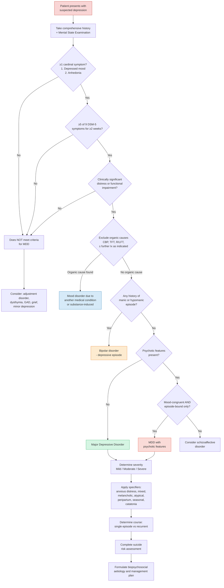
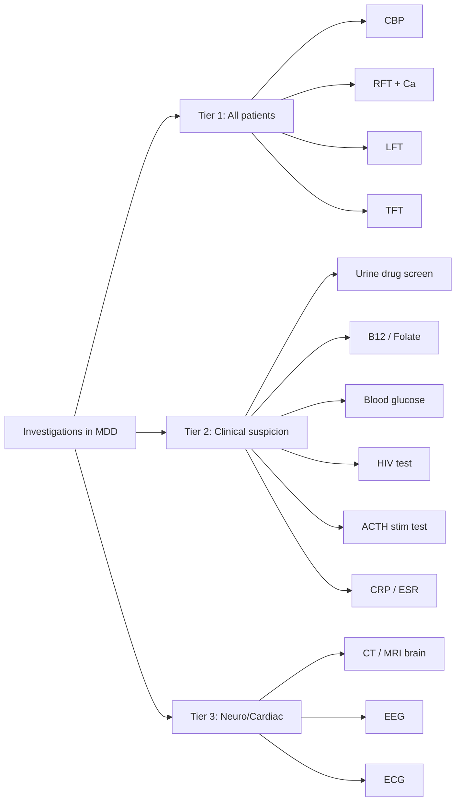

## Diagnostic Criteria for Major Depressive Disorder

### The Logic of Diagnostic Criteria

Psychiatric diagnosis rests on **pattern recognition** — there is no blood test or scan that confirms MDD. Diagnostic criteria exist to standardise this pattern recognition across clinicians. They consist of four components [2]:

1. **A cluster of symptoms** — core (discriminating) + associated (characteristic)
2. **A minimum duration** — to distinguish from transient emotional states
3. **Functional impairment or distress** — to distinguish from normal variation
4. **Exclusion criteria** — to distinguish from other conditions that mimic MDD

Two classification systems are in use: **DSM-5-TR** (American Psychiatric Association, primarily used in research and clinical practice worldwide) and **ICD-11** (WHO, used in most hospital coding systems). Both converge on the same essential construct but differ in structure. HKU teaches both — you need to know the DSM-5 criteria in detail and be aware of the ICD framework.

---

### A. DSM-5 Criteria for Major Depressive Disorder

***Major depressive disorder*** requires ALL of the following [3]:

#### Criterion A: Symptom Cluster

***Clear-cut changes in affect, cognition, and neurovegetative functions*** [3]

***5 or more of the following symptoms are present during the same 2-week period, representing a change from previous functioning; at least 1 of the symptoms is either (1) or (2)*** [3]:

| # | Symptom | Pathophysiological Basis | Notes |
|---|---|---|---|
| ***(1)*** | ***Depressed mood most of the day, nearly every day, as indicated by either subjective report (e.g., feels sad, empty, hopeless) or observation made by others (e.g., appears tearful)*** [3] | 5-HT/NE deficiency → vmPFC hyperactivity → negative emotional bias, rumination | ***In children and adolescents, can be irritable mood*** [3] |
| ***(2)*** | ***Markedly diminished interest or pleasure in all, or almost all, activities most of the day, nearly every day (as indicated by either subjective account or observation)*** [3] | DA deficiency in mesolimbic reward pathway → impaired reward/pleasure processing | This is **anhedonia** — one of two cardinal symptoms |
| ***(3)*** | ***Significant weight loss when not dieting or weight gain (e.g., a change of more than 5% of body weight in a month), or decrease or increase in appetite nearly every day*** [3] | Hypothalamic dysregulation (5-HT modulates feeding centres) | ***In children, consider failure to make expected weight gain*** [3] |
| ***(4)*** | ***Insomnia or hypersomnia nearly every day*** [3] | 5-HT/NE dysregulation of sleep-wake cycle; premature RAS activation (in early morning wakening) | Classical = early morning wakening; atypical = hypersomnia |
| ***(5)*** | ***Psychomotor agitation or retardation nearly every day (observable by others, not merely subjective feelings of restlessness or being slowed down)*** [3] | Retardation: dlPFC hypoactivity + DA ↓; Agitation: NE hyperactivation | Must be **observable** — subjective feeling alone is insufficient |
| ***(6)*** | ***Fatigue or loss of energy nearly every day*** [3] | NE/DA deficiency → reduced arousal and drive; HPA axis exhaustion | Anergia — one of three ICD core symptoms |
| ***(7)*** | ***Feelings of worthlessness or excessive or inappropriate guilt (which may be delusional) nearly every day (not merely self-reproach or guilt about being sick)*** [3] | Cognitive distortions (personalisation, selective abstraction); may reach delusional intensity in psychotic depression | Guilt about being sick does NOT count |
| ***(8)*** | ***Diminished ability to think or concentrate, or indecisiveness, nearly every day (either by subjective account or as observed by others)*** [3] | dlPFC hypoactivity → executive dysfunction; rumination hijacks cognitive resources | In elderly, may mimic dementia (pseudodementia) |
| ***(9)*** | ***Recurrent thoughts of death (not just fear of dying), recurrent suicidal ideation without a specific plan, or a suicide attempt or a specific plan for committing suicide*** [3] | 5-HT ↓ (impaired impulse control) + hopelessness (cognitive triad) | Ranges from passive to active; must always be assessed |

<Callout title="Cardinal vs Associated Symptoms">
At least one of **(1) depressed mood** or **(2) anhedonia** MUST be present. You cannot diagnose MDD without one of these two cardinal symptoms — even if a patient has 7 other symptoms (fatigue, insomnia, weight loss, etc.), without depressed mood or anhedonia, this is not MDD.
</Callout>

#### Criterion B: Duration and Functional Impairment

***At least 2 weeks' duration*** [3]

***Symptoms cause clinically significant distress or impairment in social, occupational, or other important areas of functioning*** [3]

Why 2 weeks? This threshold was chosen empirically to distinguish MDD from transient sadness. Normal grief and disappointment typically show improvement within days to a couple of weeks and retain emotional reactivity. The 2-week minimum captures persistent, autonomous mood disturbance.

#### Criterion C: Exclusion of Substance/Medical Cause

***The episode is not attributable to the physiological effects of a substance or to another medical condition*** [3]

This is why investigations (TFT, CBP, RFT, LFT, etc.) are essential — you must rule out organic mimics before diagnosing a primary mood disorder.

#### Criterion D: Exclusion of Psychotic Spectrum Disorders

***Not better explained by schizoaffective disorder, schizophrenia, schizophreniform disorder, delusional disorder, or other specified and unspecified schizophrenia spectrum and other psychotic disorders*** [3]

Why this criterion exists: Schizophrenia can have prominent negative symptoms (flat affect, avolition, anhedonia) that look like depression. The distinction is that in MDD, psychotic features (if present) are mood-congruent and episode-bound; in schizophrenia/schizoaffective, psychotic symptoms dominate and exist independently of mood episodes.

#### Criterion E: Exclusion of Bipolar Disorder

***Absence of previous manic or a hypomanic episode*** [3]

This is the single most critical exclusion criterion. A patient with a current depressive episode + any history of mania/hypomania = bipolar disorder, not MDD. This changes management entirely (antidepressant monotherapy is contraindicated in BAD).

<Callout title="Bereavement Exclusion — Removed in DSM-5" type="idea">
***Key change from DSM-IV: Removal of the "bereavement exclusion"*** [3]. Previously, depressive symptoms within 2 months of bereavement were excluded from MDD diagnosis. DSM-5 removed this because: (1) bereavement can trigger a genuine MDE; (2) ***depressive symptoms may be understandable/considered appropriate to significant loss (e.g., bereavement, financial ruin, losses from a natural disaster, a serious medical illness or disability)*** but can still represent MDD; (3) ***exercise of clinical judgment based on the individual's history and the cultural norms*** is required [3]. The point: grief can coexist with MDD, and withholding treatment on the basis of a "bereavement exclusion" may harm patients.
</Callout>

---

### B. ICD-11 Criteria for Depressive Episode

***ICD-11 cardinal symptoms: depressed mood or diminished interest in activities occurring most of the day, nearly every day during a period lasting at least two weeks*** [3]

***Additional symptoms: difficulty concentrating, feelings of worthlessness or excessive or inappropriate guilt, hopelessness, recurrent thoughts of death or suicide, changes in appetite or sleep, psychomotor agitation or retardation, and reduced energy or fatigue*** [3]

#### ICD-10/11 Severity Grading System (Box 9.1)

ICD uses a two-tier structure — **Section A** (core symptoms) and **Section B** (additional symptoms) [2]:

**Section A — Core Symptoms:**
1. Depressed mood
2. Loss of interest and enjoyment (anhedonia)
3. Reduced energy and decreased activity (anergia)

**Section B — Additional Symptoms:**
1. Reduced concentration
2. Reduced self-esteem and confidence
3. Ideas of guilt and unworthiness
4. Pessimistic thoughts
5. Ideas of self-harm
6. Disturbed sleep
7. Diminished appetite

**Severity grading** [2]:

| Severity | Section A Required | Section B Required | Overall |
|---|---|---|---|
| **Mild** | At least **2 of 3** | At least **2** of B | Total ≥ 4 symptoms |
| **Moderate** | At least **2 of 3** | At least **3** of B | Total ≥ 5 symptoms |
| **Severe** | **All 3** of A | At least **4** of B | Total ≥ 7 symptoms |

> Severity of symptoms AND degree of functional impairment also guide classification [2].

<Callout title="DSM-5 vs ICD: Key Differences" type="idea">
**DSM-5**: 5 of 9 symptoms (at least 1 cardinal), single threshold, severity assessed by clinical judgement and specifiers. **ICD**: Two-tier system (A+B) with explicit numerical thresholds for mild/moderate/severe. ICD requires **anergia** as a core symptom; DSM-5 lists fatigue as an associated symptom. Both converge on the same clinical picture — the structure differs.
</Callout>

---

### C. DSM-5 Specifiers

***Specifiers for major depressive disorder*** [3]:

#### Course Specifiers
- ***Single episode*** vs ***recurrent episode*** [3] (recurrent = ≥1 previous episode with ≥2-month interval of remission between episodes)

#### Severity Specifiers
- ***Mild, moderate, severe, with psychotic features, in partial remission, in full remission, unspecified*** [3]

#### Other Specifiers

***Other specifiers without codes*** [3]:

| Specifier | Key Features | Clinical Significance |
|---|---|---|
| ***With anxious distress*** [3] | Feeling keyed up/tense, restless, difficulty concentrating due to worry, fear of something awful happening, fear of losing control | Poorer prognosis, higher suicide risk, slower treatment response |
| ***With mixed features*** [3] | ≥3 manic/hypomanic symptoms during depressive episode (e.g., elevated mood, grandiosity, pressured speech, racing thoughts, increased energy, decreased need for sleep) | May predict future bipolar conversion; caution with antidepressant monotherapy |
| ***With melancholic features*** [3] | ***Near-complete absence of the capacity for pleasure*** [5]; loss of emotional reactivity, early morning wakening, depression worse in AM, psychomotor disturbance, weight loss, excessive guilt | Better response to biological treatments (ECT, TCA > SSRI) [2]; ↑ neurobiological abnormalities, ↑ FHx [2] |
| ***With atypical features*** [3] | ***Mood reactivity, weight gain, hypersomnia*** [5]; leaden paralysis, rejection sensitivity | Better response to MAOIs/SSRIs; poorer response to TCA [2] |
| ***With psychotic features*** — ***mood-congruent*** or ***mood-incongruent*** [3] | Delusions/hallucinations; mood-congruent = themes of guilt, worthlessness, nihilism, poverty; mood-incongruent = themes inconsistent with depression | Requires antidepressant + antipsychotic or ECT. Mood-incongruent psychosis → consider schizoaffective |
| ***With catatonia*** [3] | Stupor, mutism, negativism, posturing, stereotypy, echolalia/echopraxia | May require benzodiazepines or ECT |
| ***With peripartum onset*** [3] | Onset during pregnancy or within 4 weeks postpartum | ***Severe anxiety and even panic attacks. Risk of infanticide*** [5]. Screen all peripartum women |
| ***With seasonal pattern*** [3] | ***Depression begins in fall or winter and remits in spring*** [5] (recurrent episodes only) | Bright light therapy; melatonin-related mechanism |

#### Melancholic/Somatic Features — Detailed Criteria (Box 9.2)

At least **4** of the following are required for "with somatic features" (ICD-10) or "with melancholic features" (DSM-5) [2]:

1. Loss of interest or pleasure in usual activities
2. Lack of emotional reactivity to normally pleasurable surroundings and events
3. Early-morning waking (≥2 hours before usual time)
4. Depression worse in the morning
5. Psychomotor agitation or retardation
6. Marked loss of appetite
7. Weight loss (≥5% of body weight in last month)
8. Marked loss of libido (ICD-10 only)
9. Distinct quality of depressed mood (DSM-5 only)
10. Excessive guilt (DSM-5 only)

DSM-5 specifically requires **either** "loss of interest/pleasure" **or** "lack of emotional reactivity" to be present [2].

**Clinical relevance of melancholic depression** [2]:
- ***↑ neurobiological abnormalities + ↑ FHx***
- ***↑ severity of symptomatology***
- ***↓ response to placebo and ↑ response to TCA than SSRI***

---

### D. Key DSM-5 Changes from DSM-IV

***Key changes from DSM-IV*** [3]:

1. ***Removal of the "bereavement exclusion"*** — discussed above
2. ***Dysthymia → persistent depressive disorder (includes both chronic major depressive disorder and the previous dysthymic disorder)*** [3]
3. ***Introduction of two new disorders*** [3]:
   - ***Disruptive mood dysregulation disorder***: ***persistent irritability and frequent episodes of extreme, out-of-control behaviour in children up to age 18 years*** [3] — created to reduce over-diagnosis of paediatric bipolar disorder
   - ***Premenstrual dysphoric disorder***: ***mood symptoms occur during the final week before the onset of menses, and improve within a few days of menses*** [3] — distinct from premenstrual syndrome by severity and functional impairment

---

### E. Complete Diagnostic Algorithm

The following flowchart integrates symptom assessment, exclusion criteria, severity grading, and specifiers into a single clinical pathway:

---

### F. Standardised Assessment Instruments

***Objective measures of severity of depression*** [3]:

These are ***useful in clinical practice and research but not diagnostic*** and ***should not be used as a substitute for a clinical diagnosis made from a thorough interview*** [3].

| Instrument | Type | Description | Use |
|---|---|---|---|
| ***Hamilton Rating Scale for Depression (HAM-D)*** [3] | Clinician-rated | 17-item scale; scores ≥8 = mild, ≥14 = moderate, ≥19 = severe, ≥23 = very severe | Gold standard for research; tracks treatment response |
| ***Montgomery-Åsberg Depression Rating Scale (MADRS)*** [3] | Clinician-rated | 10-item scale; more sensitive to change than HAM-D; scores 0-6 = normal, 7-19 = mild, 20-34 = moderate, ≥35 = severe | Preferred in clinical trials for antidepressant efficacy |
| ***Patient Health Questionnaire-9 (PHQ-9)*** [3] | Self-rated | 9 items mapping to DSM-5 criteria; scores 5-9 = mild, 10-14 = moderate, 15-19 = moderately severe, 20-27 = severe | Most widely used screening tool in primary care |
| ***Beck Depression Inventory (BDI)*** [3] | Self-rated | 21-item scale; scores 0-13 = minimal, 14-19 = mild, 20-28 = moderate, 29-63 = severe | Commonly used in research and CBT monitoring |
| ***Center for Epidemiologic Studies-Depression Scale (CES-D)*** [3] | Self-rated | 20-item scale; cutoff ≥16 suggests significant depression | Primarily used in epidemiological research |
| ***Special patient groups*** [3]: ***Geriatric Depression Scale*** | Self-rated | Yes/No format, simpler for elderly | Screening in elderly populations |
| ***Cornell Scale for Depression in Dementia*** [3] | Clinician-rated (with informant) | Specifically designed for patients with cognitive impairment | Distinguishes depression from dementia symptoms |
| ***Edinburgh Postnatal Depression Scale*** [3] | Self-rated | 10 items, validated for peripartum use; cutoff ≥10 or ≥13 depending on protocol | Routine screening in postnatal care |

<Callout title="Screening Tool ≠ Diagnosis" type="error">
A common mistake: using a PHQ-9 score alone to diagnose MDD. These instruments are **screening and severity measurement tools**, not diagnostic instruments. A high PHQ-9 score should trigger a thorough clinical interview using DSM-5/ICD-11 criteria. Conversely, a low score does not exclude depression in a patient who minimises symptoms.
</Callout>

---

### G. Investigation Modalities

Investigations in MDD serve **three purposes**:
1. **Exclude organic/secondary causes** of depression
2. **Establish baseline parameters** before starting pharmacotherapy
3. **Screen for neglect** (e.g., malnutrition, substance misuse) and comorbidities

#### Tier 1 — Mandatory Baseline Investigations (All Patients)

| Investigation | What You're Looking For | Interpretation/Rationale |
|---|---|---|
| ***CBP*** [2][3] | ↓ Hb (anaemia → fatigue mimicking depression); ↑ MCV (macrocytosis → alcoholism or B12/folate deficiency); ↑ WBC (infection as organic cause) | Anaemia alone can cause fatigue, poor concentration, and low mood. Raised MCV in a depressed patient should prompt questioning about alcohol use [2] |
| ***Renal function tests (RFT)*** [2][3] | U/Cr (renal impairment → uraemia causing apathy, cognitive impairment); HypoNa (SIADH — can be caused by SSRIs/SNRIs); Ca (hypercalcaemia → "psychiatric moans" of hyperparathyroidism) | HypoNa is also an important antidepressant side effect to monitor. Calcium is essential — hypercalcaemia causes depression, confusion, constipation [2] |
| ***Liver function tests (LFT)*** [2][3] | GGT (alcoholic liver disease — elevated GGT is a sensitive marker of chronic alcohol use); transaminases (hepatitis); bilirubin | Alcoholism is both a differential diagnosis and a comorbidity. GGT is a more sensitive marker than transaminases for chronic alcohol use [2] |
| ***Thyroid function tests (TFT)*** [2][3] | TSH, fT4 (hypothyroidism is the classic organic mimic of depression); less commonly hyperthyroidism presenting with agitated depression | Hypothyroidism → ↓ T3/T4 → slowed cerebral metabolism → fatigue, psychomotor retardation, weight gain, depressed mood. **This is the single most important investigation to exclude** in a depressed patient [2] |

#### Tier 2 — Guided by Clinical Suspicion

| Investigation | When to Order | Interpretation/Rationale |
|---|---|---|
| ***Blood alcohol level*** [3] | Suspected alcohol misuse | Acute intoxication or chronic use |
| ***Blood and urine toxicology screen*** [2][3] | Suspected substance use; acute presentation; adolescents; history inconsistent with symptoms | Identifies stimulant, opioid, cannabinoid, benzodiazepine use — substance-induced depression |
| Blood glucose / HbA1c | Suspected diabetes; obesity; on antipsychotics | Type 2 diabetes is comorbid with depression; some antipsychotics cause metabolic syndrome |
| Vitamin B12 and folate [2] | Elderly, poor nutrition, raised MCV, vegan/vegetarian diet, malabsorption | B12 deficiency causes depression, cognitive impairment, and megaloblastic anaemia. Folate deficiency has similar psychiatric manifestations |
| CRP/ESR [2] | Suspected infection or inflammatory disease | Neuroinflammation contributes to depression; chronic inflammatory conditions (RA, IBD) have high rates of comorbid depression |
| ***HIV test*** [3] | Risk factors present; unexplained weight loss; young patient with atypical depression | HIV-associated neurocognitive disorder can present as depression |
| ***Cosyntropin (ACTH) stimulation test*** [3] | Suspected ***Addison disease*** — hyperpigmentation, hypotension, electrolyte abnormalities, unexplained fatigue | Adrenal insufficiency → cortisol deficiency → fatigue, depression, weight loss |
| Dexamethasone suppression test | Suspected Cushing's syndrome — moon face, central obesity, striae, proximal myopathy | Cortisol excess → hippocampal neurotoxicity → depression. Failure to suppress cortisol after dexamethasone = hypercortisolism |
| Calcium, phosphate, PTH | Suspected hyperparathyroidism — bone pain, constipation, renal stones, depression | Hypercalcaemia → neuropsychiatric symptoms ("stones, bones, groans, psychiatric moans") |
| Syphilis serology (VDRL/RPR) | Risk factors; atypical presentation; cognitive decline | Neurosyphilis can present as depression, cognitive impairment, personality change |

#### Tier 3 — Neuroimaging and Neurophysiology

| Investigation | When to Order | Interpretation/Rationale |
|---|---|---|
| ***CT or MRI brain*** [2][3] | ***For organic brain syndrome or hypopituitarism*** [3]; focal neurological signs; cognitive deficits; atypical presentation; first episode in elderly; treatment resistance | Excludes structural lesions (tumours, infarcts, demyelination), hydrocephalus, pituitary pathology |
| ***EEG*** [2][3] | ***For epilepsy*** [3]; suspected seizure disorder; episodic behavioural changes; temporal lobe epilepsy | TLE can present with interictal depression, dissociative episodes. Post-ictal depression is also recognised |
| ECG [2] | Before starting TCAs, lithium, or antipsychotics; cardiac history; elderly | TCAs and lithium prolong QT interval and may trigger arrhythmias. Baseline ECG is essential before initiating these medications [2] |

#### Investigation Summary Diagram

---

### Mnemonic for DSM-5 MDD Criteria

> **SIG E CAPS** (think of prescribing "energy capsules" — SIG = prescription directions)
> 
> **S** = Sleep disturbance (insomnia or hypersomnia)
> **I** = Interest loss (anhedonia) ★ cardinal
> **G** = Guilt (or worthlessness)
> **E** = Energy loss (fatigue)
> **C** = Concentration impairment
> **A** = Appetite/weight change
> **P** = Psychomotor agitation or retardation
> **S** = Suicidal ideation
> 
> \+ **Depressed mood** ★ cardinal
> 
> Need ≥5/9 for ≥2 weeks, with at least 1 cardinal (depressed mood or anhedonia)

---

<Callout title="High Yield Summary">

**DSM-5 MDD Criteria**: ≥5 of 9 symptoms (SIG E CAPS + depressed mood) for ≥2 weeks; at least one must be depressed mood or anhedonia; causes significant distress/functional impairment; not attributable to substance/medical condition; not better explained by psychotic spectrum disorders; no history of mania/hypomania.

**ICD Severity**: Mild (2A + 2B), Moderate (2A + 3B), Severe (3A + 4B). ICD uniquely includes anergia as a core symptom.

**Key DSM-5 Changes**: Removal of bereavement exclusion; dysthymia → persistent depressive disorder; new diagnoses (disruptive mood dysregulation disorder, premenstrual dysphoric disorder).

**Specifiers**: anxious distress, mixed features, melancholic, atypical, psychotic (mood-congruent vs incongruent), catatonia, peripartum onset, seasonal pattern. Melancholic = better response to biological Tx (TCA > SSRI, ECT).

**Assessment Tools**: HAM-D, MADRS, PHQ-9, BDI, CES-D + special populations (GDS, Cornell, Edinburgh). These are screening/severity tools, NOT diagnostic substitutes.

**Investigations**: Tier 1 (all patients) = CBP, RFT, LFT, TFT. Tier 2 (guided) = drug screen, B12/folate, glucose, HIV, ACTH stim, calcium. Tier 3 (neuro/cardiac) = CT/MRI, EEG, ECG. TFT is the single most important investigation.

</Callout>

---

<ActiveRecallQuiz
  title="Active Recall - Diagnostic Criteria, Algorithm & Investigations"
  items={[
    {
      question: "Recite the 9 DSM-5 symptom criteria for MDD using the SIG E CAPS mnemonic, and state the minimum required for diagnosis.",
      markscheme: "S = Sleep disturbance, I = Interest loss (anhedonia), G = Guilt/worthlessness, E = Energy loss, C = Concentration impairment, A = Appetite/weight change, P = Psychomotor agitation or retardation, S = Suicidal ideation, plus Depressed mood. Need 5 or more of these 9 symptoms for at least 2 weeks. At least 1 must be depressed mood or anhedonia. Must cause significant distress or functional impairment.",
    },
    {
      question: "How does the ICD severity grading system for depressive episodes differ from DSM-5? State the criteria for mild, moderate, and severe episodes.",
      markscheme: "ICD uses a two-tier system: Section A (3 core symptoms: depressed mood, anhedonia, anergia) and Section B (7 additional symptoms). Mild = 2A + 2B. Moderate = 2A + 3B. Severe = all 3A + 4B. DSM-5 uses a single threshold of 5 of 9 symptoms and grades severity by clinical judgement and specifiers rather than strict numerical cutoffs. Key difference: ICD includes anergia as a core symptom.",
    },
    {
      question: "What was the bereavement exclusion and why was it removed in DSM-5?",
      markscheme: "In DSM-IV, depressive symptoms occurring within 2 months of bereavement were excluded from MDD diagnosis. Removed in DSM-5 because: (1) bereavement can trigger a genuine major depressive episode; (2) depressive symptoms may be understandable in context of significant loss but can still represent MDD requiring treatment; (3) clinical judgement based on individual history and cultural norms should be used rather than an arbitrary temporal exclusion.",
    },
    {
      question: "Name the DSM-5 specifiers for MDD that have direct treatment implications, and explain why melancholic features matter therapeutically.",
      markscheme: "Treatment-relevant specifiers: melancholic features, atypical features, psychotic features (mood-congruent vs incongruent), catatonia, peripartum onset, seasonal pattern. Melancholic features matter because: associated with increased neurobiological abnormalities and stronger FHx; shows decreased response to placebo; better response to TCA than SSRI; ECT is particularly effective. Also associated with greater severity of symptomatology.",
    },
    {
      question: "A 55-year-old woman presents with new-onset low mood, fatigue, weight gain, and constipation. What is the single most important investigation and what are you looking for?",
      markscheme: "Thyroid function tests (TFT) - looking for hypothyroidism (raised TSH, low fT4). Hypothyroidism is the classic organic mimic of depression: decreased T3/T4 leads to slowed cerebral metabolism and reduced monoamine synthesis causing fatigue, psychomotor retardation, weight gain, constipation, and depressed mood. Must be excluded before diagnosing primary MDD. Also order baseline CBP, RFT, LFT.",
    },
  ]}
/>

## References

[2] Senior notes: ryanho-psych.md (Psychiatry chapter — sections 7.1.1, 7.2, pages 4, 33, 140–143, 155–158, 162)
[3] Lecture slides: GC 164. I am depressed Mood disorders.pdf (pages 2, 3, 5, 6, 7, 8, 9, 10, 14, 15)
[5] Lecture slides: GC 163. I am a superman Bipolar disorder.pdf (pages 3, 12, 22)
