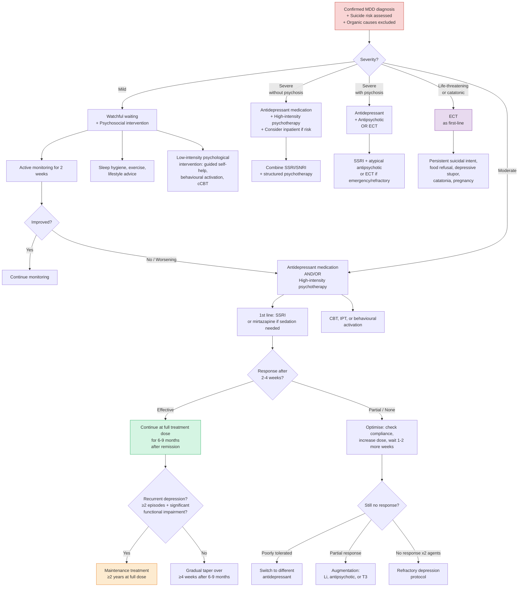

## Management of Major Depressive Disorder

### Overarching Principles

Before diving into treatments, understand the framework. Management of MDD follows the **biopsychosocial model** — you never treat with drugs alone or therapy alone. Treatment is always a combination of biological, psychological, and social interventions, tailored to severity.

***Though changes in monoamines constitute only part of the aetiological picture, the monoamine systems provide the most accessible treatment avenue*** [3].

Three phases of treatment [2]:
1. **Acute treatment** — resolve the current episode (weeks to months)
2. **Continuation treatment** — prevent relapse of the same episode (6–9 months after remission)
3. **Maintenance (prophylactic) treatment** — prevent recurrence of new episodes (years, sometimes lifelong)

<Callout title="Key Concept: Relapse vs Recurrence">
**Relapse** = return of symptoms of the *same* episode (within 6–9 months of remission) — prevented by continuation treatment. **Recurrence** = a *new* episode after full recovery — prevented by maintenance treatment. This distinction matters because premature drug cessation after apparent improvement often leads to relapse (the episode never truly ended), not recurrence.
</Callout>

---

### Management Algorithm by Severity (NICE-Based Approach)

The stepped-care model matches intensity of intervention to severity of illness [2]:

---

### 1. General Measures (All Severities)

These apply to **every** patient regardless of severity [2]:

- **Avoid alcohol and substance use** — alcohol is a CNS depressant that worsens depression and impairs antidepressant efficacy; cannabis worsens amotivation; stimulant withdrawal triggers rebound depression
- **Lifestyle advice on diet and sleep hygiene** — regular sleep-wake schedule (supports circadian rhythm regulation), avoid caffeine in the evening, structured daily routine
- **Encourage suitable activity** — ***physical inactivity causes social withdrawal and exacerbates depression*** [2]. Exercise increases BDNF, endorphins, and monoamine neurotransmission — it is literally a biological antidepressant

***Physical activity*** is listed as a distinct management modality [3]:
- Aerobic exercise (30 min, 3–5×/week) has evidence equivalent to mild antidepressant effect
- Mechanism: ↑ BDNF, ↑ endorphin release, ↑ serotonin/noradrenaline, ↑ hippocampal neurogenesis, normalises HPA axis
- Most useful as adjunct; insufficient alone for moderate-severe depression

---

### 2. Pharmacotherapy

#### A. When to Use Medications

***Indication: most effective in moderate-severe depression*** [2]

The natural history numbers are important to understand drug efficacy [2]:
- **20%** will recover without treatment (spontaneous remission)
- **30%** will respond to placebo (expectation + therapeutic alliance + natural course)
- **50%** will respond to antidepressants

This means the **number needed to treat (NNT)** for antidepressants vs placebo is approximately **5–7** for moderate-severe depression. For mild depression, the NNT is much higher (effect barely separates from placebo) — hence why we start with psychosocial interventions.

#### B. Choosing an Antidepressant

The approach to choosing a drug [2][3]:

> ***Discuss choice of drug with the patient***, considering: ***potential therapeutic effects, possible adverse effects, likelihood of discontinuation symptoms, likely time to respond, the role of therapeutic alliance in predicting response*** [2]

***Choice of medication determined by clinical circumstances, particularly the patient's physical comorbidity and concomitant medications*** [3]

***Marked inter-individual variation in antidepressant tolerability*** [3]

#### C. Classes of Antidepressants

| Class | Examples | Mechanism | Key Features |
|---|---|---|---|
| ***Selective Serotonin Reuptake Inhibitors (SSRIs)*** | ***Fluoxetine, paroxetine, sertraline, citalopram, escitalopram, vortioxetine*** [3] | Block SERT → ↑ synaptic 5-HT | **1st line** for most patients. Best safety profile. Vortioxetine also has multimodal 5-HT receptor activity |
| ***Serotonin and Norepinephrine Reuptake Inhibitors (SNRIs)*** | ***Duloxetine, venlafaxine, desvenlafaxine*** [3] | Block SERT + NET → ↑ synaptic 5-HT and NE | Useful for depression with chronic pain (duloxetine); venlafaxine at low dose is essentially an SSRI, only becomes dual at higher doses |
| ***Non-selective Monoamine Reuptake Inhibitors (TCAs)*** | ***Amitriptyline, imipramine, nortriptyline, clomipramine, dothiepin, trimipramine, desipramine*** [3] | Block SERT + NET (+ varying degrees of DRT) | ***Older antidepressants associated with significant adverse events and drug-drug interactions*** [3]. More effective in melancholic depression but dangerous in overdose (cardiac toxicity) |
| ***Tetracyclic antidepressants*** | ***Mianserin*** [3] | α2-adrenergic antagonist → ↑ NE release; also antihistaminic | Sedating; less commonly used now |
| ***Norepinephrine and Dopamine Reuptake Inhibitors (NDRIs)*** | ***Bupropion*** [3] | Block NET + DRT → ↑ synaptic NE and DA | Activating; no sexual dysfunction; also used for smoking cessation. CI in seizure disorders and eating disorders |
| ***Monoamine Oxidase Inhibitors (MAOIs)*** and ***Reversible Inhibitors of MAO-A (RIMAs)*** | ***Tranylcypromine, phenelzine, isocarboxazid, selegiline*** (irreversible); ***moclobemide*** (reversible) [3] | Inhibit MAO enzyme → ↓ monoamine breakdown → ↑ synaptic 5-HT, NE, DA | Effective for atypical depression. Irreversible MAOIs require strict tyramine-free diet (risk of hypertensive crisis). Moclobemide is safer (reversible) |
| ***Melatonergic antidepressants*** | ***Agomelatine*** [3] | MT1/MT2 melatonin receptor agonist + 5-HT2C antagonist | Resynchronises circadian rhythm; few sexual side effects; requires LFT monitoring (hepatotoxicity) |
| ***Others*** | ***Trazodone, mirtazapine*** [3] | Trazodone: SARI (5-HT2 antagonist + weak SERT inhibitor); Mirtazapine: NaSSA (α2 antagonist + 5-HT2/3 antagonist + H1 antagonist) | Mirtazapine: strongly sedating (H1 blockade), appetite stimulating → useful when insomnia and weight loss are prominent. Trazodone: mainly used for insomnia at low doses |

<Callout title="First-Line = SSRI (or Mirtazapine if Sedation Needed)">
The approach from the flowchart [2]: ***suggest an SSRI or mirtazapine if sedation is required***. SSRIs are first-line because of their favourable safety-to-efficacy ratio. The choice between specific SSRIs is guided by side-effect profile, drug interactions, and patient preference.
</Callout>

#### D. The Cipriani Meta-Analysis (2018) — Key Evidence

***Systematic review and network meta-analysis of 21 antidepressants*** [3]:

- ***More effective than other antidepressants: agomelatine, amitriptyline, escitalopram, mirtazapine, paroxetine, venlafaxine, and vortioxetine*** (range of ORs 1.19–1.96) [3]
- ***More tolerable than other antidepressants: agomelatine, citalopram, escitalopram, fluoxetine, sertraline, and vortioxetine*** (range of ORs 0.43–0.77) [3]

The sweet spot: **escitalopram** and **vortioxetine** appear in both the "more effective" and "more tolerable" lists, making them strong first-line choices.

#### E. Practical Prescribing Algorithm

The approach follows a logical stepwise escalation [2]:

**Step 1: Start antidepressant**
- Titrate to a recognised therapeutic dose
- Assess efficacy after **2 weeks** — explain to patient that full effect takes 2–6 weeks (because the therapeutic effect is not just about ↑ synaptic monoamines, but downstream neuroplastic changes: ↑ BDNF, hippocampal neurogenesis, receptor downregulation)

**Step 2: If effective**
- ***Continue for 6–9 months at full treatment dose*** [2]
- Consider longer-term treatment in recurrent depression

**Step 3: If NOT effective after 2 weeks**
- ***Assess weekly for a further 1–2 weeks. If still no response, consider increasing dose*** [2]

**Step 4: If poorly tolerated**
- ***Switch to a different antidepressant*** [2]
- Titrate to therapeutic dose, assess efficacy over 3–4 weeks

**Step 5: If 2nd antidepressant also fails**
- ***Consider third choice options: mirtazapine, vortioxetine, agomelatine*** [2]

**Step 6: Still no effect**
- Refer to **refractory depression** protocol (see below)

#### F. Duration of Treatment

**Continuation phase** [2]:
- ***First episode → continue antidepressants for ≥6–9 months at the dose that induces remission*** [2]
- This prevents relapse. Stopping too early is the most common cause of "failed" antidepressant treatment

**Maintenance phase** [2]:
- ***≥2 episodes + significant functional impairment → continue antidepressants for ≥2 years*** [2]
- Some guidelines recommend lifelong treatment after 3+ severe episodes

**Stopping** [2]:
- Gradual taper over ≥4 weeks to avoid **discontinuation syndrome** (dizziness, nausea, electric shock sensations, irritability, insomnia — especially common with paroxetine, venlafaxine)
- Never stop abruptly

#### G. Key Side Effects and Contraindications

| Class | Common Side Effects | Serious Risks | Contraindications |
|---|---|---|---|
| **SSRIs** | GI upset (nausea, diarrhoea), headache, sexual dysfunction, insomnia/agitation (initially), weight gain (long-term) | Serotonin syndrome (if combined with MAOIs), hyponatraemia (SIADH, especially elderly), ↑ suicidal ideation in < 25y (initial weeks), GI bleeding (esp with NSAIDs) | Concurrent MAOI use (≥2 week washout; 5 weeks for fluoxetine due to long half-life) |
| **SNRIs** | Similar to SSRIs + sweating, dry mouth; venlafaxine: dose-dependent ↑ BP | Serotonin syndrome, hyponatraemia, ↑ BP (venlafaxine) | Concurrent MAOI; uncontrolled HTN (venlafaxine) |
| **TCAs** | Anticholinergic (dry mouth, constipation, urinary retention, blurred vision), sedation, orthostatic hypotension, weight gain, sexual dysfunction | **Lethal in overdose** (QT prolongation → ventricular arrhythmias → cardiac arrest; seizures) | Recent MI, heart block, arrhythmias, severe liver disease, acute angle-closure glaucoma, urinary retention. Avoid in suicidal patients (OD risk) |
| **MAOIs** (irreversible) | Orthostatic hypotension, weight gain, insomnia, sexual dysfunction | **Hypertensive crisis** with tyramine-rich foods (aged cheese, red wine, fermented foods, broad beans); serotonin syndrome with serotonergic drugs | Concurrent serotonergic drugs (SSRIs, SNRIs, TCAs, pethidine, tramadol); phaeochromocytoma; hepatic impairment |
| **Mirtazapine** | Sedation (H1), weight gain (H1 + 5-HT2C), dry mouth | Rare: agranulocytosis | Concurrent MAOI |
| **Bupropion** | Insomnia, dry mouth, agitation, headache | Seizures (dose-dependent; risk ~0.4% at therapeutic doses) | Seizure disorder, bulimia/anorexia (↑ seizure risk), concurrent MAOI |
| **Agomelatine** | Nausea, dizziness, headache, fatigue | **Hepatotoxicity** — requires LFT monitoring at baseline, 3w, 6w, 12w, 24w | Pre-existing hepatic impairment; concurrent potent CYP1A2 inhibitors (e.g., fluvoxamine, ciprofloxacin) |

<Callout title="TCAs + Suicidal Patient = Dangerous Combination" type="error">
TCAs are **lethal in overdose** — as few as 10 days' supply can be fatal. The mechanism: sodium channel blockade → QRS widening → ventricular arrhythmias. This is why TCAs are avoided in patients with suicidal risk. SSRIs are far safer in overdose (very rarely fatal). If a TCA must be used, dispense limited quantities and consider supervised administration.
</Callout>

<Callout title="STAR*D Trial — What Happens When Drugs Fail?" type="idea">
The landmark **STAR*D** trial (Sequenced Treatment Alternatives to Relieve Depression) [2] showed cumulative remission rates across 4 treatment steps:

- Step 1: Citalopram → **28%** remission
- Step 2: Switch or augment → additional **~20–25%** remission
- Step 3: Switch or augment again → additional **~12–20%** remission
- Step 4: Tranylcypromine or mirtazapine + venlafaxine → additional **~7–14%** remission

Key lesson: With persistent, systematic treatment, ~**60–70%** of patients eventually remit — but each successive step has diminishing returns. Early, aggressive, optimised treatment matters.
</Callout>

---

### 3. Psychotherapy

***Psychosocial treatment*** is a core management modality [3].

The main psychotherapies for depression [2]:

| Therapy | Basis | Format | Mechanism | Best For |
|---|---|---|---|---|
| ***Cognitive-Behavioural Therapy (CBT)*** | Beck's cognitive model — depression is maintained by negative automatic thoughts and cognitive distortions | Structured, 12–20 sessions, homework-based | Identifies and challenges negative thoughts (cognitive restructuring) + behavioural experiments + behavioural activation | Mild-moderate depression (monotherapy); moderate-severe (combined with medication); relapse prevention |
| ***Mindfulness-Based Cognitive Therapy (MBCT)*** | Combines CBT with mindfulness meditation | Group format, 8 weeks | Teaches patients to observe thoughts non-judgementally rather than react to them → breaks rumination cycle | **Relapse prevention** in recurrent depression (≥3 episodes); NICE recommended |
| ***Interpersonal Therapy (IPT)*** | Problems with interpersonal life contribute to psychopathology | Brief (12–16 sessions), focused on current problems | Focus areas: grief over loss, interpersonal disputes, role transitions, interpersonal skill deficits → improve social functioning | Depression linked to interpersonal difficulties; equivalent efficacy to CBT |
| ***Psychodynamic therapy*** | Unconscious conflicts and early relational patterns shape current emotional experience | Longer-term (months to years) | Explore unconscious patterns, defence mechanisms, transference | Chronic/recurrent depression with personality factors; patients interested in deeper self-understanding |
| ***Behavioural activation*** | Withdrawal and inactivity perpetuate depression | Structured, brief | Scheduling of valued activities to counteract avoidance and withdrawal → increases positive reinforcement from environment | Mild-moderate; can be delivered by non-specialist |
| ***Group therapy*** | Various theoretical orientations | ~5–10 patients, weekly for 1h | Observation of psychological/behavioural responses to group members in a "safe" social setting | Adjunctive; social skills building; cost-effective |

**Efficacy and choice depends on patient features and type of depression** [2]:
- Mild depression: psychotherapy alone may be sufficient (CBT, behavioural activation, guided self-help)
- Moderate depression: psychotherapy + medication (combined is superior to either alone)
- Severe depression: medication is essential; psychotherapy is adjunctive (patients often too impaired cognitively for full engagement in therapy until medication begins to work)

<Callout title="When Psychotherapy Alone Is Sufficient">
For **mild depression**, evidence supports watchful waiting + low-intensity interventions (guided self-help, computerised CBT, behavioural activation, exercise) as first-line. Medications should be reserved for moderate-severe illness or when psychosocial interventions fail. This is the stepped-care principle.
</Callout>

---

### 4. Physical Treatments

#### A. Electroconvulsive Therapy (ECT)

"Electro" (electricity) + "convulsive" (seizure) + "therapy" — using electricity to induce a therapeutic seizure.

***Electroconvulsive therapy*** [3] — ***induction of seizure to treat psychiatric disorders*** [2]

**Mechanism of action**: Unknown precisely, but several hypotheses [2]:
- **Neuroendocrine**: ↑ hormonal release by hypothalamus and pituitary (PRL, TSH, ACTH, endorphins)
- **Neurotrophic**: ↑ BDNF → induces neurogenesis (may explain why multiple sessions needed)
- **Other**: ↑ monoamine neurotransmitter release, transient ↑ BBB permeability, changes in brain connectivity

**Indications** [2]:

ECT is indicated in severe depression when:
- ***Rapid definitive response required*** (e.g., pregnancy)
- ***Life-threatening*** (persistent suicidal intent, food refusal → malnutrition/dehydration)
- ***Antidepressants failed or cannot be used*** (refractory, medical comorbidities)
- ***Previous good response to ECT***
- ***Catatonia*** (depressive stupor)

> Mnemonic: **ECT** = **E**mergency, **C**atatonia, **T**reatment-refractory [2]

**Also indicated for** [2]:
- Mania/mixed states (pregnant, life-threatening, treatment-resistant)
- Puerperal psychosis with prominent mood symptoms (rapid treatment to allow reuniting with baby)
- Selective treatment-resistant schizophrenia

**Administration** [2]:
- Course: **6–12 treatments**, **2–3 per week**
- Process: Short-acting induction agent + muscle relaxant (suxamethonium) → ensure ~5 min of GA → psychiatrist applies two electrodes to scalp → electric pulse delivered to induce a **generalised tonic-clonic seizure lasting at least 15 seconds**
- **Unilateral vs bilateral**: bilateral is more effective but may cause more cognitive impairment. Unilateral (contralateral to dominant hemisphere) is used when cognitive effects are a concern

**Adverse effects** [2]:
- **Cognitive impairment**: acute confusion, anterograde or retrograde amnesia → generally short-lived (days after ECT)
- General complaints: headache, nausea, muscle pain
- **Mortality**: 2–4 per 100,000 (~other minor surgery under GA), usually due to cardiopulmonary events

**Contraindications**: No **absolute** contraindication. Relative contraindications include [2]:
- Heart disease: recent MI, heart failure, ischaemic heart disease
- ↑ ICP (risk of herniation during seizure)
- Risk of ICH: hypertension, recent stroke
- Phaeochromocytoma (seizure → catecholamine surge)
- Poor anaesthetic risk

**Efficacy**: ***ECT is considered more effective than drugs in the most severe cases*** [2]. It is especially effective for depression with psychosis and/or psychomotor retardation [2].

#### B. Transcranial Magnetic Stimulation (TMS)

***Transcranial magnetic stimulation*** [3][2]:
- **Procedure**: Non-invasive; hand-held plastic-coated coil placed close to scalp → external magnetic field stimulates generation of action potential and firing of neurones (targeting left dorsolateral PFC to counteract its hypoactivity in depression)
- **Use**: Suitable for ***medically unwell people who cannot tolerate antidepressants or ECT*** [2]
- **Side effects**: Minimal, but only available in selected centres
- FDA-approved for treatment-resistant depression

#### C. Transcranial Direct Current Stimulation (tDCS)

***Transcranial direct current stimulation*** [3][2]:
- **Procedure**: Non-invasive; constant, low-voltage DC via electrodes on head → anode increases cortical excitability, cathode decreases it → modulates spontaneous neuronal network activity
- **Use**: ***NOT suprathreshold*** (unlike TMS, ECT) → therefore limited to ***adjunctive use only*** [2]
- **Side effects**: Minimal, but only available in selected centres

---

### 5. Dietary and Lifestyle Interventions

***Healthy diet may help as part of the overall depression treatment, though no specific diet has been proven to relieve depression*** [3]:

- ***Food rich in antioxidants*** (e.g., blueberries, oranges, carrots, nuts) [3] — oxidative stress is implicated in depression; antioxidants may have neuroprotective effects
- ***Complex carbohydrates*** (e.g., whole grains) ***can have a calming effect*** [3] — they ↑ tryptophan transport across BBB → ↑ serotonin synthesis
- ***Protein-rich foods*** (e.g., turkey, tuna, chicken) ***boost alertness*** [3] — contain tyrosine (dopamine/NE precursor) and tryptophan (serotonin precursor)
- ***Mediterranean diet as a source for B vitamins*** [3] — B6, B12, and folate are cofactors in monoamine synthesis; deficiency → impaired serotonin/dopamine production

***Omega-3 fatty acids*** [3]:
- ***Essential polyunsaturated lipids that influence cellular metabolism and function*** [3]
- ***Earlier studies linked low seafood intake (a major source of omega-3 FAs) and mood disorders, and positive results with fish oil intervention → subsequent results more diversified*** [3]
- ***EPA rather than DHA as the effective component*** [3] — EPA has anti-inflammatory properties (↓ pro-inflammatory cytokines → ↓ neuroinflammation)
- ***Monotherapy as well as adjunct therapy*** [3]

---

### 6. Refractory (Treatment-Resistant) Depression

Defined as failure to respond adequately to ≥2 adequate trials of antidepressants from different classes.

**Approach** [2]:

First, **reconsider the fundamentals**:
- ***Reassess diagnosis***: look for secondary causes (e.g., substance abuse, medical conditions, personality disorder, bipolar disorder)
- ***Assess compliance***: are they actually taking the medication? At adequate dose? For adequate duration?
- ***Assess for ongoing psychosocial stressors***: no antidepressant will overcome ongoing abuse, poverty, or entrapment

Then, **therapeutic options** [2]:

| Strategy | Details |
|---|---|
| ***Switch to another class*** | Usually done ***first***, preferably of a ***different mechanism*** (e.g., SSRI → SNRI, or SSRI → mirtazapine). Beware of serotonin syndrome and discontinuation syndrome → cross-tapering [2] |
| ***Combination therapy*** | Usually 5-HT mechanism (SSRI, venlafaxine) + NE/DA mechanism (bupropion, mirtazapine) → "California rocket fuel" = venlafaxine + mirtazapine [2] |
| ***Augmentation with lithium*** | Well-established evidence. Target level 0.4 mmol/L for augmentation in unipolar depression. Monitor RFT, TFT, plasma Li [2] |
| ***Augmentation with antipsychotics*** | Low-dose atypical antipsychotic, especially if psychotic features present. ***Antipsychotics licensed for augmentation: quetiapine, aripiprazole*** [2] |
| ***Augmentation with T3 (tri-iodothyronine)*** | Even in euthyroid patients, T3 25–50 μg/day can augment antidepressant response. Mechanism: T3 enhances serotonergic neurotransmission [2] |
| ***ECT*** | ***Considered more effective than drugs in the most severe cases. Indications: emergency, refractory, catatonic*** [2] |

> **Options for refractory depression** [2]: ***Optimise existing treatment → Augmentation by antipsychotics, Li or T3 → Combine with another antidepressant with another mechanism → Switch to another mechanism***

Newer options (for severe treatment-resistant cases):
- **Esketamine** (nasal spray) — NMDA receptor antagonist; approved for treatment-resistant depression; rapid onset (hours to days vs weeks for traditional antidepressants)
- **Psilocybin-assisted therapy** — emerging evidence; not yet standard practice
- **Deep brain stimulation (DBS)** — experimental; targets subcallosal cingulate (area 25)

---

### 7. Special Populations

| Population | Key Considerations |
|---|---|
| **Elderly** | Start low, go slow. Increased sensitivity to anticholinergic effects (TCAs → avoid). SSRI-induced hyponatraemia more common. Use Geriatric Depression Scale for assessment [3] |
| **Children and adolescents** | ***In children and adolescents, depressed mood can be irritable mood*** [3]. Fluoxetine is the only SSRI with robust evidence in paediatric depression. Beware of increased suicidal ideation with SSRIs in under-25s (black box warning) — monitor closely in first weeks |
| **Pregnancy** | Risk-benefit analysis. Untreated severe depression carries risks (poor nutrition, substance use, suicide, impaired bonding). SSRIs generally considered acceptable (sertraline, fluoxetine have most data). Paroxetine associated with cardiac malformations — avoid. ECT is safe in pregnancy [2] |
| **Peripartum** | ***With peripartum onset — severe anxiety and even panic attacks. Risk of infanticide*** [5]. Edinburgh Postnatal Depression Scale for screening [3]. Breastfeeding: sertraline has lowest infant exposure |
| **Psychotic depression** | Antidepressant alone insufficient — requires **antidepressant + antipsychotic** or **ECT** |
| **Bipolar depression** | ***NOT identical to Tx of unipolar depression*** [2]. ***Conventional antidepressants are less effective, associated with risk of inducing mania, and risk of inducing rapid cycling*** [2]. First-line: quetiapine or olanzapine + fluoxetine. Antidepressants should be ***combined with antipsychotic or mood stabiliser*** [2] |

<Callout title="Bipolar Depression ≠ Unipolar Depression Treatment" type="error">
This is a critical exam point. ***Conventional antidepressants are (1) less effective in treating bipolar depression, (2) associated with risk of inducing mania, (3) associated with risk of inducing rapid cycling*** [2]. ***SSRIs may be effective but may induce mania. TCAs and SNRIs have ↑↑ risk of inducing mania*** [2]. Always use mood stabiliser cover.
</Callout>

---

### 8. Course and Prognosis

Understanding prognosis helps guide duration of treatment [2]:

- **Clinical course**: generally ***self-limiting within 6 months to 1 year*** [2]
  - Age of onset: ~50% before age 21
  - Duration: average 6 months; ~25% > 1 year; ~10–20% chronic unremitting
- **Recurrence**: ***~80% will recur***, average ***~4 further episodes in 25 years*** [2]
  - Usually associated with ***progressive shortening of interval*** between episodes
  - ***~50% do not have complete symptom remission*** between episodes
  - ***Only ~25% of those with recurrent major depression achieve 5-year clinical stability*** with good social and occupational performance [2]
- **Mortality**: ***> 20× risk of suicide***, can approach ***15% in those with severe admitted cases*** [2]

**Prognostic factors for relapse** [2]:
1. Incomplete symptomatic remission
2. Early age of onset
3. Poor social support
4. Poor physical health
5. Comorbid substance abuse
6. Comorbid personality disorder

---

<Callout title="High Yield Summary">

**Stepped-Care Model**: Mild → watchful waiting + psychosocial. Moderate → antidepressant + psychotherapy. Severe → antidepressant + psychotherapy + consider inpatient. Psychotic → antidepressant + antipsychotic or ECT. Life-threatening/catatonic → ECT first-line.

**First-Line Pharmacotherapy**: SSRI (or mirtazapine if sedation needed). Cipriani meta-analysis: escitalopram, vortioxetine = effective + tolerable. Older antidepressants (TCAs, MAOIs) = more side effects and dangerous in OD.

**Duration**: Continue ≥6–9 months at full dose after remission (first episode). ≥2 years if ≥2 episodes with functional impairment. Taper gradually (≥4 weeks).

**Refractory Depression**: Reassess diagnosis/compliance/stressors → switch class → combine (SSRI + mirtazapine or bupropion) → augment (Li, quetiapine/aripiprazole, T3) → ECT.

**ECT Indications**: Emergency (suicidal, food refusal), Catatonia, Treatment-refractory. No absolute CI. Most effective treatment for severe depression, especially with psychosis/psychomotor retardation.

**Psychotherapy**: CBT is most evidence-based. IPT for interpersonal issues. MBCT for relapse prevention. Combine with medication for moderate-severe.

**Bipolar Depression**: NOT same as unipolar Tx. Antidepressant monotherapy contraindicated (mania risk). Use quetiapine or olanzapine + fluoxetine.

**Prognosis**: 80% recur; average 4 episodes over 25 years; > 20× suicide risk. Prognostic factors for relapse: incomplete remission, early onset, poor social support, poor physical health, comorbid SA, comorbid PD.

</Callout>

---

<ActiveRecallQuiz
  title="Active Recall - Management of Major Depressive Disorder"
  items={[
    {
      question: "A patient with moderate MDD asks you about starting treatment. Walk through the stepwise approach to antidepressant prescribing, including first-line choice, time to assess efficacy, duration of treatment, and what to do if the first drug fails.",
      markscheme: "First-line: SSRI (e.g., escitalopram, sertraline) or mirtazapine if sedation needed. Discuss choice with patient. Titrate to therapeutic dose. Assess efficacy after 2 weeks; if no response, assess weekly for 1-2 more weeks and consider dose increase. If poorly tolerated, switch to different antidepressant. If 2nd agent also fails, consider third-choice options (mirtazapine, vortioxetine, agomelatine) then refractory protocol. If effective, continue at full treatment dose for 6-9 months (first episode) or ≥2 years (recurrent with functional impairment). Taper gradually over ≥4 weeks when stopping.",
    },
    {
      question: "List the indications for ECT in depression and explain why it is considered the most effective treatment for severe depression.",
      markscheme: "Indications (mnemonic ECT): Emergency (persistent suicidal intent, food refusal/malnutrition, pregnancy needing rapid response), Catatonia (depressive stupor), Treatment-refractory (failed adequate antidepressant trials). Also: previous good response to ECT. ECT is most effective because it has the highest remission rate for severe depression (especially with psychotic features and psychomotor retardation), works faster than medications (days-weeks vs weeks-months), and has multiple mechanisms including increased BDNF/neurogenesis, monoamine release, and neuroendocrine effects. No absolute contraindications.",
    },
    {
      question: "Name 4 strategies for managing refractory depression and give a specific example for each.",
      markscheme: "1. Switch antidepressant class (e.g., SSRI to SNRI or mirtazapine). 2. Combination therapy (e.g., venlafaxine + mirtazapine = 'California rocket fuel'). 3. Augmentation with lithium (target 0.4 mmol/L in unipolar depression). 4. Augmentation with atypical antipsychotic (quetiapine or aripiprazole are licensed). 5. Augmentation with T3 (tri-iodothyronine 25-50 mcg/day). 6. ECT. Must also reassess: diagnosis (rule out bipolar, SA, medical cause), compliance, ongoing stressors.",
    },
    {
      question: "Why is antidepressant monotherapy contraindicated in bipolar depression? What should be used instead?",
      markscheme: "Conventional antidepressants in bipolar depression are: (1) less effective than in unipolar depression, (2) associated with risk of inducing manic switch, (3) associated with risk of inducing rapid cycling. TCAs and SNRIs have highest mania-induction risk; SSRIs have lower but still significant risk. Instead, use: first-line quetiapine alone or olanzapine + fluoxetine combination; alternatives include lithium, lamotrigine. If antidepressant is used, it must be combined with a mood stabiliser or antipsychotic, never given alone.",
    },
    {
      question: "From the Cipriani 2018 network meta-analysis, which antidepressants were found to be both more effective and more tolerable than others?",
      markscheme: "More effective: agomelatine, amitriptyline, escitalopram, mirtazapine, paroxetine, venlafaxine, vortioxetine (ORs 1.19-1.96). More tolerable: agomelatine, citalopram, escitalopram, fluoxetine, sertraline, vortioxetine (ORs 0.43-0.77). Drugs appearing in BOTH lists (effective + tolerable): escitalopram, vortioxetine, agomelatine - making them particularly strong first-line choices.",
    },
    {
      question: "What are the prognostic factors for relapse in MDD, and what is the overall recurrence rate?",
      markscheme: "Recurrence rate: approximately 80% will have at least one further episode; average 4 episodes over 25 years. Only 25% achieve 5-year clinical stability. Prognostic factors for relapse: (1) incomplete symptomatic remission, (2) early age of onset, (3) poor social support, (4) poor physical health, (5) comorbid substance abuse, (6) comorbid personality disorder. Mortality: more than 20x risk of suicide, approaching 15% in severe admitted cases.",
    },
  ]}
/>

## References

[2] Senior notes: ryanho-psych.md (Psychiatry chapter — sections 3.1.1, 3.1.3.1, 3.2, 3.3, 7.2 Management, pages 33, 44–45, 51, 56, 62–63, 71, 140, 155–162, 165)
[3] Lecture slides: GC 164. I am depressed Mood disorders.pdf (pages 13, 14, 16, 17, 24, 25)
[5] Lecture slides: GC 163. I am a superman Bipolar disorder.pdf (pages 12, 22)
